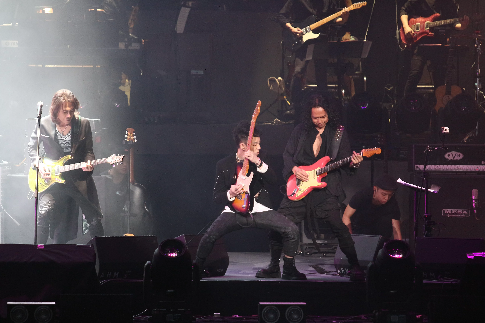
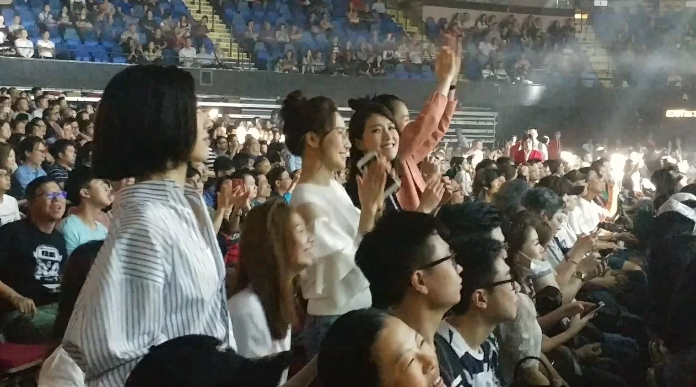
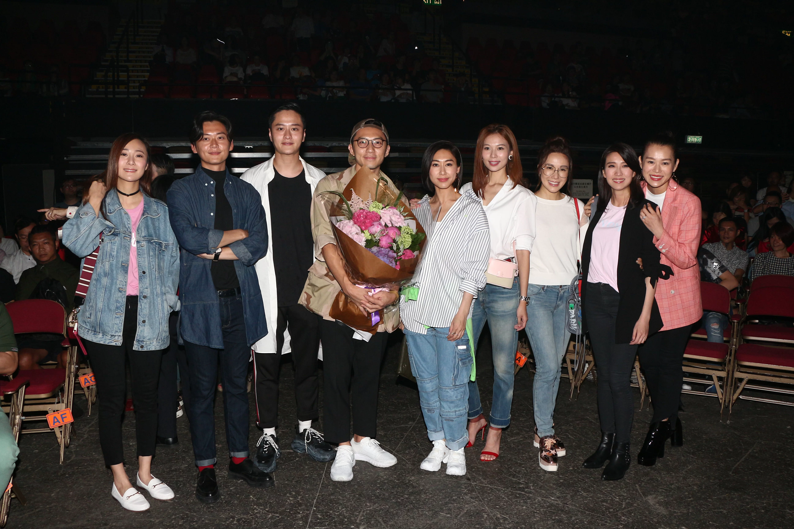
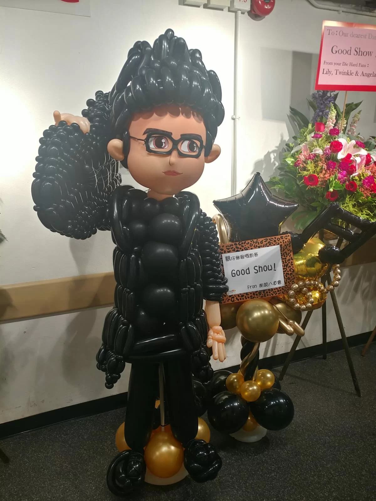
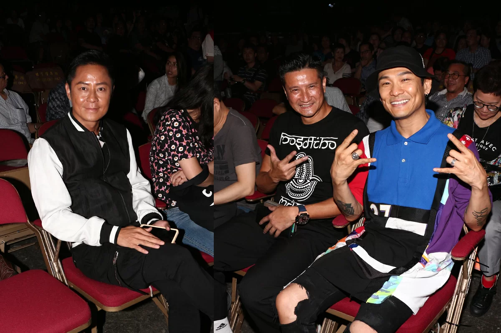
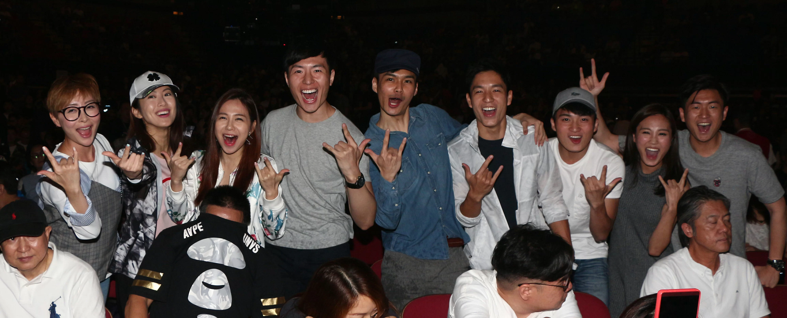
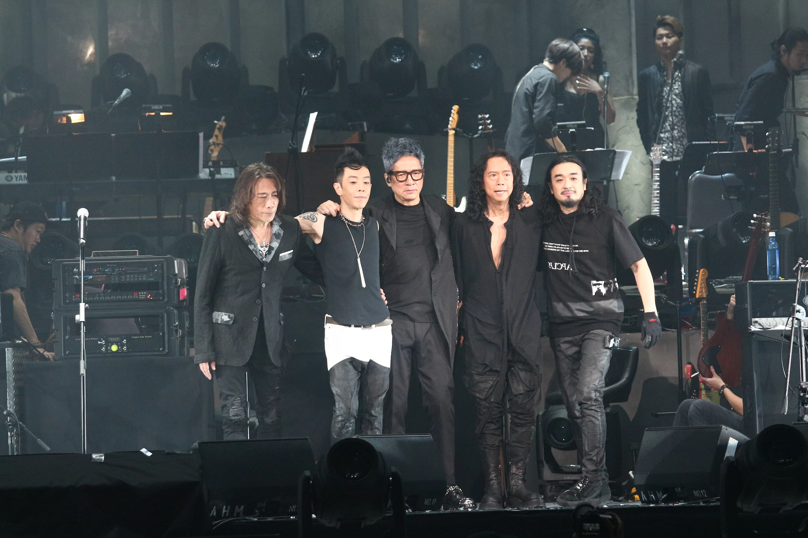

*「搖滾大俠奏」今晚在紅館舉行一連兩場演唱會*

集合香港Band壇五大勁人夏韶聲，黃貫中，單立文，鄧建明，恭碩良的「搖滾大俠奏」在紅館舉行一連兩場演唱會，一開場五位邊彈結他及打鼓，邊唱太極樂隊經典歌曲《紅色跑車》，迅即燃起場內氣氛，觀眾都舉起rock and roll手勢。

*胡說八道會一眾成員睇到超high*

當中最high的是胡說八道會一眾成員，包括胡杏兒，胡定欣，李施嬅，楊秀惠，姚子羚，都high到站起來，當台上唱着Beyond名曲《我是憤怒》時，她們都站立跟着拍子投入音樂當中，反而坐在胡定欣旁邊的袁偉豪，只坐着沒有站立。

*胡說八道會送了豹哥形狀的汽球公仔撐豹哥豹嫂*

胡說八道會還送了一個特別的花籃到來，是一個豹哥單立文形狀的汽球公仔，她們都是來撐豹哥豹嫂的，豹嫂胡蓓蔚擔任特別嘉賓，與單立文合唱Blue Jeans與林憶蓮的歌曲《下雨天》。

*圈中人蔡一傑 、 杜德偉 都有來捧場*

今晚演唱會很多圈中人來捧場，有杜德偉，蔡一傑，湯盈盈等一班《愛回家》藝人等。演唱會期間，黃貫中演唱英國樂隊U2歌曲前，有感而發說大家弄得原本美麗的世界和環境變醜，更粗俗地說「我代表地球X你哋」。在後台，黃貫中的太太朱茵送來兩個花籃，演唱會開始個多小時未見她蹤影，據說她會在星期五尾場現身撐阿Paul。

