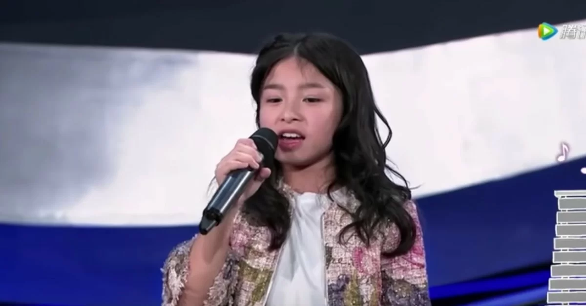
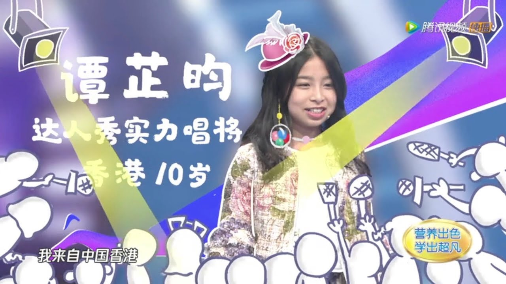

import YouTube from '@/components/patterns/YouTube.astro';

Celine妹妹（譚芷昀）近日到浙江為內地網絡綜藝節目《超凡小達人》擔任嘉賓，再以實力唱功演唱《A Moment Like This》，令觀眾和主持樂嘉拍爛手掌，特別嘉賓劉畊宏聽到閉眼 enjoy，樂嘉抵死地問劉畊宏：「聽完她的歌被她征服了嗎？」劉畊宏笑着回應：「在我的腦海裏是一個美麗成熟的女性，然後一睜開眼睛又變小孩，有一種錯亂的感覺。」

*Celine Tam 譚芷昀 sings A Moment Like This on 騰訊視頻《超凡小達人》20180615期 (Celine Cut)*

<YouTube id="15cMT8kRKE0" />

雖然外界一直有指Celine太老積，但在節目中亦表現出她可愛的性格和童真的一面。Celine 出名巨肺，樂嘉問她拉長尾音可以拉到幾耐？結果進行測試，將一句歌詞的尾音拉長，拖到近 12 秒才停下；然後樂嘉又問她可以升多少個 key？ Celine最初話9個，但Celine現場重複清唱Beyond《喜歡你》一曲中的「喜歡你，那可愛臉容」，真的一key還有一key 高，完美達成連升11 key 壯舉，劉畊宏不禁讚歎：「她聲音非常有 power，未來當然前途無可限量。」而 Celine 亦說：「我很喜歡唱歌，我想一直唱下去。」
