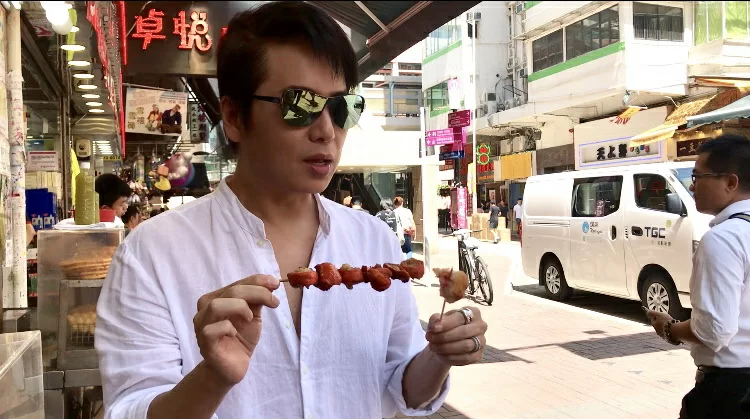
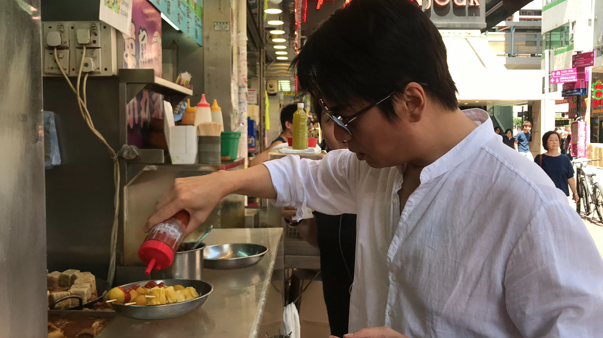
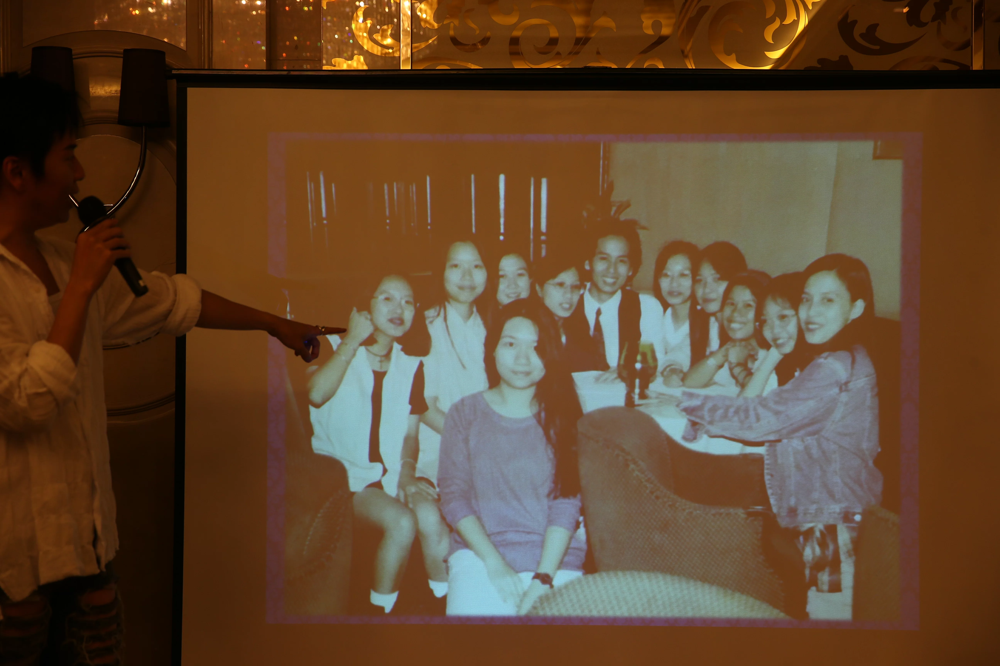
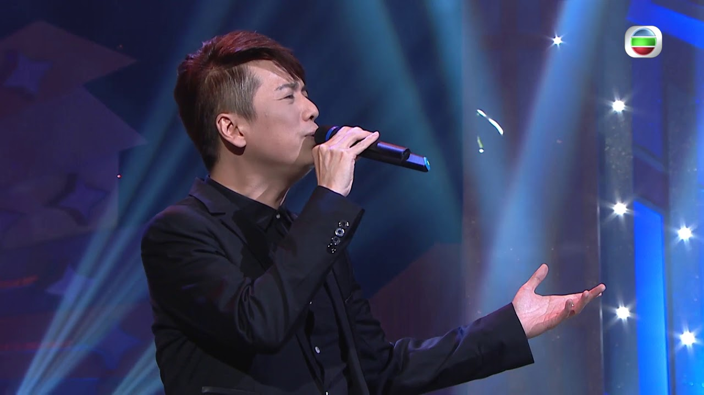

import YouTube from '@/components/patterns/YouTube.astro';

*蔡興麟一圓二十多年來的心願，在旺角吃炸大腸和咖喱魚蛋，識食當然要加大量的甜醬、辣醬和芥辣吧。*

## 蔡興麟（Gary）闊別香港二十六年多，究竟香港有什麼是他最掛念呢？

繼四月返港後，Gary再次應家燕姐邀請參加《流行經典50年》，今次他與約三十位歌迷聚會，再抽一天時間「掃街」吃小食和到文華酒店懷念張國榮。

蔡興麟Gary當知道七月底會再次返港後，他的經理人陳寶儀即以一張二十多年前Gary與粉絲的合照作號召，尋找當時的相中人現身。在短短數星期時間，成功尋人外，還籌備了「聚麟天下國際歌迷會」香港區活動。Gary見到熟口熟面的粉絲也很興奮，笑言有的當年十六、七歲，現在已結婚和生了小孩，更有歌迷已榮陞婆婆級，他很感恩地說：「好多謝他們仍支持我，有幾位還是專程從國內來港參加。」Gary與歌迷玩遊戲和唱歌，先以溫馨小聚來熱熱身。

*歌迷中不乏兩朝元老，Gary表示國內粉絲知道他在香港辦活動，也呷醋了。*

*早前在社交網站重貼這張蔡興麟與粉絲的合照，成功尋回不少當年的歌迷。*

*歌迷會聚會上玩猜度遊戲，包括估頭圍、頸圍、腳長和眼睛的總長度。*

## 廿五年來第一口炸大腸

Gary上次返港已經很想在街邊拮魚蛋、燒賣和豬大腸，今次終於如願，在旺角「掃街」，先是一串魚蛋，再來燒賣、炸蛋和炸大腸，「已經二十五年沒有吃過炸大腸，以前媽咪唔俾食，後來唱片公司又唔俾食，所以好希望可以食到。」食飽後再轉戰文華酒店High Tea，他回憶當年與哥哥張國榮是坐在哪一張沙發歎茶，「他對這個細佬好用心提拔和教導，所以今次一定來文華酒店紀念他，緬懷與他的回憶。」要懷念的故友非哥哥一人，還有是Beyond的黃家駒。他多次以「沒有家駒就沒有蔡興麟」來感謝家駒，「九一年底，我第一次在公司見家駒，當時我是新人，他已經是天王巨星，他說送一份禮物給我，隔一日，他再話要兩星期後才有。原來，他寫了首歌給我，還說是特別為我而寫，很適合我。」這首歌就是《為了你為了我》，Gary每次演唱也必唱這歌，所以他覺得家駒一直沒有離開他。今年是家駒逝世二十五年，Gary希望將這首歌改為國語歌，「歌詞已經填好，是為家駒而寫的。這首歌的版權處理中，待一切清晰後，會在最短時間內把《為了你為了我》變成國語版，希望大家一齊支持我和家駒。」Gary說。

<YouTube id="897U-UKMVvw" />

