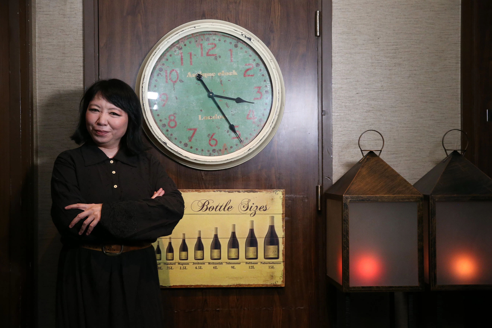
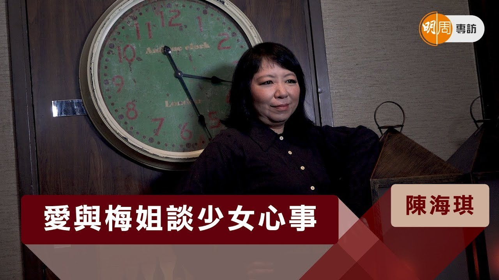
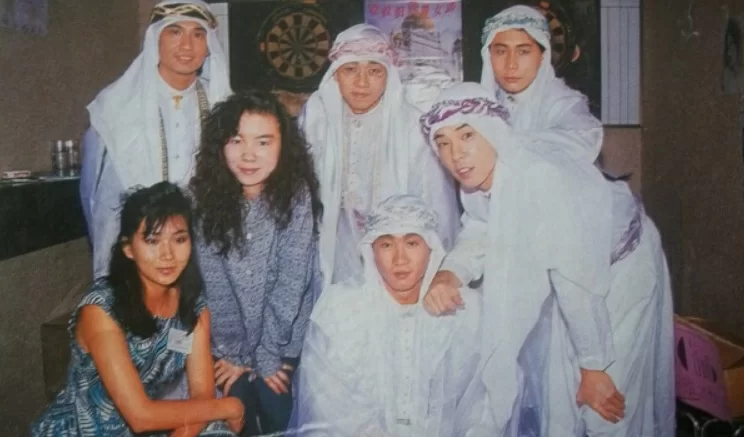
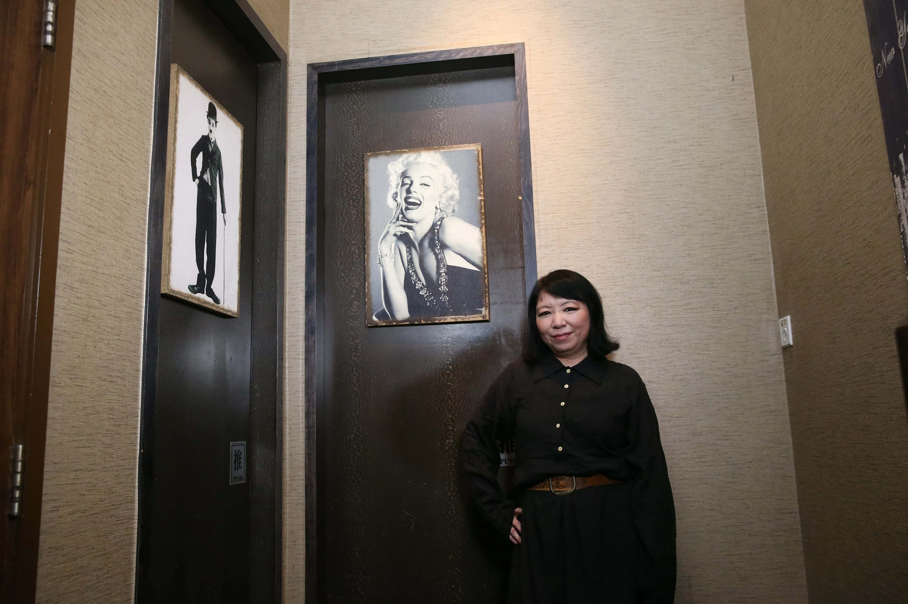

import YouTube from '@/components/patterns/YouTube.astro';

有一段時間，陳海琪和朋友已少去disco，半夜兩三點做完節目，就會到梅艷芳家裏。「她家裏大廳有個天窗，可以看到天空，我們晚晚談到天亮，飲個糖水，有時她一面聊天，一面卸妝。（談什麼話題？）男人！我們是愛情至上，最記得她說過：『你有沒有發覺？我們這類人，真的很不公平，如果我們哭，排長龍隊尾，也沒有人來安慰我們。』笑到我！」

## 愛與梅姐談少女心事

*陳海琪 愛與梅姐談少女心事*

<YouTube id="e6OxD5MImmk" />

*海琪的電台節目請過梅艷芳、成龍、曾志偉、劉德華等做嘉賓*

海琪形容阿梅是俠女，會拿把劍落山比武，為的是救整條村的人。「但她的苦心未必人人珍惜，演藝圈是血淋淋的名利場，大部分人利益至上，很多藝人沒有明天，他的身價和名聲就是他能夠賺取的財富和榮耀，所以自己艘船的帆都駛得好盡，但阿梅不是這樣的人，鐵達尼沉船，她會是拉小提琴那一個，她好肯幫人，若她幫的人反骨或出賣她，她最多躲起來鬧，絕對不會公開說別人不是。」

陳海琪十多年前離開港台，過程不太愉快。「她打電話來第一句不是問：『點解？』而是說：『是不是有人欺負你？要不要我想辦法？』」

*海琪與Beyond識於微時*

## 家駒請幫手播自資盒帶

陳海琪與搖滾樂隊特別投契，很多band仔都是她好朋友，Beyond也不例外。「家駒和我可說是同期出道，Beyond地下時期自資錄了《再見理想》盒帶，我在電台做DJ資歷尚淺，他很真誠請我幫手播，我拿回電台，卻被全面排斥，我很憤怒，在自己節目播，家駒很開心。後來家駒的經理人為了幫他們賺點生活費，安排Beyond到橋咀島的鬼節戲棚表演，觀眾席只有幾個撥扇的阿伯，我做司儀，為了多賺幾百元，接了中午和黃昏兩場，中間一段長空檔，我們走去一個荒廢公園，黃貫中爬鋼架，又熱又曬，我們坐着聊天，家駒說：『我們一定要忍耐。』有點像勵志日劇。」

後來Beyond走紅，海琪也漸有名氣，她最開心的是港台辦了一個衛星直播的節目《Band Stand》，她做司儀，Beyond壓軸。「我記得在台上我們互相望了對方一眼。」那個眼神蘊藏「我們做到了」的意思。Beyond的band房「二樓後座」是海琪常流連的地方，坐在不太乾淨的地上可以聊半晚。「他們的女朋友都在場的，真的是青春歲月。」

*陳海琪常做Beyond活動的司儀*

另一個藝人聚腳的地方是草蜢位於九龍城的家。「我時常叫那裏做『藝人之家』，簡直不鎖門，五台山很接近，拍電視的、做電台的，有空就自行入去，多人到被其他居民投訴。」

## 與常寬異地戀無法結果

海琪還和《灰色》時期的林憶蓮同住，她們早在憶蓮做商台DJ 611時已認識，後來憶蓮加入樂壇，兩人仍很談得來。「我們喜歡的衫褲鞋襪一樣，一齊去電髮，她《灰色》時期頭髮好長好鬈，都有一起去disco，也常講男人，好姊妹到一起租屋住。」

海琪常跟朋友談天，她自己的感情世界又如何？「有過四五個男朋友，其中有三個已面目模糊，我想不起初戀男友姓什麼。」後來她其中一位男友就是北京搖滾歌手常寬，不過這段感情很多年前已結束。「我們拍了超過五年，但我們相隔兩地，見面時間不多。」當時她想過跟常寬結婚，又曾請幾個月假到北京跟他一起，正是這幾個月近距離相處，令她對婚姻有所啟思。「為了防止離婚，就不要時常見面，愛情到了明白的時候，就是再見的時候，是文化差異的問題，由生活很細微的事情到人生大事，我是否真的跟你這麼合得來呢？」

她拒絕為別人調整，選擇轉身走，到了現在，她說已忘了有多久沒拍拖，被很疼她的前輩黃霑說中了：「你不適合結婚。」

*海琪與北京搖滾歌手常寬有過數年相隔兩地的戀情*

## 與秋生一席話

陳海琪在圈中那麼多新知舊友，除了回歸港台做節目，最近在ViuTV與陶傑主持電視節目《大星講》，先後約了袁詠儀、草蜢、黃秋生做訪問。

黃秋生近年因社會政治氣氛，事業受影響，海琪替他不值，節目中除了談工作，還談到在英國的私生子。「他跟這個兒子相處得很好，兩人像朋友關係，他說兒子自嘲homeless（無家可歸），因家裏的事情，要背着帳幕到山中紮營，他很開心兒子跟他談這些。」

與秋生一席話，她大嘆香港的怪獸家長應該聽一聽。

