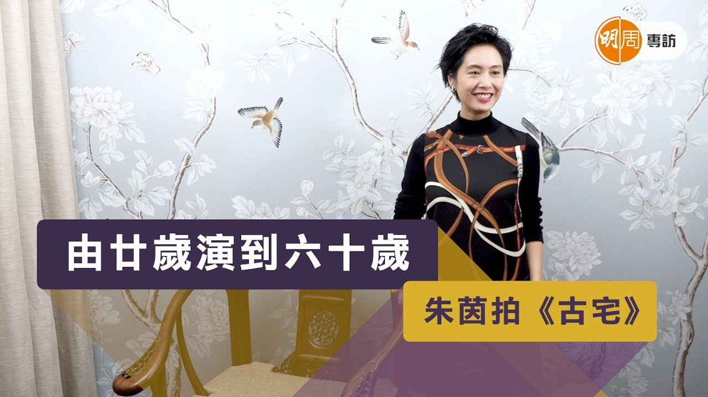
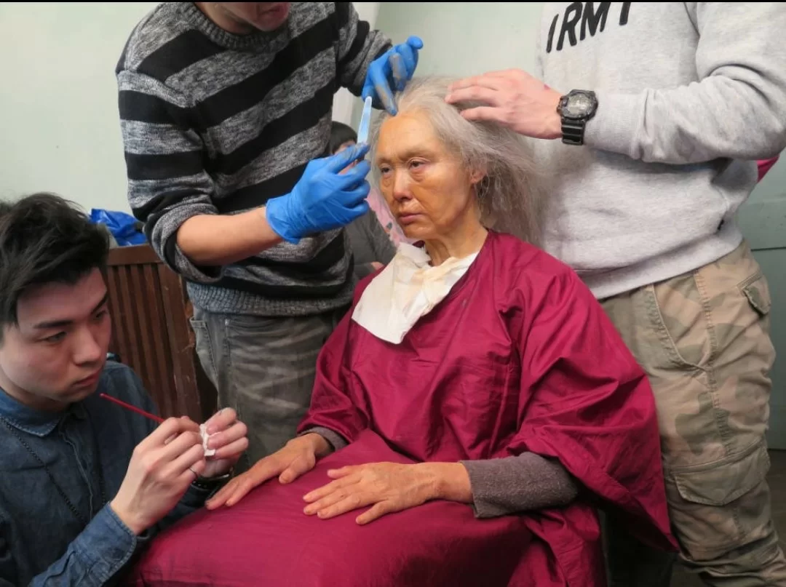
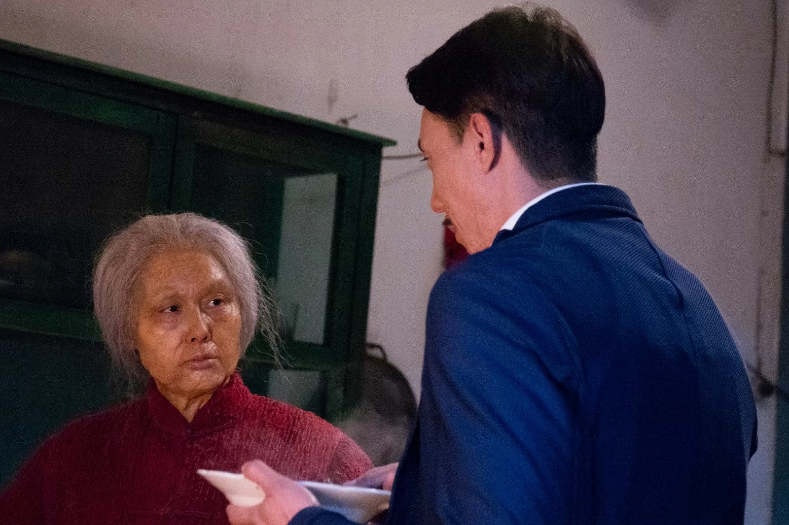

import YouTube from '@/components/patterns/YouTube.astro';

*朱茵現在被女兒分薄了老公對她的愛，她是明白的，女兒是二人的愛情結晶。*

朱茵與黃貫中（Paul）結婚以來，都是甜甜蜜蜜，自從女兒出世後，她的生活一百八十度大轉變，減少工作，每天只為陪伴女兒成長，隨着女兒漸漸長大，明年升讀小一，她可以做自己喜歡的工作；近日她接拍電影《古宅》，戲中由二十歲演至六十歲，妝容也有幾個不同階段，接拍原因是劇本吸引，有驚慄片元素，又有母子情，當中描寫媽媽的心態，寫得非常好，「拍攝時，我望住鏡子中的老妝，真的很怕自己變老，不想要這些皺紋。」

*朱茵拍《古宅》 由廿歲演到六十歲*

<YouTube id="i8sX1T-M4As" />

*朱茵在戲中會由二十歲演至六十歲，是一大挑戰，飾演其「忤逆子」是張繼聰。*

現實中，她是一位媽媽，面對戲中的「忤逆仔」張繼聰，她在片場忍不住哭了，皆因聯想到將來女兒這樣待她就慘了，「我會開始擔心，做子女總會覺得父母很煩。我發覺做媽媽並不容易，沒有一本天書是教你做媽媽，其實是『執生』。我覺得自己氣量、見識和潛能都多了，我常常會檢討自己，每句話會否對女兒有影響？可幸是我和女兒的關係好好，女兒有同理心；有時我會跟女兒說：『如果鶯鶯激媽媽，媽媽就會有白頭髮。』她是立即雙眼紅了，我即刻叫她放心，媽媽未老，媽媽不敢老，她聽了後會好安樂。我會陪她說故事、傾心事，教導正面的價值觀，告訴她父母永遠是你的後盾，永遠支持你。」

*接拍內地真人騷後，朱茵坦言一家的關係也改變了，特別是老公跟女兒關係。（網上圖片）*

老公黃貫中早前與女兒拍攝內地真人騷《想想辦法吧！爸爸》，完成後，一家三口的關係改變了，特別是父女關係，朱茵坦言看見女兒跟着爸爸大哭，她亦忍不住哭了，心酸到不得了，「我看精華片段見到女兒哭，老公又很辛苦，究竟他們有沒有飯吃？拍攝時女兒又扭計，嚷着要媽媽。不過，由原先女兒是踢爸爸出房門，說他講故事不好聽，到現在兩父女是很有默契，鶯鶯會找爸爸聊天和玩耍，老公亦不再怕一個人湊女，因為他連真人騷都應付到，真正的相依為命只有這次。我覺得老公今次好有得着，父女間增添了信心，以前的他，常常跟女兒說不，現在會學懂忍耐。」

*闊別香港大銀幕多年的朱茵，為了新戲角色化老妝，她坦言看見皺紋也擔心將來變老。*

問她覺得老公暴躁的脾氣有改變嗎？「他現在對住女兒是沒脾氣，如果有脾氣女兒都不理你，你自己忟憎，只是自己沒趣，所以老公對住女兒是收晒火，完全無火。」朱茵與黃貫中拍拖以來受萬千寵愛，現在是否被女兒分薄了愛？她即說：「是呀，現在分薄了，有一半去了女兒身上，不過我明白的，這個寶貝是我們的結晶。」

*朱茵在片中為了兒子不惜一切，連自己的命也不要，她相信天下所有媽媽都是這樣。*

-   髮型：Jackson Yung（IL COLPO）PP HK
-   化妝：Emma Lee
-   服裝：MARELLA
-   場地：灣仔龍門棧
