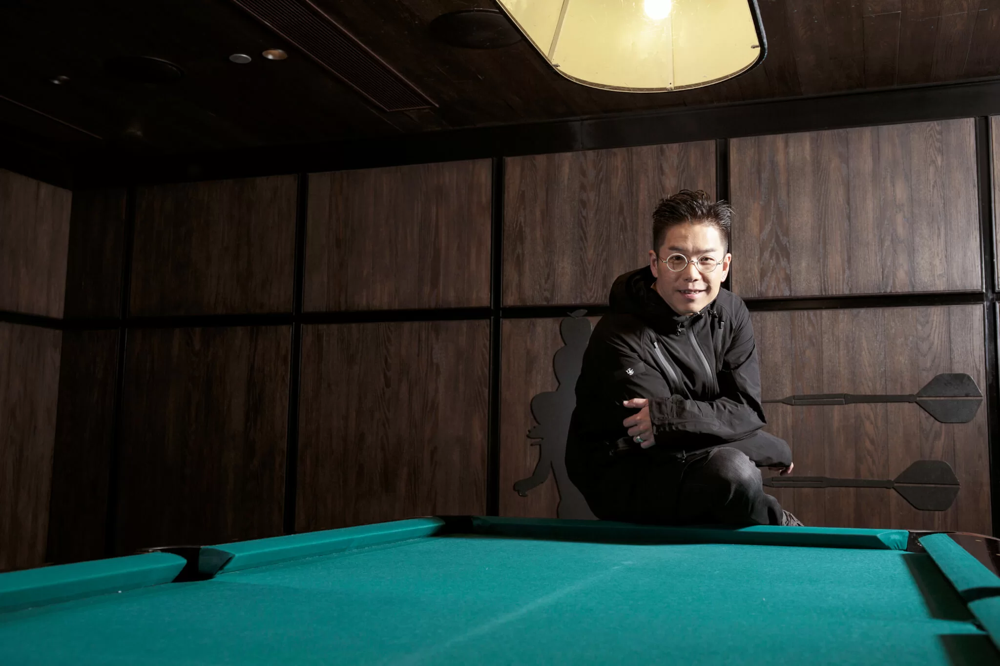
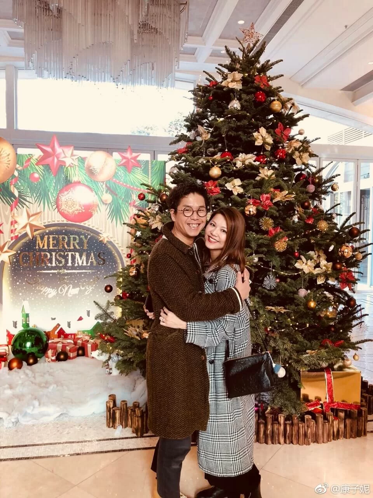
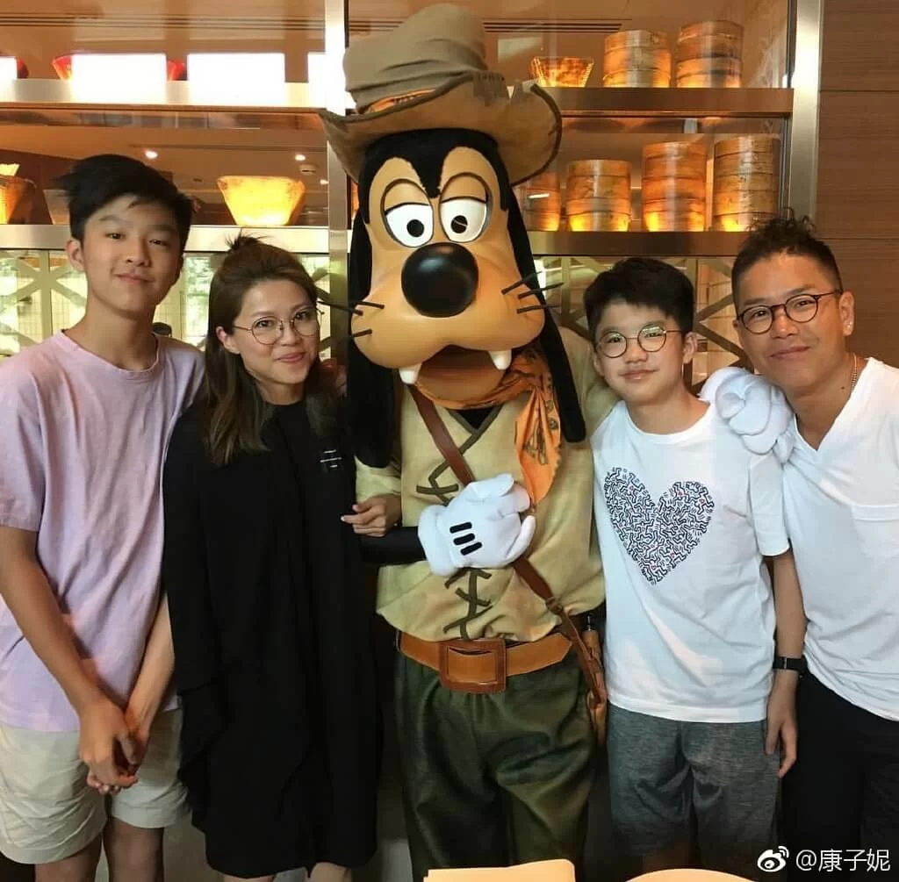
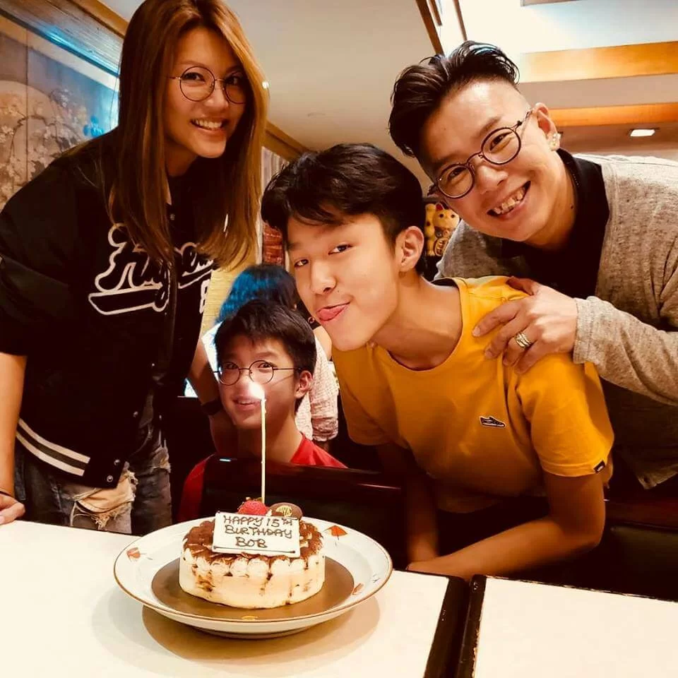
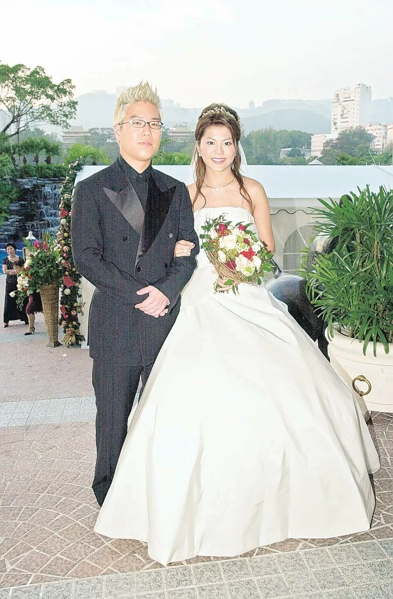
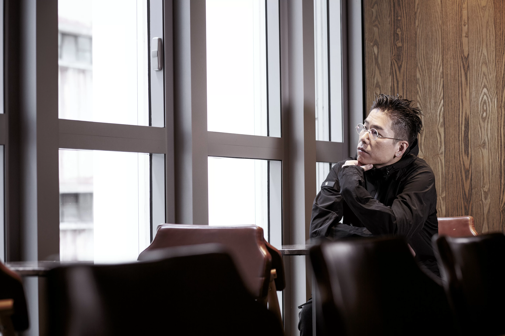

import YouTube from '@/components/patterns/YouTube.astro';

不知不覺之間，林曉峰和太太康子妮結婚十六、七年了。康子妮在加拿大的大學主修音樂，她結婚時廿六歲，可說為家庭放棄了向音樂發展的理想，林曉峰有首飲歌《海闊天空》，在跟鄭伊健等的《歲月友情演唱會》巡迴和無綫《流行經典50年》都唱過，當中歌詞「放棄了理想，誰人都可以」是送給太太。

<YouTube id="EnmLmL1ajNw" />

「她結婚時很年輕，很快生了小孩，當時娛樂圈的環境是，女藝人要穿低胸短裙，才可以有多些機會，但她已做了媽媽，相對少了很多工作，而且獲派的崗位，是比她真實年紀老很多的工作，那時我未有很多音樂方面的工作，所以她放低了很久，直至後來她幫伊健做演唱會和音，然後開始搞自己的音樂工作，又跟我、小春、天華等一起做《歲月友情演唱會》巡迴的和音，才找回自己理想。」

*林曉峰與康子妮*

太太近年製作樂譜、推出鋼琴專輯，組織了女子組合「岩巉」，有錄歌、拍微電影，又自製首飾售賣和經營代購。「我好保守，不熟不做，她就大膽嘗試不同工作。現在我有點不適應，因為兒子開始長大，太太又忙，兒子又忙，我習慣了投放八成、九成時間在家庭，我做什麼？會好迷惘，這正正是我的中年危機。」

## 岳父幫忙付首期買樓

林曉峰這樣形容自己：「我是一個family-oriented的人，與一般人相比，我在工作方面的上進心不大，反而很需要家人，很需要愛。」

他自言是個矛盾的父親，有點控制狂，但又想給兒子自由去嘗試新事物，兩邊拉扯。林曉峰是羽毛球好手，兒子亦受他感染，羽毛球打得很出色，入選體育學院精英培訓計劃。「我逼出來的，我覺得人要有運動，才有鬥志和衝勁，逼我老婆和兩個仔都一齊玩，漸漸覺得他們打得比我好，有機會發展。後來才知，在練習的過程中，原來他們一直不想打，只是為了滿足我；近年決定不要訓練，只是玩才打，在玩的過程中，又發現原來真的打得好，做人就是這麼有趣。」

林曉峰一直都是租樓住，前年首次置業，過程中都反映買樓人士的辛酸。「我一直不買樓，是沒有能力，我太太那幾年不斷跟我說：『不要買那麼多東西。』又說要計一計條數，儲了一點錢，再加上岳父認為我們是時候買樓，幫了我們一部分首期，加起來買了層樓，很多人說：『你一定是做《歲月友情演唱會》巡迴賺了很多。』我都費事解釋，多謝岳父幫忙，所以買到。」

孭着一層樓，經濟有沒有壓力？「我太太感覺大一點，因為她要看着盤數，所以她想試不同工作，要幫輕家計，她覺得我工作辛苦。」

*林曉峰很重視與太太康子妮、大仔林寶、細仔林熙的相處時間，是超級愛家男人。*

## 兩個兒子演藝細胞活躍

林曉峰的長子林寶十五歲，長得頗高，二子林煕十四歲，臉圓眼圓頗可愛。「我們兩夫婦的表演細胞在他們身上都很活躍，大仔擅長跟人談天和分析事物，細仔最叻練啤牌手藝和結他，很多人問：『如果他們想入行，你准不准？』不是我准許與否，要看他們行不行，有人找的話，而他們又行，為什麼不做？」

問他覺得兩個兒子靚不靚仔，他說：「對我來說，我兩個仔全世界最靚仔。」林曉峰近年外型也不同了，減了肥，練了肌肉，在《歲月友情演唱會》騷肌打鼓。「以前別人覺得我肥，就做肥仔角色，其實我原本很瘦的，但入行後，別人覺得我肥肥哋、圓圓哋，幾得意，就keep住這樣，減少少也不可以，我是為了生活、為了別人才這樣。直至做巡迴，才可以做回自己。」

*大仔Bob林寶十五歲生日，一家四口慶祝。*

林曉峰以往給人感覺玩很多男士玩意，精通汽車、電玩、潮服等等，太太要他買少點東西，辛苦嗎？「現在不辛苦，穿來穿去都是黑色，為了做騷，隔一段時間就買套西裝，有人說可以借，我一定要買；以前會追牌子，現在追什麼？沒有人看你穿什麼牌子，一律黑色算了。以前無謂到不得了，同一對鞋，黑色白色都要；同一件衫有黑白灰，黑白灰都要。衣服浪費到不得了，只穿一兩次，擔心別人認得，其實根本沒有人認得，重複穿一百次也沒人理。遊戲機早已不玩，送晒俾人，玩具也送晒俾人，我兩個仔和老婆需要空間，讓了給他們，我全屋只佔一張枱加張木凳，上面有充電線，放我部電腦，我佔的空間只是那麼多，以前買的衫陸續丟棄，不是斷捨離，是不會再穿，讓出空間給家人。」

*林曉峰和康子妮2002年結婚*

## 回家入油

林曉峰去年離開無綫，加入ViuTV主持旅遊節目等，亦是他處理中年危機的其中一個調節。「當你做主持的時候，身邊拍檔比自己年輕一大截，就知道是時候要去新的地方學新的東西。」

他又拍了溫情片《玩轉全家福》，他演家中大哥，盧海鵬演老爸，有個妹妹鄭欣宜和弟弟林德信，對於那麼重視家庭生活的林曉峰，演家庭戲能帶出珍惜家人相處時間的信息，他拍得開心。

他自比一架車：「我不會減少投放給家人的時間，家裏是我的電池、油、動力來源，我減少在家的時間，即是未入滿油，這樣我不能行長途，我要full tank才可以出去闖。」

-   髮型：Vincent@ii Alchemy
-   化妝：Shuen Kong @WiLL Wong
-   場地：九龍貝爾特酒店
