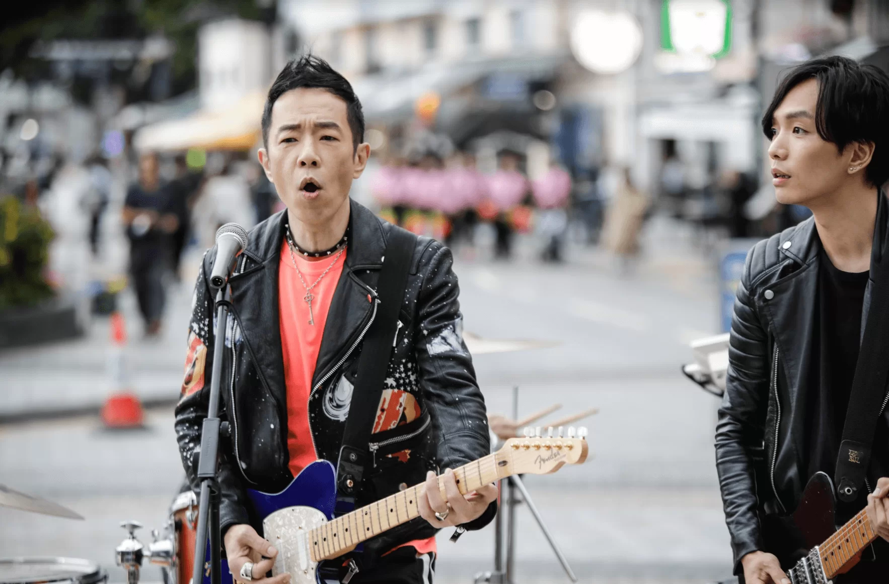
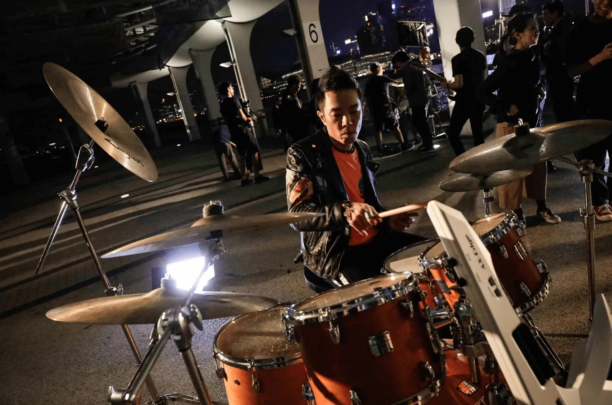
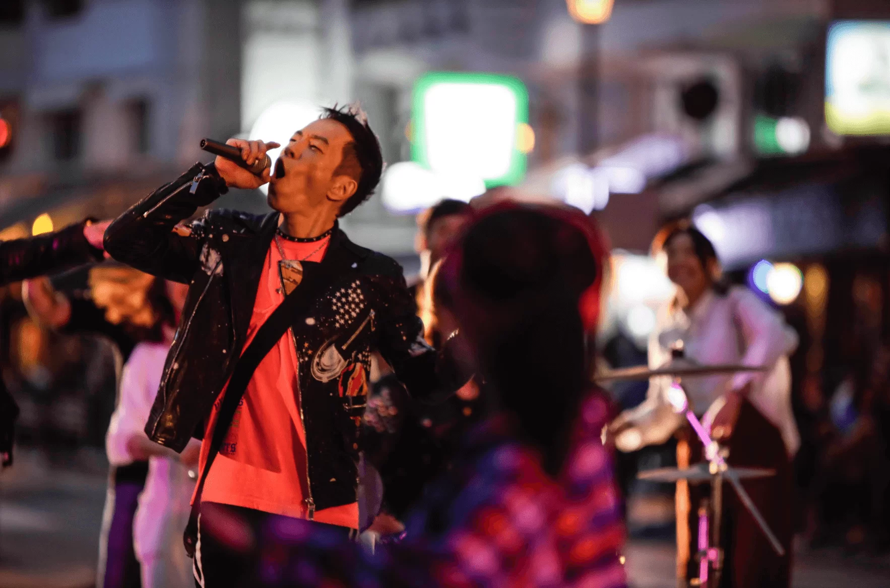
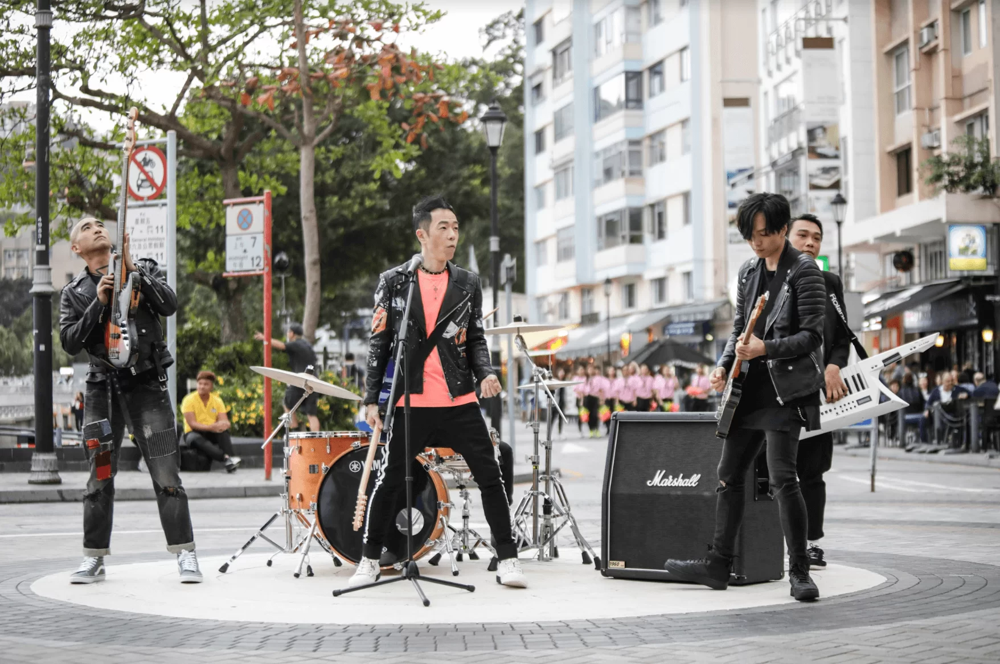
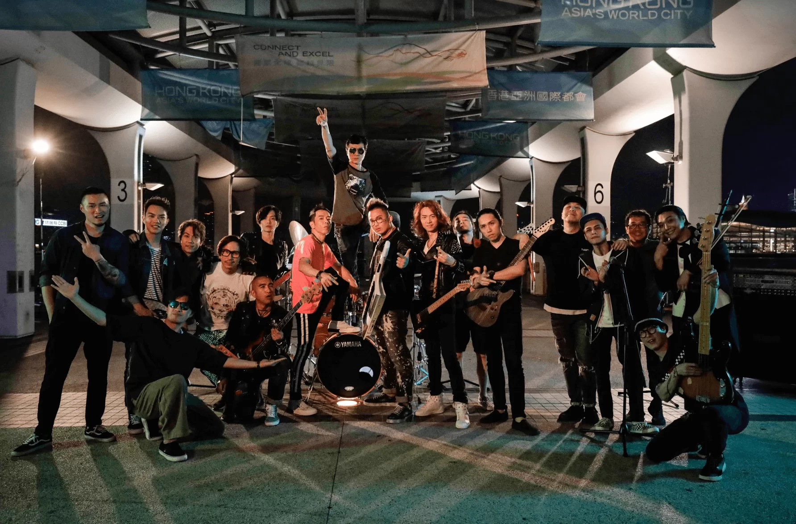

有幾年沒出新歌的黃貫中（Paul）終於推出新歌《何車AHEM》，一向熱愛音樂的他包辦歌曲的作曲和填詞，Paul式搖滾樂令人十分期待！

談起出新歌的感覺，Paul表示自己已不記得太久遠的事：「我記得上次推出新歌時囡囡啱啱出世。上次推出新歌到而家，至少有兩三年，不過感覺好似已經二十年」他指自己以往比較高產，「忽然兩三年無做，感覺就好似過咗十年咁樣！」

至於新歌有何意思，Paul則認爲音樂能代表自己的想法：「無能力喺度講到首歌原本想表達咩嘢，或者就算有能力我都唔係好想講晒出嚟。正因為我無辦法講晒出嚟，所以至需要音樂去幫我講。」他指音樂最美好和特別之處在於「各自都有自己嘅解讀，呢個反而係我唔想講寫呢首歌意思嘅原因」。

音樂有意義之餘，原來音樂MV也大有來頭。這次的新歌MV以電影拍攝方式製作，Paul特地找來多才多藝的泰迪羅賓幫忙，「多謝泰迪羅賓先生，因為佢真係幫咗我好大忙，其實係全靠佢。而家大家覺得好有電影感，Teddy除咗懂得電影，最緊要仲識得音樂，我唔使講咁多嘢，佢已經明白我想表達咩嘢，除咗內容，甚至音樂上想表達咩嘢佢都知道，我其實好開心、好滿意。」

MV在中環碼頭及屋邨等地拍攝，Paul邀請了不少音樂人參與創作，如玩busking的音樂愛好者、街舞舞者、廣場舞大媽，甚至四代同堂的家庭組合！MV中也可見Paul在閙市中夾band的畫面，他一人身兼結他手和主唱，場面十分熱鬧。Paul透露《何車AHEM》節奏感較強，希望觀眾聽後能更加精神和開心。

Paul亦希望MV能融入不同的色彩，故加入香港隨處可見的事物：「我覺得香港如果係一幅畫，就係有好多唔同顏色混埋一齊，有紅有綠有藍有黃有黑，每一種顏色都混埋一齊就會變得好靚。」從MV花絮中可見，Paul的畫室中掛滿油畫。他拍攝MV時也搞笑地為自己的臉畫鬼臉，可謂童心未泯。

MV在三月拍攝，碰巧撞正Paul的五十五歲生日。Paul在拍攝期間收到生日蛋糕，令他十分驚喜，更五體投地感謝這份意料之外的生日禮物。近年一直和葉世榮舉行演唱會的他，希望能再次在香港表演：「早前喺佛山玩得好開心，但都好希望可以同樣喺香港玩得咁開心。我覺得一定要喺香港舉行，又唔一定要喺紅館嘅，總之必須要喺香港舉行一次嘅。」期待Paul在香港的演出！
