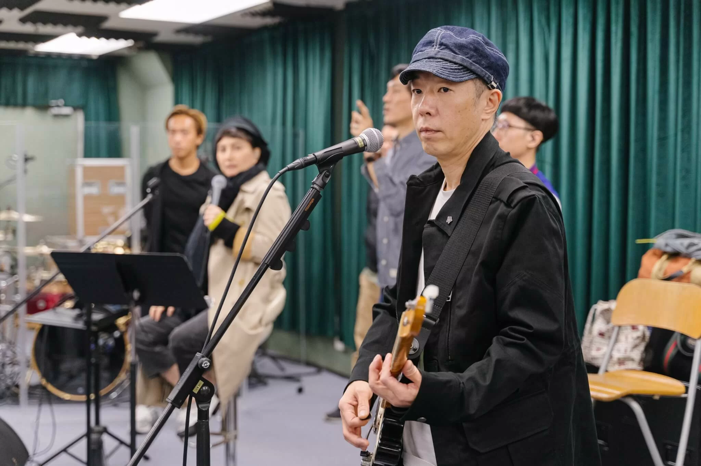
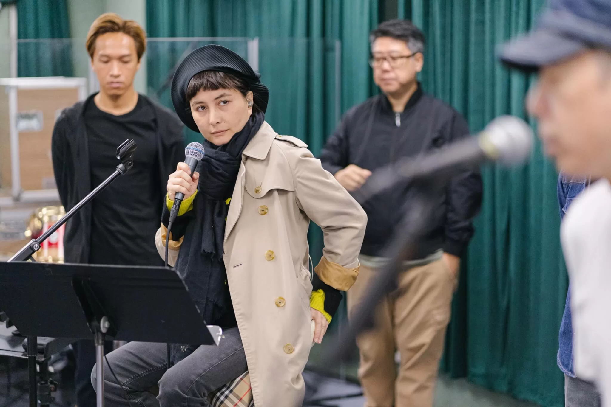
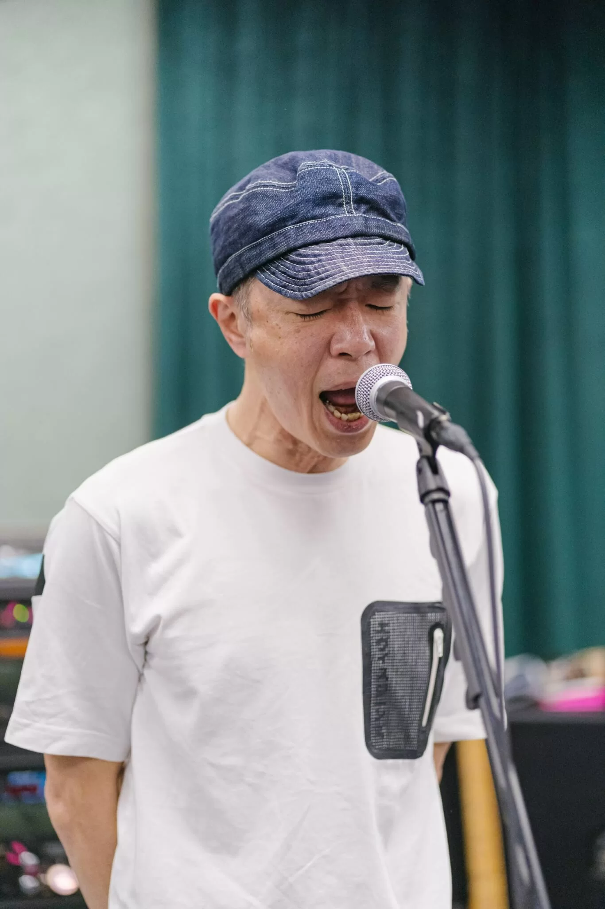
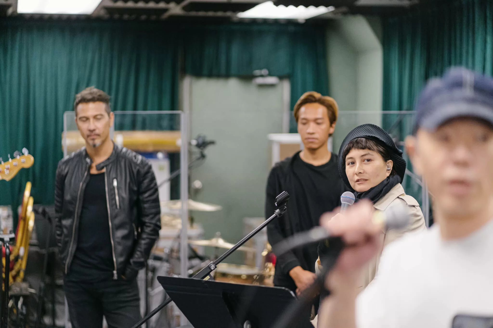

黃貫中（Paul）自從2016年在九展舉行過個人音樂會後，已有3年沒有舉行個唱。12月，阿Paul將率領香港6大搖滾樂隊Josie & The Uni Boys、Soler、ToNick、Cassette、秋紅以及逆流赴澳門開騷。

阿Paul日前與樂隊練歌，對於與葉世榮的紅館演唱會取消，阿Paul坦言感到無奈及可惜。但他的心情未受影響，十分認真和投入排練，並與樂隊及工作人員有講有笑。

阿Paul表示非常期待今次的演出，目前最希望集中精神做好澳門Band Show，距離演唱會不足一個月，他表示已經準備好心情迎接，偕同各樂隊齊齊Jam歌，一同大匯演Beyond經典金曲《海闊天空》，向Beyond致敬。

