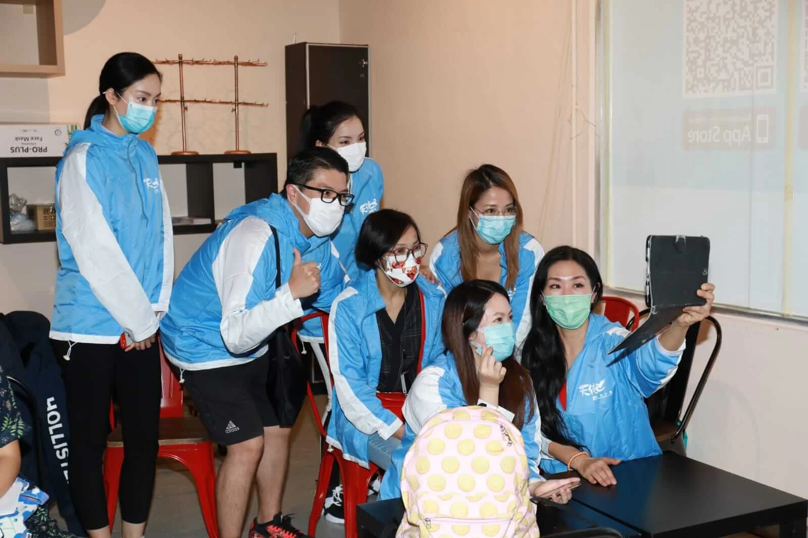

韓馬利、葉家寶、施熙瑜、丁樂鍶、關浩揚等現身觀塘向市民派口罩及消毒用品，Mary姐有份投資的跳舞學校受「限聚令」影響而停業，不少朋友問她何時復課，她坦言安全為上，復課急不來，又透露業主應該會減租，但不敢計算蝕了多少錢，只能相信明天會更好：「最緊要學校重開大家有工做。」家寶表示影音使團於5月9日在網上舉行《疫境同行 真的愛你》音樂會，屆時會有關心妍、林沖、巫啟賢等歌手演出，目前亦正在聯絡黃貫中，看看他能否與朱茵或Beyond成員獻唱《真的愛你》，送給各位媽媽。

