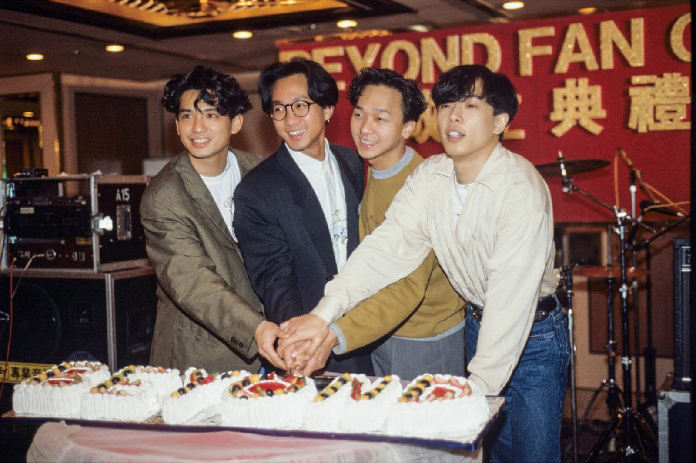
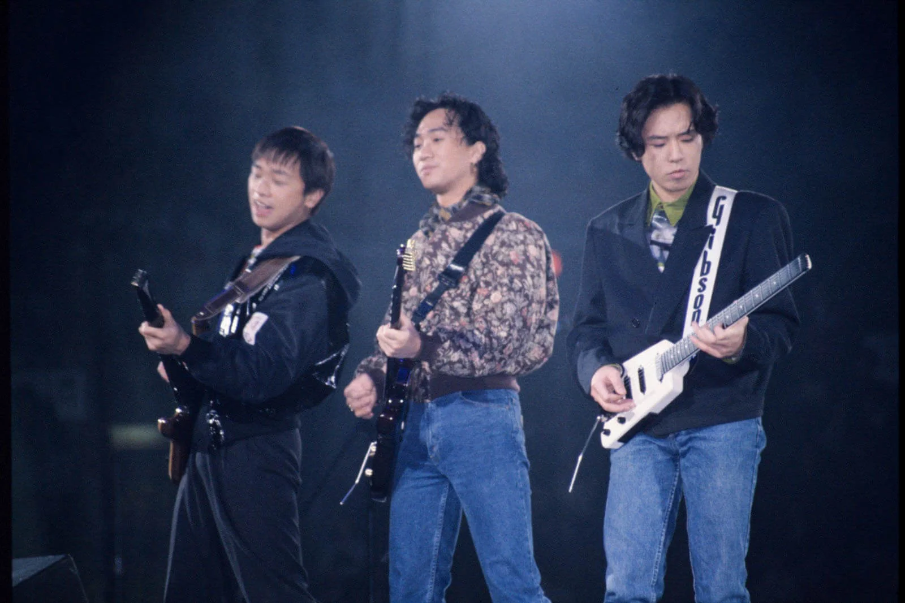
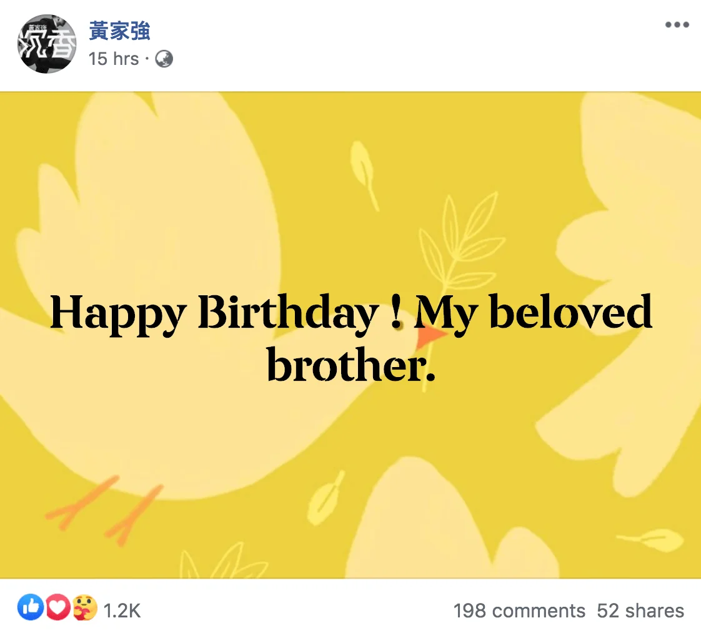
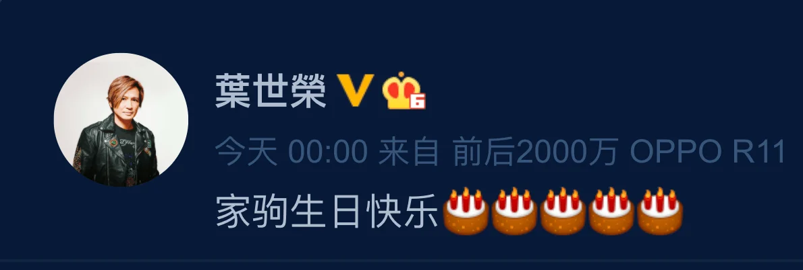
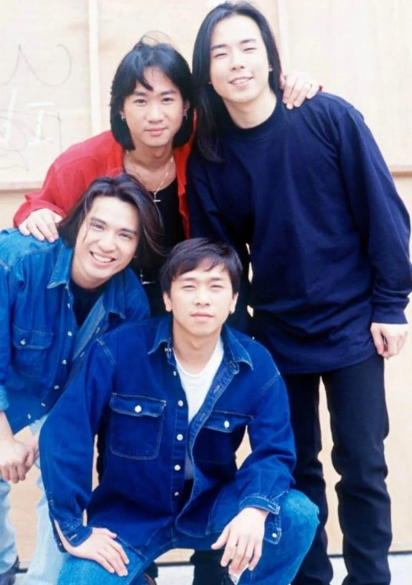

今日（10日）是殿堂級樂隊Beyond主唱作人黃家駒的58歲生忌，家駒在日本意外逝世至今將近27年，仍無減樂迷和昔日Beyond隊友對他的思念，其對音樂的執着和愛好和平自由的精神更影響不少年輕一代。

在家駒冥壽這天，Beyond三子依舊透過社交網向遠方送上祝福，家駒胞弟黃家強在Facebook寫道，「Happy Birthday ! My beloved brother.（生日快樂﹗我親愛的兄弟。）」

葉世榮亦準時在零時零分發文：「家駒生日快樂」；黃貫中也留言：「家駒，生日快樂！」一班樂迷除了在網上為家駒慶生外，還專程到家駒九龍塘省善真堂的靈前奉上祭品，祝願偶像生辰快樂。

