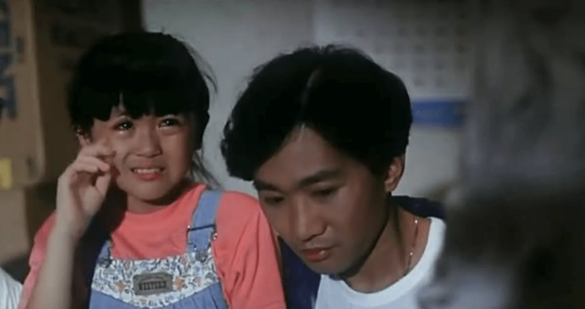

今日（30日）是殿堂級樂隊Beyond主音黃家駒逝世27周年，家駒曾於1991年和隊友黃家強、黃貫中和葉世榮，以及王菲、萬綺雯合作拍攝電影《Beyond日記之莫欺少年窮》，其中飾演家駒妹妹的「麗娜」唐寧，在IG貼出二人合照悼念「二哥」。當年只有10歲唐寧深受家駒疼愛，她亦視對方為親哥哥，即使家駒離開二十多年，也無減對哥哥的思念。

*二人合演兄妹*

而葉世榮亦微博留言悼念：「我們懷念你﹗」家駒胞弟家強在Facebook坦言難以入眠，他寫道：「難以入眠只因思念佔據了我的思緒，望向星空彷似看到你充滿憂慮的眼神，若然看不到的未來會是悲劇的誕生！那麼無畏無懼的步伐才是命運的贏家。無奈未能與你一起走過這大時代的變幻，但感覺你一直在我身邊就已經足夠了，謝謝你的愛。哥哥，永遠懷念你。」

