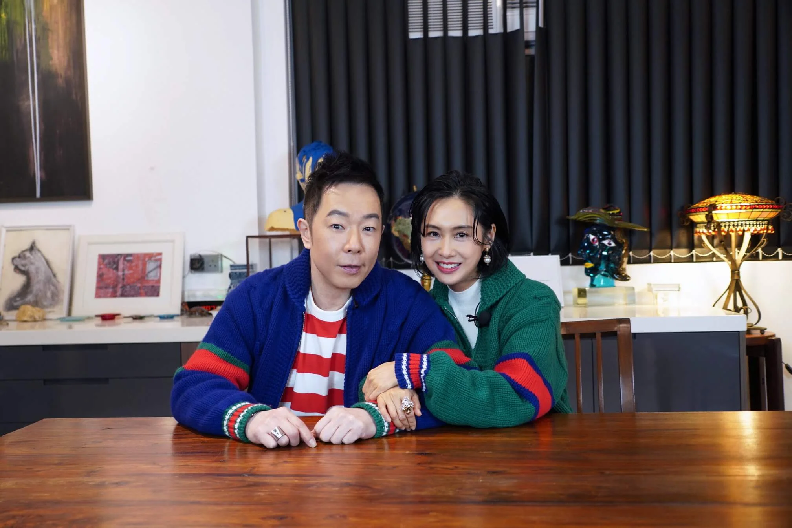

黃貫中與朱茵趁今日（26/02）元宵佳節，分享相愛廿年的相處之道，不過之前就玩遊戲熱身，挑戰「愛情五秒定律」，首先Paul說出老婆三件最易令他發脾氣的事，「凍又唔着衫、肚餓唔食嘢、亂放雜物、唔願起身、遲到。」他一口氣連珠炮發，朱茵裝作生氣，表示：「你今晚係咪想頂痰罐啊？」不過談到老婆身上最大的地方，Paul氹得老婆很開心，「眼大、嘴大和志氣大。」輪到朱茵說出為老公做過最浪漫的事，她說：「煮飯、揸車送佢開工、幫佢開門‥‥‥」Paul一臉無奈：「咁都算浪漫？」最後，朱茵在挑戰中落敗，向老公送吻作元宵禮物，感覺甜蜜又溫馨。

兩人相愛超過廿年，依然恩愛，黃貫中坦言這些年肯定有悶場，但要懂得如何保鮮，「最重要唔好有一個奉旨嘅心態，例如太太為你煮飯，你要識得欣賞，要覺得每一餐飯都係第一次，將呢個心態套用喺所有事情上，就唔會覺得悶，反而好新鮮。」朱茵就建議大家想想如何在生活增加情趣，尤其現在疫情影響，夫妻多了時間留在家中，可以嘗試做不同的事，例如一起砌3D模型和睇戲。

夫妻倆總有意見不合，甚至爭吵的情況發生，黃貫中自有一套「爭吵哲學」，表示：「吵架輸咗，固然係輸；贏咗你都有排捱！既然輸贏都係處於輸家嘅狀態，奉勸各位男士最好就唔好同另一半嘈，係咪都認錯先。」

