import YouTube from '@/components/patterns/YouTube.astro';

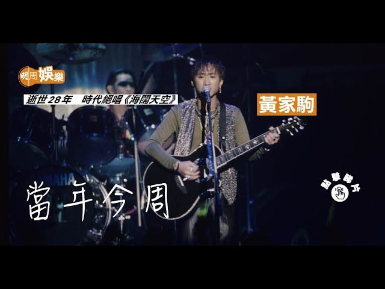

<YouTube id="bzHXeFl68Ho" />

一九九三年六月廿四日，樂隊Beyond為宣傳即將發行的日語唱片，應邀到日本富士電視台位於河田町的4號錄影室拍攝遊戲節目《小內小南的 想做什麼 就做什麼》，遊戲進行了十五分鐘便發生意外：樂隊主音黃家駒在狹窄並沾滿水漬的台上奔跑時不慎滑倒，強大衝力使身旁三塊佈景板的固定裝置脫落，佈景板鬆開。黃家駒與身旁的主持人內村光良一同墜落三米高的台下。黃家駒頭部朝下摔落，後腦首先着地，隨即昏迷；內村光良則胸部着地，僅受輕傷。

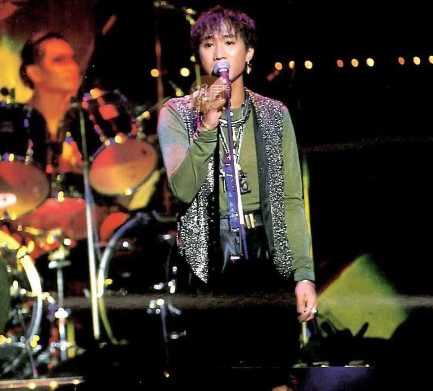

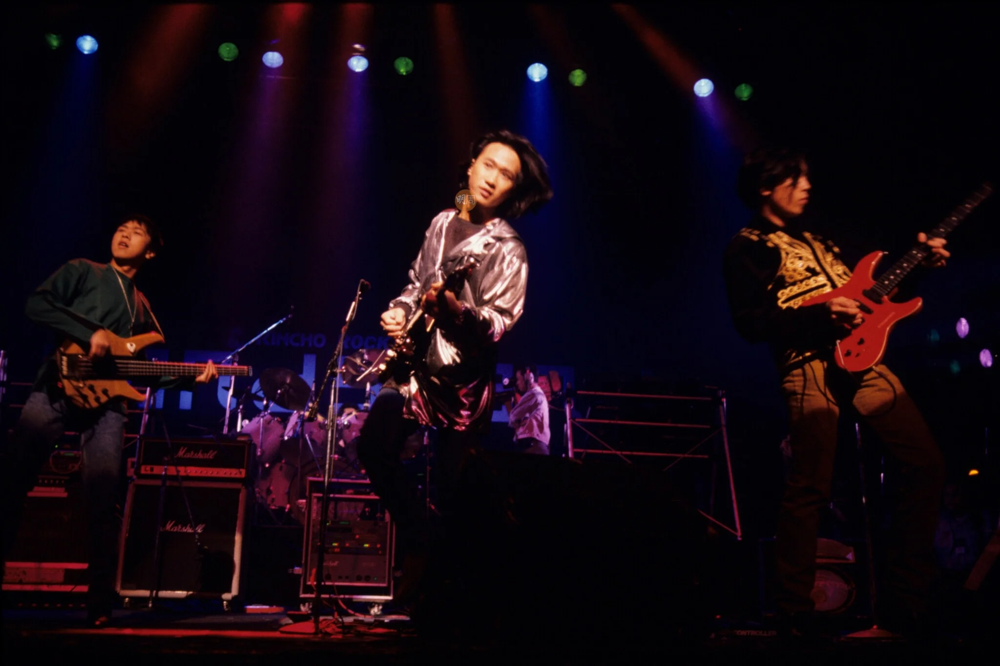

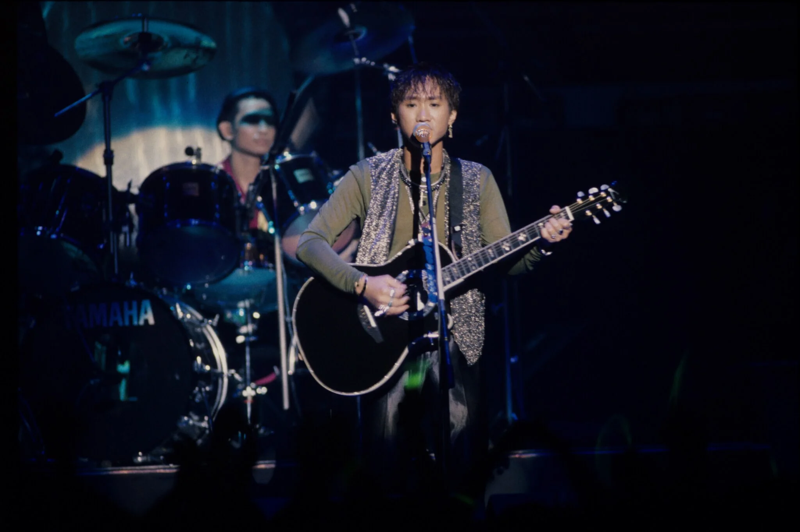

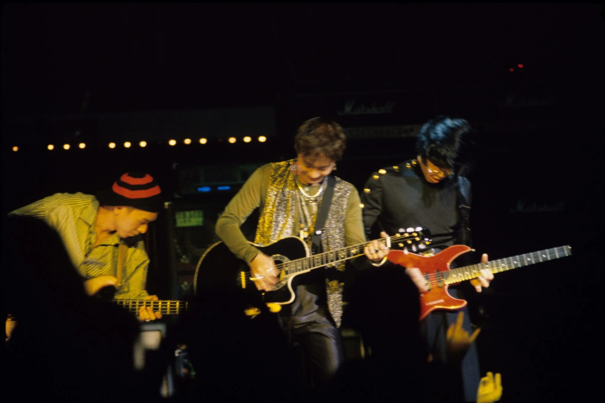

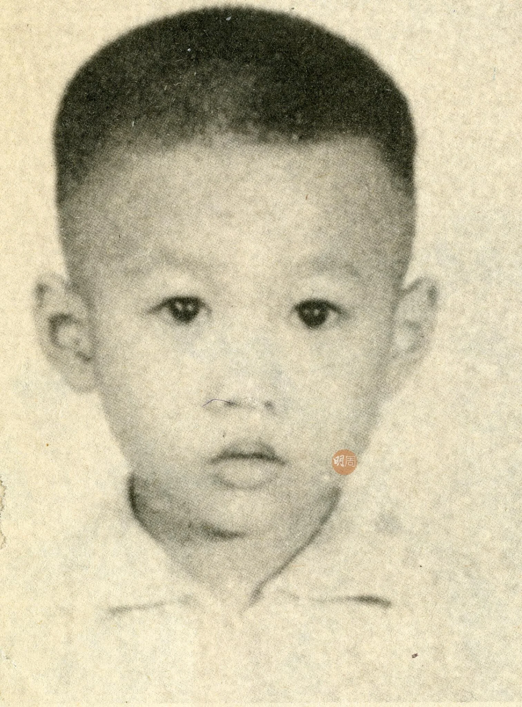

*黃家駒*

鑑於黃家駒頭部嚴重受創，醫生未能施手術清走腦內瘀血，昏迷六日後，於六月三十日下午四時十五分在東京女子醫科大學醫院逝世，終年僅三十一歲，院方公布死因為急性腦膜下血腫、頭蓋骨骨折、腦挫傷及急性腦腫脹。

七月二日，黃家駒的遺體運回香港，七月四日於北角香港殯儀館設靈，同日晚上香港商業電台於紅磡高山劇場舉行「永遠懷念家駒」悼念音樂會，全場坐滿二千六百人，大部分與會者表現激動。翌日中午大殮，靈車駛出殯儀館時，聚集在人行道上的數千名年輕樂迷衝出馬路圍着靈車，情況一度混亂。遺體最後下葬於將軍澳華人永遠墳場，而九龍塘省善真堂亦安放了其靈位。

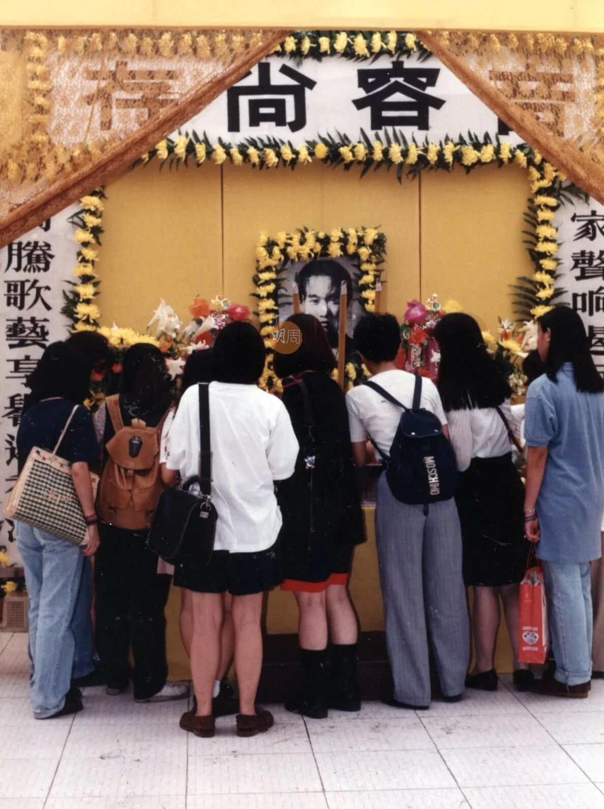

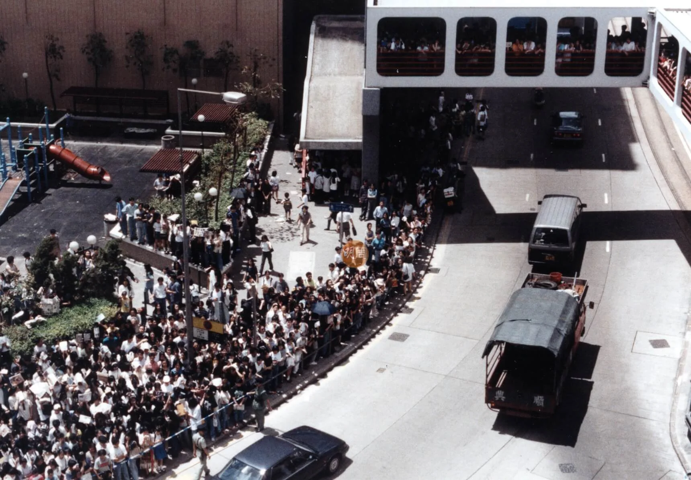

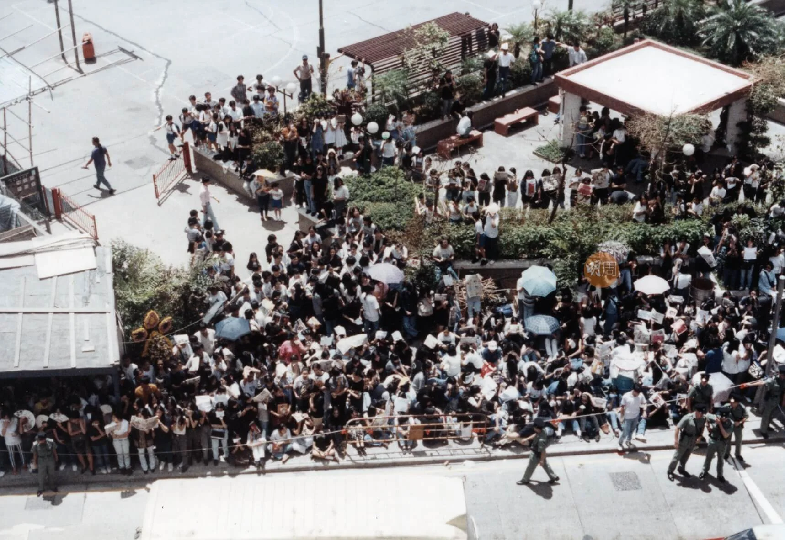

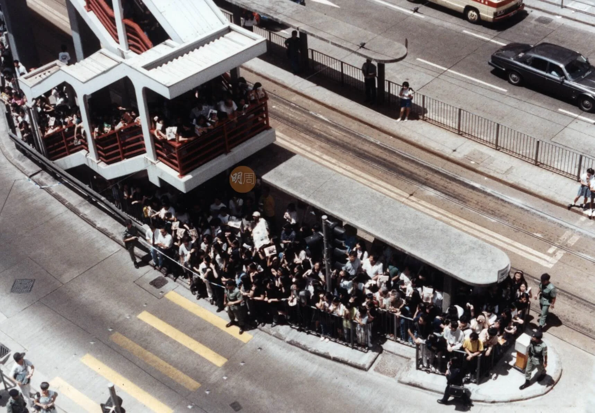

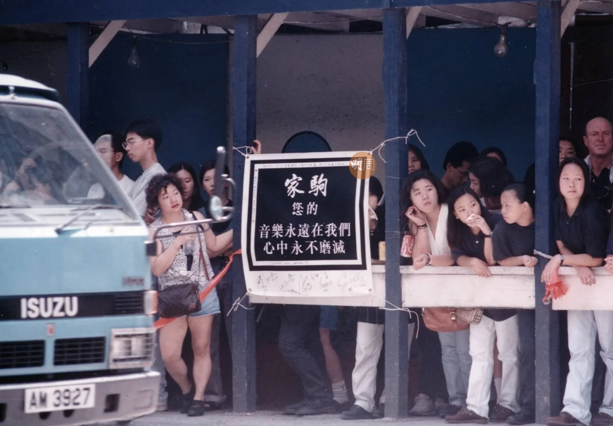

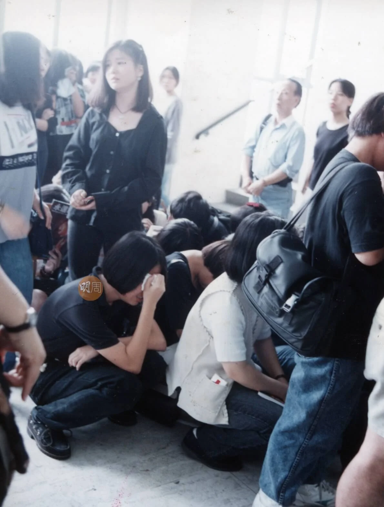

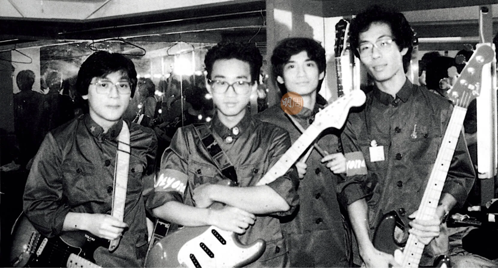

黃家駒六二年六月十日出生，一家七口住在九龍深水埗蘇屋邨，十七歲時，黄家駒因鄰居搬家撿來一把木結他，有了他的第一件樂器。他曾參加地下樂隊，遭主結他手羞辱，說他彈奏甚差；黄家駒很難過，回家後，對弟弟黄家强說自己有了人生的第一個目標，就是要彈奏得比這位樂手更出色，他更不分晝夜練習。

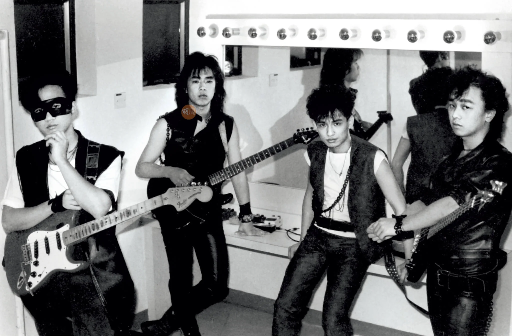

*初代beyond*

那時他的偶像，就是有搖滾變色龍稱號的英國歌手David Bowie。八十年代初，中學畢業的黄家駒兼職做過辦公室助理、五金、冷氣、水電工程、電視台布景員等，甚至加入樂隊鼓手葉世榮任職的公司任保險經紀。他通過香港通利琴行老闆介紹認識葉世榮，於是連同兩位朋友鄧煒謙和李榮潮一起組成樂隊，八三年參加《結他雜誌》舉辦「山葉結他比賽」，因為報名需提供樂隊名字，鄧煒謙為樂隊定名為Beyond，樂隊在比賽中贏得冠軍。後來鄧煒謙和李榮潮相繼離隊，八四年，黃家駒的弟弟黃家強加入成為低音結他手，八五年，主音結他手黃貫中加入，同年，Beyond在堅道的明愛中心自資舉辦《永遠等待演唱會》，翌年再推出自資卡式帶《再見理想》，之後在經理人陳健添（Leslie Chan）的協助下，從地下音樂正式進入商業流行樂壇。

*小時候的黃家駒*

黄家駒的音樂路上並非一帆風順，相反更是走在一條充满崎嶇不平的小路上。他集詞、曲、唱、編曲於一身，一生創作了七百多首歌曲，但是發表的只有一百多首。九○年，黃家駒與黃家強接受訪問，兄弟二人談起了音樂，家駒説：「我想如果沒有音樂我會死的，我真的會死的，我不可能沒有，玩音樂，很多家裏人會覺得沒有出息，家裏覺得玩樂隊夾band沒有前途。而我屬於非常走火入魔的那種，不是隨隨便便玩玩的。」作為樂隊靈魂的黃家駒對香港狹小的音樂市場也頗有微詞，他說過香港只有娛樂圈，沒有樂壇。

*黃家駒*

黄家駒一直在尋找商業和搖滾之間的平衡點，從《再見理想》、《永遠等待》開始嘗試搖滾的理想主義青年，在自資出版唱片和小型演出不被重視後，堅持不懈的同時也改變音樂走向，開始唱一些更容易被接受的歌曲。《大地》、《真的愛你》打出知名度以後，他們歌曲的题材愈來愈豐富，而他留下最後的作品《海闊天空》更是超越時代的絕唱，及後經常出現於籌款節目、示威活動等多種場合，歌中的不屈不撓激勵人心，成為象徵「永不放棄」的神曲！黃家駒的音樂作品，對香港、台灣、東南亞、中國大陸、日本及世界其他華人地區年輕樂迷仍然有着深遠的影響。

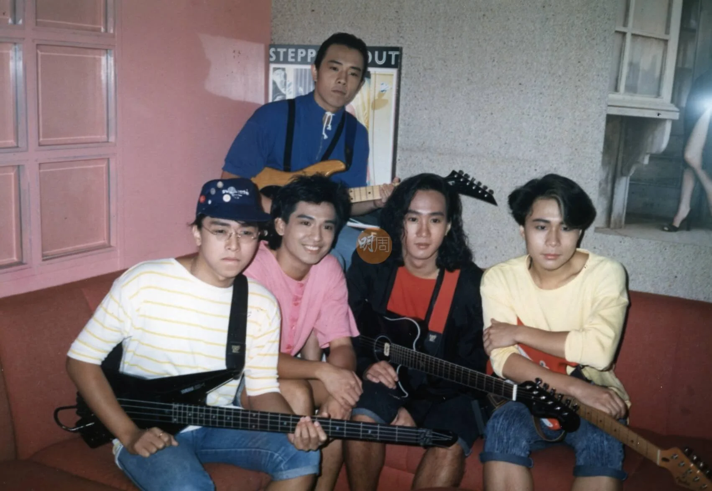

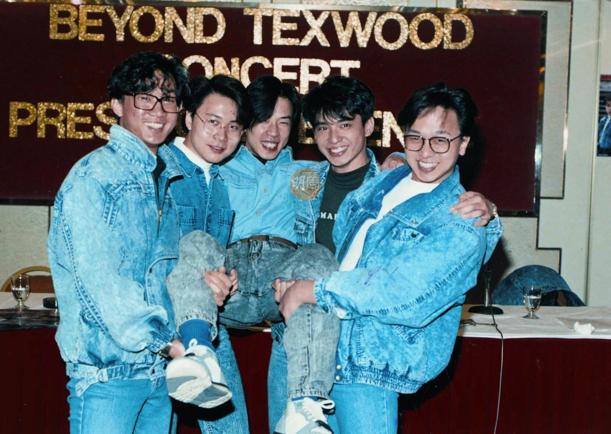

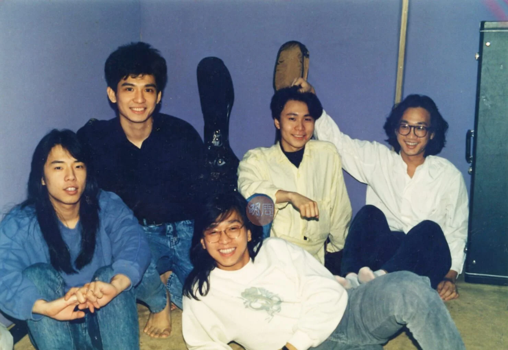

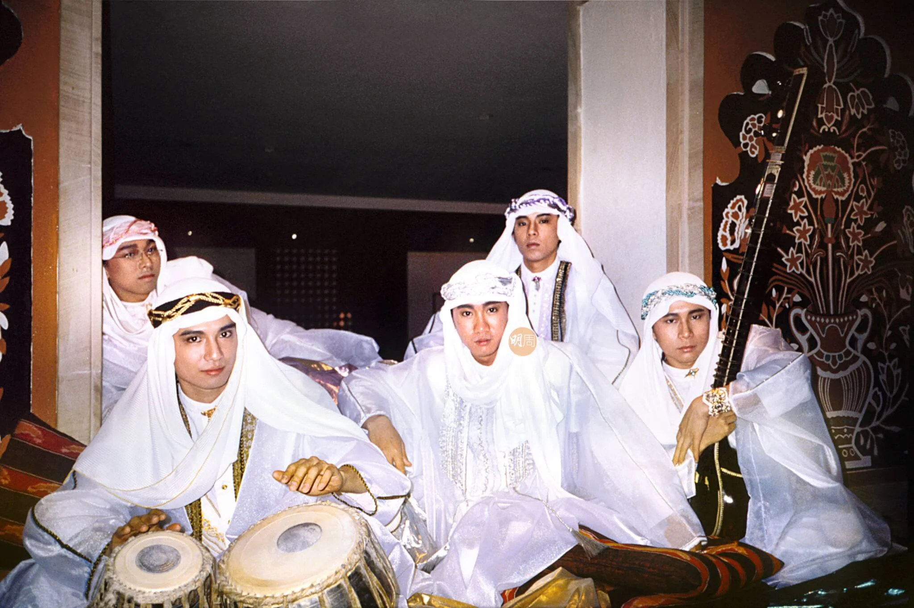

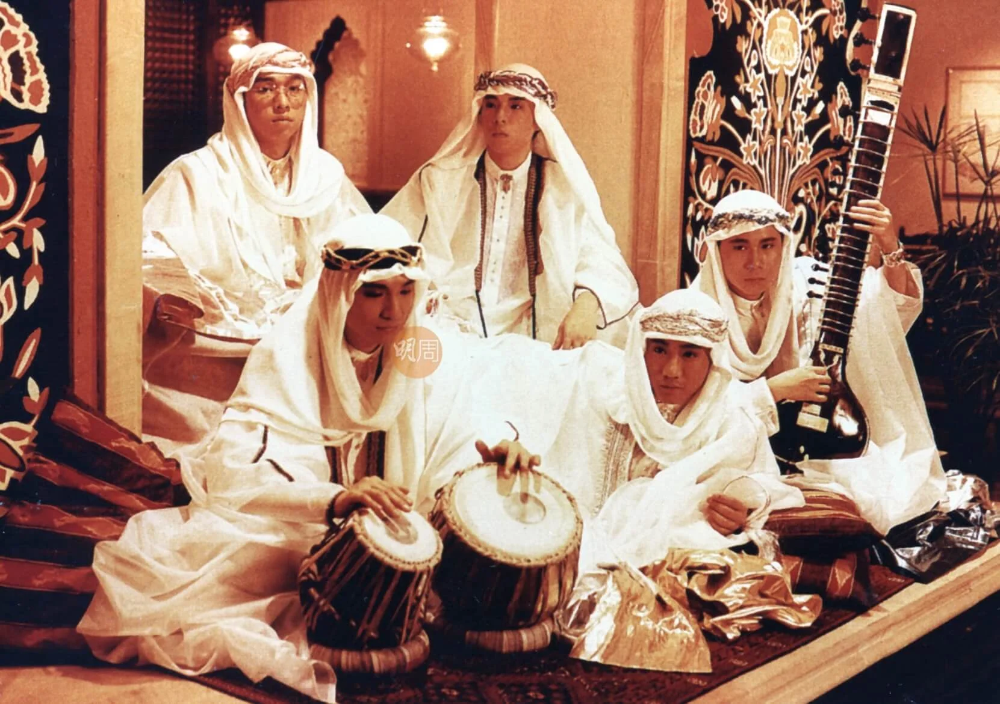

*Beyond*
