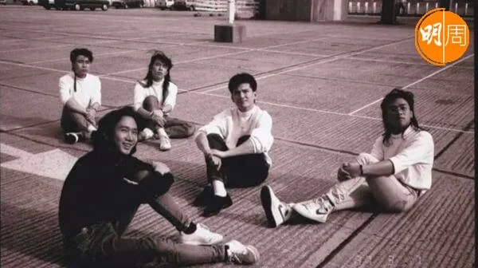
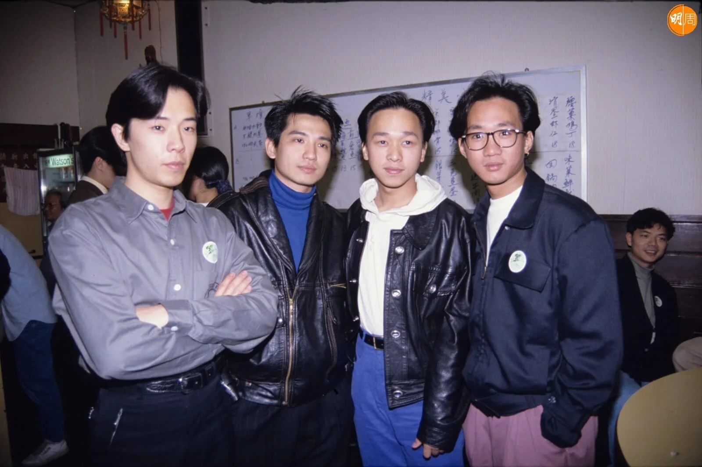
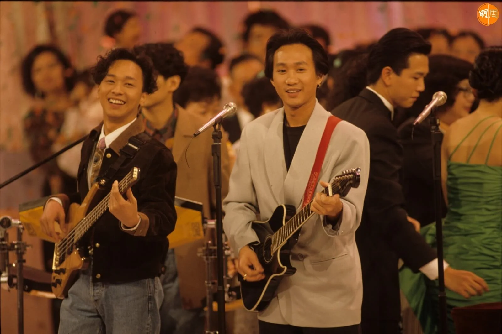
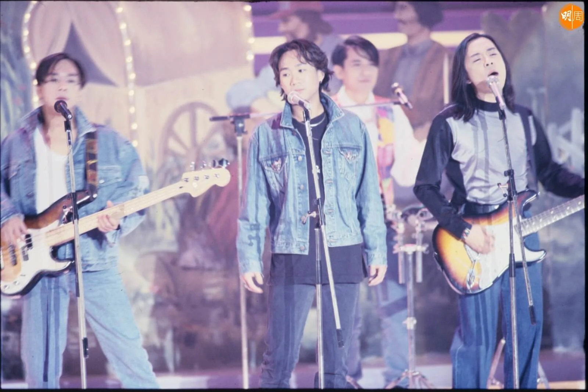
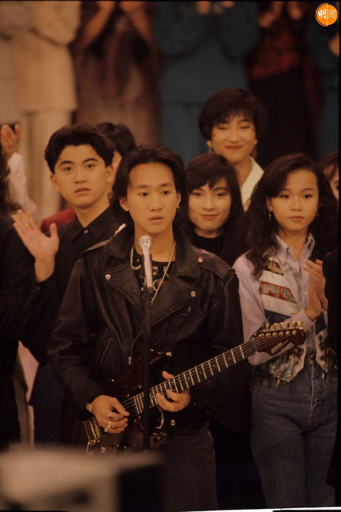
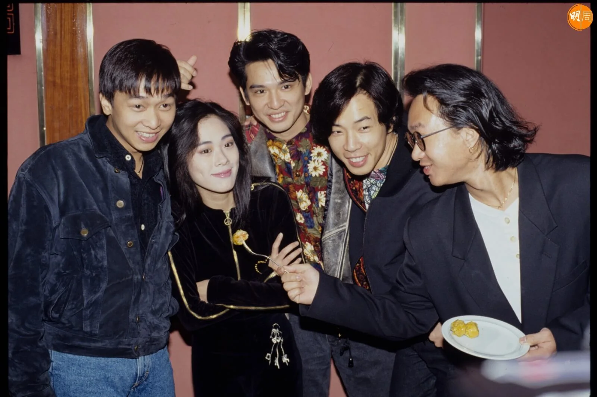
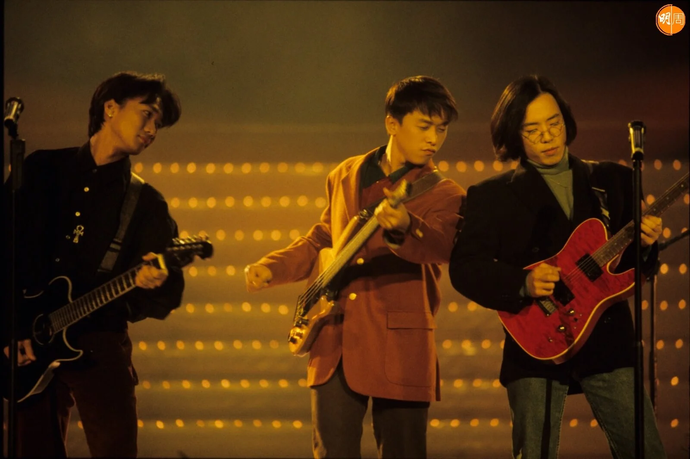

import YouTube from '@/components/patterns/YouTube.astro';

假如黃家駒（Koma）依然在世，今天（6月10日）他已經60歲了。

*黃貫中在社交網上載與家駒合照*

*阿Paul與家駒一起走過青葱歲月*

*去年家駒死忌，阿Paul也有在社交平台表達對家駒的思念。*

充滿音樂天分的家駒，是Beyond靈魂人物；遺憾地，於1993年6月24日，在日本參與富士電視台遊戲節目從高台跌下受傷，6月30日逝世，終年31歲，令人惋惜不已，他留下無數經典作品，長伴歌迷。

他的好兄弟黃貫中（Paul），平日甚少在社交平台發文，但今天早上，他上載了兩張與家駒和Beyond的舊照片，寫道：「兄弟，又到今日了，時間流逝快得像丟失了一樣，但在我心中的你卻沒有『昨天』過，還好嗎？祝你生日快樂！」

去年家駒死忌，阿Paul也有在社交平台表達對家駒的思念，「28年前，失去了一個好朋友，世界上少一個天才，其實我知道你沒有走過，你一直都在，就在我左右，每當音樂響起時，你比以往任何一刻都更貼近我們，對，你不在天堂，也不在地獄，你就在我們的心裏。家駒，謝謝你給我們的一切。」

<YouTube id="0D78vXMXyLI" />
