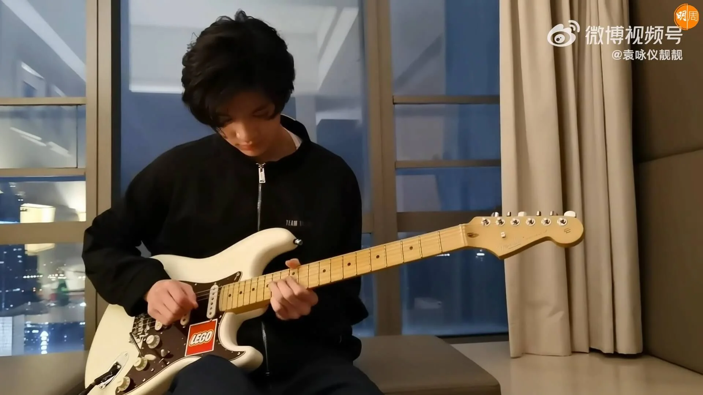
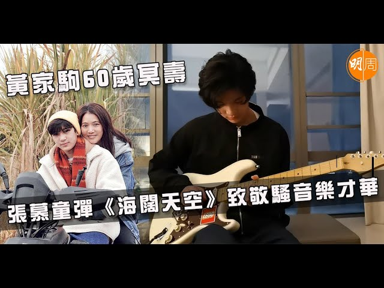
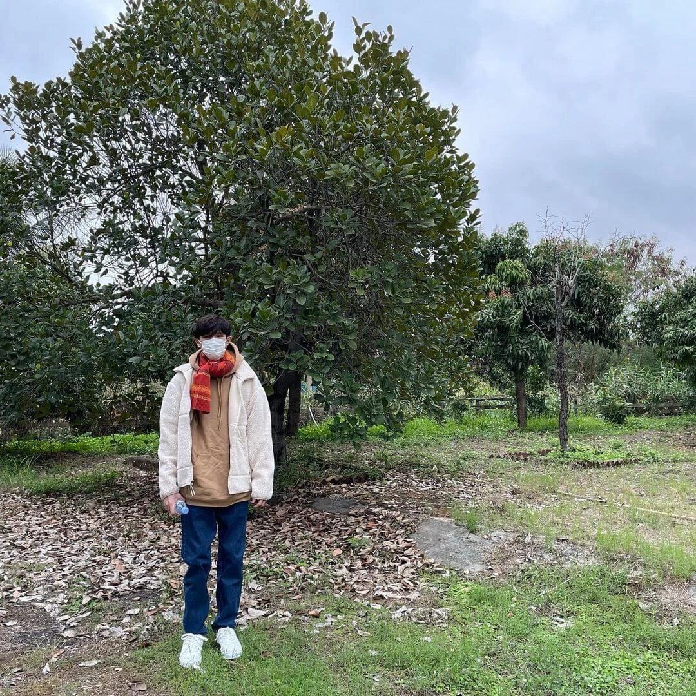
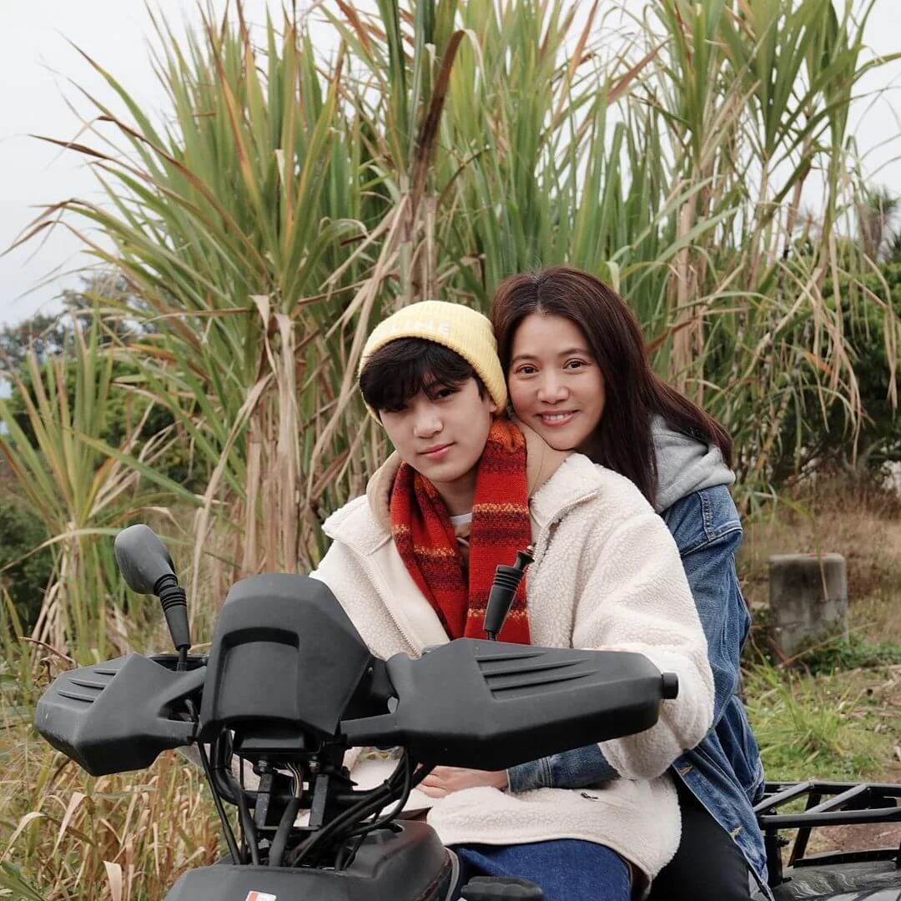
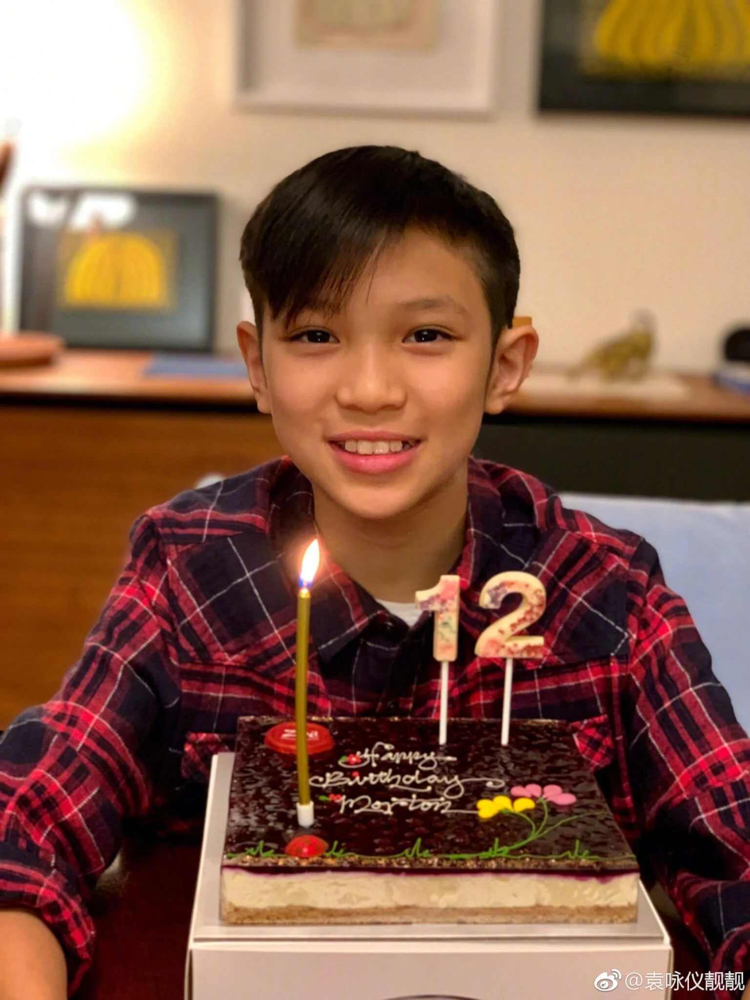
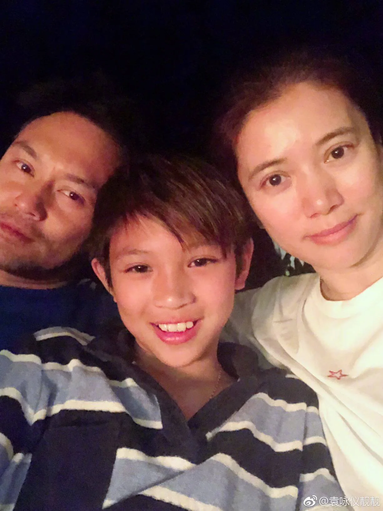

import YouTube from '@/components/patterns/YouTube.astro';

前日（10日）是Beyond主音黃家駒的60歲冥壽，眾星及歌迷都以不同方式悼念他，而身為家駒忠實粉絲的袁詠儀也不例外，她在微博分享一段短片，由兒子張慕童（魔童）手握電結他，彈奏Beyond名曲《海闊天空》的solo部分，看其功架非常熟練，專注彈奏時散發魅力，加上討好外型，令粉絲瘋狂讚好，「我的天啊，魔哥太帥了」、「魔先生遺傳了爸爸的音樂細胞」、「結他彈得好棒」。

<YouTube id="JLN2ZFi6oKE" />

