import YouTube from '@/components/patterns/YouTube.astro';

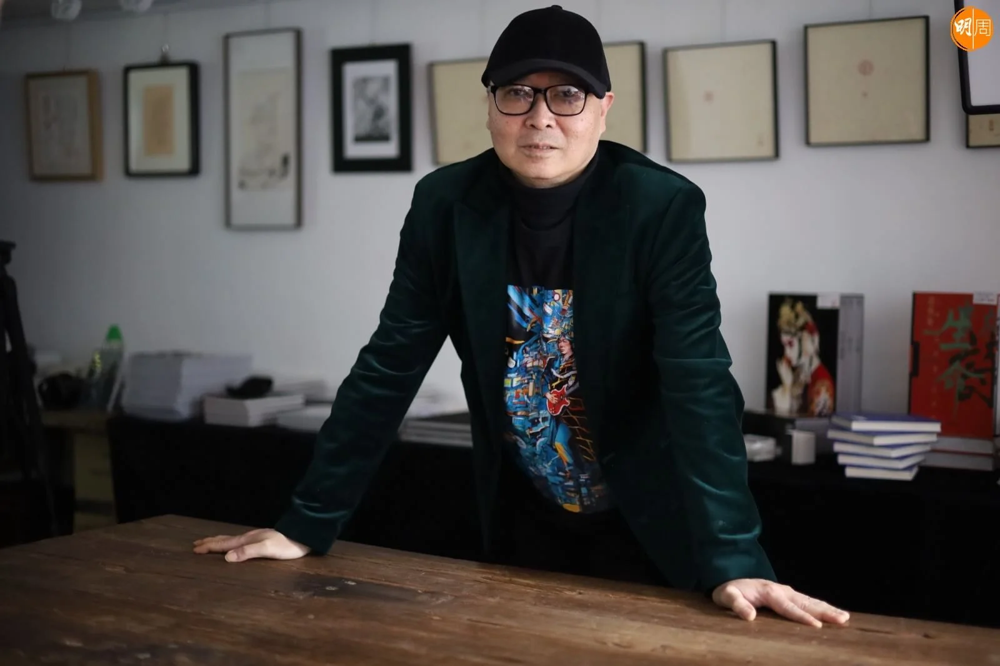

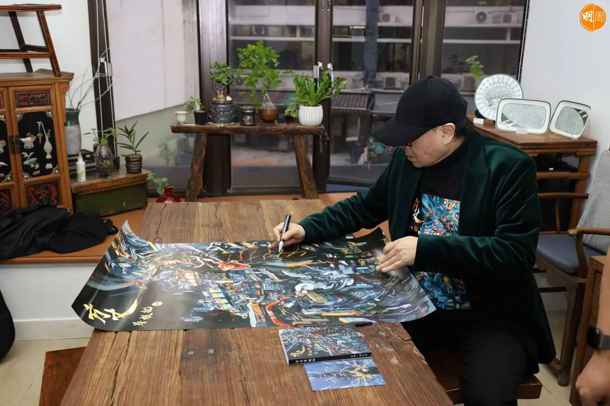

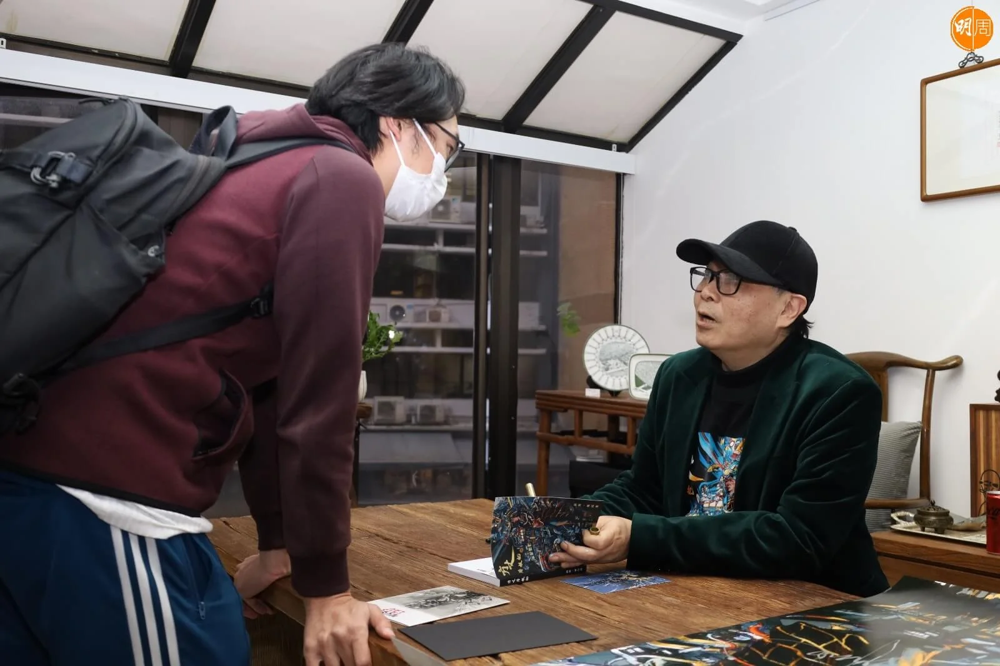

劉以達現在一日飲8罐可樂，「白色嗰隻！」他說。每朝八點起牀，晚上很早就睡，生活規律，控制飲食修身瘦了廿多磅，只是煙癮戒不掉，訪問期間要「呼吸」一下。過去三年，劉以達形容為「軟禁期」，「日日喺屋企百無聊賴，好似好多香港人咁，又冇工開又冇戲拍，我強項係音樂，點知攞起支結他都唔知做乜！」結果，憂鬱症重臨，直到執筆寫完自傳，才真正療癒。劉以達感恩一直陪伴身邊的達嫂，訪問時對她愛的剖白。《方丈尋根記》既是劉以達的半生緣，也是他寫給香港的情書。

下月正式「登六」的劉以達，大半生寫歌的達哥，竟然寫起字來，最近推出了自傳《方丈尋根記》，尋根源頭來自一位粉絲，「突然間有個達明fans，po咗一張相上去我FB，我年青時喺北角（炮台山）富利來商場，租咗場教學生又試音，終於搵到明哥（黃耀明）。睇見fans呢個post，突然間馬尿都流埋，憶起當年；跟住我老婆睇到，佢都知我青年奮鬥經歷，但唔係好深入，佢叮一聲，不如你都寫啲年青時候奮鬥短篇故仔啦，post上去FB，激勵下現今香港人同年青人。」

<YouTube id="Th4asBttkDI" />

由FB短篇連載，變成實體書自傳出版。這次尋根回憶錄，竟將過去三年的鬱悶，一併抒發出來，「今年（去年）年頭，已經經歷咗社會運動，跟住個三年，真係軟禁期呀！我有『三高』，醫生唔建議我去打針，佢又唔肯開醫生紙俾我，我唔知佢點解啦，等咗三年都冇打（針），日日喺屋企百無聊賴，好似好多香港人，又冇工開又冇戲拍，我強項係音樂，點知連做音樂都冇mood，日日望天打卦。」憂鬱症復發，「要去睇醫生，之前我都試過幾大鑊，呢次冇咁大鑊，但都影響心情，早晚要食藥，瞓覺都要食安眠藥；依家唔使喇，依家好好多，開始做呢個project嘅中期，已經唔使（食藥）！百無聊賴冇寄托，人生好似已經玩完，突然間有嘢充實返心情，醫返好自己囉！」

## 望天打卦擔心生活

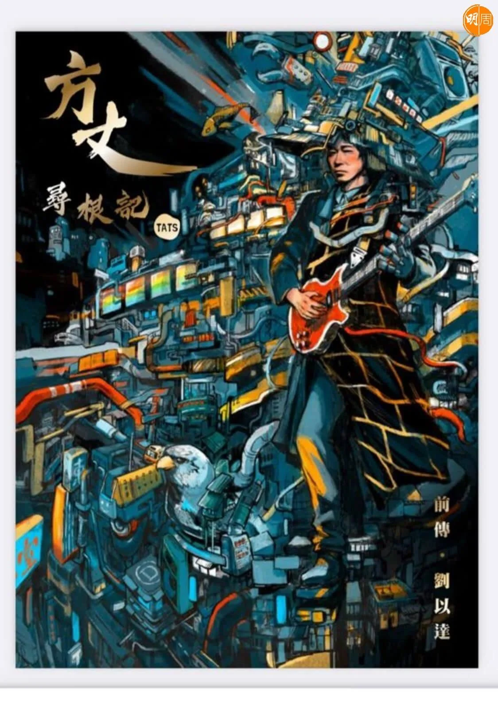

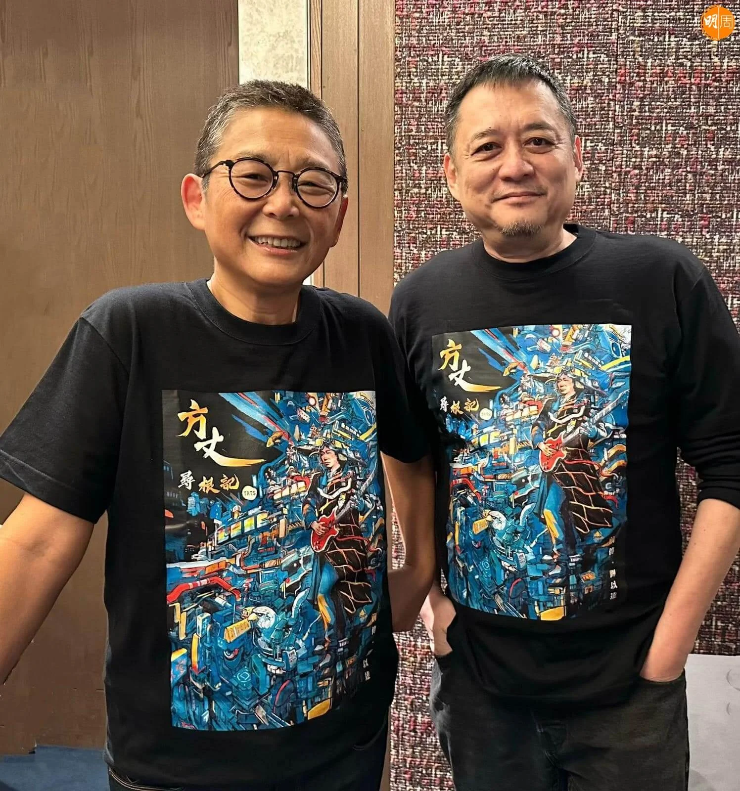

劉以達說，冇工開冇戲拍，即使有人找他開戲，結果酬勞之低，他寧可返屋企瞓覺，「最主要係市道問題，曾經有人搵過我拍劇，某電視台，唔開名啦，搵我拍幾集啫，開嘅價錢，我絕對接受唔到，我情願返屋企瞓多幾個鐘頭覺！（低成點？）低到幾多個位呀？4個位，一日得4個位！」

「軟禁期」在家望天打卦，「我擔心將來，疫情都唔知幾時完，幾時社會先回復正常，演藝事業先會再返來，唔會突然之間荷李活走嚟話搵我拍戲，佢鬼知你係邊個咩，鬼佬唔知我係方丈㗎嘛！所以我又擔心生活，主要係經濟問題。」達哥再說，「好彩都有啲積蓄，都叫頂住，起碼有兩場《Replay演唱會》可以頂住！」21年的聖誕，正值達明在伊館開騷，陪住香港人重溫達明經典。1986年出道的達明一派，時至今日，仍有版稅收，不過達哥說，「環球（唱片）依家仲有賣返精選達明一派嘅唱片，CD、黑膠都有出，但係分嘅錢唔多，因為當其時我哋簽嘅時候，好多年前啦，簽落我有作曲費收、artist費又有得收，但係砸咗咁耐，一年最多幾千蚊咋，最多喎！」

說起達明，劉以達坦言，兩人親近過又疏遠過，如今一切在心中，「同明哥依家嘅感情，唔使見㗎，一個WhatsApp已經搞掂，因為我哋已經昇華晒，友誼昇華咗！我都好祝福佢，喺台灣1月1號個mini concert，祝佢玩得好開心同埋平安，有一場仲喺高雄！」達哥忽然醒起，「我仲未俾本書佢！」

除了明哥黃耀明，另一個對劉以達影響深遠的重要人物，是俞琤。「如果冇咗佢，真係冇達明一派。我打算搞二人電子組合（85年），登報紙搵歌手，明哥喺商台做緊DJ，俞琤又喺商台。明哥來應徵，我覺得明哥掂啦，跟住明哥就俾咗啲demo俞琤聽，佢聽咗好鍾意，第一件事，約咗我出嚟喺某酒店，第一句出聲就話已經同你哋改咗個名，我好突然；跟住佢問你哋想唔想簽寶麗金，當時寶麗金係香港最多artists、最大，搵錢最多嘅唱片公司。其實我仲識得一個做label嘅人，就係當時Beyond經理人Leslie Chan（陳健添）！有兩個選擇喎，你估我哋兩個會揀邊間呢？我哋同心地說寶麗金。」

## 香港冇咗YouTube即刻走

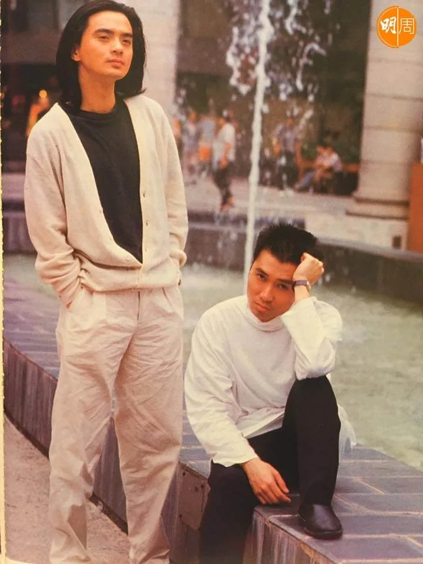

劉以達說，俞琤多年來暗中幫過達明很多，「佢唔係好收我哋錢，唔似嗰啲吸血鬼經理人，吸到你盡，然後俾返兩毫子你嗰啲！一路到依家，我都好尊敬佢，佢一定係我嘅伯樂。」今次為了新書，達哥找了俞琤寫序，更打算找她為隨書附送的16首全新創作的音樂作品錄獨白，達哥說，原先只打算隨口說說，誰知道俞琤一口應承，「佢仲請咗我去酒店食咗餐好貴嘅晚飯！」

俞琤是伯樂，陪伴達哥24年的老婆達嫂，就是他生命中的全部，「我老婆影響我最深，佢係一個好樂觀、充滿活力，啱啱同我相反性格嘅人；我個油門大多時候都係踩唔着，同埋有少少負面思想。呢排我哋作息時間差咗兩三個鐘，我八點就起身，佢瞓到十點，我起咗身就有啲唏噓，到佢起咗身，有佢陪嘅時候，佢帶俾我好多動力。佢會鼓勵我，見到我down就氹我開心，好甜蜜嘅！」難得深情的達哥，對着鏡頭說：「老婆，你係我嘅生命！」

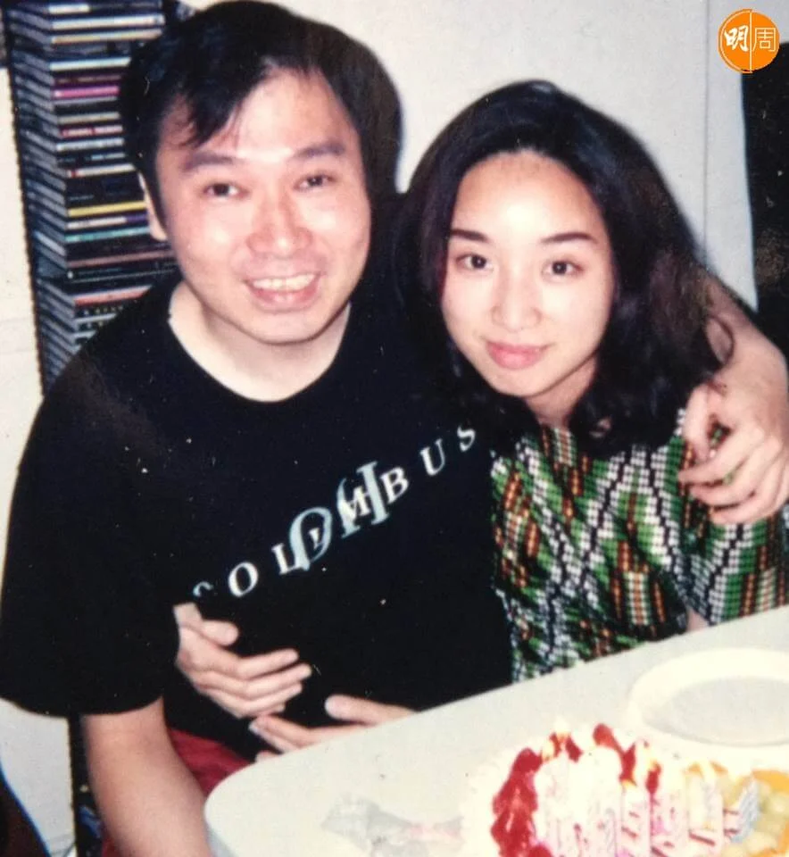

達哥和達嫂同樣好愛香港，彩虹邨出身的劉以達，他說：「我喺香港出世、香港發跡，差唔多成個career都冇離開過香港，嗰份情義同感覺都好強，所以我愛香港。」移民？「有呢個念頭，但未有呢個能力同動力！如果移民，我即係退休養老，去邊度？一度就指數低、同聲同氣，都唔同聲㗎喇，你知邊度啦；另外嗰度就好貴下，啲屋好大，鬼佬地方，冬天要鏟雪……」達哥最後說，「如果香港去到last minute，當香港冇YouTube，直頭冇咗睇唔到；冇咗Facebook、冇咗Google，我就真係非洲都去！」最放不低，達哥說：「我帶唔走啲figure模型！」

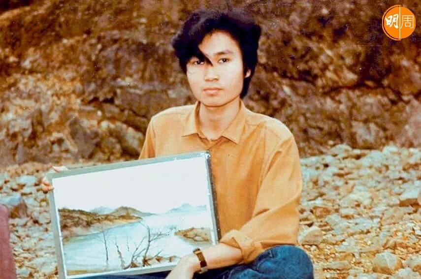

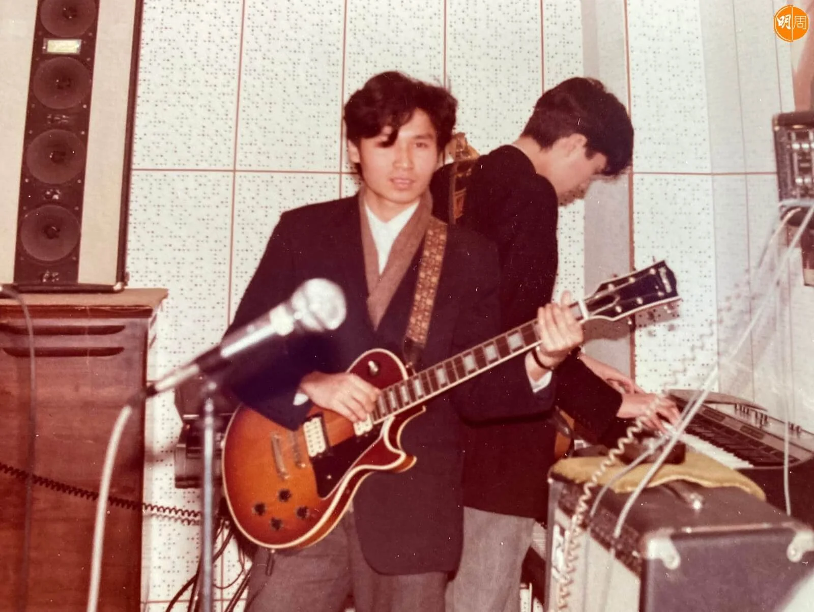

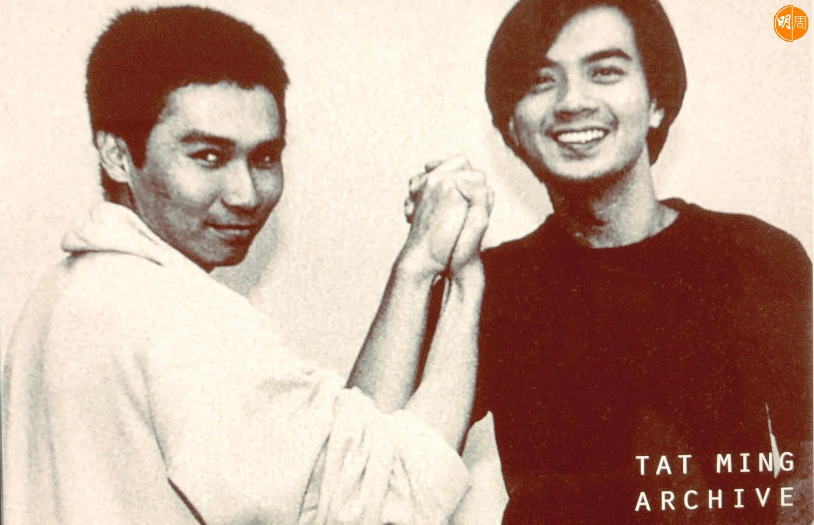

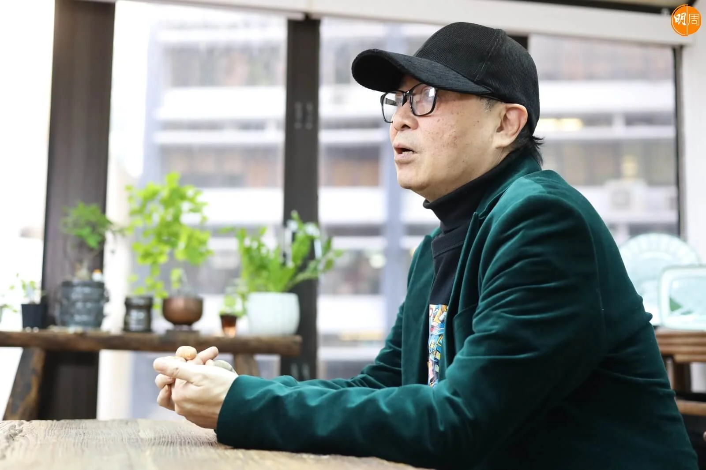

-   場地提供：文化者The Culturist
