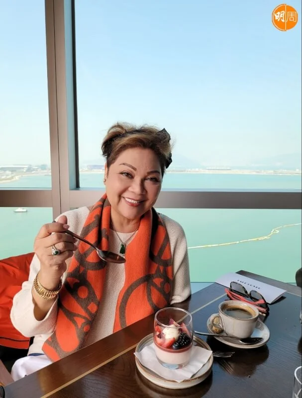
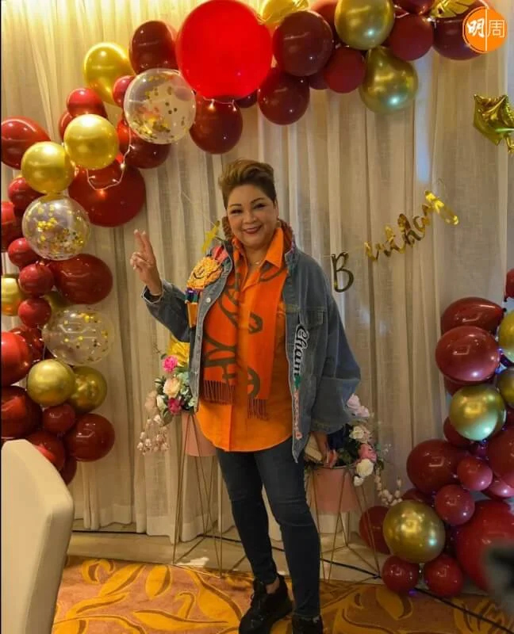
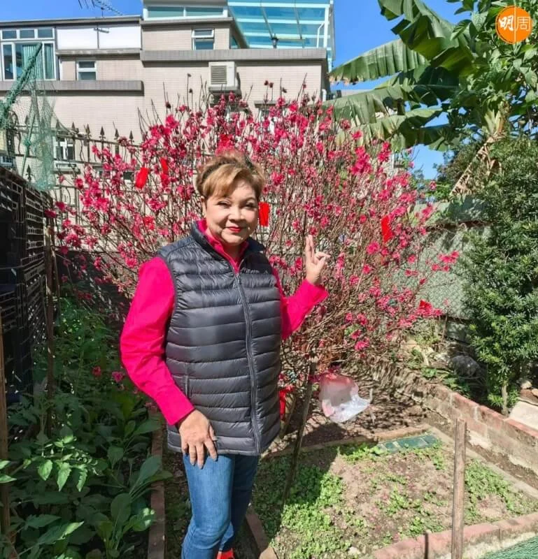
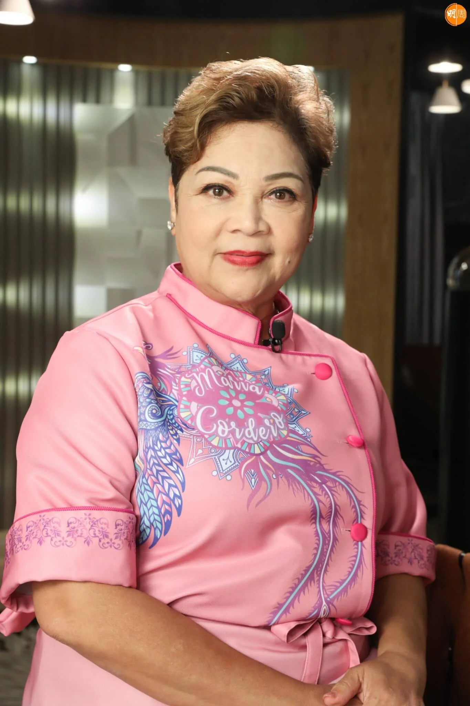
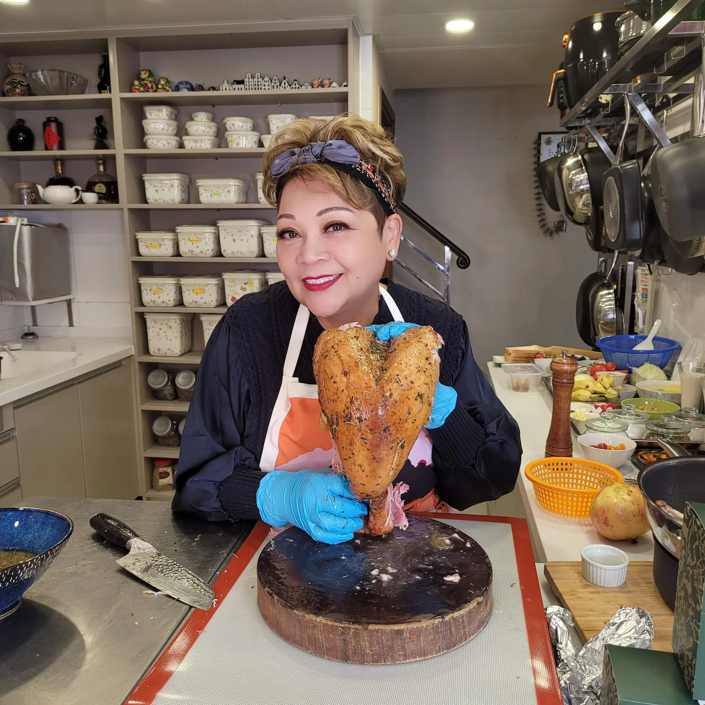

import YouTube from '@/components/patterns/YouTube.astro';

*本周五是樂隊Beyond的主音兼結他手黃家駒離世30周年。*

本周五（30日）是樂隊Beyond的主音兼結他手黃家駒離世30周年，前晚（24日）無綫播出特備節目《永遠光輝 黃家駒》以作紀念，其中肥媽（Maria Cordero）在節目中曝光錄音現場，自稱透過黃家強來電透露是黃家駒為自己寫的歌。

肥媽在節目中透露去年接到黃家強的來電，說黃家駒有一首歌給自己，且希望為了紀念在全球發行。她還感性說因為忙到沒時間聽歌，錄音前兩天才聽過一次，要黃家駒幫幫自己：「我聽了兩次去（錄音）就完成了，我覺得他都有幫我，我沒想到他會寫這首歌給我，很觸動我的心，真是我的榮幸。」

*黃家強今日在FB轉發有關報道，並炮轟肥媽講大話！*

不過，黃家強今日（26日）在FB轉發有關報道，並炮轟肥媽講大話，他寫道：「關於我的都是謊言，我哥哥雖然走了，我還活生生的，怎麼可以這樣不尊重人，無論是什麼途徑得到這首歌，誠實說出原因未必不能”感動”人。」、「係（喺）呢個風雨飄搖嘅時代，我希望做人可以無愧於心。」

<YouTube id="UdGEZqbLMx8" />
