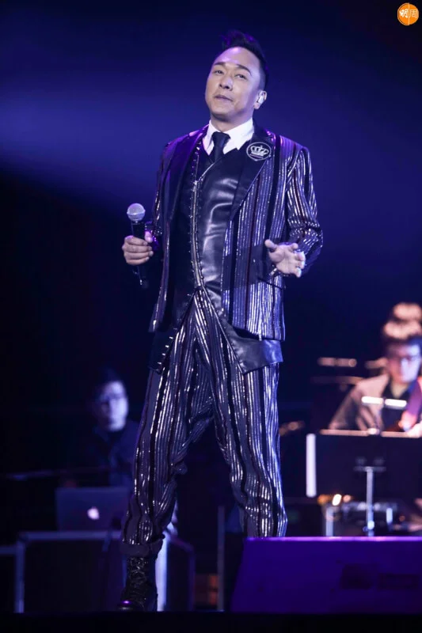
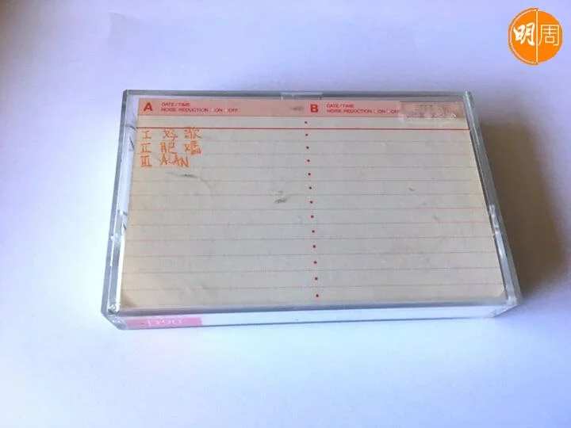
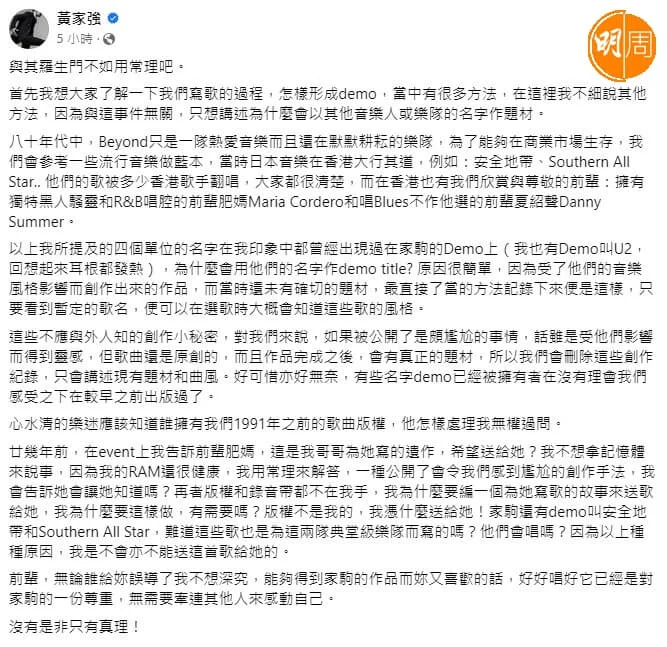
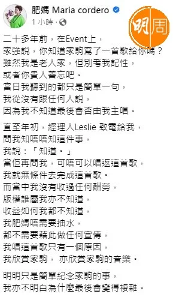
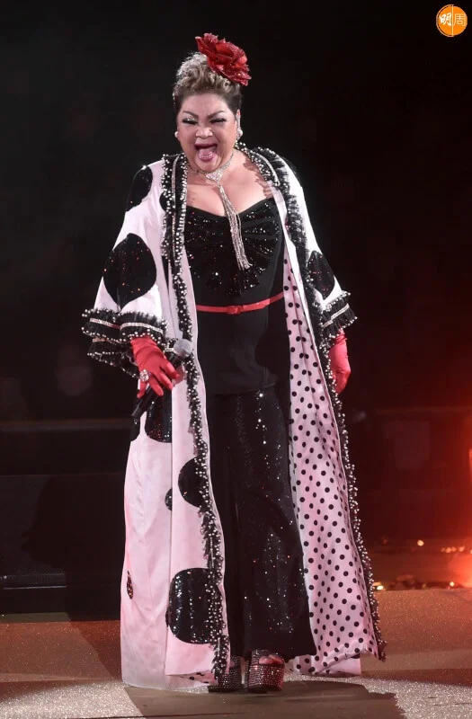
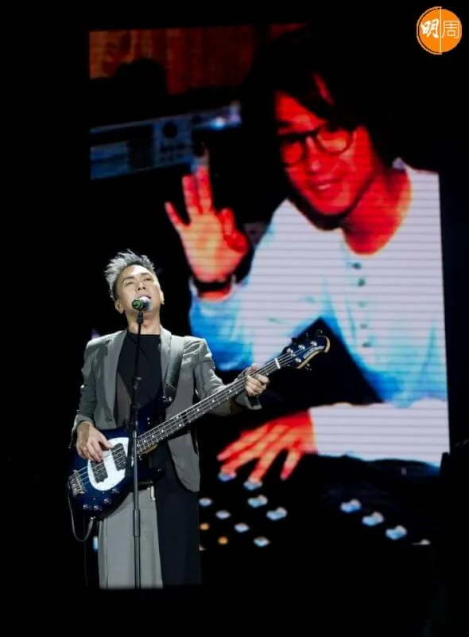
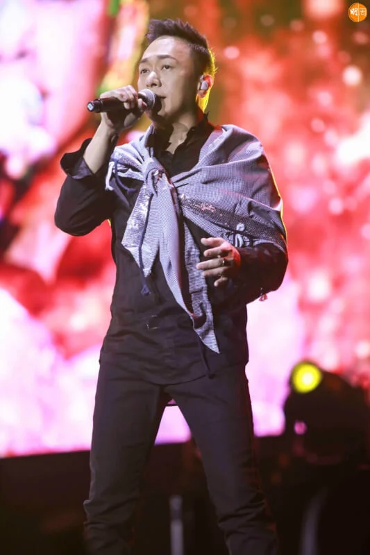
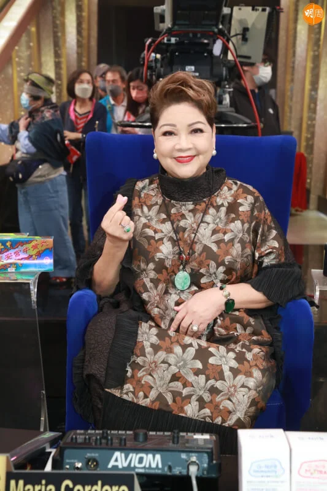
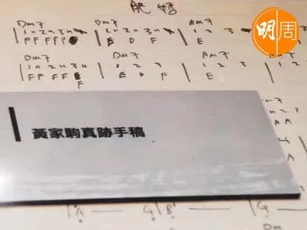

*黃家強表示「沒有是非只有真理！」*

肥媽（Maria Cordero）於無綫上周六播出的特備節目《永遠光輝 黃家駒》中，表示家駒胞弟黃家強跟他說，當年家駒作了一首歌曲《感激這對手》給她。可是在節目播出後，家強在fb發文指「關於我的都是謊言，我哥哥雖然走了，我還活生生的，怎麼可以這樣不尊重人，無論是什麼途徑得到這首歌，誠實說出原因未必不能『感動』人。」

肥媽昨日就有關指控拿出家駒生前留下並寫上「肥媽」的錄音帶Demo照作證，重申「早於二十多年前，我和家強出席一個event時，他曾經跟我提過家駒作了一首歌送給我的。」

至今早，家強再發文「與其羅生門不如用常理吧」，首揭當年Beyond寫歌的過程，當中會以其他音樂人或樂隊的名字作題材，以一些流行音樂做藍本，然後用他們的字作為Demo title。家強再直指：「心水清的樂迷應該知道誰擁有我們1991年之前的歌曲版權，他怎樣處理我無權過問。」

*Demo帶*

家強續謂：「廿幾年前，在event上我告訴前輩肥媽，這是我哥哥為她寫的遺作，希望送給她？我不想拿記憶體來說事，因為我的RAM還很健康，我用常理來解答，一種公開了會令我們感到尷尬的創作手法，我會告訴她會讓她知道嗎？再者版權和錄音帶都不在我手，我為什麼要編一個為她寫歌的故事來送歌給她，我為什麼要這樣做，有需要嗎？版權不是我的，我憑什麼送給她！家駒還有demo叫安全地帶和Southern All Star，難道這些歌也是為這兩隊典（殿）堂級樂隊而寫的嗎？他們會唱嗎？因為以上種種原因，我是不會亦不能送這首歌給她的。」最後更謂：「沒有是非只有真理！」

肥媽隨後亦就此事在fb回應，強調：「雖然我是老人家，但別考我記性，或者你貴人善忘吧。當日我聽到的都只是簡單一句，我從沒有跟任何人說，因為我不知道最後會否由我主唱。」

肥媽表示直至年初，經理人Leslie致電給她問她知否此事，她說知道後，「當佢再問我，可唔可以唱返這首歌，我就無條件去完成這首歌。而當中我沒有收過任何酬勞，版權誰屬我亦不知道，收益如何我都不知道，我肥媽唔需要抽水，都不需要藉此做任何宣傳，我唱這首歌只有一個原因，我欣賞家駒，亦欣賞家駒的音樂。明明只是簡單紀念家駒的事，我亦不明白為什麼最後會變得複雜。」

*「我肥媽唔需要抽水」*

肥媽更轉載一篇2008年家駒紀念展覽的報道，當中一張圖片「黃家駒真跡手稿」，有一張曲譜亦是寫上《肥媽》為題。

