import YouTube from '@/components/patterns/YouTube.astro';

今年Beyond成軍40周年，本周五(30日)亦是黃家駒逝世30周年，這個時候，黃家強與肥媽卻因一個demo引發一場記憶力口舌大戰，兩人連日來在網上互片，連Beyond前經理人Leslie陳健添也有牽連。

已移居澳洲的Leslie，原來本月低調返港，於12日為Beyond舉行了一場紀念騷，選址在堅道明愛社區中心，這個地方是Beyond誕生之地；這晚，黃貫中、前Beyond成員劉志遠亦有出席，而身在北京的葉世榮亦以live形式現身，唯獨未見家強的蹤影，Leslie接受《明周》獨家訪問，詳述「Beyond 40」的project，亦為近日的demo大戰解話。

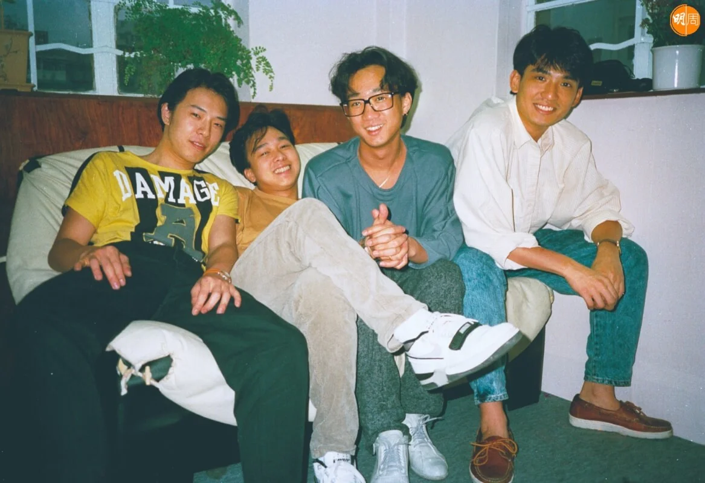

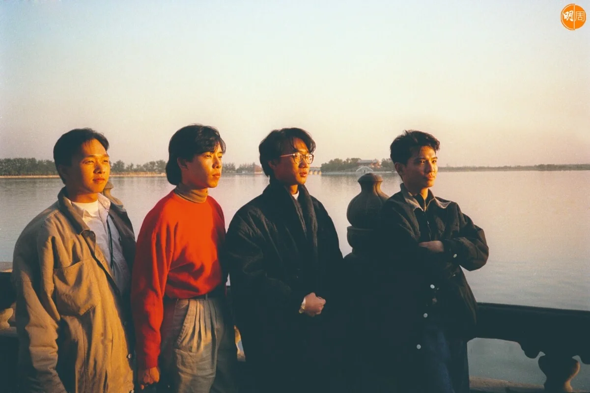

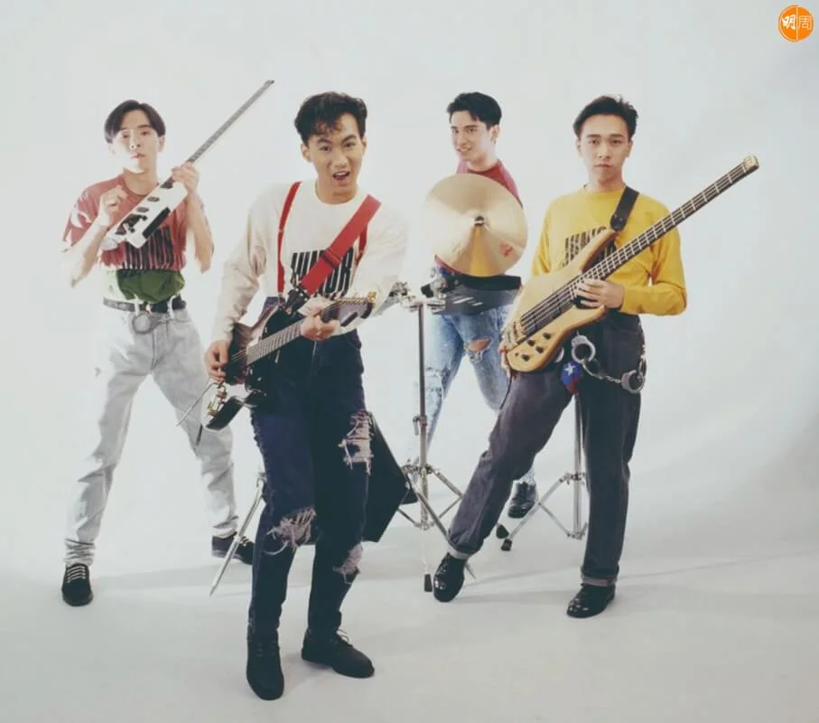

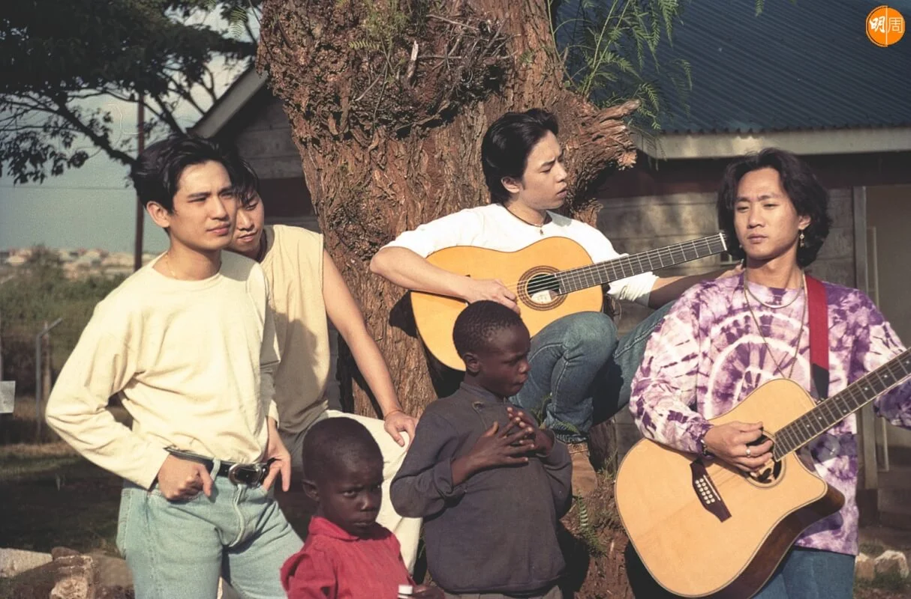

為了紀念Beyond靈魂人物黃家駒逝世30年，本月(24日)無綫播出特備節目《永遠光輝 黃家駒》，記錄Beyond與家駒生前的珍貴片段；肥媽在節目中透露黃家強曾找她，表示家駒生前寫過一首歌給自己，不過這番話卻惹來家強不滿，更公開炮轟肥媽「全是謊話」，說自己從來沒致電給她，展開一場記憶戰。及後肥媽還擊show出demo卡帶，盒上分三行寫上「好歌」、「肥媽」、「ALAN」，力證真有其事，不過家強再發文說demo的名字只是家駒多年來創作習慣，以人名代表曲風；肥媽其後把家強08年出席沙田展覽的報道作還擊，截圖家強曾經說過家駒作了首歌給她，家強再發文說：「講者無心聽者有意，竟然被有心人看中商機，處心積慮部署到今天，硬生生把我拉進他們的發財大計，營造一次廿幾年前的邂逅，望前輩可以完成我哥哥的遺作的心願，這等美化大計的深情對話，來突顯歌曲的感人之處，這些宣傳伎倆令我不勝煩擾。我重申再講多次，我沒有反對他們用這首歌的權利，只是希望他們不要把我牽連在內。前輩，我為了保護哥哥而讓妳表錯情感到抱歉！如果妳話我十五年前我自己向媒體講，可能我們就不用換RAM了。希望大家能夠找到整件事的重點！誰把兩個無辜的人變成他的宣傳工具。」本刊曾聯絡家強，但他說再不接受訪問。

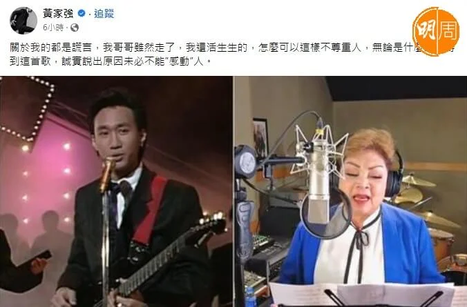

*肥媽在節目中透露黃家強曾找她，表示家駒生前寫過一首歌給自己，不過這番話卻惹來家強不滿，更公開炮轟肥媽「全是謊話」。*

本周三，身在澳洲的Leslie接受本刊訪問，他說本應不想在這個星期發表任何東西，考慮了一整天，亦有感事件已變質，他才肯開腔：「如果大家是尊重家駒，有啲乜嘢都好，需唔需要呢個星期講？有啲你認為唔高興嘅，或者你覺得想講嘅，講遲一個星期得唔得？我冇指明講邊個，依家包括我自己，原本我係打算下星期在YouTube講返關於嗰首歌，同埋點解搵肥媽？我做成件事係好單純嘅啫。」

本周五是家駒的死忌，連日來有關demo事件已發酵成是非，Leslie是事件的關鍵人物。其實，Leslie在去年初開始，已開始籌備一個名為「Beyond 40」的project，他說：「40周年喎，係咪要做返啲嘢呢？我的出發點是一個好單純的方式，但整個過程真係勞心勞力，錢又唔夠，過程中一定有少少唔好嘅爭拗，有啲意見對方未必聽你講，去到最尾想搞個音樂會，但我哋冇經費搞，我去搵sponsor，同sponsor傾咗三個月都係拖住拖住，整個過程充滿好大嘅挑戰。」Leslie強調自己的出發點：「世界應該是美好的，可以做些令人覺得美好的事情，我相信是一件更美好的事。」

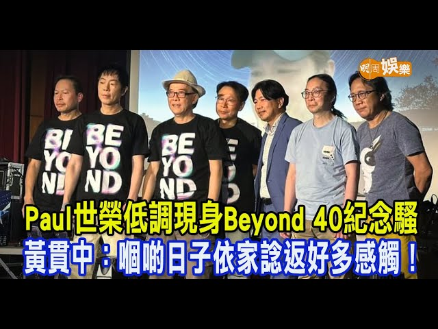

<YouTube id="AyNm4RGumeI" />

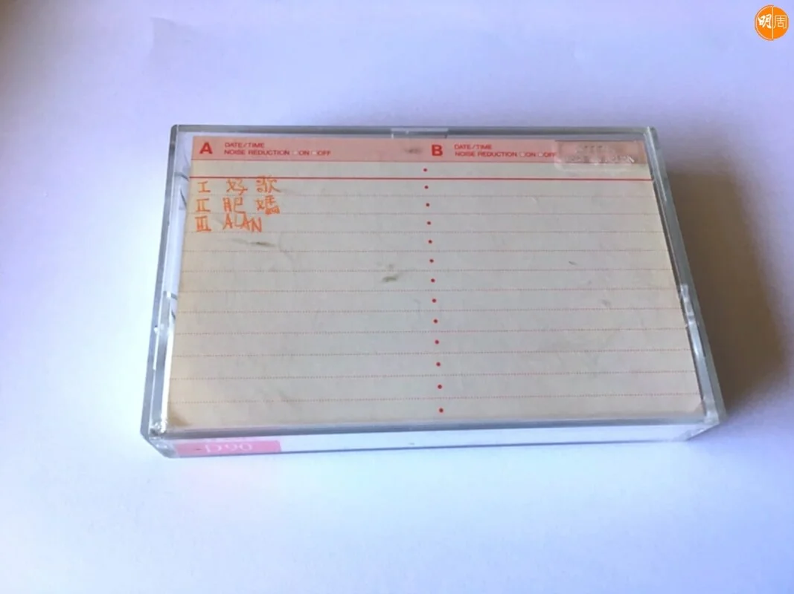

*Leslie還原家駒當年留下demo的來龍去脈*

「Beyond40」的project，除了紀錄騷，還會推出兩張致敬專輯，在四位成員昔日的demo中，揀選20首製成歌曲，讓一些本地新樂隊或一些和demo有關係的歌手錄唱，而「肥媽」就是其中一首demo。

Leslie解釋來龍去脈，「家駒好多時哼咗melody會錄低，啦啦啦啦啦咁樣，或者做咗個好簡單嘅編曲，未係一個完成版嘅歌，點解會有『肥媽』、『ALAN』、『好歌』呢啲名出現嘅呢？基本上他們每個member，寫完個demo就隨意改住個名先，好似《秘密警察》咁，佢哋嗰陣做咗個好初期嘅demo，就已經有呢幾個音，咁『肥媽』係咪真係做俾肥媽嘅呢？呢個問題我一定好認真地講，其實都有fans搵返《別了家駒十五載》個展覽已經出現『肥媽』手稿，絕對係家駒的筆跡，家強亦都有講，在蘇屋鄒搵咗好多珍貴嘅嘢出嚟，包括呢個手稿，去年初，我決定做呢個project，我將所有手頭上有嘅demo全部拎出來，分開四個member，揀吓對吓先發現『肥媽』呢首歌原來未出過㗎，咁多年其實太多啦，差唔多有40首，有時漏咗兩首都唔出奇，家駒當時如果錄咗啲demo，佢覺得可能啱Beyond用，佢會自己keep住先，覺得唔係好啱Beyond用嘅呢，佢就會交俾我。」

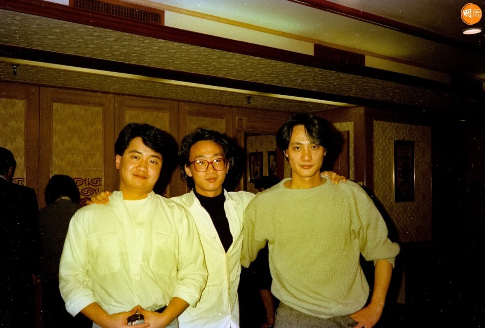

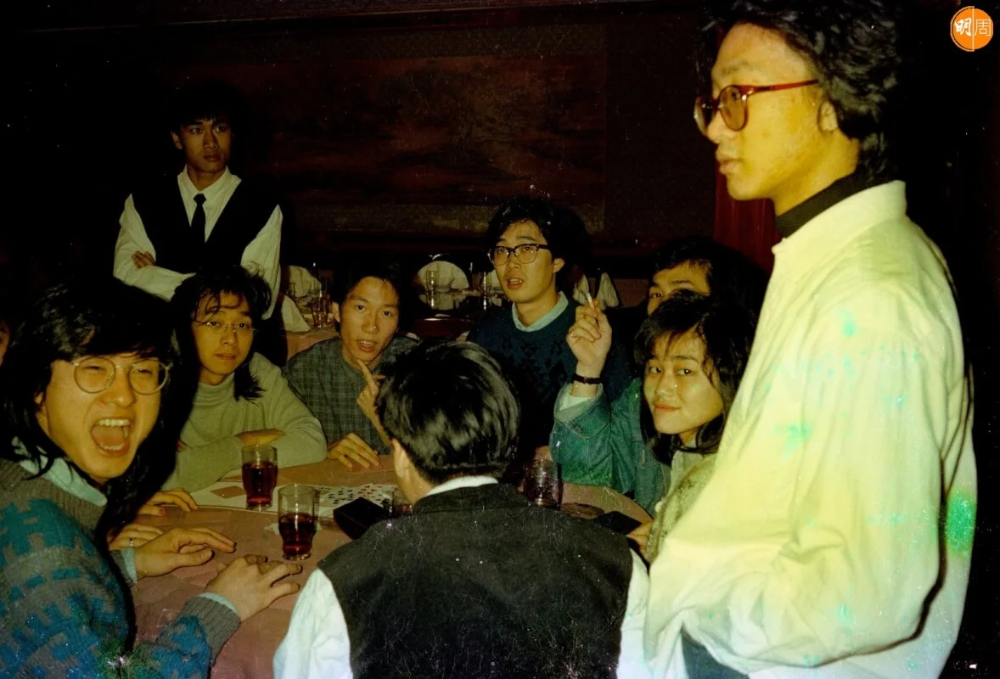

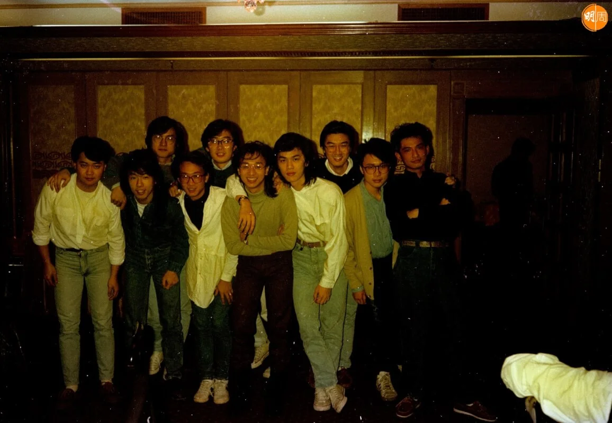

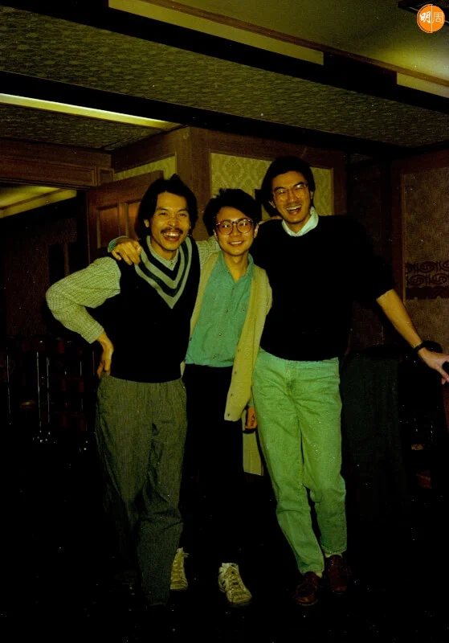

*Leslie(左)提供幾張Beyond從未曝光的照片，攝於1987年，Beyond仍是五子的時期。*

Leslie講返家駒俾盒帶的過程，說是家駒親手給他，「當時盒帶上係乜鬼都冇寫，依家你哋見到嗰三個歌名係我寫嘅，嗰日家駒講『有三首歌啊！Leslie，有一首歌好啱Alan(譚詠麟)，跟住呢首好啱肥媽feel，你俾肥媽啦。』當年係咁交帶我呢件事，『ALAN』在89年阿倫已經出咗叫一首《忘情都市》，『肥媽』呢首歌呢？當年究竟係咪無俾到肥媽？定係佢唱片公司冇特別回覆呢？我就無進一步跟進喇！咁發現呢首歌原來未曝過光喎，我覺得係好珍貴，咁我一定係首先邀請肥媽去做呢件事先，如果肥媽佢話唔想唱，我咪再搵人唱囉，我經個朋友搵咗肥媽電話，我打俾佢自我介紹完，就話當年家駒寫咗首歌俾你喎，問佢知唔知？佢話知，但從來冇收過首歌，再講埋呢個project，佢OK，就係咁。」

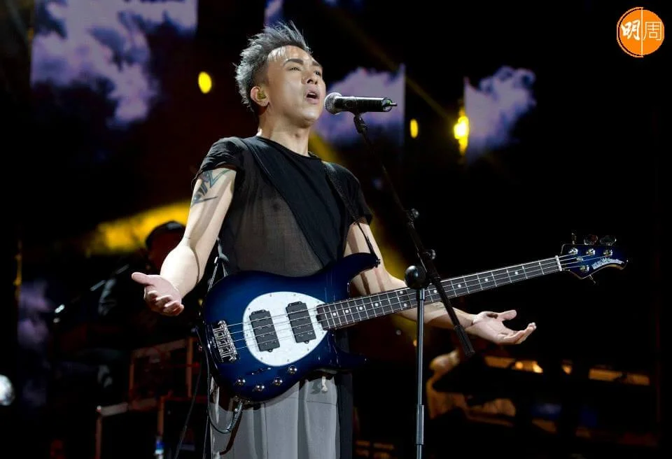

*黃家強與肥媽因一個demo引發一場記憶力口舌大戰，兩人連日來在網上互片。*

咁今次是否家強擺烏龍？Leslie說：「我就唔清楚啦，老實講，我唔可以做任何判斷，anyway有可能係，但我又唔係好明，當年其實佢喺個展覽都攞過個譜(手稿)出嚟，咁即係佢冇理由唔知有呢首歌啦！不過，我要補充一樣嘢，我相信家強和其他兩位member，係有可能唔知道有『肥媽』呢個demo帶，呢種卡帶不只一盒，91年，家駒亦都俾咗另一盒入面有三首歌，三首歌又係冇歌名嘅，咁end up呢三首歌，其中一首就俾咗王菲唱嘅《可否抱緊我》、另一首就係蔡興麟嘅《為了你為了我》，第三首我唔記得喇，兩個case都係一樣，大家諗吓，我點可以去違背家駒嘅原意先，係咪？」

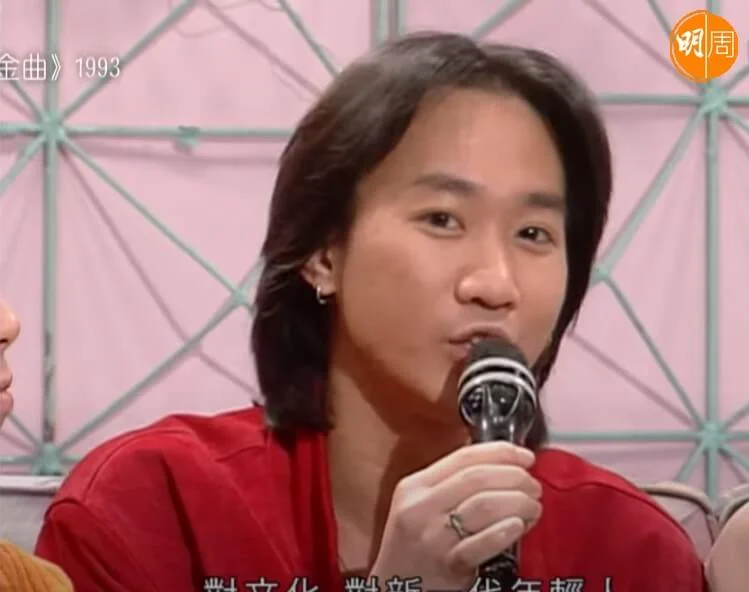

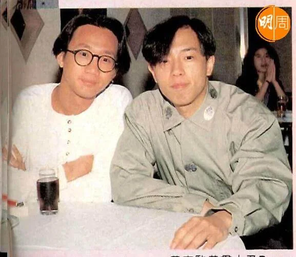

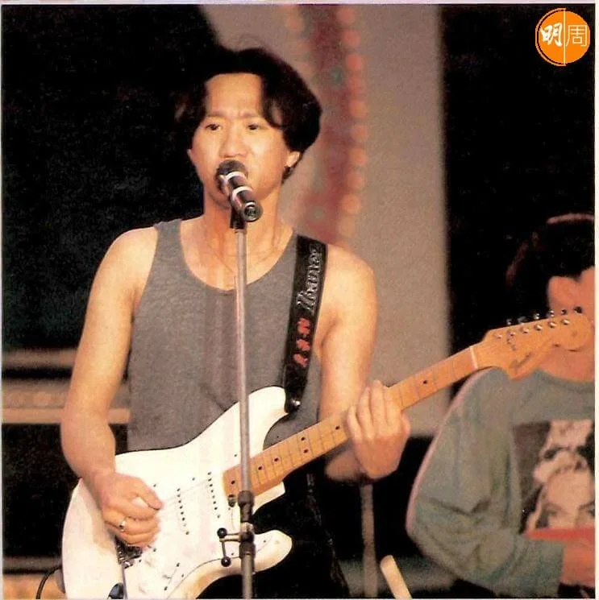

*Beyond與Leslie，多年來因版權問題多次爭拗，這次demo事件，家強在帖文指：「心水清的樂迷應該知道誰擁有我們1991年之前的歌曲版權，他怎樣處理我無權過問。」*

早於2014年，家強曾撰長文，講述Beyond與Kinn’s Music的版權糾紛，家強曾指「陳先生」已將所有版權賣給環球音樂版權部，惟多年後版權是否再易手，則不得而知。對此Leslie解釋：「以前我哋曾經有段時間，因為日本公司喺中間，造成一啲不必要嘅問題又好，argument又好，今次做呢個project前，我事前已經向各位寫咗封信，我都驚佢哋有時唔記得以前嘅嘢嘛，信裏面有一個kind reminder友善提醒，即係有啲乜今次我係會用嘅，其實，當年我哋三個party，我啦、日本公司同埋Beyond，大家已經有個協議和解，協議同佢哋講得好清楚，我點樣處理版權上嘅問題，其實唔只呢批demo，包括以前所有嘅Beyond嗰啲publishing都喺我度，後來就轉讓咗俾環球啦，當時環球話不如呢三十幾首demo嘅publishing都賣埋俾佢哋，但我唔想到時又解釋咁多，咁複雜，製造一啲不必要嘅問題，算啦，我自己留返。」

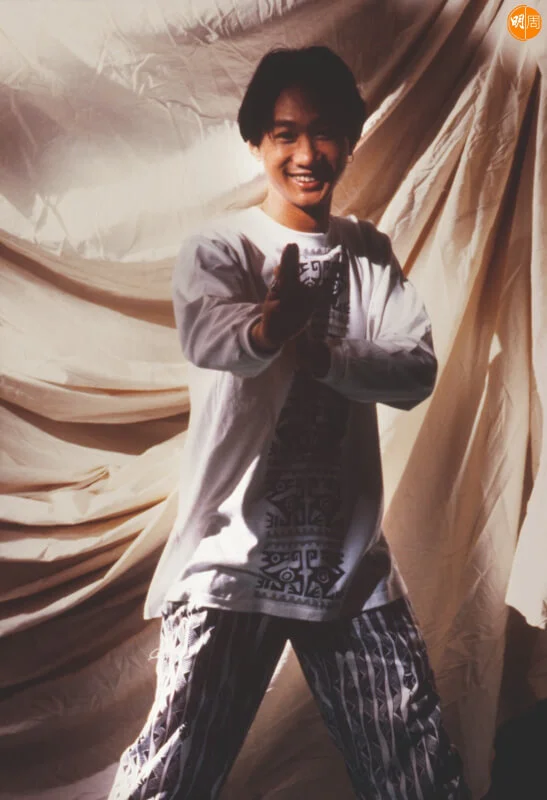

*家駒逝世已30周年，但他的音樂和精神永遠留在樂迷心中。*

經過今次40周年的project，Leslie直言已經心力交瘁，完成家駒最後一個遺願，他便不會再「掂」有關Beyond的事情，「做完呢個project之後，你哋鍾意我又好、唔鍾意我又好，我唔會再去『掂』，我覺得四十年我真係做晒我應該做嘅嘢，明年會出埋家駒一張個人solo，家駒93年離開之前，做完《樂與怒》，佢曾經同隊band講過，佢想將Beyond停一停，想出一張純音樂的唱片，我相信大家可以搵到阿Paul都曾經講呢件事，我哋亦曾經喺日本有開過咁嘅會，當時家駒好認真咁講，我好記得阿Paul、世榮都好錯愕，『咁我哋點呀？』咁我理解嘅，因為家駒最早期係有一啲純音樂嘅嘢，喺日本嗰兩年對佢哋嚟講係唔容易嘅，同埋家駒覺得既然合同簽兩張碟㗎嘛，咁係咪可以抖一抖呢？係咪可以做一啲佢自己好想做嘅嘢？而唔係for個market呢？」

最後，公平一點都要問句Leslie，做這個project，究竟會唔會賺大錢？「而家出一張CD，叫做兩個album，一張CD我當你賣百五蚊好唔好？而家雙CD我係咪可以賣貴啲先？就算我唔賣三百蚊都賣二百八十啦，但我唔會啦，當益吓啲Fans得唔得？你問我係咪賺大錢？呢個project我花了幾十萬，如果可以賣十萬張我就話會發達啫，我唔明大家對發達的定義，如果我賣完賺幾萬蚊叫做發達嘅，咁咪發達囉。」

Leslie提供幾張Beyond從未曝光的照片，攝於1987年新年，當時Leslie是第二代小島樂隊的經理人，剛剛簽了Beyond，「Beyond當時出了《永遠等待》的EP，兩隊樂隊一起在尖東北海漁村食團年飯。」相中的家駒戴着招牌烏蠅眼鏡。

家駒，30年了，我們永遠懷念你。
