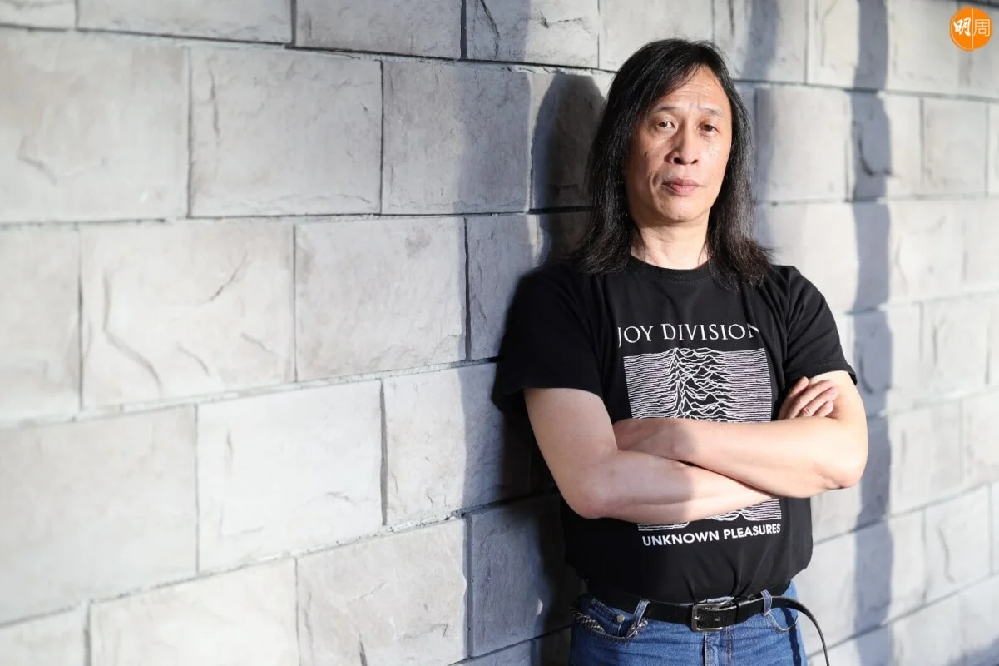
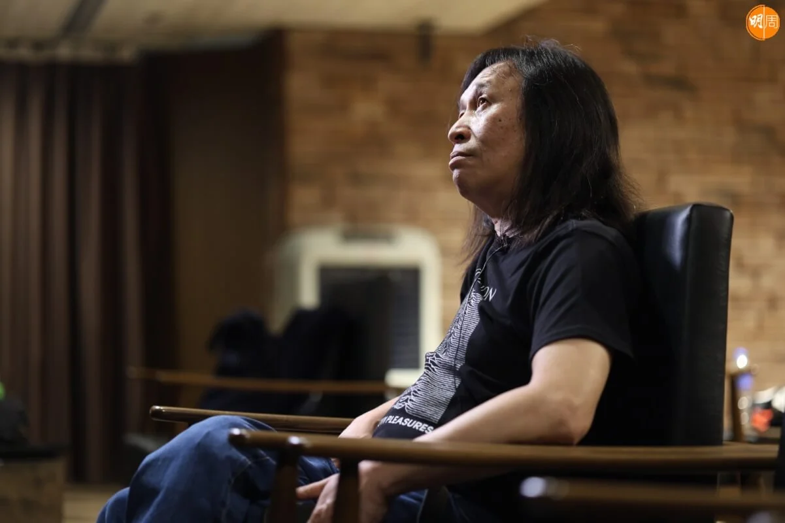
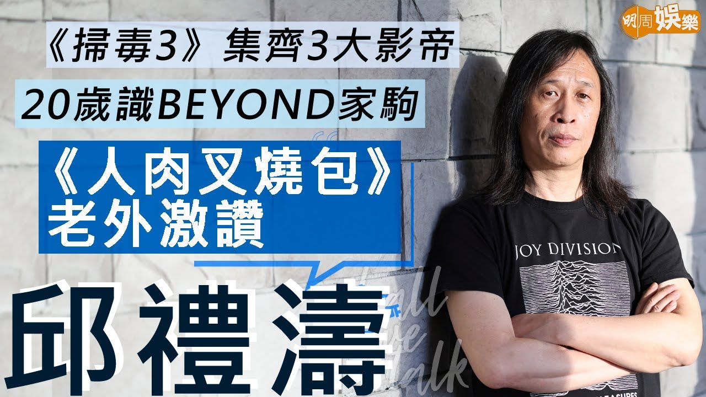
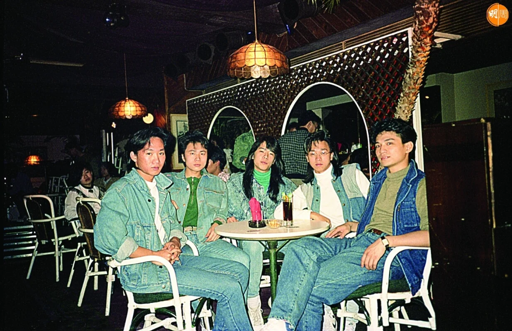
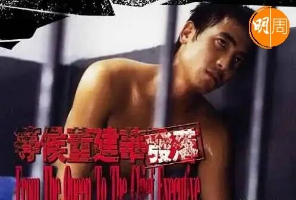
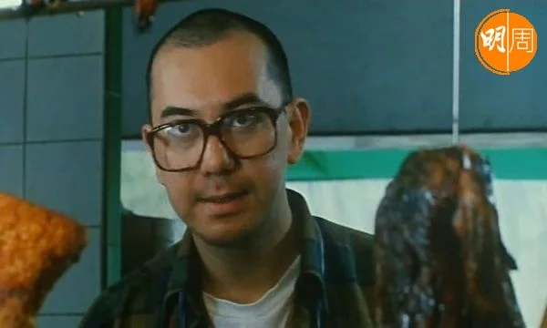
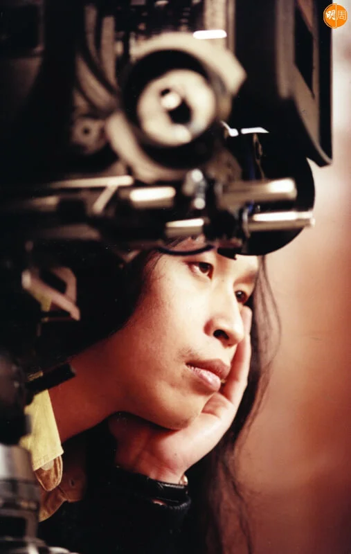
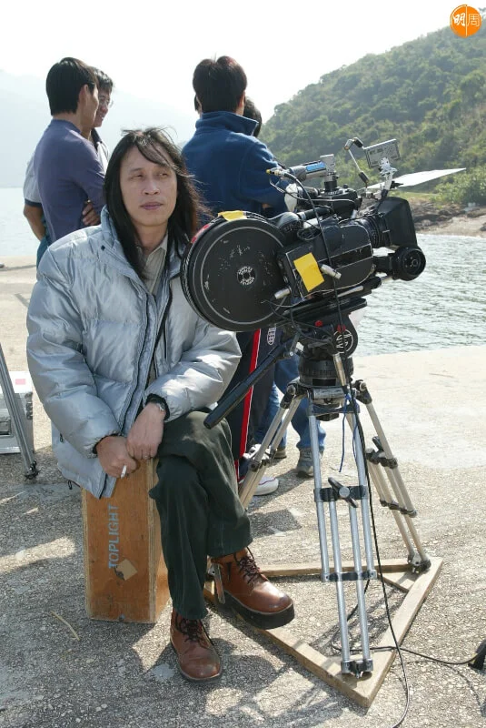
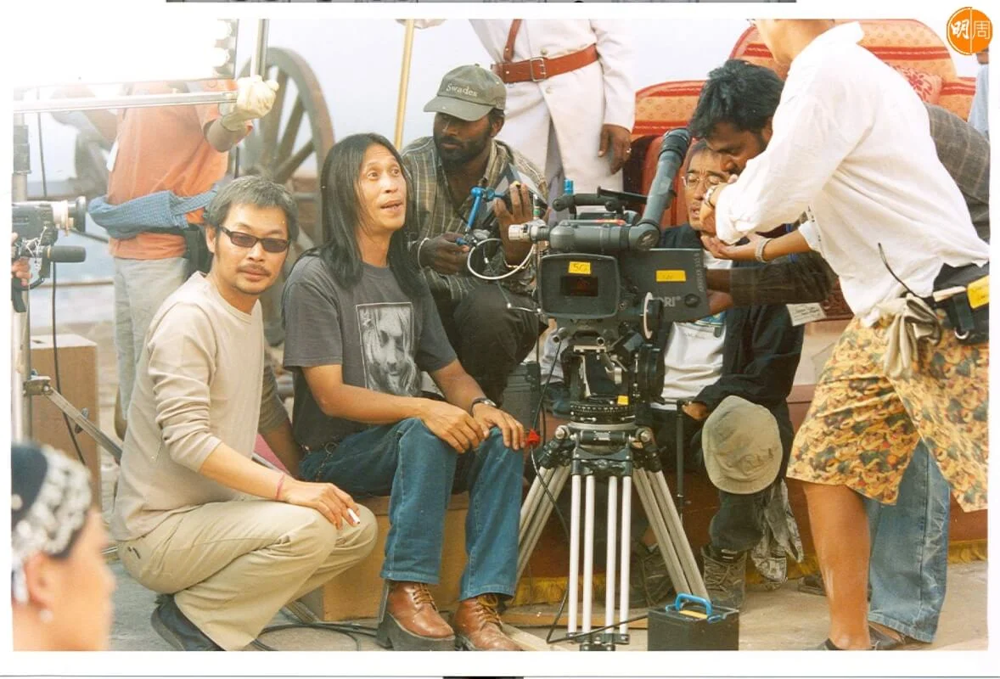

import YouTube from '@/components/patterns/YouTube.astro';

邱禮濤識於微時的，除了秋生、子華，還有一個家駒。邱禮濤第一部電影《靚妺正傳》，當年的Beyond五子有份友情客串，五年後於張之亮執導的《籠民》，由家駒主演，輪到邱禮濤友情客串，他笑言自己的幕前演出：「朋友叫到啫！」

## 讚家駒係音樂天才大細路

*讚家駒係音樂天才大細路*

<YouTube id="twjyHgcSMGc" />

今年是家駒逝世30周年，同樣愛音樂的邱禮濤說起故友，「大家未夠20歲就識，家駒細我十個月。好奇怪，你係某一堆人呢，就會碰到，同家駒喺中環藝穗會識，仲係五蚊杯啤酒嘅年代，又有個朋友劉卓輝、Beyond早期經理人Leslie，後尾反咗面啦！我識Beyond嘅時候，佢都未簽Leslie，個圈好細，大家就碰到，柯士甸道有間咖啡店Run Away，家駒、Paul、家強、世榮幾個、仲有遠仔（劉志遠），遠仔後尾搞咗第二隊Band同阿柏（梁翹柏）。」邱禮濤說家駒的性格，像個大細路，「音樂上毫無疑問好有天分，佢彈結他彈得好好，好多時好似阿Paul彈lead，其實唔係咁樣去分，家駒當然好有天分，天才！」

邱禮濤自言細個懶反叛，「我哋聽啲歌，係冇人聽嗰啲，當有型呀，我去買隻唱片賣一蚊隻，當日嘅single賣五蚊，點解呢隻賣一蚊，我一買就買五隻；溫拿啲碟，我哋飛㗎嘛，即係用來掟㗎！」

## 電影翻生要睇年產量

除了電影，邱禮濤最愛音樂和看書，拍戲之餘亦繼續完成嶺南的文化研究博士，他那篇十多萬字的畢業論文，是講電影審查。拍戲產量之多，仍有時間讀書？「你想做就做到！啲人話冇時間，其實唔想做！08年我報讀博士唔收我，09年我再報。正常一個博士論文，一般都要寫你幾年，我寫四年半啦！我呢個題目冇人做過，作為文化研究要搵個切入點，香港電影歷史從審查角度去講，亦都從未有過，咁就值得做啦！所謂審查都係一個管治工具，其實係一個切入點，即係講管治。」

問邱禮濤，今年電影業是否翻生？正如他老友子華就有套破億《毒舌大狀》，他就說：「咩叫翻生？如果要去返一年二百幾三百部戲，似乎唔會翻生囉！翻生定義係咩？要去返我入行個年產量，地球上輸出電影最高嘅地區，呢個就叫翻生！」今年62歲的邱禮濤說，「始終年紀大，拍電影好耗體力，依家當然都仲好OK，可以拍就盡量去拍。」

## 唔會拍兩個超級大明星

從影生涯36年，邱禮濤說電影圈很現實，「你連瓜兩部，你就可以靜兩年㗎喇！我好彩囉，有啲瓜又瓜唔晒，夠你開第二部，又一直唔俾你威，等你學懂謙虛。」邱禮濤說自己好又好過、衰又衰過，他的低潮期是在《陰陽路》系列之後，「成日覺得會唔會係最後一部，冇人搵你拍戲，咁做乜呢？拍啲戲又高不成低不就，心理上低潮！」到了01年的《等候董建華發落》，「當日有個好年青嘅電影節《第三屆烏甸尼》。以前都有電影節，我哋唔去當有型，你哋好稀罕，我就唔稀罕，你啲咩獎都係統計學，柏林康城好巴閉咩，叫做麻醉自己自欺欺人，或者自細都係咁，我哋細個覺得HKU好巴閉咩，你整出嚟全部港英政府奴才……所以嗰個係我第一次去影展，播《叉燒包》，原來啲鬼佬西方人熱情啲，完咗套戲，拍咗十幾二十分鐘手掌，嗰種尊重，我又覺得我之前做啲嘢唔太差！」

走過低潮，業界都羡慕邱禮濤產量多，他卻自嘲：「雖然我係濫拍，但係你只見到我拍咩，見唔到我推咗咩，我都推好多㗎！」例如呢？「嗰啲唔好講啦！」有乜真係唔拍？他說：「有，如果你用香港有兩個超級大明星演嘅戲，我都推！原因係我唔需要花兩年去服侍佢哋！」永不合作？「冇永遠嘅呢個世界，只不過我有嘢busy，我可以揀，我去揀下其他。突然間有人對你好好，你就要小心，冇人會無端端對你太好，反而要警惕呀，唔好上頭！」

誰是香港兩個超級大明星，開不了名；反而圈中最佩服的，開名無妨，就是劉德華。邱導演說：「劉德華真係好勤力，佢亦懂電影，佢對電影嘅接納面好闊，有啲人就一味，動作片就動作片，佢好闊呀！」

## 後記：故仔

邱禮濤在訪問中常說，什麼題材類型也不緊要，「故仔」才重要。由當年找秋生拍的短片《惘》到《掃毒3》，吸引他的永遠都是故仔，能導能攝，邱禮濤也能寫。

有一個他很想拍的故仔，是關於他一個已經離世的朋友真實故事，「本書叫《瘋狂大康復》，May（楊淑彝）走咗啦，嗰時我出版社（進一步）幫佢出嘅一本書。佢係一個精神病患者，佢本書都講咗，所以係公開訊息。佢係一個鋼琴教師，病發到康復過程本書裏面都有寫。因為我識佢，覺得係一個幾值得拍嘅故仔，但係依家冇諗啦，因為第一佢人走咗，第二有版權㗎，要釐清版權屬於屋企人邊個，好複雜，早幾年就已經覺得無緣，故仔唔拍得！」

想拍唔拍得，另一個就是多年來一直很想拍的，「種種原因差唔多開又冇開到，一個香港女歌手嘅故事，你識唔識有個女歌手叫黎愛蓮？Irene Ryder嘅故事。唔係紀錄片，以佢呢個人物嘅故仔。有啲故事，輾轉間十幾年都開唔到，當日諗住A君做，十幾年後A君已經長大咗十幾歲！」點解咁想拍黎愛蓮？「好難解釋！你鍾意想拍一樣嘢，就係你想見到呢件事發生。」

很多未完的故事。所以一部電影，故仔好緊要，正如電影圈，古仔好重要。

-   場地提供：K11 Art House
