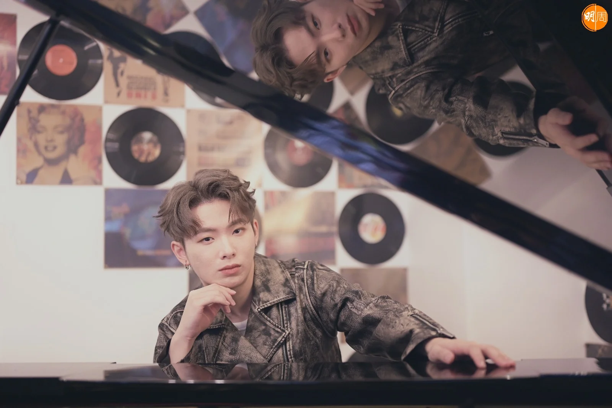
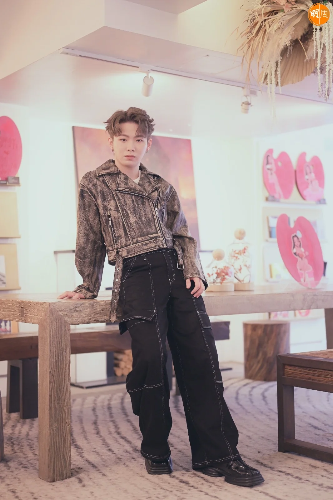
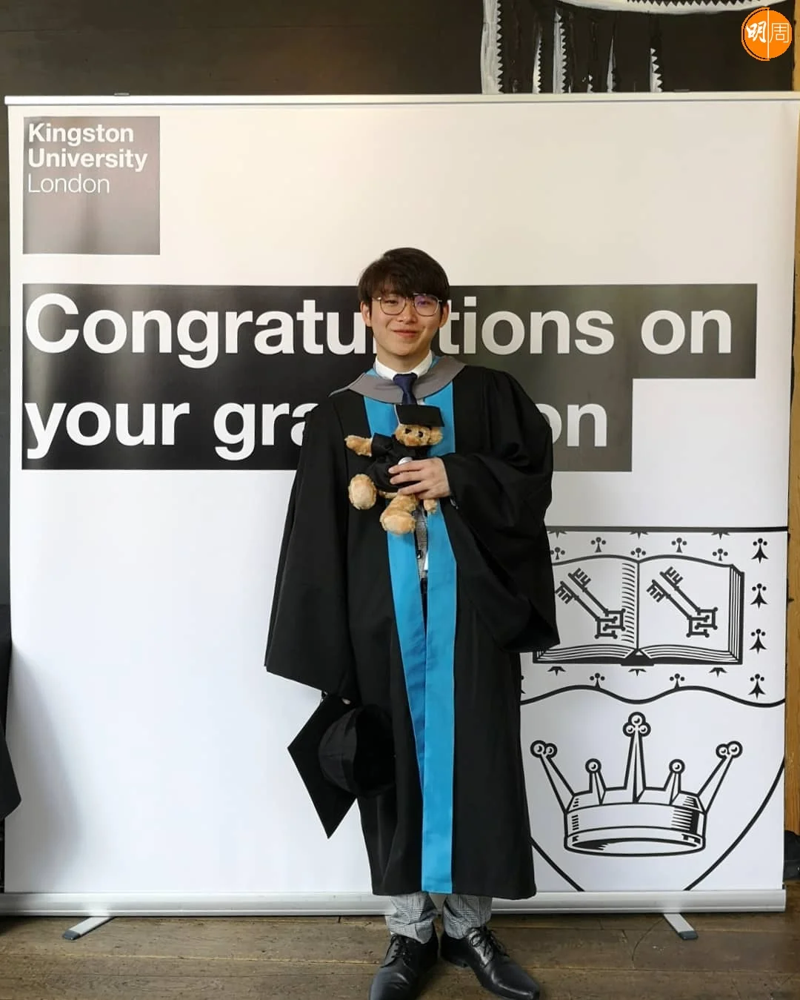
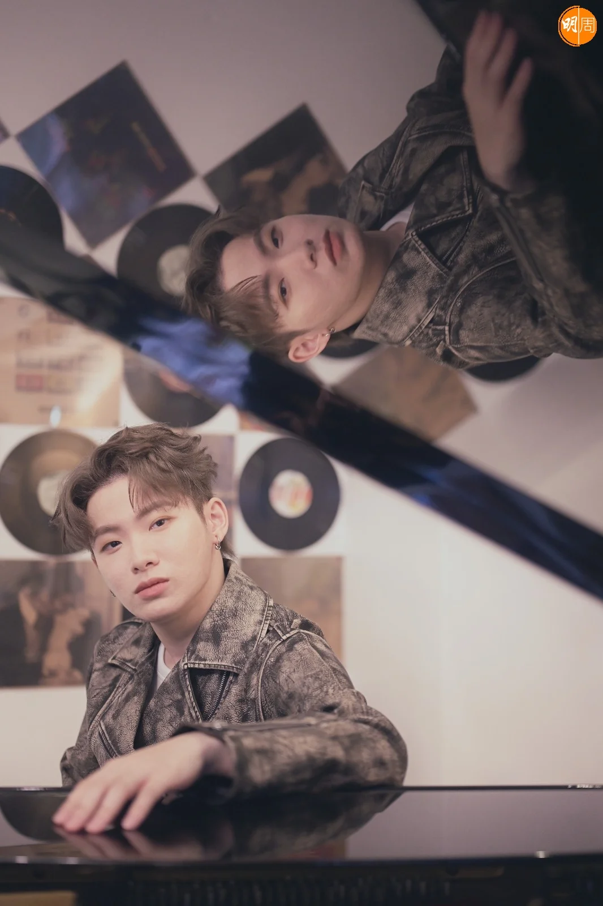
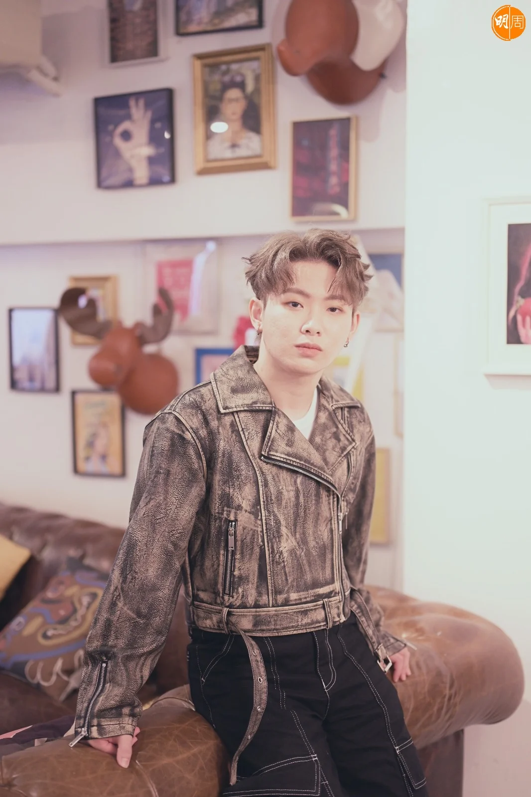

import YouTube from '@/components/patterns/YouTube.astro';

《造星V》來自大馬的「做工佬」Ritchie梁瑋城，成為今屆的最強遺珠。20進10一役慘輸，網友紛紛戥佢唔抵，工友（粉絲暱稱）更加力撐到底，Ritchie除了是網上民選冠軍外，TG群組人數亦僅次真冠軍香胤宅（Lyman）。

*「做工佬」大馬香港兩邊飛追夢 《造星V》Ritchie高呼靠自己的時代*

<YouTube id="60opmiQADac" />

在《造星V》有「做工佬」之稱的Ritchie，回想這個花名也覺得好笑，「我哋馬來西亞話做工，即係香港人嘅返工，節目組問我喺度做咩，我就話做工，之後網上好多人話我講做工做工，覺得好好笑，之後就有『做工佬』呢個名出現！」

做工佬出現，連帶「工友」數量不斷激增，短短三個月時間，Ritchie已經舉行過兩次FM（粉絲見面會），上周日暴雨下亦不減工友們的熱情。Ritchie火速造好新歌，與另一海外參賽者Chit（黃哲）合力炮製《雞蛋仔格仔餅》，Ritchie說新歌是他對香港的感情與回憶，「我哋想寫一首歌代表海外參賽者喺香港嘅回憶，想用一啲好地道嘅代表，所以叫《雞蛋仔格仔餅》。我哋好鍾意食灣仔附近，有一間好好食嘅雞蛋仔同格仔餅店。比賽完咗冇幾耐就寫咗呢首歌，先可以好快出呢首歌。」

（MV花絮率先睇）

自資錄歌更在彩虹邨取景拍MV，近日Ritchie亦在自家YouTube頻道，開設新節目《同做工佬一齊學廣東話》，動作多多。問他ViuTV有否找他簽約？他說：「冇！其實係冇傾過！」不過Ritchie並冇失落，「可能佢哋想簽多啲本土參賽者，我都明白嘅！」有MC張天賦的先例，其實唔簽Viu都未必係壞事，Ritchie亦坦言，「我覺得呢個時代，可以完全靠自己去做好多嘢，因為有YouTube同好多平台分享作品，我覺得依家係一個靠自己，去market自己嘅一個時代！」

「再瘦就真係有病！」

這次來港，Ritchie真人再比錄節目時更瘦，相比第一集《造星》亮相時的包包面和厚身，瘦了足足兩個碼，「我冇特登去減肥，其實嚟到香港，我繼續食好多嘢，但係我覺得每一日都好stress好大壓力，每一日瞓覺就會諗好多，莫名有壓力。阿Jay（馮允謙）籌備演唱會期間，有一段時間冇見過佢，我哋再撞返剛好用同一間studio練舞，佢見到我就話，Ritchie好陰功呀，你發生咩事咁瘦呀？我返馬來西亞都有繼續食嘢，但每次返嚟啲工友或者導演監製見到我，都會話Ritchie你又瘦咗，我話冇呀，我再瘦就真係有病㗎喇！」

由海選到殺入20強，Ritchie仍然記得在大馬海選時的情境，那時候，他是完全未看過《全民造星》的人，「我入到房就見到肥仔、Dee哥同監製，我可以好誠實講，我其實唔識ERROR，casting之後導演問，你知唔知佢哋係邊個，我話我唔知呀！之後聽返佢哋嘅歌，先知道原來香港已經出咗好多唔同嘅男團女團。因為節目組話，你哋來參加要睇返啲片，我先知道有《全民造星》呢個節目！」

今年26歲的Ritchie自小愛唱歌彈琴創作，15歲寫下第一首作品，18歲時誕生了《I Can’t Tell》，在大馬亦參加過不少歌唱比賽，有獲獎有失敗，《造星V》是他人生第一個參加的選秀真人騷。成長期間，Ritchie最愛的香港歌手是Eason與Beyond，「細個聽好多廣東歌，長大之後慢慢就冇聽。好似陳奕迅都係從細聽到大，另外馬來西亞人好多都聽Beyond，我差唔多每一次駐唱，一定有人點《海闊天空》，所以我都對呢首歌好熟。」一年多前，Ritchie開始在餐廳駐唱，「之前冇諗過會做呢件事，因為經過另一個歌唱比賽識咗Adam（同為《造星》參賽者），佢先帶我去駐唱再到參加《全民造星》，我覺得係一個緣份。駐唱之後對自己唱功有啲研究，對自己有多啲要求，慢慢練到《全民造星》，我已經準備好可以挑戰呢個舞台。」

Ritchie在大馬身為審計師，參賽至今幸得老闆支持與批准，靠攞大假或趁周未來港，他並未打算辭去審計師一職，原來為了同樣身為審計師的爸爸一個交代，「我媽媽從我18歲開始讀大學，佢講過大學畢業之後，想做咩都可以去做，但我爸爸係一個好傳統思想嘅Asian parent，佢覺得搵一份穩陣工作最好。我覺得我爸爸喺我出世嘅時候，已經諗定我之後要做咩，佢覺得要跟佢一齊做審計師，我一直以嚟都算跟住我爸爸願望去做，因為我從細到大都係讀accounting，我呢次算係想做自己嘅嘢，第一次去做自己想做嘅嘢！」爸爸現在支持嗎？Ritchie笑說：「佢冇拒絕，已經係一種支持！」繼續兩邊飛，實行審計師與唱歌夢，Ritchie說：「我唔係50/50，我係100/100！」繼續追夢呀，做工佬！

-   化妝：@mua_gloria_
-   髮型：@alsonchau_privatei
-   場地提供：迷你中環
