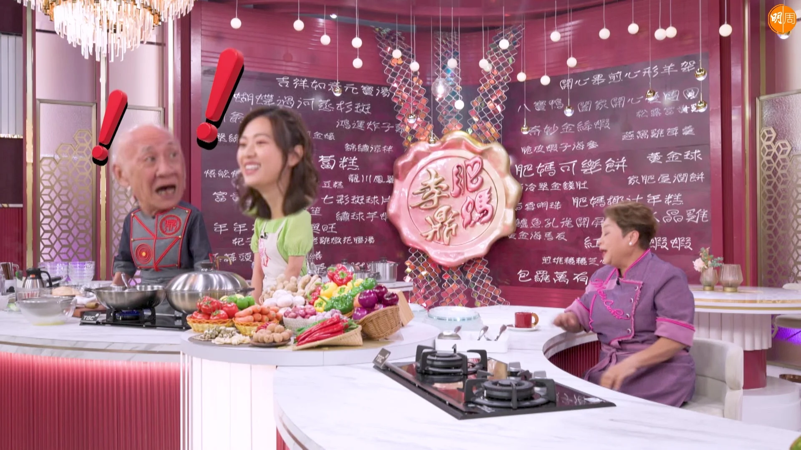

由肥媽、李家鼎（鼎爺）及游嘉欣（游游）擔任主持的全新飲食節目《肥媽李鼎打大佬》，明晚（8日）播出的第四集主題是「人生導師的盛宴」，肥媽、鼎爺大談拜師學藝二、三事。出名巨肺的肥媽分享了一件昔日學唱歌的趣事：「以前每個禮拜五、六都會去酒店做替工，香港嘅酒店好犀利，會請到一啲國際巨星嚟。有一次有個比較瘦同矮嘅黑人，但佢把聲就好雄厚，我問佢點解咁細粒但把聲會咁大，佢就教我點樣抖氣。」肥媽更即場示範大師傳授的數數字練丹田方法。談到近來是非多多，肥媽坦言原本非常困擾，並曾因此戒吃最愛的大閘蟹，但後來因為高人一句話，又重拾「吃蟹樂」，肥媽說：「佢話做娛樂圈最緊要有是非，理得佢好定唔好，佢一講完我即刻食番8隻大閘蟹！」

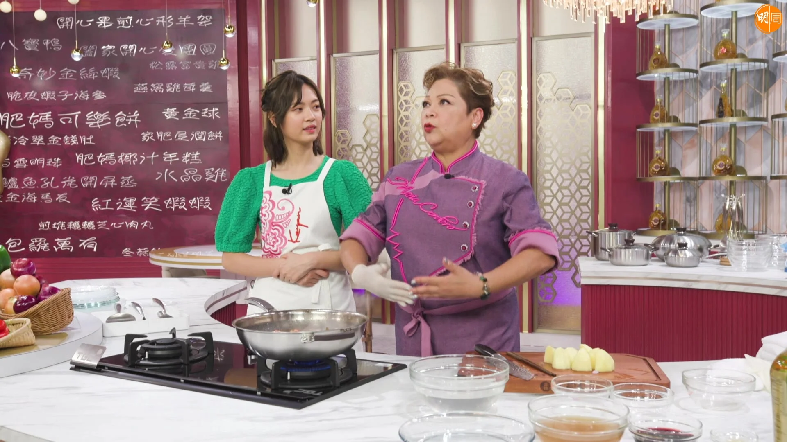

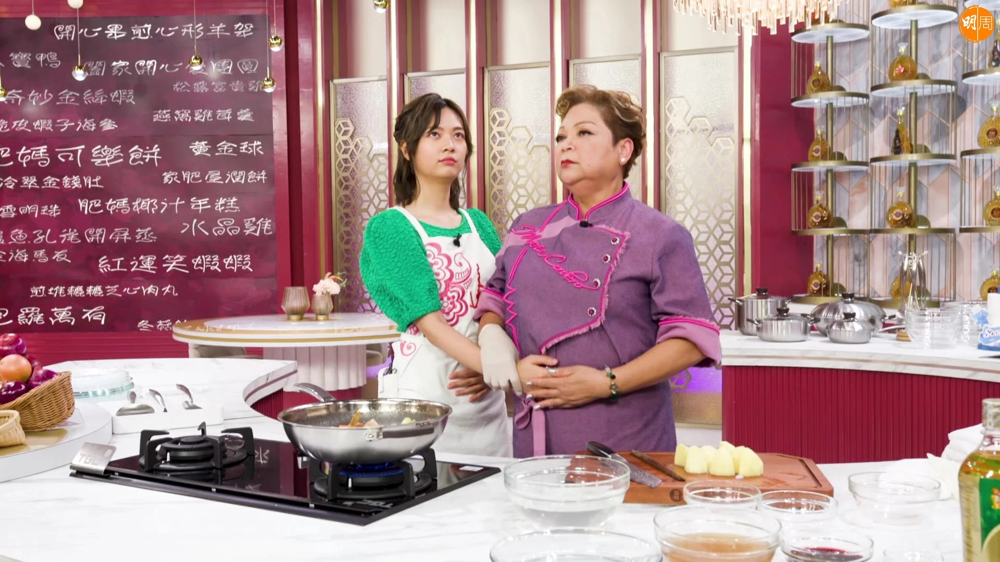

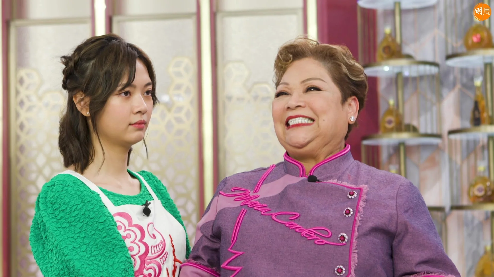

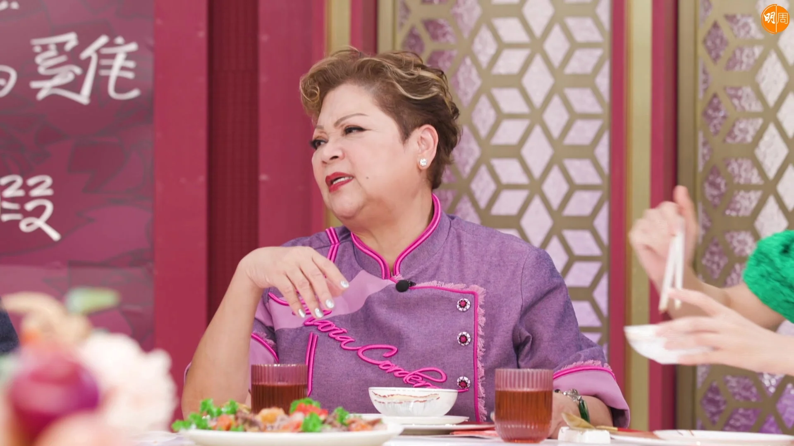

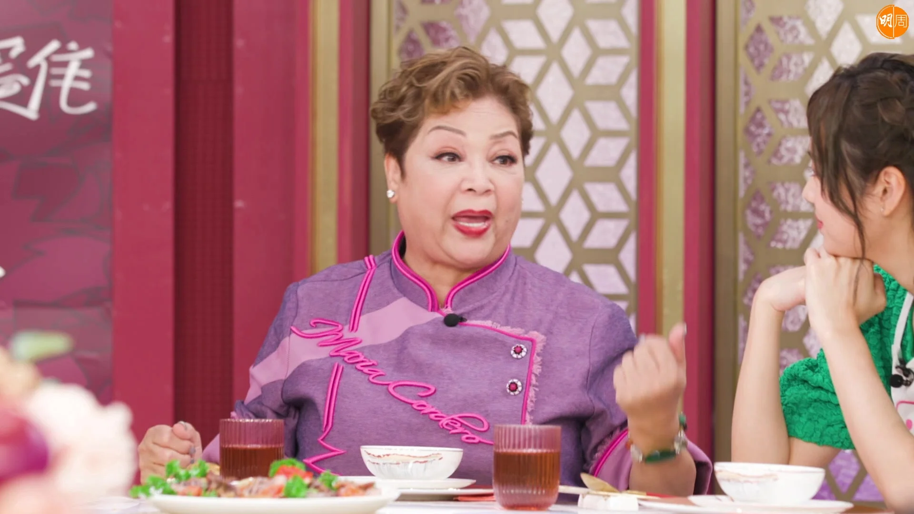

之後肥媽為近年是非逐一解畫，包括好友張學潤（Nel Nel）自殺風波、黃家駒送歌事件及捲入加密貨幣騙案風波。娛圈新鮮人游游則坦言沒有正式學過戲，但曾試過向前輩偷師，她說：「之前佘詩曼前輩返嚟拍嘢，我特登去個廠度睇。」肥媽聞言即出情景題考游游演技：「你條仔呃晒你爸爸啲錢，仲激死咗你爸爸，咁你仲愛唔愛條仔？定係同爸爸報仇？」肥媽更即場化身渣男交戲，到底游游會如何招架？

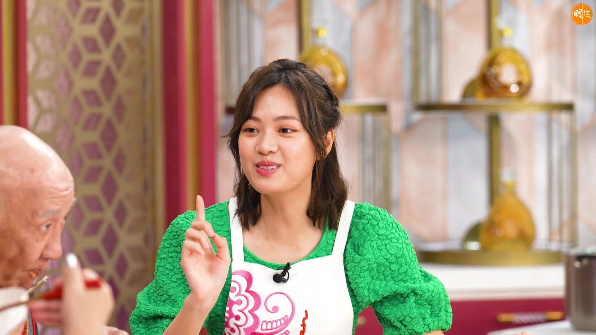

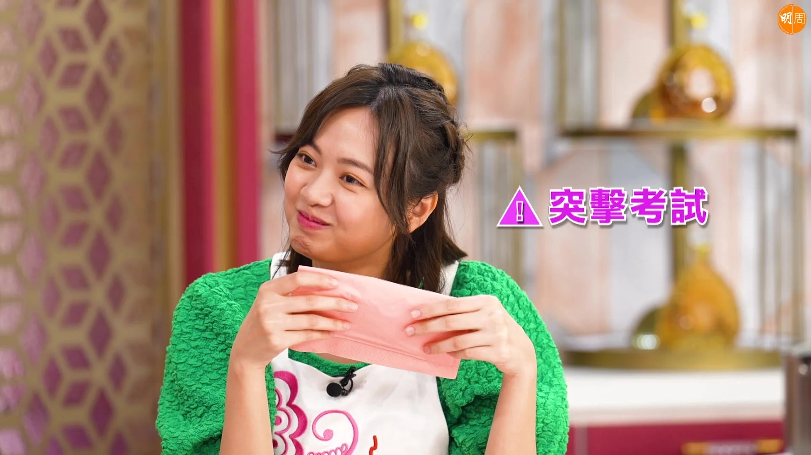

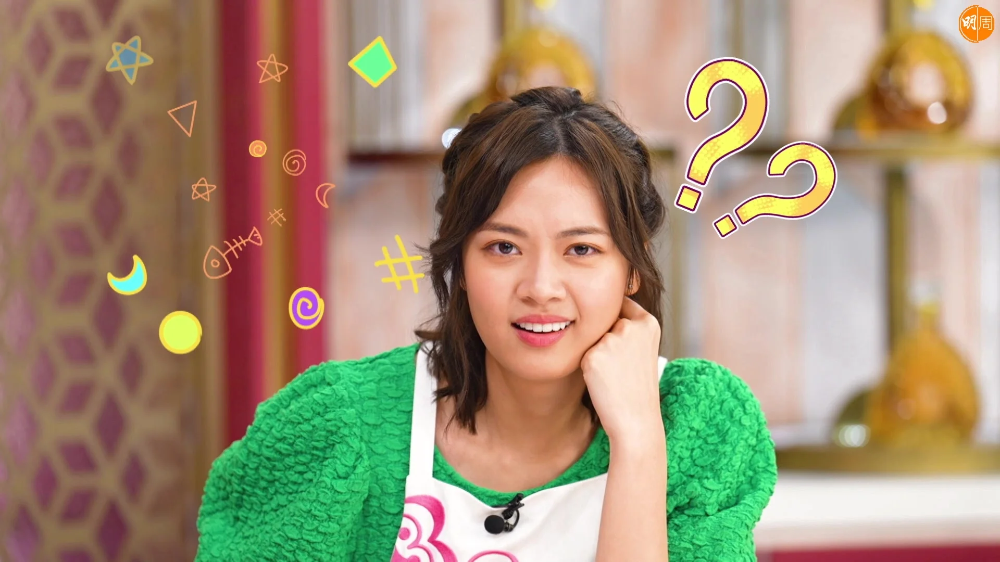

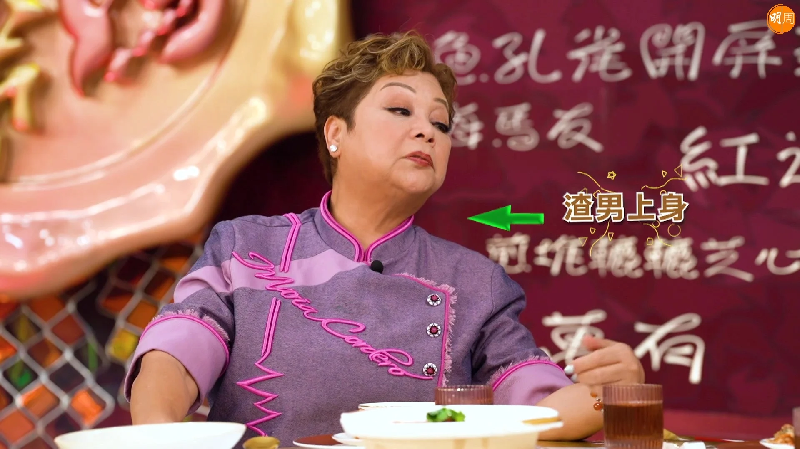

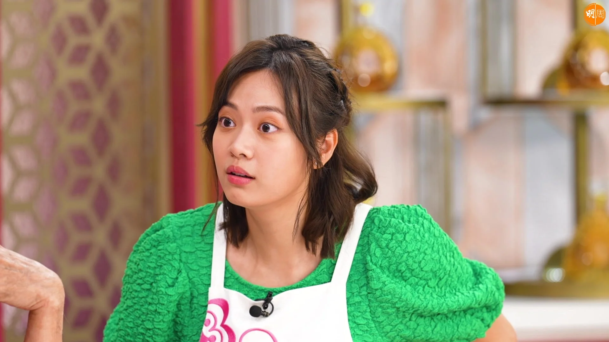

後晚（9日）播出的第五集主題是「壽星的煩惱」，看似大男人的鼎爺原來亦有浪漫一面，他透露曾為另一半送上可以放相片的頸鏈，說畢又自嘲自己不懂浪漫，遭肥媽搞笑質疑：「咁都話唔識？」鼎爺聽畢再踩多自己一腳：「我真係唔識，係朋友教我㗎咋，我低B㗎！」場面搞笑。之後鼎爺炮製香濃雞白湯菜膽雞時，搞鬼的肥媽笑言：「知唔知阿爺最鍾意食咩雞？係處女雞呀！」鼎爺沒好氣說：「處女雞即係雞項，唔好食嘅。」天然懵的游游此時加把嘴說：「咩品種都試吓囉，要試多啲先得嘅！」隨即引起哄堂大笑。最後肥媽分享了一件之前為媽媽慶生的趣事：「有一次送咗個楓葉金幣俾阿媽，點知佢一打開就掉咗落地！」肥媽及後爆出媽媽生氣真相後，全場即哭笑不得。

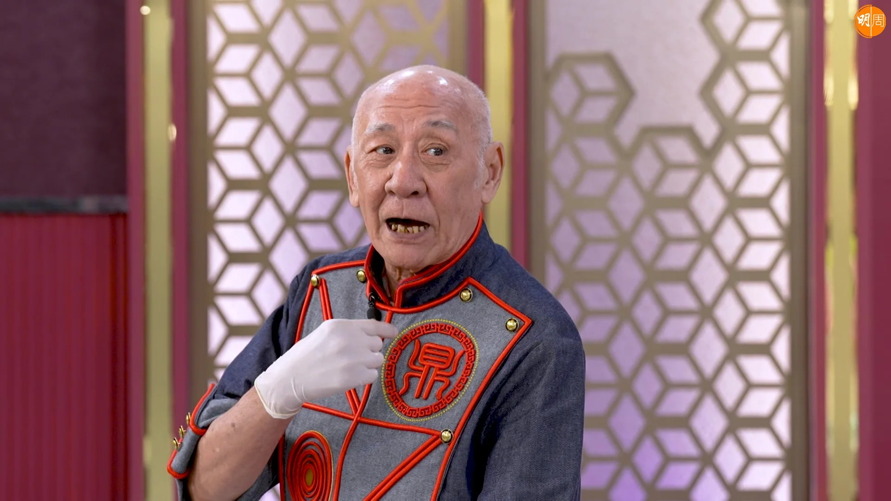

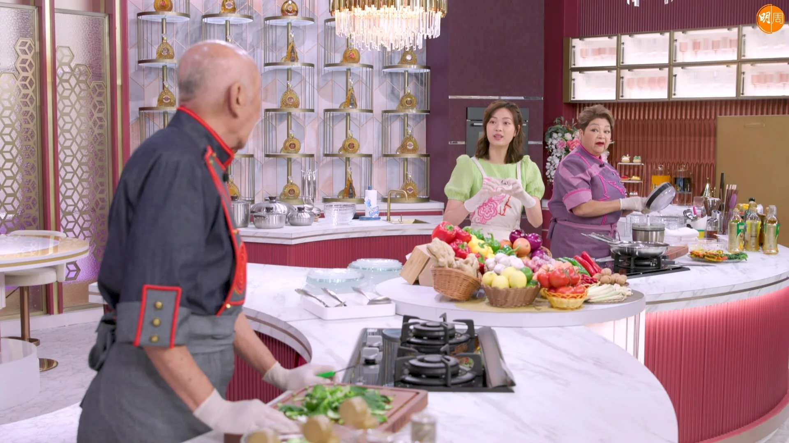

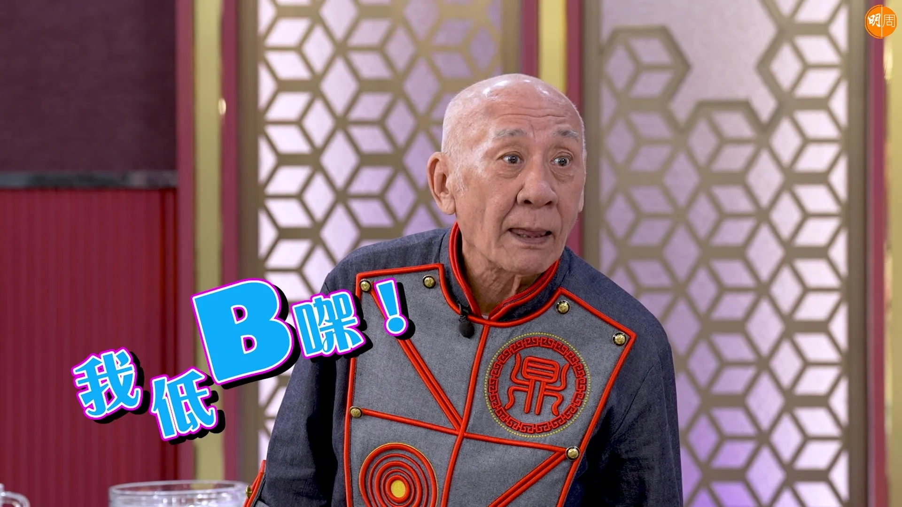

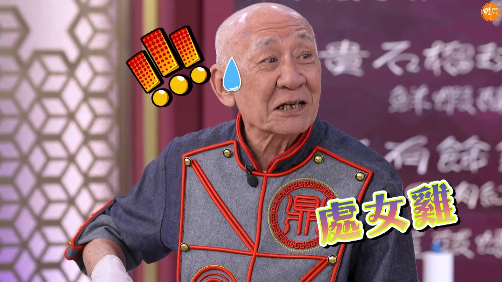

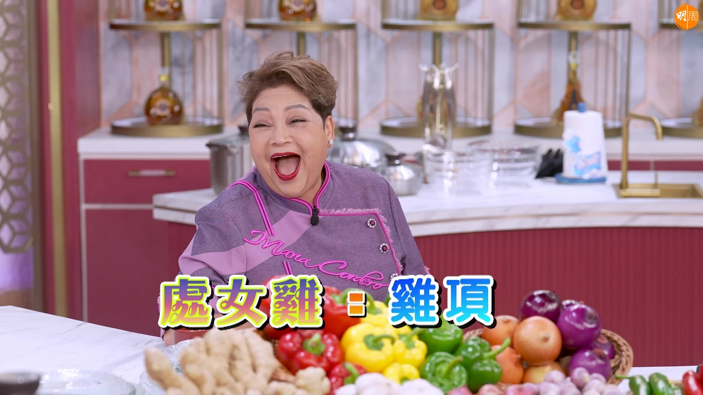
