import YouTube from '@/components/patterns/YouTube.astro';

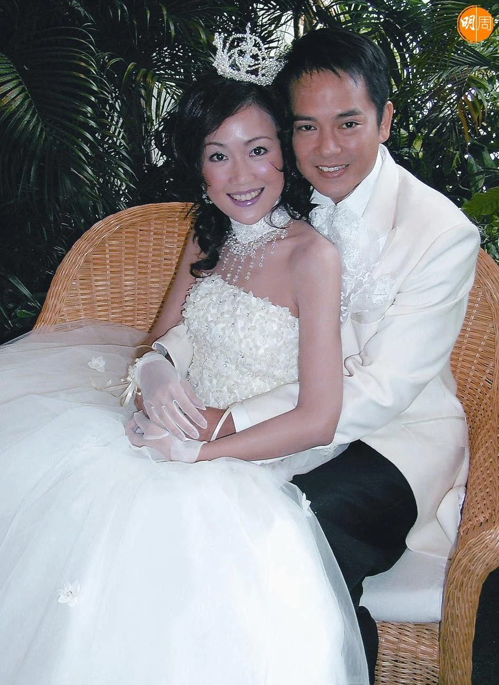

2000年3月4日是陳嘉輝與梁小冰的大喜日子，早上十時陳嘉輝在伴郎黃貫中及戥穿石等伴同下，到酒店接新娘，當日的伴娘及姊妹團亦陣容鼎盛，三位伴娘蔡少芬、朱茵及何婉盈，而姊妹團則有陳法蓉、黎美嫻及劉美娟等。下午二時半，婚禮在教堂舉行，小冰由爸爸帶領下步入教堂，嘉輝與小冰在牧師見證下宣讀誓詞，二人都忍不住流下歡欣的眼淚，在場的親友亦受感動而眼濕濕。

梁小冰是1990年度香港小姐季軍，曾代表香港參與1990世界環球小姐，同年簽約成為無綫合約藝員，並客串處境喜劇《同居三人組》，憑着清純氣質在90年代中港台擁有相當高的人氣，1999年參演台灣劇集《新梁山伯祝英台》，當年已經30歲的梁小冰更與20歲的羅志祥分別飾演祝英台和梁山伯，在台灣大受歡迎。而陳嘉輝畢業於香港理工大學土木工程系，曾在政府土木工程拓展署任職工程監督，因為偶然拍了一個大型廣告而入行。他在1986年加入無綫電視，在處境喜劇《都市方程式》擔任男主角，1990年，他與張衛健、林文龍以及劉錫明被力捧為「太陽之子」。

<YouTube id="BCd4hAnPRn4" />

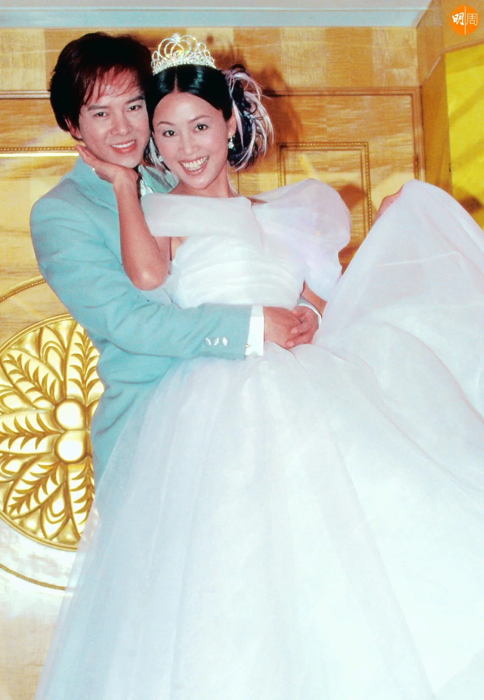

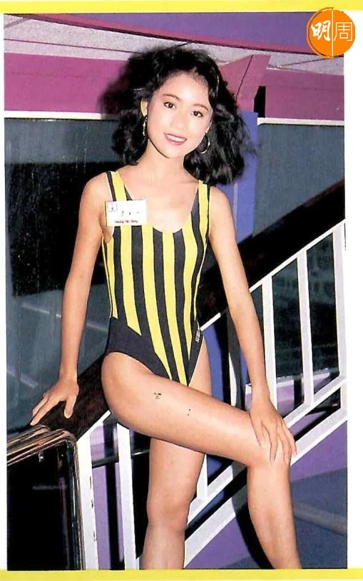

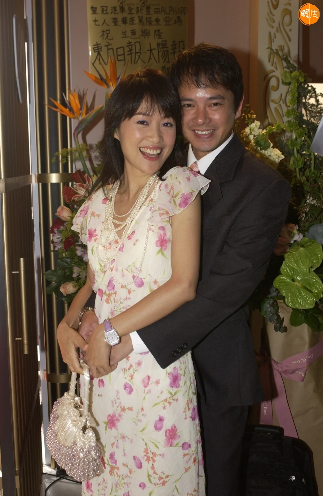

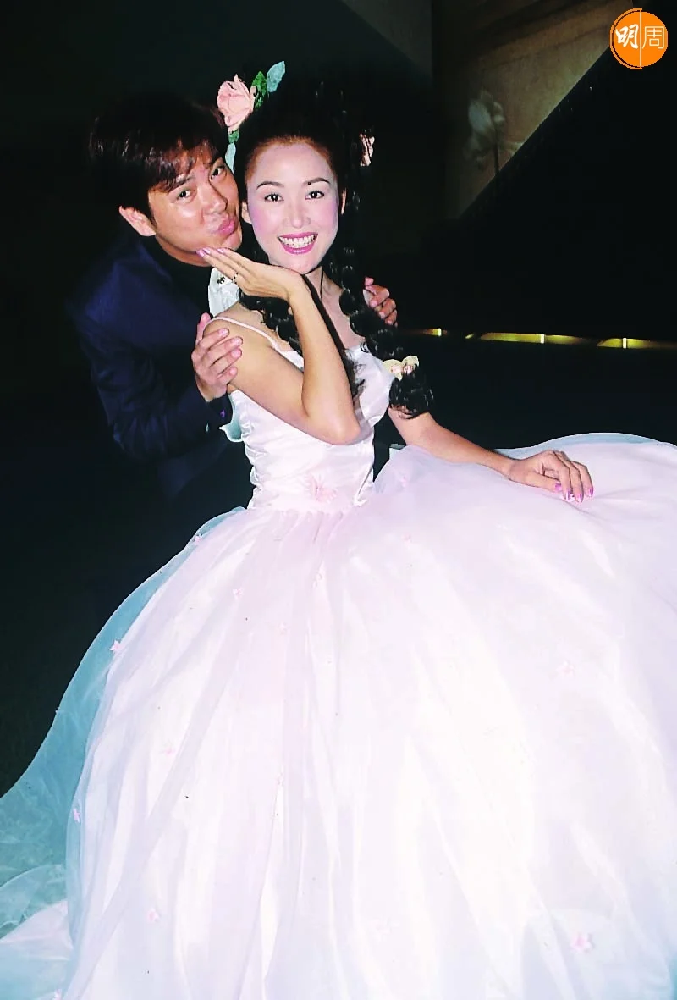

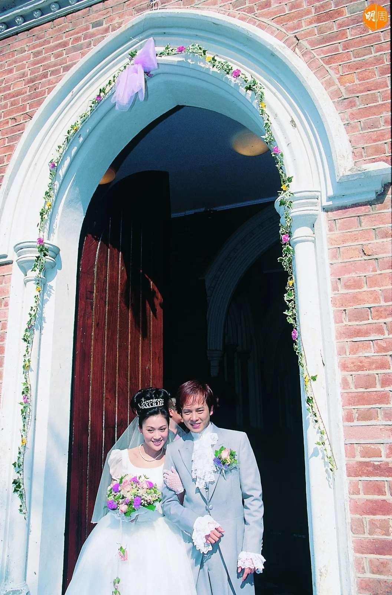

嘉輝與小冰於1992年因為合作劇集《兄兄我我》而結緣相戀，拍拖八年終於步入教堂，在小冰的眼裏，婚前的陳嘉輝是個典型大男人，不會好快樂，也不會不快樂，情緒總處於同一水平線上。她不知道他的喜怒哀樂，建議彼此去接受牧師的輔導，梁小冰說：「他是一個活生生的人嘛！一個人怎可能對一切都沒感覺？作為他的女朋友，他的喜怒哀樂，我卻是一點都不知道！再這樣下去，感情一定有不良的影響。於是，我建議大家去接受牧師的婚前輔導。」

很多人聽到「輔導」兩個字，就會覺得有問題，最初小冰向嘉輝提出要求，他的反應也一樣，「只有唔掂的人才要別人的援手！」幸好最終也接納了小冰的建議，在輔導的過程中，二人對於對方與自己，都加深了認識。小冰說原來男人流血不流淚是騙人的，「因為對這句話深信不疑，一直以來，他都把情感壓抑，因為習慣了，他不覺得有問題；而我，也從來沒看過他哭。」

接受輔導後，嘉輝開始學習把感情發放出來，有一天，嘉輝在小冰面前，掉下第一滴眼淚「那天究竟有什麼事情發生了，我已經忘記，總之經過那一刻，我知道嘉輝不再如從前般，把自己的真感情收藏起來，並且，我感覺到他是因為疼我而傷心、而流淚的，他已成了我的一部份。」

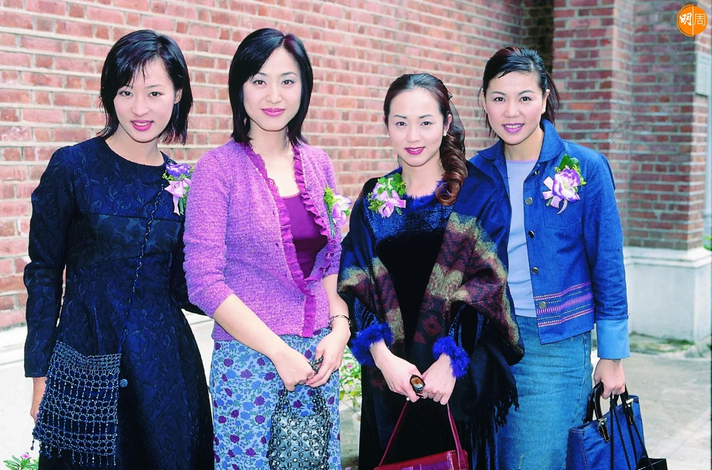

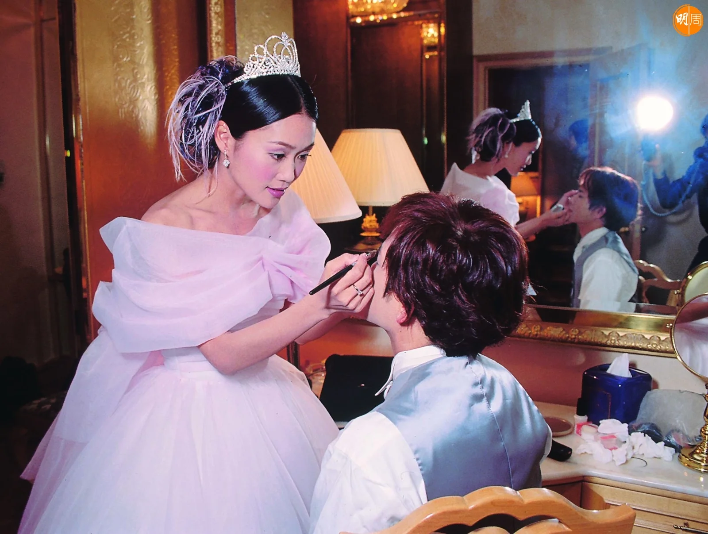

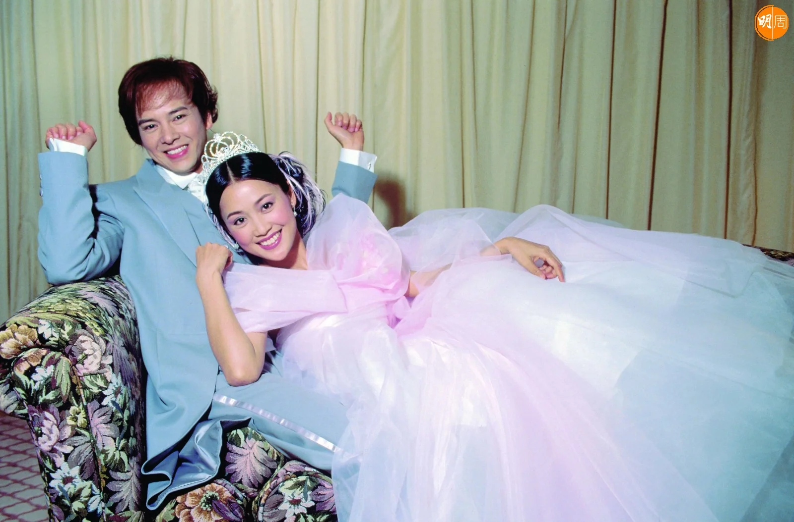

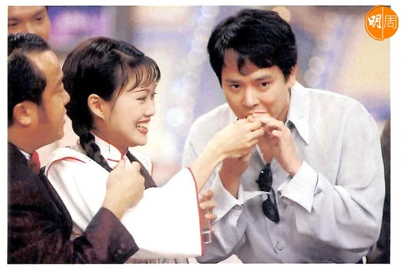

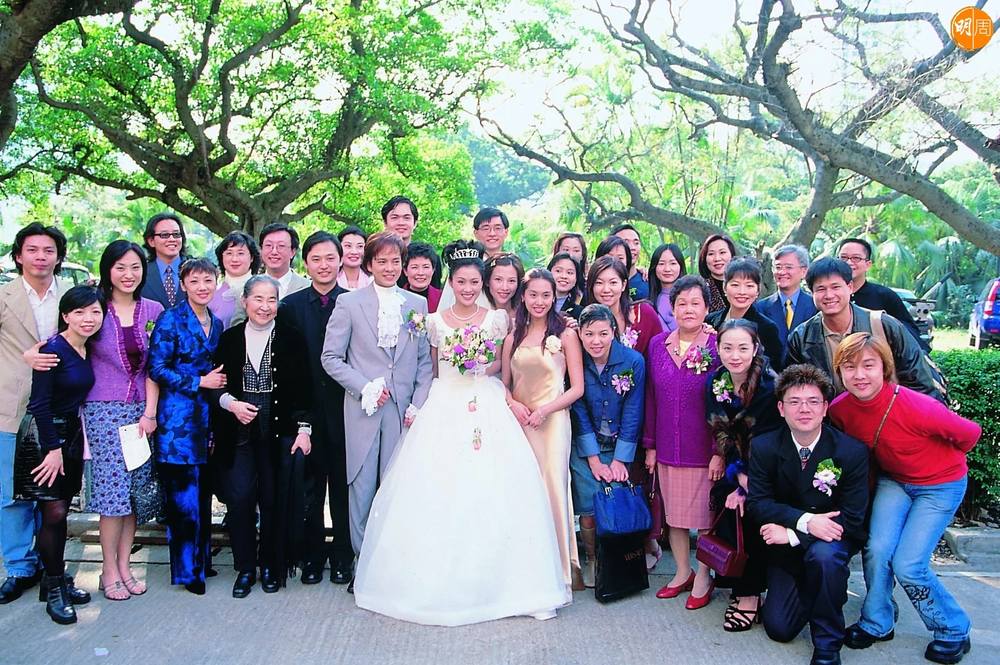

小冰表示今天的嘉輝已經蛻變為一個性情中人，眼神裏閃爍驕傲。禱告作引子當兩個人清晰看見，自己跟對方已經合而為一，且到了不可分割的地步，結婚就變得順理成章了。「我們雖然做了一次又一次的婚前輔導，明知對方就是將來跟我牽着手，步上紅地氈的那一位，結婚兩個字，在我的思想裏，還是件遙不可及的事。因為，我們覺得大家在時間、心理上及性格各方面，也未到達談婚論嫁的階段。直到98年，我決定離開無綫，我強烈地感覺到，那是一個新的階段，對於事業如是，對於感情如是。我想，是時候建立自己的家庭了。」小冰覺得這就叫做默契吧！大家都在相同的時候有相同的想法，嚴格來說，嘉輝不單單在想，且靜靜地有所動作，「記得那時，我要到大馬拍戲，臨行前，我暗中請求一位好友，替我訂造一隻心形的鑽石指環。指環做好了，我趁空檔飛回來，準備向小冰求婚。我曾經為了下跪不下跪的問題而反覆思量，最後，我決定採取二人一貫的溝通方式，以禱告來開路，邀請上帝為我們的愛情作見證。」

二人走在一起逾三十年，是圈中的模範夫婦，兒子陳洋溢（Lewis）今年已17歲，陳嘉輝近年回歸TVB拍劇，於處境劇《愛．回家之開心速遞》飾演朱展相當入屋，小冰不時在社交平台分享家庭相，一家三口非常美滿幸福。
