import YouTube from '@/components/patterns/YouTube.astro';

昨日黃家駒的墳墓遭兩名男子破壞，警方以「刑事毁壞」罪名拘捕兩名分別15及23歲男子。

*黃家駒墓碑被毁 黃家強為「此種不滅國亡不遠」解畫｜張晉50歲生日獲老婆力撐 蔡少芬：有你我們才完整（20/05/2024）*

<YouTube id="FZmojtkZ3gw" />

昨日（19日）黃家駒位於將軍澳華人永遠墳場的墳墓遭兩名男子破壞，墳場職員報警求助，警方以「刑事毁壞」罪名拘捕兩名分別15及23歲男子，Beyond三位成員黃家強、黃貫中、葉世榮分別就事件回應。但當中家駒弟弟家強的回應惹來熱議，以下是家強回應全文：

「這是個什麼樣的國家，道德淪亡到這個地步，千里迢迢來摧毁別人的墓園，你所做的一切會得到什麼，傷害別人真的會是你的流量密碼嗎？我不知怎樣去譴責你，倒感慨你的生活環境竟然會造就出一個你這樣可悲、可恥、可憐、可恨的賤種。我不知道還有多少你這樣的賤種在國內繁殖中，此種不滅國亡不遠矣。」

*黃家強就兄長墓碑被毁的回應，惹起熱議。*

當中家強提到「這是個什麼樣的國家，道德淪亡到這個地步」、「千里迢迢」、以及「我不知道還有多少你這樣的賤種在國內繁植中，此種不滅國亡不遠矣。」網民認為他不應該把仇恨提升到國家層次，以及暗指事件為內地人所為，是歪曲事實，借題發揮，有網民表示：「每個國家都有破壞社會的不法分子，那豈不是所有國家都會滅亡？」認為他所寫的「千里迢迢」是把責任推卸給內地人。

及後家強再為帖文解畫，他寫道：「這是一種社會現象，當然需要國家來關注，難道我這個小市民可以改變這些變態行為嗎？我文中從來沒有提及是哪個省份的人幹的，自己國家不是國內，那應該是什麼？是語言能力有問題？還是別有用心，我心裏明白，把香港分割出來是這些人，搞對立、搞分化都是這些人。」

*1993年黃家駒在日本錄影節目時，遇意外身亡，在港舉殯當日，萬人空巷，送家駒最後一程。*

更多喪禮照片：

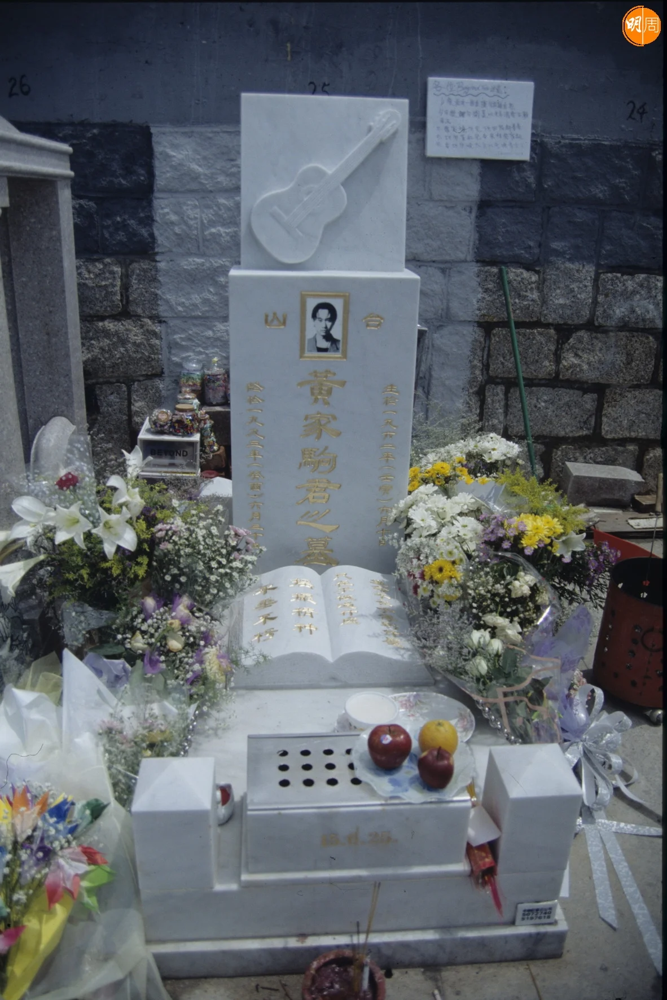

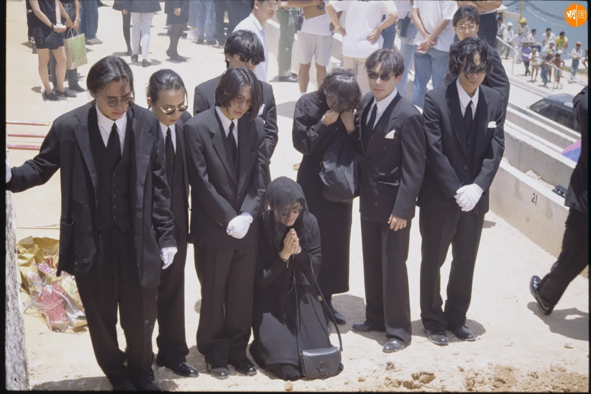

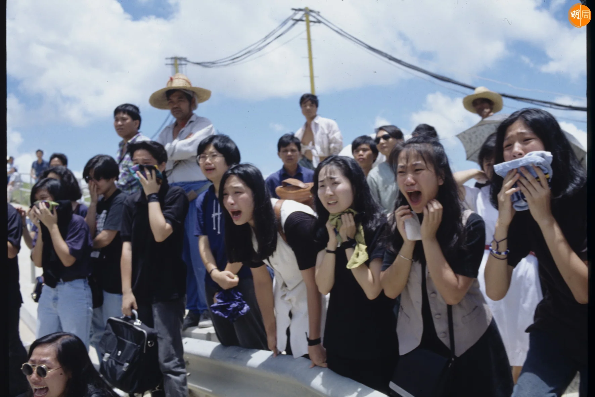

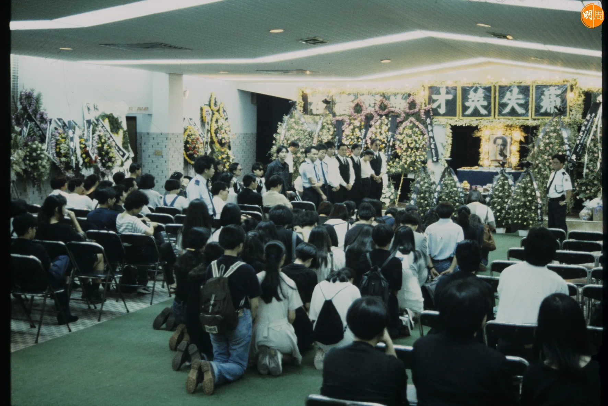

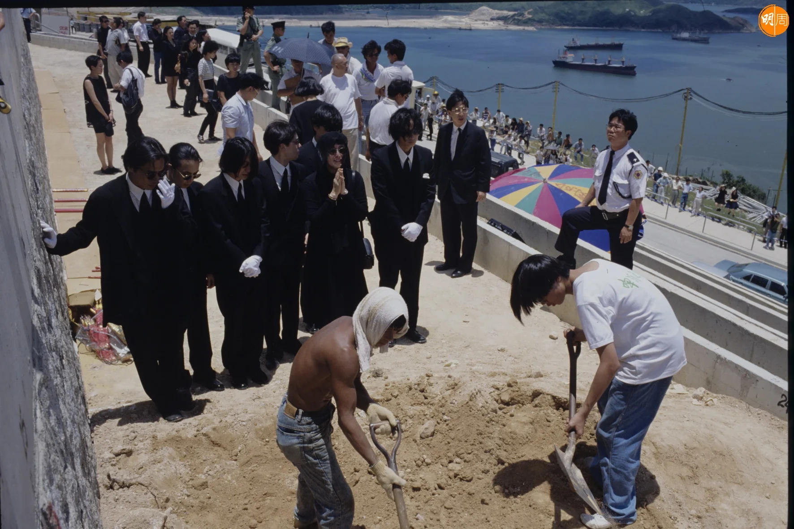

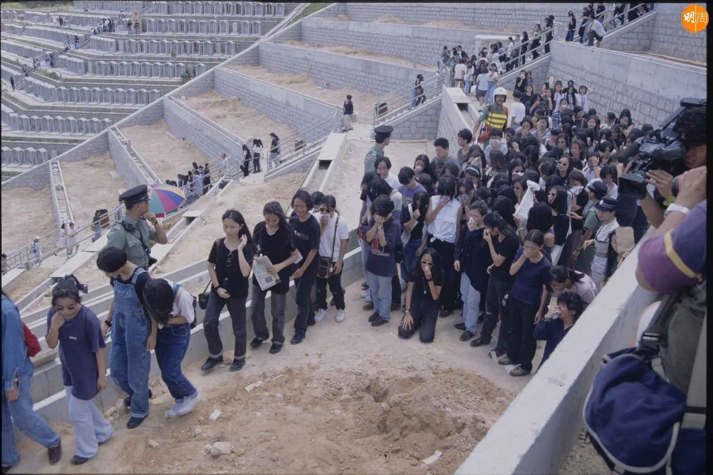

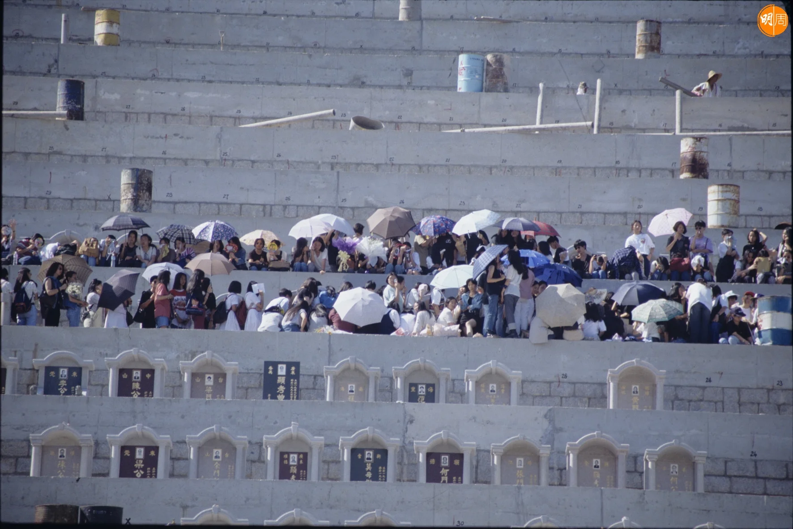

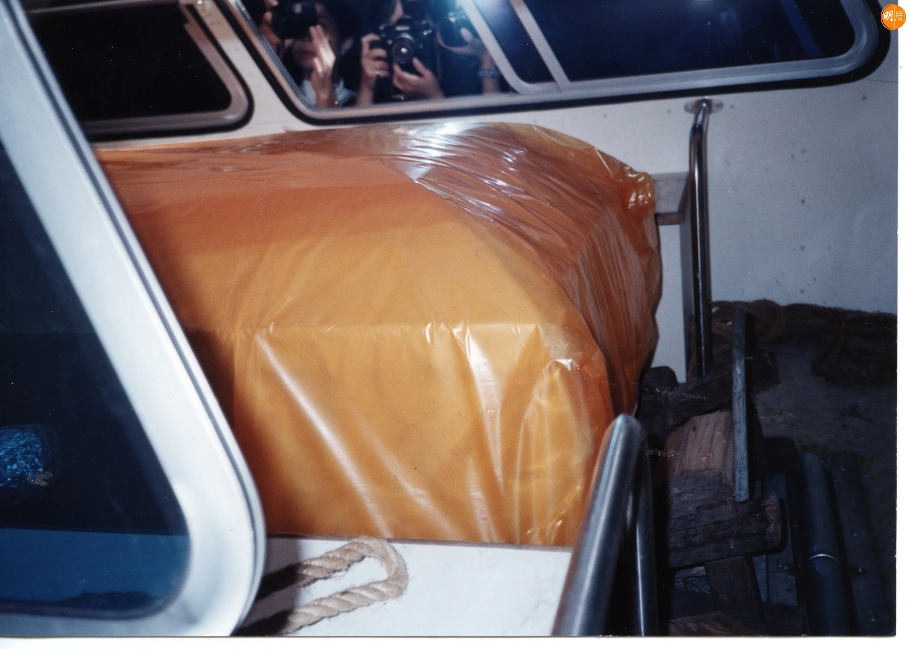

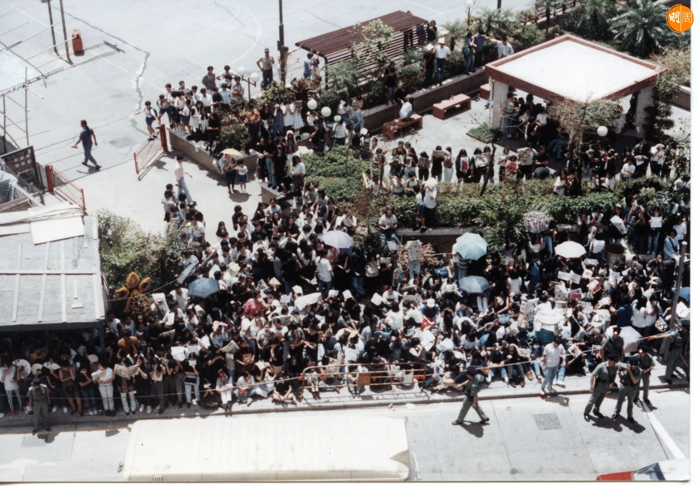

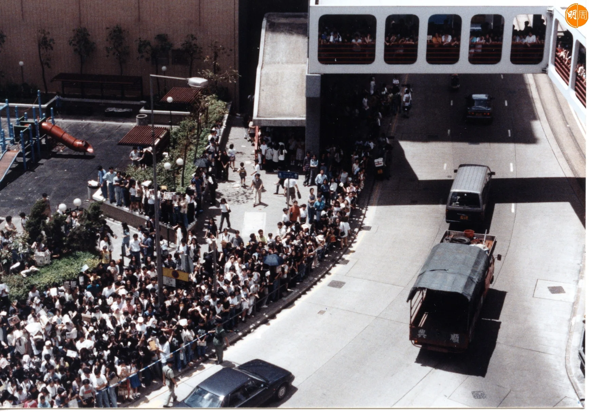

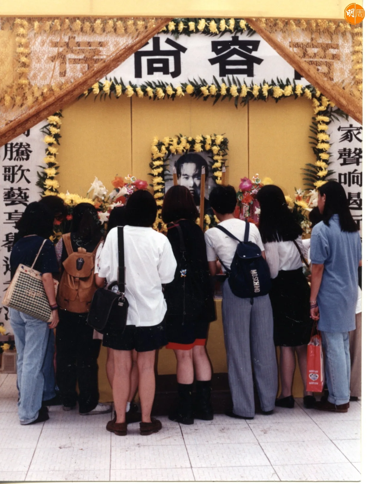

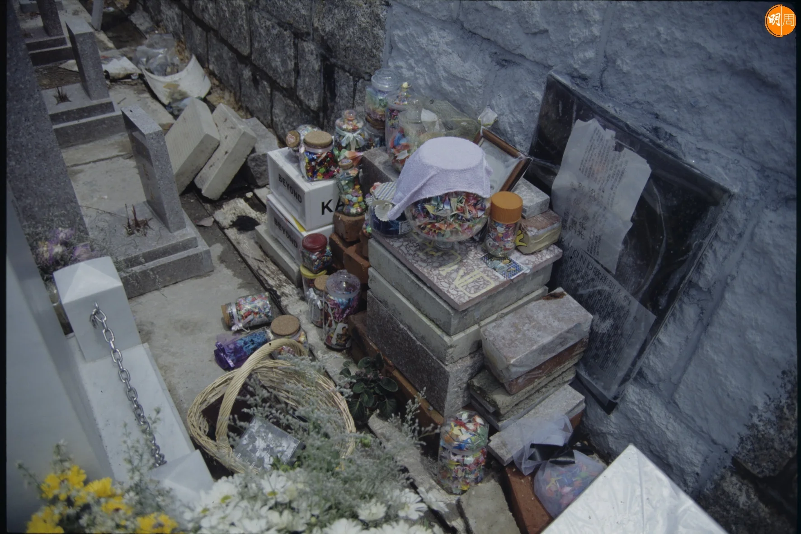

相隔數小時，他繼續表明態度：「原來『千里迢迢』都要解畫，我太高估一些人對文學的想像空間，在一些人的認知『千里迢迢』原來要拿把尺來量度的，真無奈！那好吧，容許我解一解畫，我用『千里迢迢』來隱喻這個無恥之徒浪費時間，上山下鄉，披荊斬棘，不辭勞苦都要故意而為之，真想不到竟然有人會從千里之外對號入座，真是無聊透頂的捉字虱，我根本不知道也不需要設定他是哪裡人，但我只知道他是中國人，這是國家需要關注的社會問題，因為一些人的自私自利才忽視那些社會賤種現象，永遠只會各家自掃門前雪，惟利是圖！自問為國家貢獻過什麼？你可以有什麼都不做只讚美國家的權利，但我亦有為國家美好的將來付出努力和提出問題的義務。」

*Beyond 的歌曲，多年來仍然在傳唱中。*

不過，他的解畫惹來更大的討論，他指「自己國家不是國內，那應該是什麼？」有人糾正他應該是「內地」，不是「國內」。另外，網民指責他搞分化、對立，歧視內地人，不應「一竹篙打一船人」，家強駁斥「把香港分割出來是這些人，搞對立、搞分化都是這些人。」有網民明白他身為家駒弟弟，當然生氣憤怒，但這明明是個人行為，不應失去理智，這次破壞事件所有Beyond歌迷都感到生氣，但不明白他為何第一個想到的是國家道德淪亡？也有網民感嘆原本這是一件人神共憤的破壞行為，每一個睇過片段的人都會感到極大的憤怒，但偏偏因為家強「此種不滅國亡不遠矣」的回應，令視件失焦，不禁問一句：「家駒在天之靈，有何感想？」

*隨着家駒逝世，餘下三子屢傳失和，合體機會愈來愈渺茫。*

更多Beyond圖輯：

