import YouTube from '@/components/patterns/YouTube.astro';

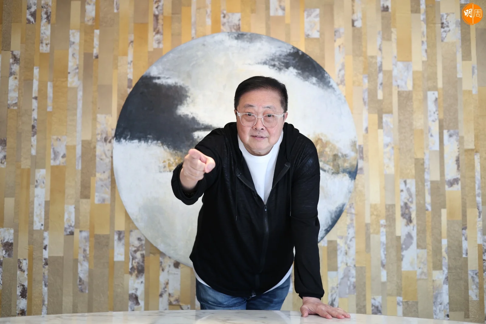

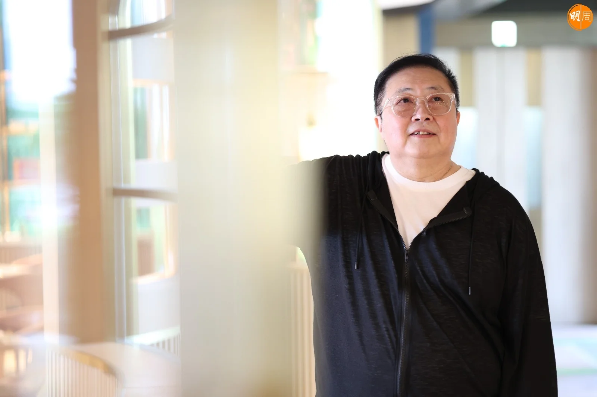

本月6日，是陳少寶自家網台開鑼的大日子，《少寶與文狄》重出江湖，這是被港台高層以「口齒不清」為由，今年五月起停播後的「復活」。今年尾就70歲的陳少寶，廣播生涯46年，從此告別大氣電波，傷感嗎？「係唔係大氣電波，我都係播俾呢啲粉絲聽！」老人家聽眾忽然在收音機少了知音，紛紛叫子女們幫忙搞網上入會，課金支持。

*陳少寶告別大氣電波 開網台再戰江湖 | 形容張國榮天生愛冒險 張學友《吻別》大賣60萬鬧出笑話 | 陳少寶專訪 | Shall We Talk*

<YouTube id="1k7RGYuihog" />

46年前，出身於港台，今天也敗於此。陳少寶除了縱橫廣播界，亦叱咤唱片圈，一手捧紅過張國榮、Beyond、王菲與張敬軒等巨星，位至唱片公司總裁。當年他炒人、今天人炒他，「我以前做過好高位置，我都有好多方法，去除我所謂唔聽話眼中釘，我絕對明，只不過當日剃人頭者，今日我俾人剃一樣！」

由電台到唱片行，職場一帆風順，直至2003年惹上轟動一時的「舞影行動」官司，陳少寶由天堂跌下來。他說，人生每一段路、每個發展轉折，他幾乎都沒有planning過，一切都是整定，很多意料之外，「1999年我返環球做香港CEO，兩年幾三年就闖禍犯官非，我整個人有好大改變，我嘗試過做少少生意，又唔成功，跟住我就返咗內地，嘗試去建立少少事情，都係唔成功！」兜兜轉轉，回到電台廣播室的咪高峰前，播歌做清談節目，原來最開心。

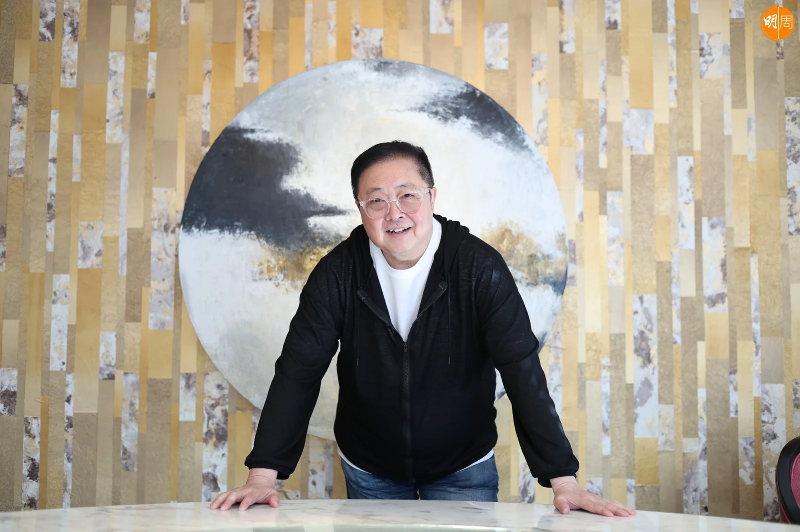

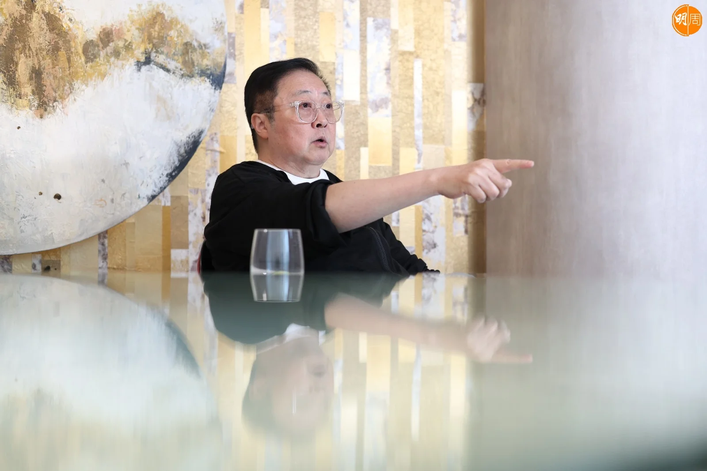

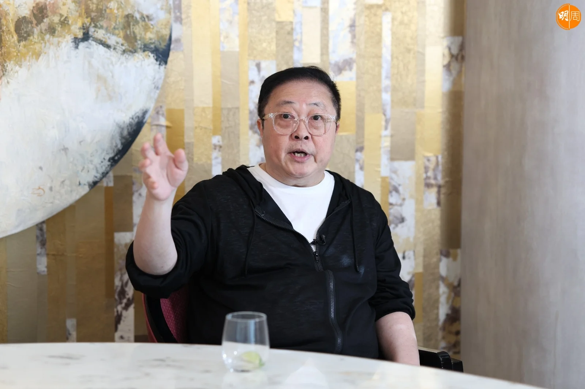

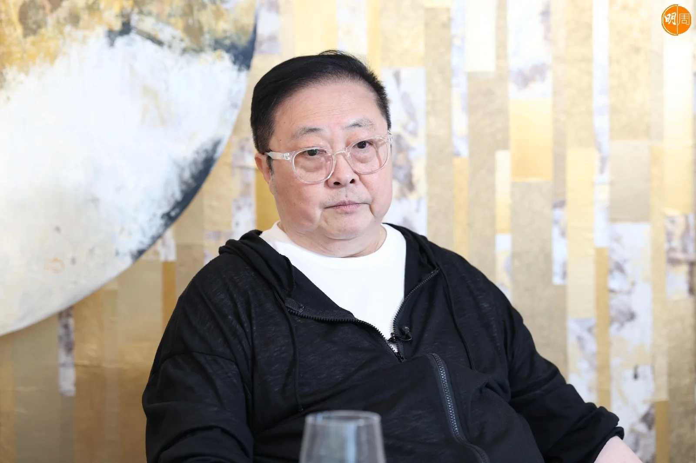

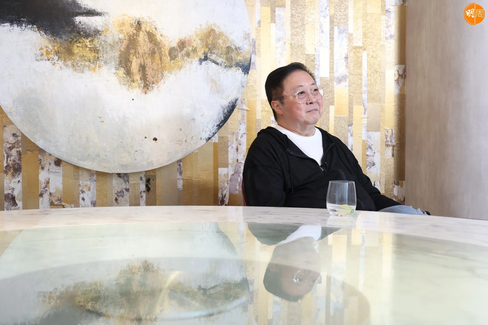

想過東山再起嗎？「我唔想下下都講上帝，我只可以講，好多嘢都係個天安排。依家成班人喺小天地（網台），你話幾開心？既然上天俾呢個功能我，而有人又接收，我梗係做啦，真係做到口齒不清為止都做呀！」今天，陳少寶口齒非常清。

## 有氣嗰日都會嘈

縱橫廣播界46年的陳少寶，近年在港台其實只是兼職員工身份，手上卻有《SUNDAY任我行》、《唱好音樂故事》與《少寶與文狄》三個節目，當中《唱好音樂故事》由陳少寶訪問圈中天王巨星老友，「碌卡」請來李克勤、陳慧嫻和張敬軒等紅星，陳少寶說，節目一出街就爆，「係咪應該好開心呢？原來唔係，因為我已經聽聞有好多人去閒言閒語，呢個老鬼只係part time，點解會有咁多節目做？我都冇太過為意，去到四月份開始，佢（港台高層）話我有聽眾投訴，投訴到點呢？舉個例，10點16分陳少寶講過呢句說話，其實係錯嘅，跟住11點32分佢呢個字講唔清楚，跟住12點佢今日講拜拜係無禮貌嘅！大家都明，肯定係針對性，邊有條友咁好心機聽，係咪先？」

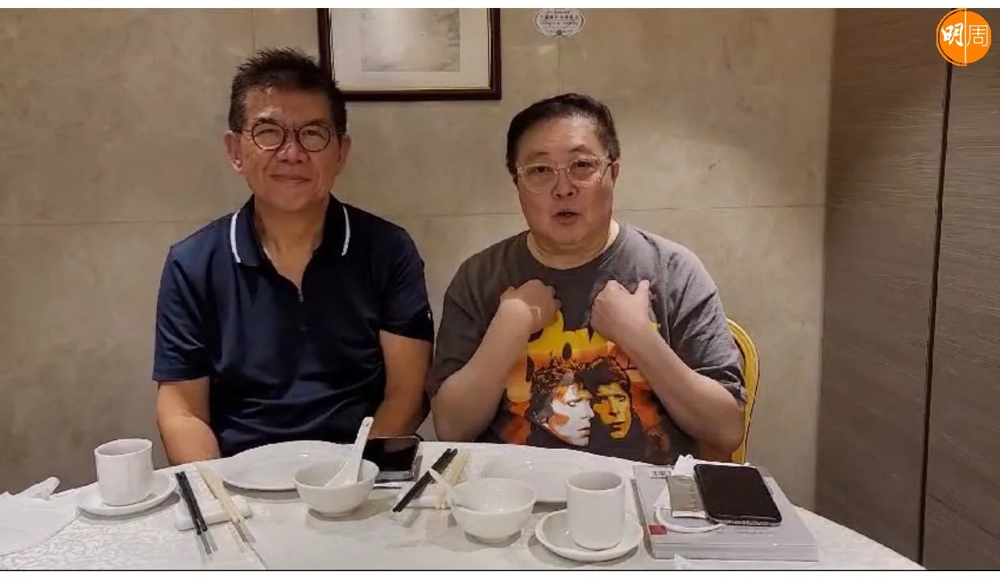

港台高層以「口齒不清」為由，成為陳少寶的被炒原因，更指他慫恿聽眾投訴停播，以違反合約為由終止合作。陳少寶說：「我真係唔嬲，我做咗幾十年人，我都炒過唔少夥計，我依家有老細，用我認為不成文道理炒我，佢係老細，佢鍾意炒我咪炒我囉，但成壇嘢，我覺得好忟憎，第一，香港電台，你係一個公營電台，公營電台係為香港聽眾市民服務，依家有一個受歡迎節目嘅主持人，你哋可以完全不加思索地話改節目就攞走佢，唔係攞走我，係攞走要聽收音機，係你老細嘅聽眾市民，你係咪應該同聽眾市民做一個最簡單解釋呀？到依家我嘈咗咁耐，佢哋冇出嚟放過一個屁！」

事件會否就此不了了之？「佢如果唔出嚟解釋，我有氣嗰日我都會同佢嘈，因為依家我去咗申訴署做申訴，我搵咗幾個老友議員support呢件事，我再強調，我唔係要俾我一個公道，甚至係咪要證明我冇口齒不清，我冇乜所謂，我覺得佢哋應該出嚟同聽眾fans好好地講一次，咁就夠喇！好老實，我小市民，我難道可以令到佢哋高官冇得做咩？荒天下之大謬，我冇咁嘅能力！」

## 第一代代客錄音

陳少寶說，自己在香港土生土長，雖然自小受西方音樂文化薰陶影響，但他自言一向愛國愛港，「特區高官應該俾我哋香港人多啲信心，我係老香港，我今年12月就70歲，我唔係恃老賣老，我絕對有權講呢句說話，我愛香港！1997我都冇移到民，我有條件去移民，我唔去移民，講到呢度我有少少想喊……呢啲官匿喺冷氣房裏面，出面嘈到冧樓呢，佢就搵幾個人出嚟，求其發幾封信，我呢單仲大鑊，連信都冇發過，我唔想講太多，講太多真係會喊！」

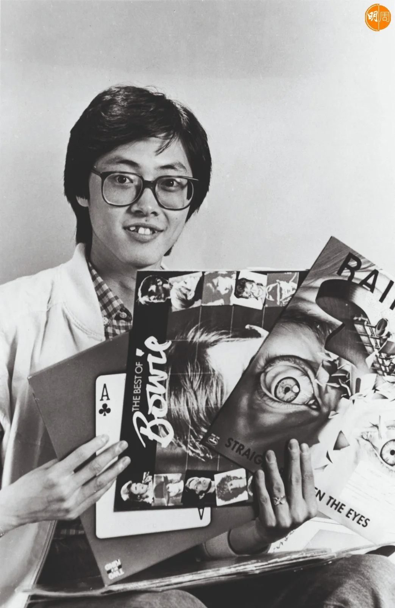

訪問中，陳少寶多次形容自己為「樂癡」，小五開始聽收音機，吸收外國音樂，到了中一，由於常到唱片舖買唱片，被老闆請了他做暑期工看舖，「當時美國人打緊越戰，70 、71年左右，嗰啲水兵一來到香港，第一件事除咗去灣仔飲酒、搞女人之外，一定去唱片舖錄音，因為可以代客錄音，嗰時冇違法，佢哋會去到揀一大堆碟，交俾唱片舖同佢錄音，一大餅錄音帶可以錄到五張大碟。我做咗第一代代客錄音，其實對我音樂知識有好大幫助，我彷彿去咗一個迷你錄音室，日日聽好多唔同歌，我唔係靠聽電台播咩歌，係西人（水兵）話我聽，民歌又有、Psychedelic（迷幻樂）又有、Hard Rock又有，成個人好似去咗間音樂大學。」

出身於港台的陳少寶，當年由資深樂評人左永然引薦而入行，他自言廣播生涯中，做勻港台、商台與新城，由AM做到FM，「1978年尾開始，嗰個年代有FM，簡直係人間大喜事，因為以前聽AM收音好差㗎，政府先行FM試播，我就有機會去香港電台做DJ，我做咗一年左右，又同人霎氣，然後我就去咗商台，商台返番去做AM，之後先轉做FM，然後我開始《六啤半》年代，亦都係廣播界經典！」出身於港台、成名於商台，當時的《六啤半》有俞琤、蘇施黃、曾路得、鍾保羅、盧業瑂與湯正川等等，位位猛人！

## 哥哥張國榮愛冒險

電台與唱片公司關係密不可分，陳少寶於1985年獲鄭東漢（鄭中基父親）賞識，邀其加入寶麗金旗下的唱片公司新藝寶。當年力邀哥哥張國榮（Leslie）由華星過檔新藝寶，成為一時佳話，「以前喺電台，我就已經同Leslie有傾有講，嗰時香港有三個所謂年青人超級偶像，一個陳百強、一個鍾保羅，另一個就係張國榮。鍾保羅本身係《六啤半》成員，成日都見，張國榮最早期係寶麗金歌星，亦係佢失意時候，大家都年輕，做完訪問會去飲杯茶吐苦水，年輕時候感情建立係最牢固。佢都覺得我係一個樂癡，華星後期，佢親自同我講，覺得華星控制佢歌曲太過嚴格，佢覺得音樂創作空間唔得廣闊，呢個係佢其中一個原因想離開華星；第二個原因係佢華星最後張唱片有首《當年情》，係新藝城電影《英雄本色》歌曲，新藝城要開間唱片公司叫新藝寶，自然又會落到少少藥，你都係我演員，我仲會開《英雄本色》第二集，跟住會同你開好多戲，你係咪應該都關照埋我旗下間唱片公司先？」

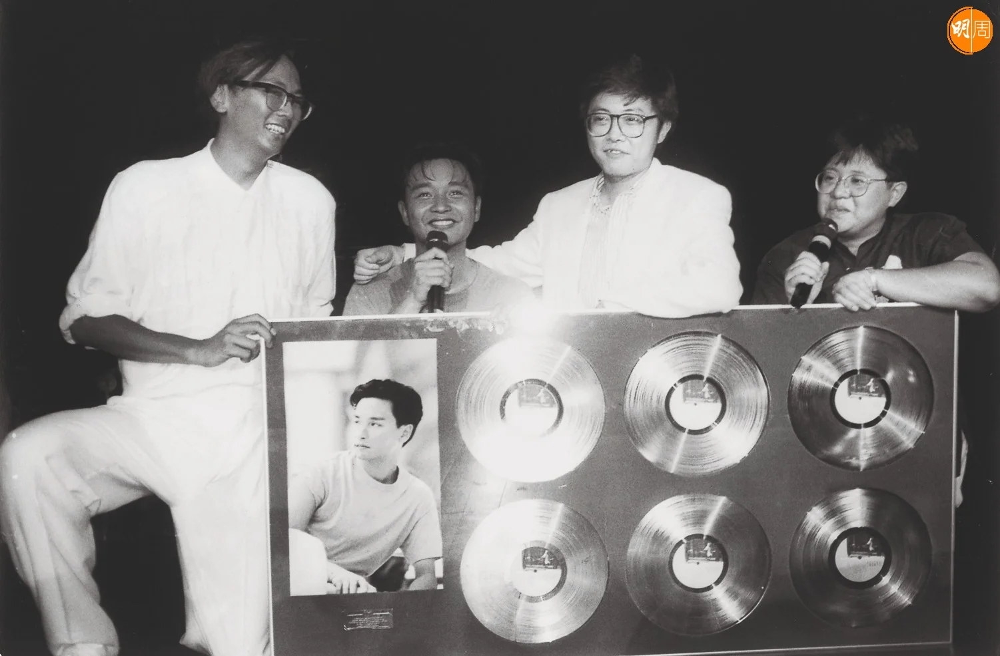

陳少寶與哥哥的緣份，由新藝寶年代直到最後的環球，兩人都並肩作戰，據陳少寶形容，哥哥是個愛冒險的人，「我有根有據，唔係老作，佢可以喺華星最紅嘅時候，《當年情》嘭一聲跳槽去我度，呢個係冒險嘅，當然更加成功，因為《無心睡眠》比《當年情》更紅，但佢又可以玩咗我嗰張合約兩、三年，然後話封咪，因為我淨係想拍戲，唔想再唱歌，呢個又係冒險！大家都知去到最尾，講得難聽啲，姣婆守唔到寡，肯定出返嚟啦，結果當時佢簽咗俾滾石，裏面我都知道有啲嘢唔太開心，咁橋，滾石張合約差唔多完，我就返環球做CEO，佢第一個就跳出嚟同我講，我哋（同滾石）就甩約，你愛唔愛我先？我梗係愛你啦，大佬，求之不得！整定，真係好似整定！」

## 王菲爸送手錶生日禮

新藝寶年代，除了公司（寶麗金）送他一份「見面禮」，讓許冠傑加盟外，陳少寶一手促成的有張國榮與Beyond，他說，「三隻棋」在手，幾乎天下無敵，「有個江湖傳聞，有好多好事者喺呢個世界上，有啲人會走去同寶麗金講，喂，你個細佬（新藝寶）愈來愈勁喎，因住佢爬你頭，大家都比較鍾意講比較挑釁說話。我大老細鄭東漢好睇得起我，嗰時鄭東漢，仲有寶麗金阿頭德哥（陳汝雄）加埋我，三條友喺呢個江湖以飲酒出名，冇人夠我哋飲！其中一次我同老闆講，我諗到一樣嘢好癲，你實會鬧我，但我好想你支持我，啲友仔日日夜夜問我1997點？個個都話要移民，我橫掂留低，你又俾我咁好機會，我依家事業都有啲成就，我又鍾意做音樂，我話我要簽個大陸人，1997嘛，總之我有呢個諗法！」陳少寶說，老闆冇say no，即是support！

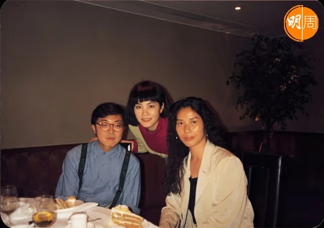

又是整定，忽然有日收到戴思聰老師電話，話說想引薦一個大陸妹，不漂亮，但唱得不錯，那個人就是王菲。陳少寶說過，王菲當年由北京來港，曾將品牌Chanel讀成Channel的笑話，「我話，戴老師，你唔好X簽俾第二個，如果你簽俾第二個，我斬你呀！佢話，你聽都未聽過（唱歌）？你就要？唔靚啊！我話，頂你，冇靚唔靚㗎呢個世界！有一晚，王菲玩票性質參加咗一個Catwalk，報紙登咗張相，梗係娘到阿媽都唔認得啦，但我覺得冇問題，第一，我簽所有歌星，我覺得最緊要唔好乞人憎，最緊要有眼緣，因為當人行運之後，自然靚仔，頂你，講完㗎喇！」

終於，戴思聰帶來王菲的錄音帶，唱了鄧麗君的《小城故事》，陳少寶聽後覺得幾好，再經之後成為王菲御用監製的梁榮駿一聽，都過關了，「跟住打電話俾戴思聰，我話簽啦，隔咗幾日見人，佢老竇都喺度，我仲記得因為王菲就快生日，食飯時佢老竇仲送咗隻手錶，俾王菲做生日禮物，嗰隻手錶就係Movado，點解我咁記得呢？因為Movado手錶嗰時好流行，成個錶面黑色，淨係得嗰兩支針係金色，連數目字都印喺外面，成隻錶黑猛蜢，我仲同佢老竇講，做咩送咁黑嘅嘢俾佢？個女就嚟做歌星呀大佬！後尾上咗佢老竇公司，佢話，我個女就交俾你，當時王菲就快十八歲，唔夠年齡，要佢爸爸做witness（見證人），整張合約俾佢簽，咁就做咗歌星，咁就做咗天后！」

## 張學友《吻別》打多個零？

捧紅Beyond、王菲後，陳少寶因當時母公司新藝城出現人事變動，他選擇在寶麗金出任國際音樂遠東區市場總經理，「做咗一年，派咗個鬼佬過嚟同我一齊做，我臭脾氣，又係同鬼佬有啲爭拗，結果我又走去同老細講，老細，你擺我喺度冇意思，我學晒嘢畢業喇！」於是，1992年陳少寶再升官至遠東區市場副總裁，「我話，點解鬼佬可以由英國推到德國、美國（音樂），我哋唔可以周圍去推我哋本地嘢？」結果，成功說服張學友進軍國語市場，「我哋有四大天王嘛，我執兩件都得啦，尤其呢兩件唱國語得嘅歌星，一個叫黎明、另一個張學友；我講過好多次，我相信阿倫（譚詠麟）都唔會嬲，唱國語歌有邊個難聽得過阿倫？阿倫求求其其，阿倫人生就係咁，冇所謂㗎，佢哋啲人有佢哋嗰啲命，做嘢唔太認真都有人受，我依家講緊呢啲說話，唔係貶低佢，佢根本都係做開心果！學友唱國語肯定好過阿倫啦，咁點呢？跟住我哋開好多會議說服學友，說服過程好辛苦，因為學友當時淨係知道，我係四大天王其中一個，日日四條友就爭宣傳期、爭歌、爭曝光、爭有機會拍戲，佢（學友）話如果我無啦啦，攞咗啲時間去台灣，如果台灣唔得，我咪大鑊？我會兩頭唔到岸，台灣我又唔得，跟住香港啲時間可能俾晒劉華、俾晒黎明、俾晒郭富城，我咪喎呵？我話，做任何一件事，都需要有取捨，都係博博吓㗎啦！」最後，香港台灣兩邊夾攻說服，才誕生了《吻別》這張國語經典。

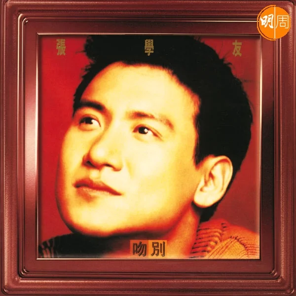

1993年張學友的《吻別》一出大賣60萬張，陳少寶說了一個笑話，「60萬係好得人驚，冇篤數，因為台灣佬只會報少，佢篤大而賣唔到，只會俾我趷佢！因為國際公司，我哋每一個禮拜，當時仲用緊Telex（電報），全世界我哋嘅暢銷榜，每兩個禮拜打一次過嚟，寶麗金唱片公司裏面，最賣得第一名可能係U2，會寫住英國，突然之間，有個叫Jacky Cheung嘅人出現，跟住我哋收到總公司嚟問，你報呢條友，60萬，係咪打多咗個零呀？做咁耐呢個榜，未見過有中文歌可以入十大，跟住就congratulations，好快過一百（萬）！大老闆都俾咗少少credit我，因為之前鬧交件事大家都知，鬼佬好少俾人鬧，係我咁薑去鬧鬼佬。我老闆話，呢條𡃁仔係難搞，不過佢做到嘢，我哋有第一個million sell out，好開心！」

## 兜兜轉轉重返廣播界

在唱片界位高權重的陳少寶，直到2003年位至環球唱片香港區總裁，當時發生「舞影行動」涉貪事件，被控私自收受賄款更改旗下歌手麥浚龍合約，其後因廉署沒收其手機，令陳少寶在未能即時找律師代表的情況下，受錯誤誘導而作出招認口供，法官質疑口供可信性，陳少寶最終甩身。官司一役，陳少寶由天堂打落地獄，是人生的最大打擊，他慨嘆：「我梗係自命不凡，我覺得做咗咁多我認為好嘅嘢，我又咁低調，叫做有啲貢獻，點解我都會碰上一樣咁唔好彩嘅嘢呢？因為呢件事發生之後，我已經感覺到我冇唱片做，我覺得好傷心，我最鍾意嘅工作，居然無啦啦冇鬼咗，當然官司結果還我公道！我冇事，但都冇人嚟搵我，有人搵過我，係滾石（唱片公司），但我當時唔知點解，我好傻傻更更話，我想休息吓，總之我對唱片行，我有少少忽然之間覺得，應該同我冇緣！」

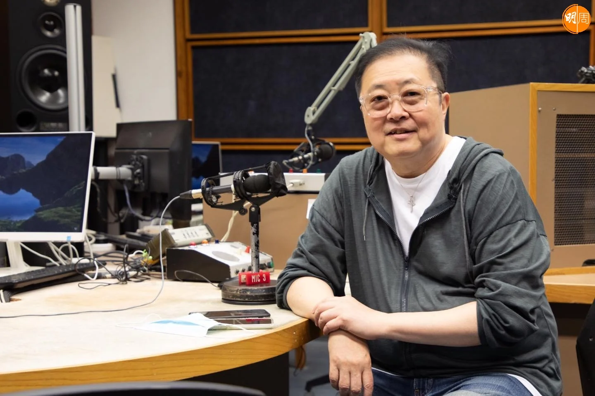

人生兜兜轉轉，竟然在下半場重返廣播界，「跟住撞到兩個老友，老友話開餐館，我咪走去開餐館，肯定唔係我強項，然之後渾渾噩噩，有個有錢佬俾錢我，嗌我去搞歌星（製作），亦都搞得唔好，我又覺得我唔可以打私人工，我做慣國際公司，我唔適應，於是乎我就開始返大陸，碰吓有冇機會，冇咩做得到出嚟，但好成功介紹咗『陳少寶』去廣州，亦都搞過小型製作演出，簽過一個半個歌星，冇咩特別成績，然之後返嚟我就覺得，不如退休啦，好愚蠢，五十三、四歲左右，結果隔咗冇耐，我就撞返朱明銳（亦是當年《六啤半》之一）， 佢話你過嚟新城做，你咁鍾意講嘢，做返《少寶與文狄》啦，我俾音樂你播，一做都做咗五、六年！」

## 籌劃八九十年代紀錄片

在大陸闖蕩的日子，陳少寶最感恩五年前可於內地出版自傳《音樂狂人》，「我覺得我喺官非之後到今日，冇咩燦爛嘅嘢，我覺得我最燦爛呢，亦都係上帝送俾我最大一份禮物，我可以出到呢本書。當時出完書，我哋已經諗住拍戲，COVID所有嘢停晒，依家眨眼都第二年（復常），希望可以有奇蹟出現！」

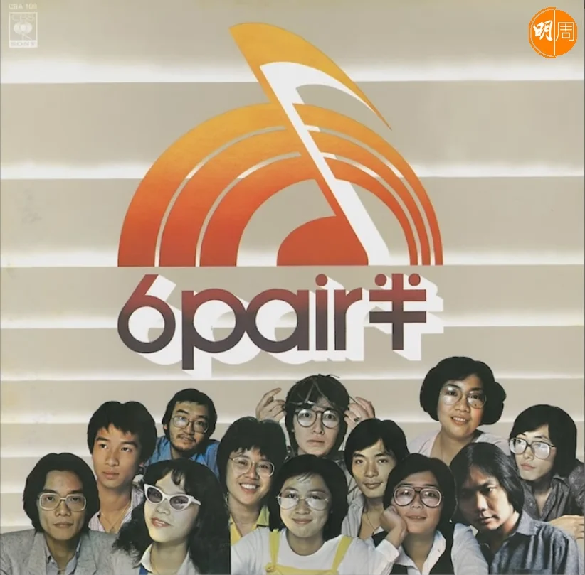

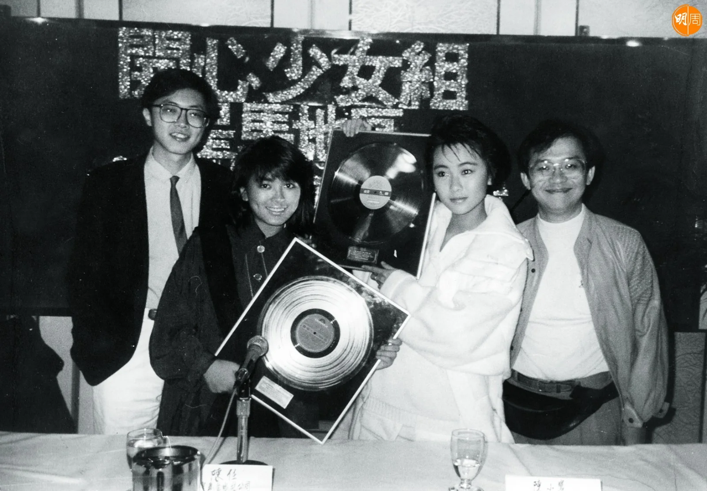

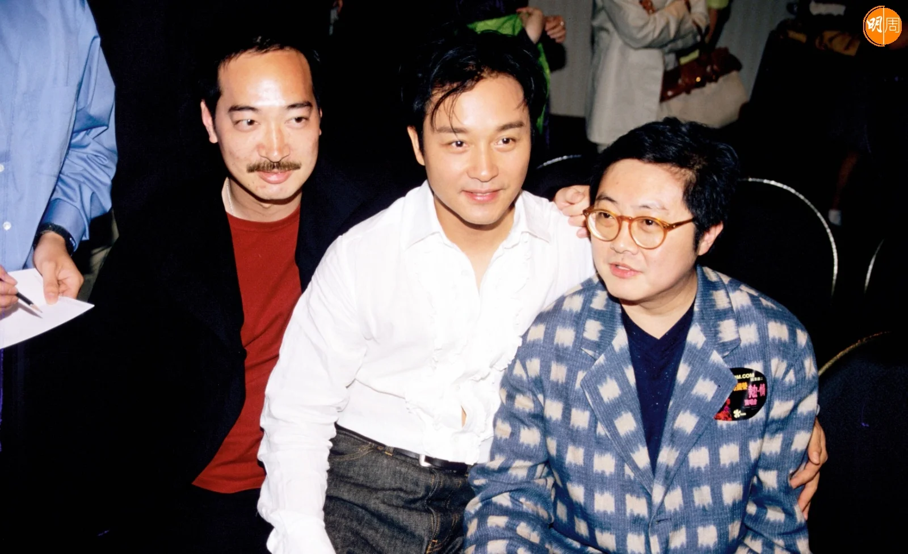

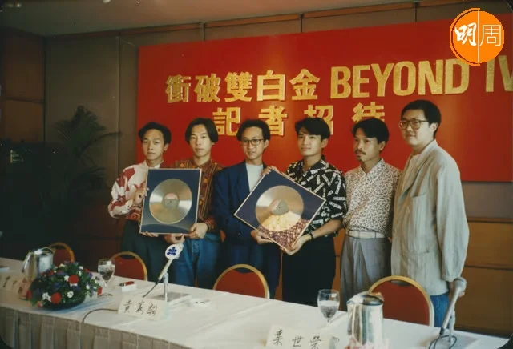

當時有計劃在內地進行《尋找黃家駒》的海選活動，陳少寶說仍然籌劃中，但有另一個計劃可能會行先一步，「關於香港八、九十年代紀錄片，因為我覺得香港文化保育，非常之差，特別流行歌曲呢一瓣， 內地依家四十幾歲到六十幾歲，全部都係聽譚詠麟、張國榮、Beyond、梅艷芳大，我長大嘅時候，一定係聽披頭四、聽Rolling Stone長大，所以我對西曲係唔會改變，同一個道理，內地有一大羣眾，呢一班都係搵到錢嘅人，咁大市場，點可以完全當呢幾十年嘅歌係垃圾呢？好簡單，王家衛拍套《繁花》，都要用咁Q多廣東話歌，覺得《繁花》好睇，係因為時代背景睇得好舒服，一個懷舊當年的東西，特別係音樂部分，因為音樂係最容易，令你諗返起以前嘅嘢！」三句不離本行，陳少寶一生最重要的，肯定是音樂。

-   場地：鏞鏞藝嚐館
