import YouTube from '@/components/patterns/YouTube.astro';

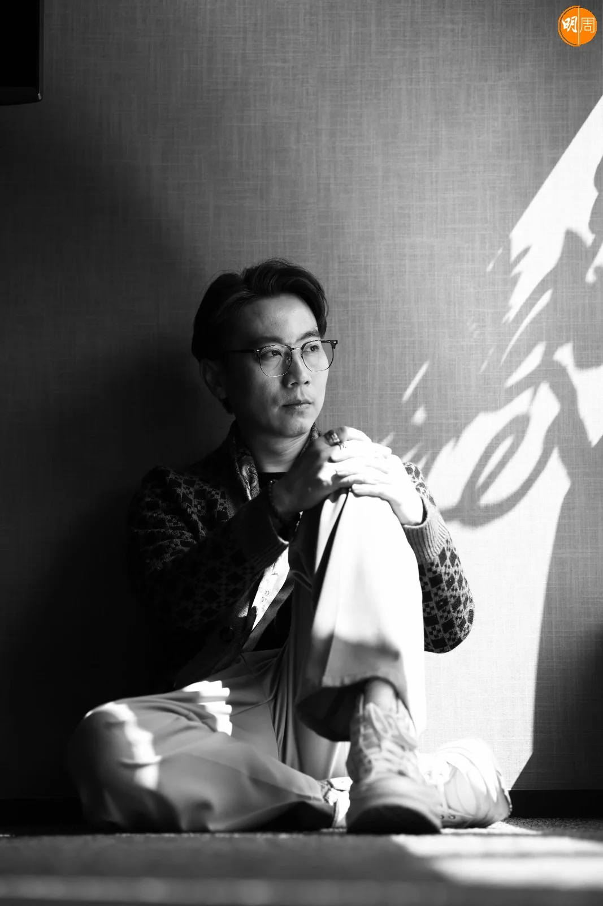

*顏米羔*

顏米羔說：「我感動自己還能夠唱歌，更感動有人肯聽我的歌，人生要找一個聽眾不容易，要找一批聽眾更是非常困難，因為每個人都有經歷，所以經歷並不值錢，現在有人聽我唱歌，對我的經歷有興趣，我為自己而感動！」他的經歷是在《中年好聲音2》得到季軍，有機會從幕後走到幕前，為不值錢的人生經歷平添絢麗，在芸芸眾生中脫穎而出變得閃爍。

*一個觀眾也是觀眾 顏米羔：感恩有人肯聽我唱歌｜顏米羔專訪*

<YouTube id="QojAFmshgh4" />

四十三歳的顏米羔從小喜歡音樂，成長過程一直與歌伴行，參加大大小小各種歌唱比賽，從二十歲到三十歲甚至四十歲，跨進娛樂圈的門檻卻沒有機會唱紅自己，直至《中年好聲音2》，一個曾經令他感覺尷尬的比賽，他說：「中年這個字眼，真心覺得有點尷尬，我做娛樂圈幕後怕被朋友取笑，要鼓起很大勇氣才敢報名，後來看到參賽者都是以前玩比賽的朋友仔，原來大家沒有放棄唱歌，從少年唱到現在人到中年，『中年』反而成為一種心靈安慰，我參加比賽不是追夢，這個夢早在多年前已經放下，我只是因為喜歡唱歌，有機會讓我唱就繼續唱下去。」

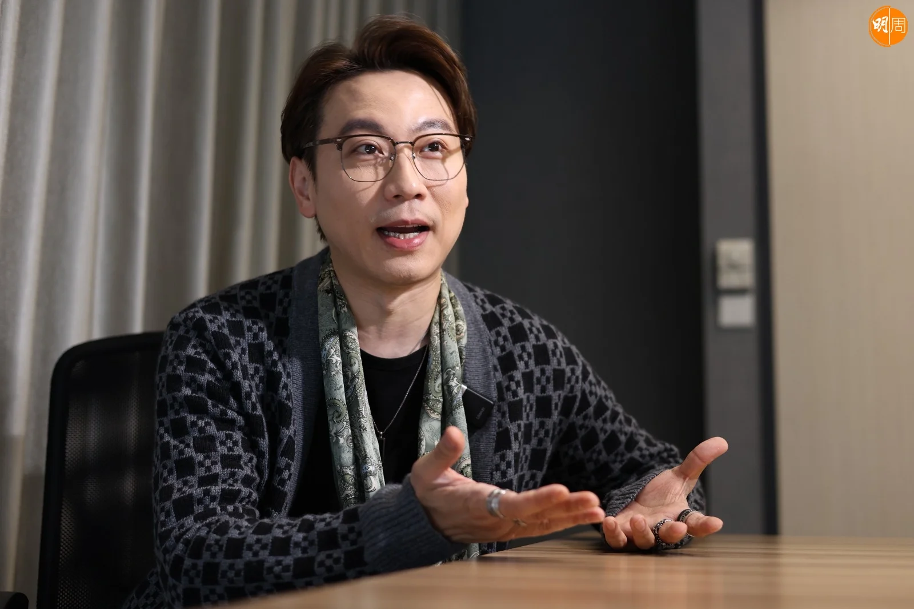

*顏米羔*

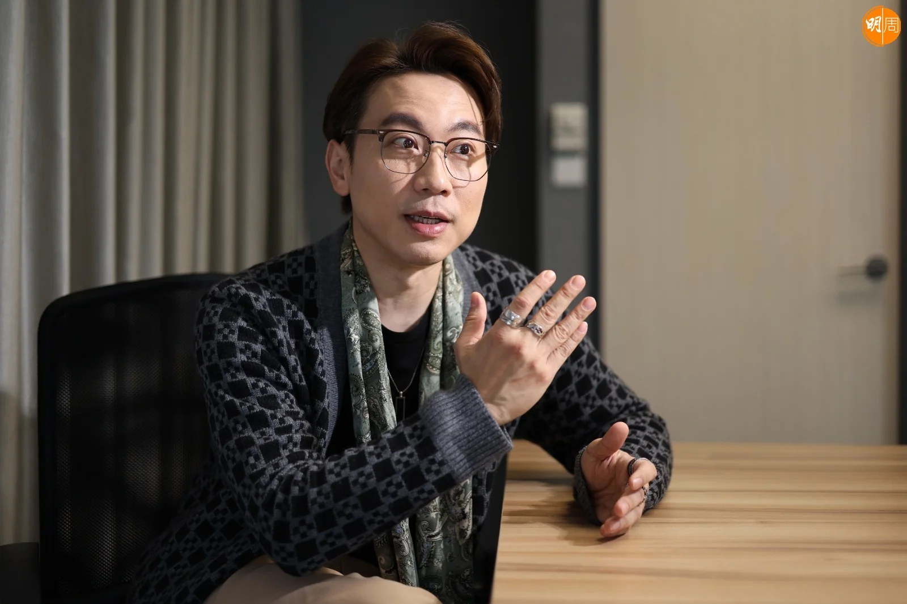

*顏米羔*

*顏米羔*

*顏米羔*

他還記得第一次登台，是十一、二歲讀小學六年級，當時被班上同學推舉做代表，畢業禮上台唱羅大佑的《童年》，在學校禮堂的小舞台初踏台板，「從小到大我

喜歡唱歌，第一次登台是被同學推舉，雖然禮堂和舞台都很小，但公開演唱的印象很深刻，升上中學後不斷參加歌唱比賽，不知道為甚麼不覺得害羞，可能因為有機會唱歌，所以熱衷參加各種比賽，經常在放學後穿著校服參加初賽，很多公開賽都是二、三十歲的大哥哥、大姐姐，我就像一粒蕃茄仔，他們叫我『達仔』對我很照顧，在他們身上聽了很多故事和經歷，現在很多人說我的歌像有很多故事，我想是受當年的經歷影響，被前輩點點滴滴的人生累積感動，希望透過自己的歌聲感動別人。」

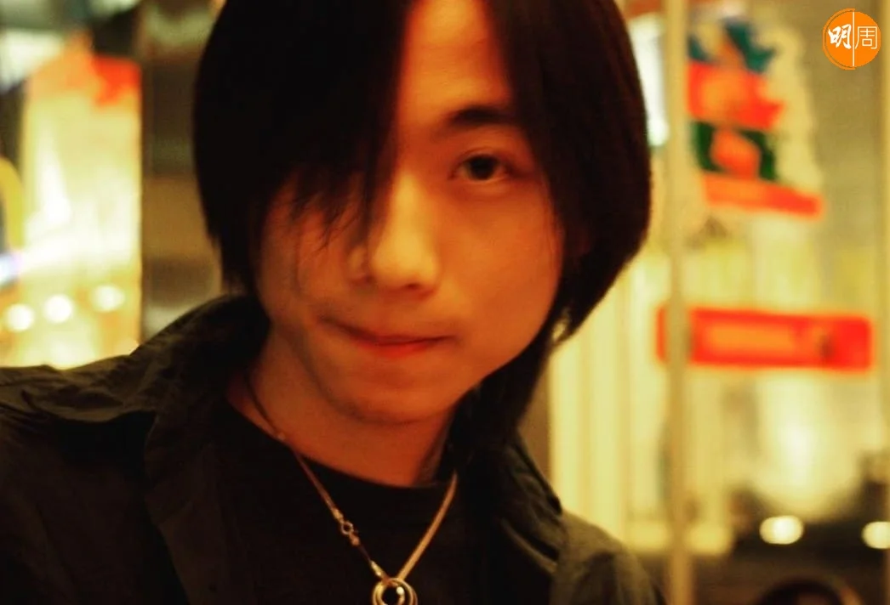

*顏米羔*

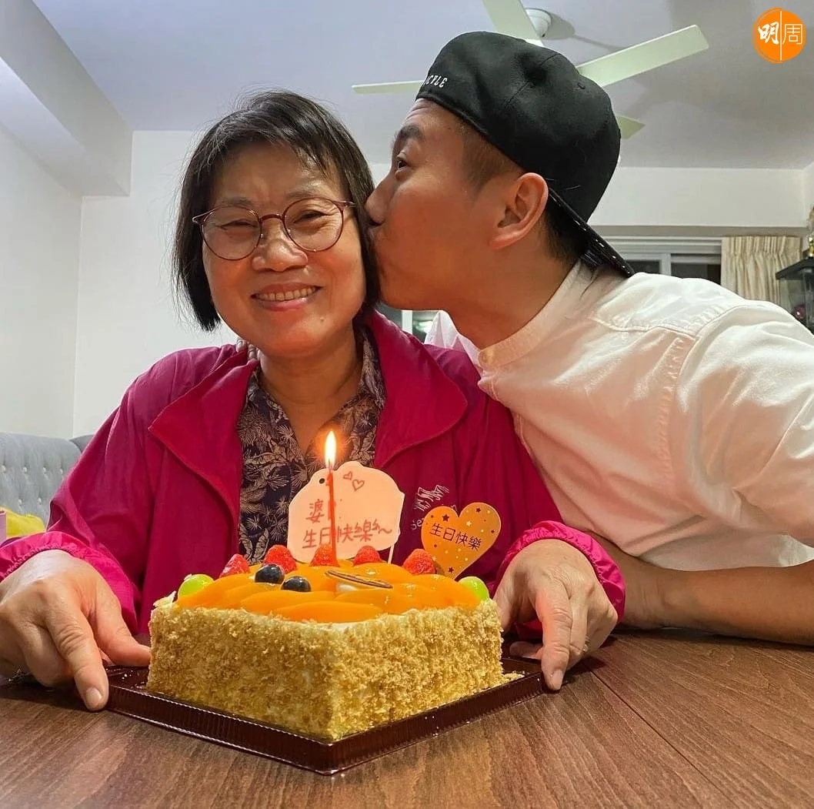

*顏米羔與媽媽*

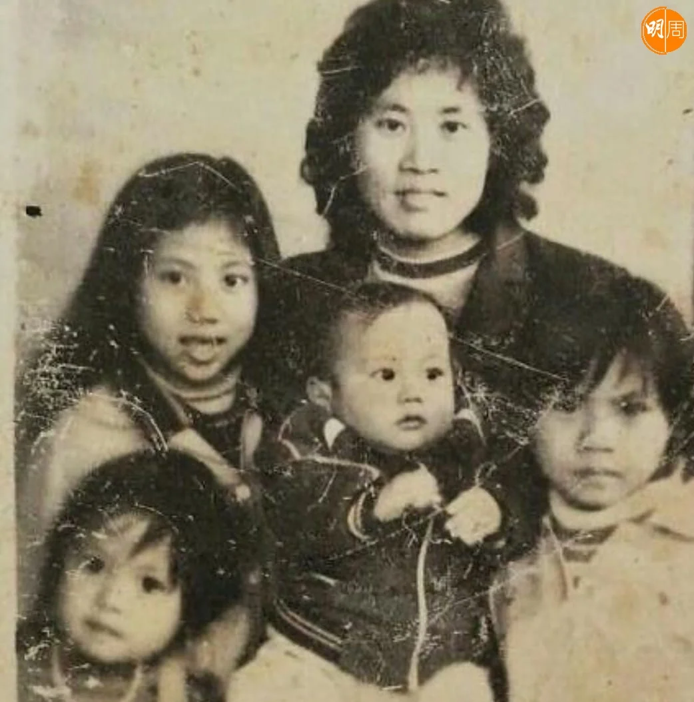

*顏米羔有三個家姐*

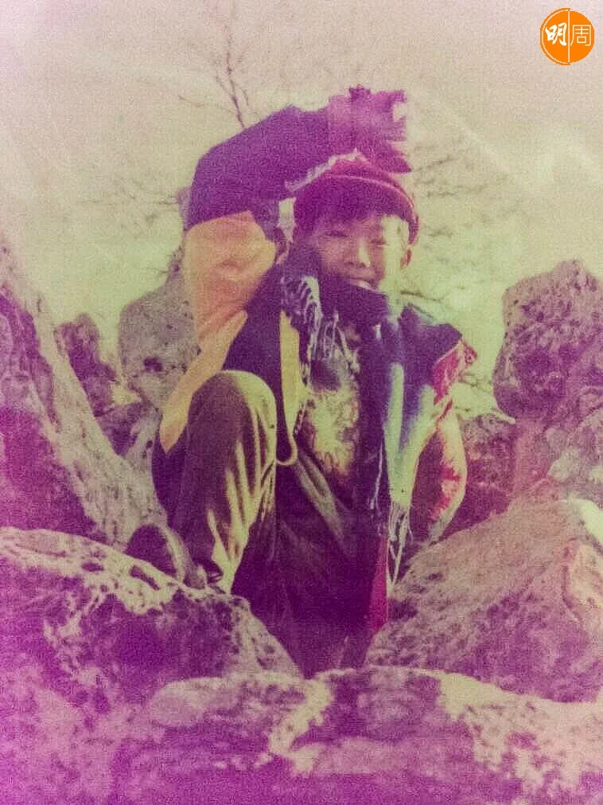

*顏米羔*

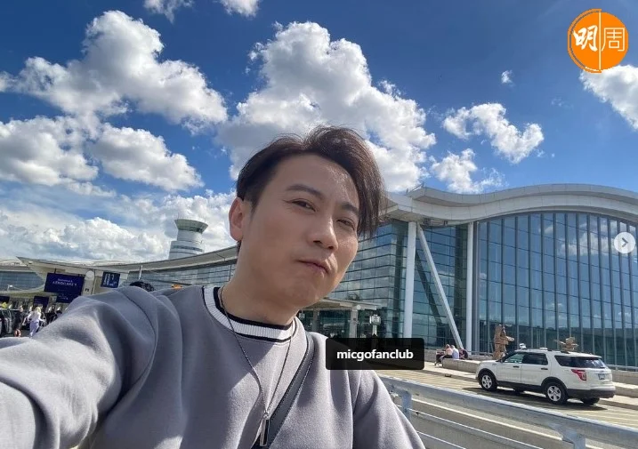

*顏米羔*

## 經歷並不值錢

他的參賽戰績包括「觀塘區歌唱大賽」冠軍、「沙田國慶盃歌唱大賽」冠軍，少年時參賽目標是得獎，爭取做歌星的機會，過了追夢的年紀現在人到中年，再參加歌唱比賽，他更多的是感動，他說：「每個人參加比賽的目標都不同，有些是為了爭名奪利，有些是自我挑戰突破自己，你問我為甚麼參加比賽？我有種奇怪的想法，就是比賽讓我很感動，感動自己仍然能夠唱歌，更感動仍然有人聽我唱歌，人生要找一個聽眾不容易，要找一批聽眾更是非常困難，因為每個人都有經歷，所以經歷並不值錢，可是到今時今日，仍然有人願意聽我唱歌，這件事本身已經令我很感動！」比賽中沒有贏得冠軍而是季軍，他說：「比賽有三甲之分，我心目中的贏是繼續有機會唱歌，繼續有人期待我的演出，我已經贏了！」

他的磁性歌聲被評為能夠感動人心，認為現在很少這種級別的聲音，但磁性歌聲曾經令他懷疑自己，他說：「現在流行飆高音，可以飆高音才是好聲音的標準，歌手們都視為一種難度挑戰，可是這種類型的歌不適合我，大家都認為磁性歌聲過時，N年前有貓王，不過年輕一代可能連貓王也沒有聽過，面對大趨勢我卻不想改變，覺得每一樣東西都有它的存在價值，所以一直堅持唱自己喜歡的歌，得到季軍收到觀眾的鼓勵和支持，得到季軍代表觀眾認同，自己的信心也開始漸漸上升。」他表示過去半年工作量增加了很多，雖然有些人形容是比賽效應的「蜜月期」，不過他仍會把握當下機會，對未來沒有奢望的心態前行。

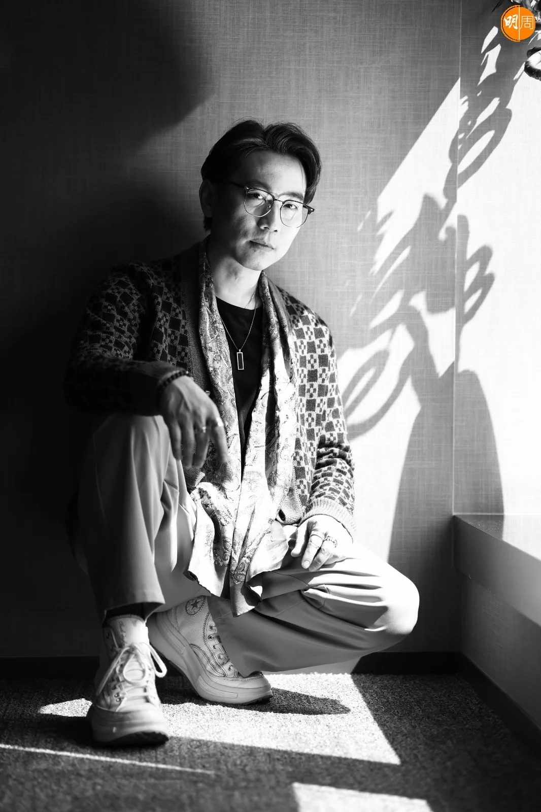

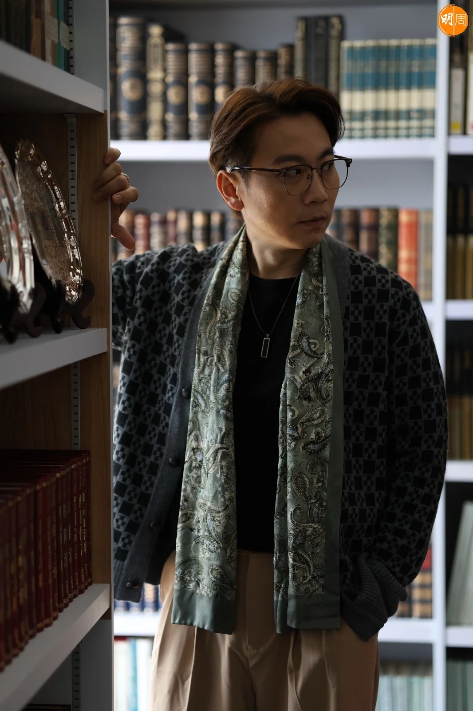

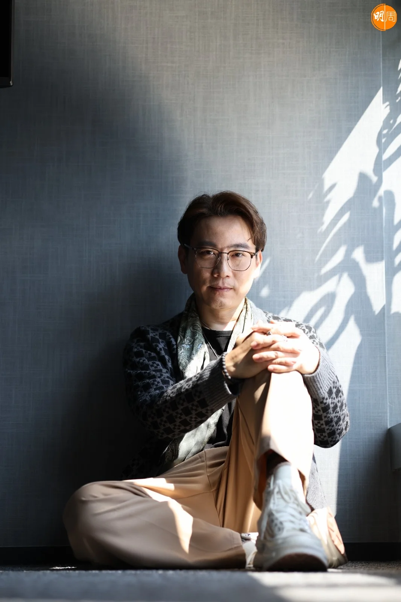

過去他在娛樂圈是電影導演，曾執導電影《私人會所》也拍過電視台節目，又擔任攝影師拍廣告和硬照宣傳，歌唱比賽令他有機會躋身幕前，他說：「我希望有機會參與幕前演出，因為從小已經表情多多喜歡玩變聲，二十多歲時很想演戲卻沒有機會，做導演經常教演員做戲，所以我的演戲細胞不錯，其實唱歌和演戲有很多共同點，我會努力爭取做演員，就算小角色也不要緊。」

## 只有一個觀眾也是觀眾

他曾經開玩笑說要儲錢開演唱會，結果錢沒有儲夠已經有開唱機會，與有份參賽的中年好友劉威煌、梁浩賢和甘永傑，本周六（16日）在麥花臣場館舉辦《ZoneD Funtast4ic》演唱會，相比演唱會，他認為更像一場音樂會，透過不同的歌了解他們的經歷和想法，他為歌迷選了一首親自填詞的歌名為《一首歌》，是十年前擔任「Gan Band」樂隊主音時寫的歌，當時正值青春年少進入成熟世故的「分界綫」，有感音樂帶來的影響寫下這首歌，他說：「我相信每個人都有一首陪伴長大的歌，失意或得意時可以安慰自己，看不開時叫自己醒一醒，鼓起勇氣繼續走下去，當時寫《一首歌》卻沒有機會公開演唱，這次終於可以公開演唱。」

他將十年前的作品，選在演唱會與歌迷分享，是想告訴大家經過十年，自己對音樂的初心並沒有改變，「我的性格比較悲觀負面，從小喜歡Beyond的《海闊天空》，心中有火卻沒有埋怨，三十五歳後開始明白，要感恩所擁有的一切，所以一直清楚自己在做甚麼，期望總有一天有人聽到我的歌，知道和理解我做的事，就算只有一個觀眾也是觀眾，現在所擁有的一切，哪怕只是賽後『蜜月期』，至少有人願意聽我唱歌，有人願意聽我說不值錢的人生經歷，所以我希望音樂會可以為大家唱《一首歌》。」
