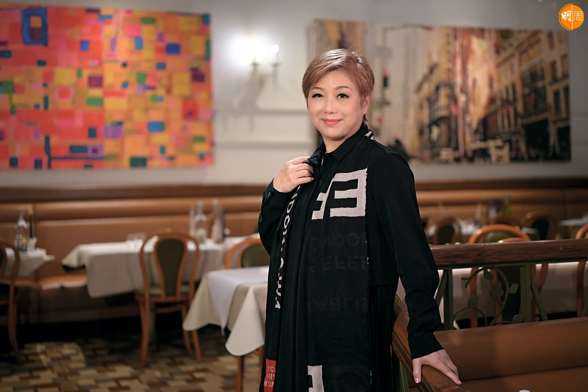
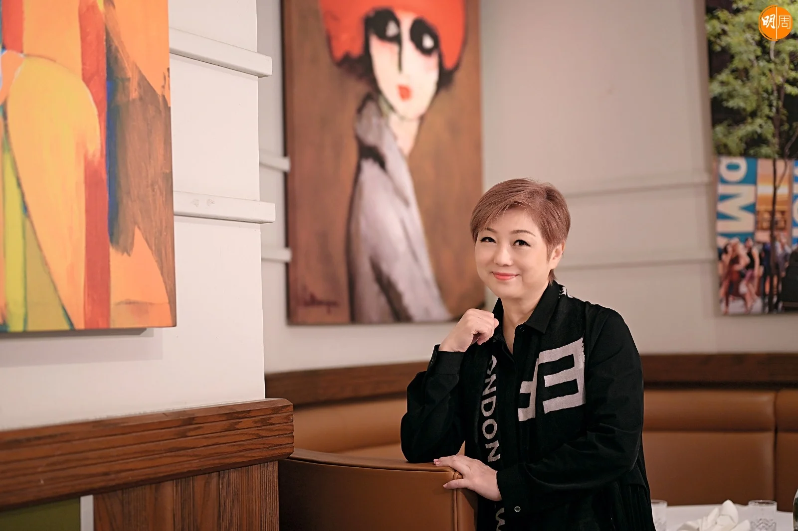
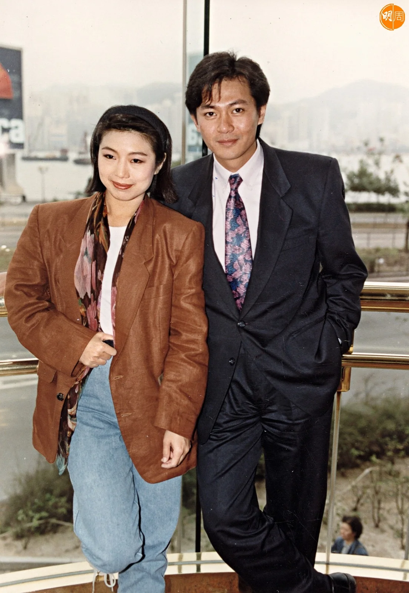
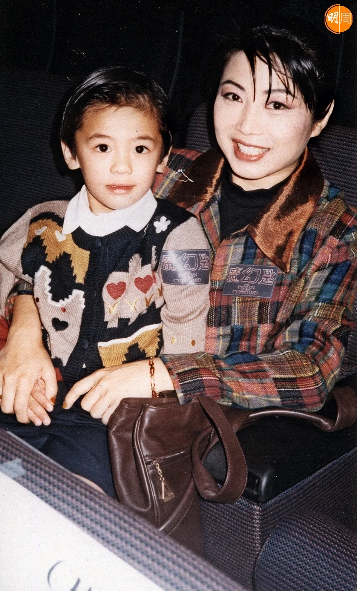
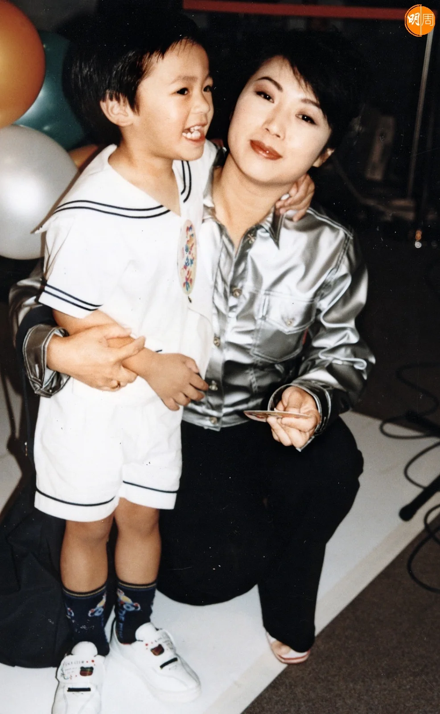
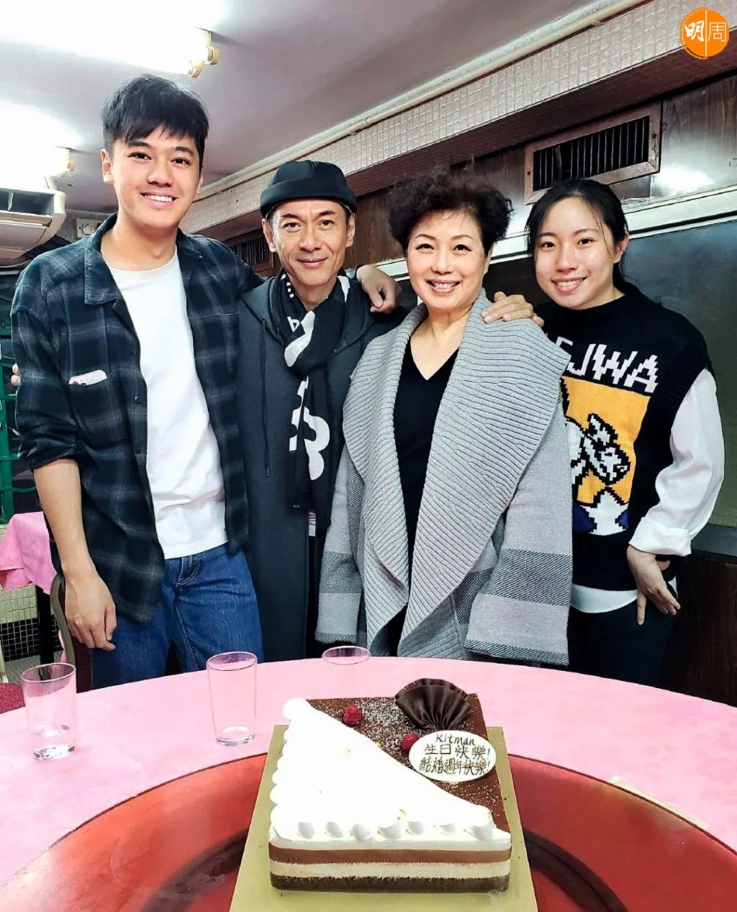
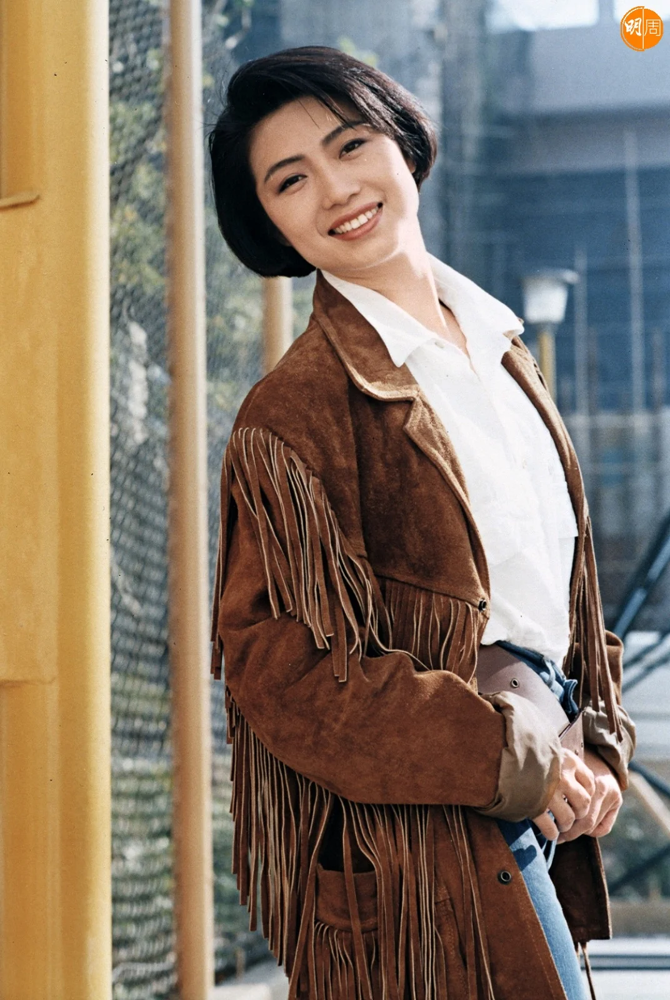
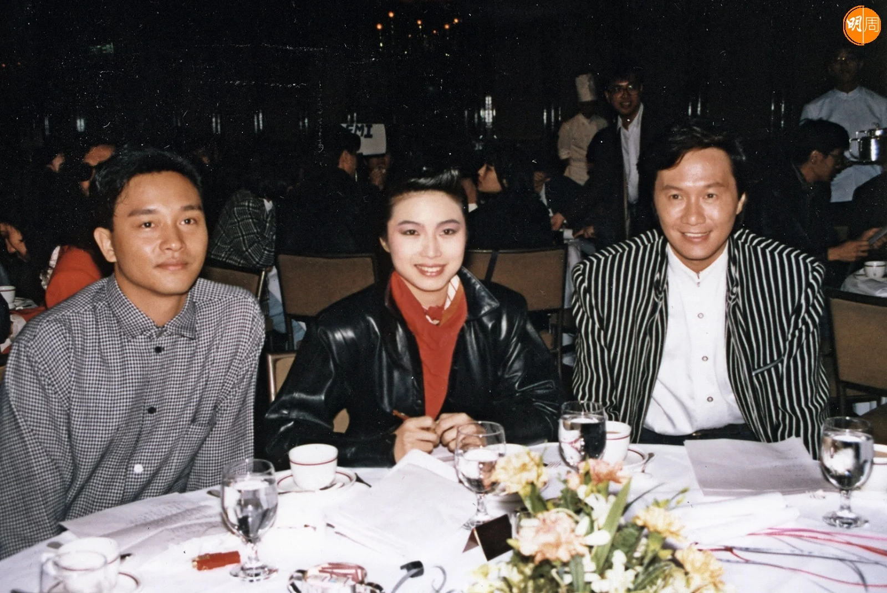
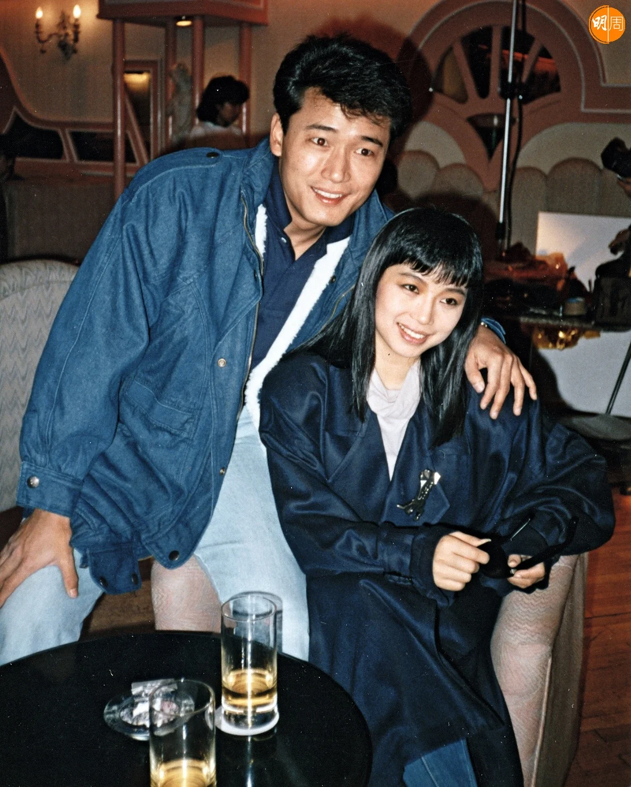
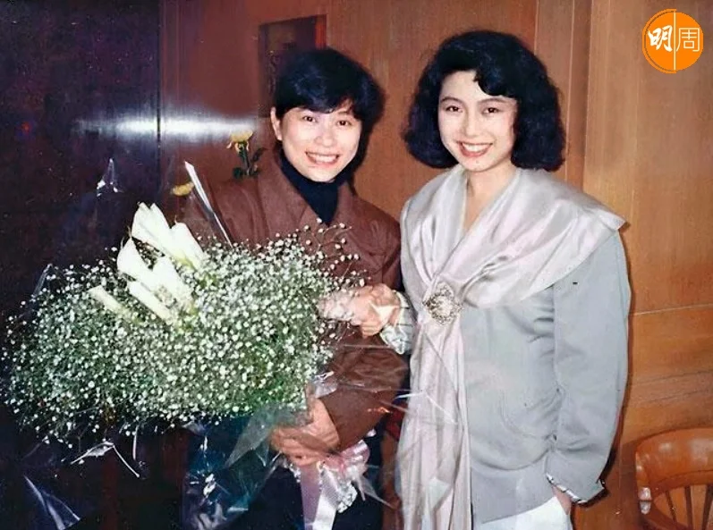

麥潔文和同學到旺角的唱歌學校學唱歌，報名參加TVB舉辦的《業餘歌唱大賽》贏了冠軍，老師介紹她去夜總會唱歌，認識了唱片公司老闆，推出第一張大碟，到電台做宣傳，又認識了播音界老前輩周聰，在商台做起DJ，並且獲介紹轉到娛樂唱片公司，憑顧嘉煇作曲的《萊茵河之戀》走紅，又唱了煇哥寫的《夜夜痴纏》，掀起不少都市傳說。

在老友小美鼓勵之下，她唱跳舞歌亦受歡迎，然後轉到新藝寶唱片公司，和張國榮合作起來，另一首為歌迷津津樂道的是，黃家駒創作的《歲月無聲》，她和Beyond四子都有一些搞笑往事。

接着她簽亞視，拍音樂特輯邂逅男主角江華，遇上她生命中最重要的男人，婚後帶來她的一對乖仔乖女Bryan和天天，做了媽咪的麥潔文亦有很多故事告訴大家。

## 黃家駒玩到爬上天橋頂

麥潔文的歌路頗闊，有一首底蘊屬於搖滾的《歲月無聲》，黃家駒作給她，劉卓輝填詞，第一句：「千杯酒已喝下去，都不醉。」一開始唱已有浩氣長存的感覺，最初用來參加《上海-巴黎世界歌唱比賽》，麥潔文灌錄了一個女聲版本，她說家駒錄了一盒demo，用「啦啦啦」唱了旋律。「你知家駒有很多裝飾音、轉音，當我唱時，都跟他這個風格，別人說我的是抒情版，其實不是純抒情版，結尾都唱得很澎湃。」之後Beyond自己重新再錄一個搖滾版本，兩個版本很多歌迷都喜歡。

當時Kitman和Beyond同屬新藝寶唱片公司，原來有一齊玩。「有時做完工作就去宵夜，食完飯嘻嘻哈哈，我們一玩起來好癲，在尖東海旁，玩玩吓家駒甩了一隻鞋，其他人將隻鞋掟了上天橋頂，他爬上天橋頂執鞋，那時好夜，可能凌晨兩點，周圍沒有人。」

五月文化中心的《麥潔文心動回眸演唱會》，她會唱《歲月無聲》懷念家駒。

每位歌手開演唱會都想唱別人的歌，她也不例外，環星老闆張國林跟她說：「你自己咁多歌，都未必唱得晒，就算唔hit的歌都好想你唱，因為你一張唱片十首歌，好多歌迷買回家，由頭逐首細意聽到尾。」

## 和江華夫婦檔合唱

在老闆鼓勵之下，今次她會唱一些冷門歌，好像《等君這一句》、《燭光》、《感情的鎖扣》、《江湖浪子》。她唱過很多小調歌曲，後來轉唱跳舞歌，她記得去深圳登台，自己幾首快歌如《勁舞Dancing Queen》，內地disco晚晚都播，由顧嘉煇、張國榮到黃家駒，整個作品集包括很闊的歌曲類型。

今次演唱會表演嘉賓不假外求，男的有丈夫江華，女的有女兒陳薔天。原來江華是她的唱歌學生之一，過去一年多，和她一起在抖音唱live。「本來他唱先，因為他開了抖音之後，發覺原來很多粉絲在找他，他已經沒有拍戲這麼多年，很多劇仍在網上流傳，他一開始做抖音，嘩，很多人追蹤他，一路增加一路增加，其實直播冇咩好做，聊天很單向，不如唱歌，他很喜歡唱張國榮、譚詠麟的歌，就變成唱歌直播，有時唱得累，我和他一起唱，我當作練歌。」

她說唱歌直播是維繫夫婦感情的好方法，不用當作開工，又可以多唱別人的歌，其實頗開心，他們兩公婆已經儲起很多合唱飲歌，包括《楚漢驕雄》片尾曲《痴心有幾濃》，是他們合唱的劇集歌，她一口氣數：「我們唱《鐵血丹心》、《難兄難弟》，還有《Miracle》、《分分鐘需要你》、《世間始終你好》、《現代愛情故事》、《相思風雨中》、《只有情永在》、《誰令你心痴》。」首首冧歌，這對夫婦頗有情趣。

## 老公提醒去拍拖

她和江華九二年結婚，一問她就說得出：「結婚三十二年。」現在夫婦關係更勝從前。「現在很好，仔女大了，我們兩個一起去玩，有時北上吃喝回來，好像拍拖一樣，有時我不記得要維繫感情，我老公提醒我：老婆同我出去走走，不要經常在家，我說好吧，就去拍拖。」

他們剛和兒子去上海旅行，因為做護士的兒子有一星期大假，原本打算去日本，但日本正值流感高峰期，改為去上海。「你知我們年事已高，感染流感就麻煩了。」Kitman形容自己「年事已高」，問她今年幾多歲，她笑笑口作答：「七十喇。」樣子真的不像，亦沒想過勁舞Dancing Queen已七十歲，感覺非常神奇。

「當我唱歌時，唯一一樣就是不要叫我跳舞，我可以分開跳，咩叫分開跳？上半身跳，或下半身跳，因為穿高跟鞋跳舞很高風險，有些事情要作出選擇。」

能夠分開跳已經很厲害了，人到了一定年紀，不再是向前衝的模式，一回顧以前的日子，即是她所說的「回眸」，感受良多。「看回以前，就會感覺到你的青春，你的歲月都在這裏，甚至在我日常生活裏，我自己都沒有老的感覺，但有時會提醒你，例如腰痛、腳痛，幸好不是很大件事。」

回顧和江華的婚姻，都發生過風波和危機，當時是怎樣克服，走過那些困境？「我覺得溝通很重要，溝通就是，你知道我鍾意你做咩，我也知道你唔鍾意我做咩，然後大家互相遷就包容，有時我們日常生活都有，例如我洗完澡、洗完頭，很多頭髮在浴缸裏，我不記得去清理，他見到就來幫我做，他不出聲，我看到會覺得這些就是包容。」

江華原名陳木華，大家都叫他陳生，而不是江生，在麥潔文口中，陳生一直是暖男，「成績表」一直拿高分，現在仍是一早起牀煮早餐給她吃。

## 生女血崩休克

她和江華婚後誕下一子一女，懷着女兒時，發生一件驚險事，差點沒命。

「當時醫生說自己收拾一個袋，隨時上車去醫院，聽起來很簡單，怎知真的發生時，我在廁所不停出血，很驚，那時我老公經常出去喝酒，但那晚他覺得冇乜好飲，回來後見到我，說煮麵給我吃，我說好啊你去煮，那時我們住村屋，有幾層樓，我在二樓，他在樓下煮麵，煮煮吓不行了，我衝去廁所，流了很多血，我的大仔和工人在三樓睡覺，關上門，我沒想到流血過多休克，眼前一黑幾乎跌倒，這時我老公跑上來扶着我，他又不能背起我，因為我肚子很大，一級一級慢慢地扶我落樓上車，立刻去醫院，回想起來很危險，如果我老公沒有回來，我突然出血，失血過多暈倒在洗手間，已經沒命了，幸好我們的上帝照顧我，女兒又早產，最初是難照顧，因為她很輕，但她一歲便已經追回來，我們去健康院，一歲跟別的一歲小朋友一樣健康強壯。」

## 栽培女兒的心得

女兒陳薔天遺傳了她的靚聲，遺傳了她的唱歌天分，她記得：「女兒四歲時，能夠整首《還珠格格》唱出來，國語吐字都很標準，那時她連國語都未學過，拍子音準難不倒她，我拍下了短片，不知能否找回，唱得很有自信、很有節奏感。」

由小朋友到長大成人，現在女兒入行做歌手了，Kitman栽培子女自成一套心得：「每個人有自己的想法，她都有，我不會太干預她，特別是唱歌，你知不同年代，我們這樣唱歌，很多年輕人抗拒，不喜歡聽像我們真聲唱歌，不喜歡聽我們那麼出力去唱，覺得你們很old school，他們都不想跟我們唱，但是奈何，其實都要講功底，就是基本功，我會幫她練習基本功，style她自己去找。」

## 一張感謝卡定情

Kitman五月演唱會，女兒做表演嘉賓，兩母女會合唱林志美《初戀》。「兩代的初戀會是怎樣呢？我的初戀是中學同學，跟着就是我老公。」當時她和江華定情，是因為一張thank you card。「那時我剛過檔亞視，拍一個音樂特輯《畢生難忘麥潔文》，要找男主角，當時好像找了任達華，後來不知為何轉了江華，他剛在電影金像獎拿了最佳新人獎，ATV簽了他，做我這個特輯的男主角，就是這樣邂逅，拍完這個特輯之後，我寫一張thank you card給他，其實每個合作的人都有thank you card，他看了之後覺得很感動，就開始了，他說我追他，沒所謂，不是食死貓，都有好感的。」

因何原因有好感？高大靚仔？「高大靚仔應該也是，但問題是這個圈很多人都高大靚仔，我都遇過不少，我覺得是緣份，眼緣、氣味，和他開始拍拖，就覺得他好像我的家人，有這個感覺。」

Kitman比江華大八年，外界標籤為姊弟戀，她說：「很奇怪，我年輕時鄰居樓上有人追我，又是細過我，很多追我都比我小。」

很多粉絲關心江華會否再拍戲或拍劇，麥潔文幫他說清楚：「基本上他不會再拍了，退休了，他不是不喜歡拍，而是沒有適合的戲劇給他拍，沒有戲劇令他想拍。」江華今年六十二歲，其實仍有很多角色適合他演，只看他意願而已。

現在他轉向唱歌，會在演唱會跟Kitman合唱《Miracle》和《分分鐘需要你》。

## 兒子是抗疫前線護士

至於兒子Bryan陳耀淙，現時在醫院做護士，希望他在媽咪演唱會當日能夠放假，坐在台下看父母和妹妹表演。「我跟他說，我不知會不會再開演唱會，體力上不知能否再應付到，每個人的聲音都會倒退，不知何時唱不出。」

兒子在疫情期間，自願被編入所謂dirty team，幫忙照顧新冠病患者，香港人要多謝他的付出，做媽媽的麥潔文培育出這個兒子。「不是我教的，他自小都是一個很有愛心的人，他小時候住在學校對面，我經常看着他上學，有一次他們去學校露營，大家都背了很大的背囊，那時他讀中一，長得很高，同班同學有些矮他一半，他見到同學矮小，背着背囊很辛苦，會幫他們拿着省力，他很喜歡幫人。細個去溜冰場，一邊溜一邊執起跌倒的小朋友，他很喜歡做這些。有一次，我和老公去了大陸拍劇，好像是拍攝《楚漢驕雄》，剩下一對仔女和工人在家中，我爸爸趕過來探望他們，探完之後，他送公公去對面搭車，他知道公公年紀大，帶張凳和我爸爸去對面等車，沒有人教他，他自己懂得這些，我沒有教他那麼細心，他就是那麼喜歡照顧人，所以他現在做護士，很開心。」

兒子疫情時加入dirty team時，Kitman沒擔心過。「他已中過新冠很多次，有三、四次，沒有辦法，那段時間中了就住酒店，不回家住，我覺得每一個行業，有需要你做的事，不應該聽到辛苦，我不肯做，走了去是不行的。他有一次跟我說，打算以後去做戰地護士、無國界護士，我說好啊，我都覺得很好。」

## 懷念與小美的閨密歲月

說到兒子，原來他的名字陳耀淙是填詞人小美和Kitman一起改的。

Kitman和小美識於微時，她在商台做DJ時，就跟仍在讀大專、在商台實習的小美認識了。「我在一台，她在二台，因為我出唱片，都叫做DJ歌手，她走來跟我說，想寫一些東西，她又會幫二台寫歌詞，然後我唱，那時我出第一首快歌《愛跳舞的少女》，我跟公司說，不如找小美填詞，於是她幫我填了她第一首歌詞，可以說是她踏入填詞界的第一首。」

所以她們當時做了好朋友，有時會一起去小美家中傾心事。「談談閨密話，有時講講娛樂圈是非，有時小美媽媽會煮飯給我們吃。」

後來小美做了郭富城經理人，麥潔文做了歌唱老師，小美請Kitman到錄音室指導郭富城錄歌。

她記得城城錄《鐵幕誘惑》時，她有份在錄音室幫手。「他最初唱的時候，用一些比較拖的唱法，我告訴他，唱這類節奏強勁的歌，就要一下一下，如果拖的話就不對，他很聽人教，很聰明。有一次他有個震音，我說震音不是這樣，他說這是他的signature，我就說，這些signature告訴別人，你不懂唱歌，他聽到我這樣說，立刻唱另一個樣子給我，是一個很好的學生。」

現在麥潔文已比較少教唱歌了，小美也有自己的事情忙，假如有機會，Kitman希望約小美敘舊聊天，像以前傾傾心事，講講是非都好，生活不能無音樂，生活不能無家人、無朋友，Kitman珍惜現在身邊的人，懷念以前遇過的朋友，發生過的故事都點滴珍貴。

-   場地：Amaroni’s New York Italian Restaurant & Café（又一城）
