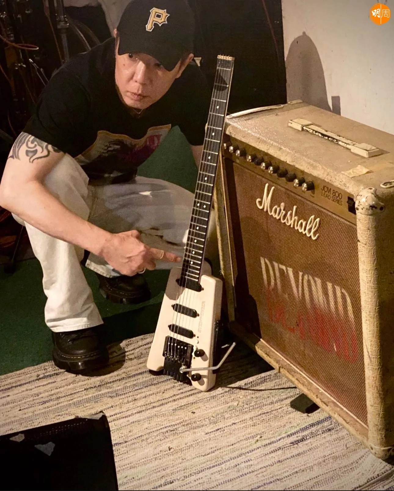
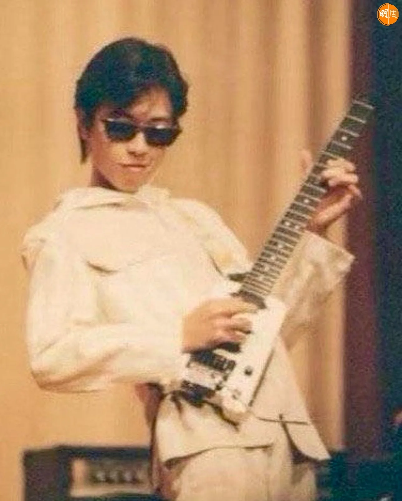
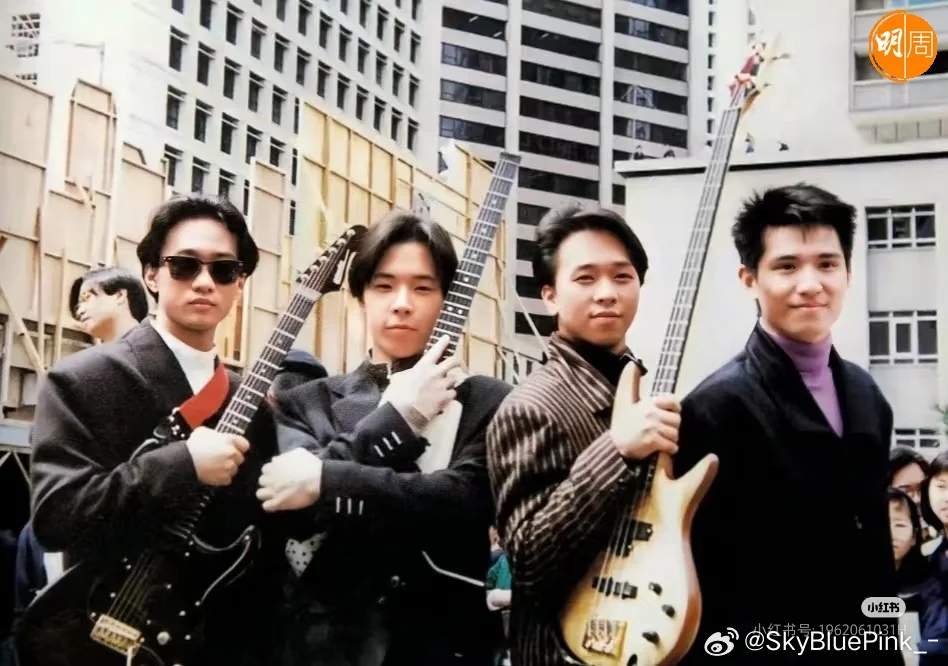
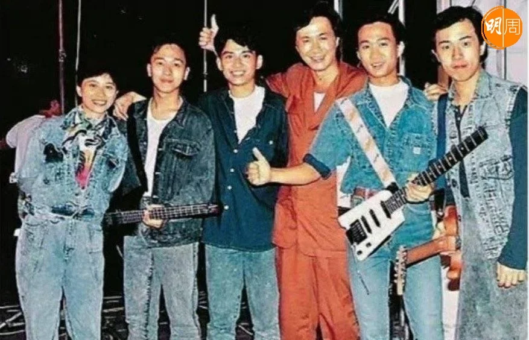
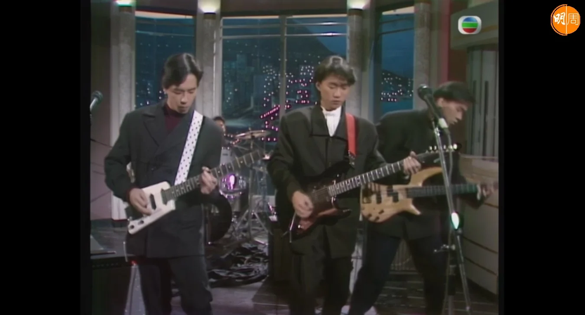
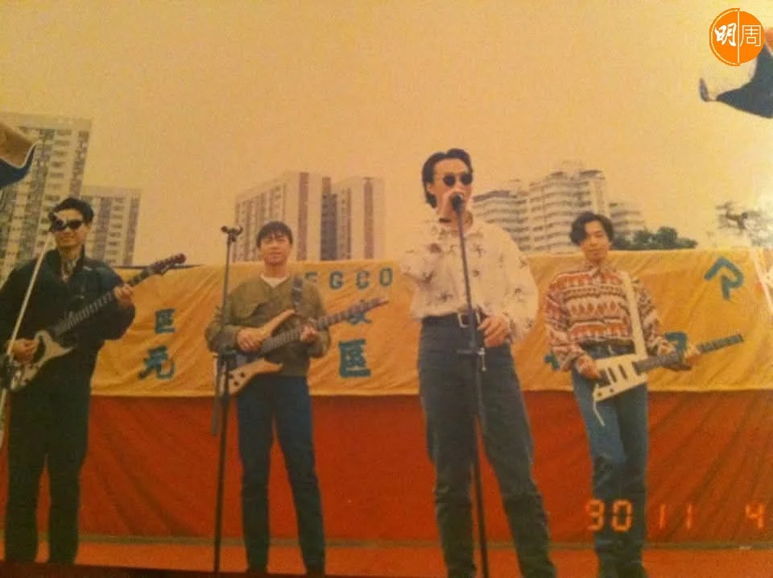
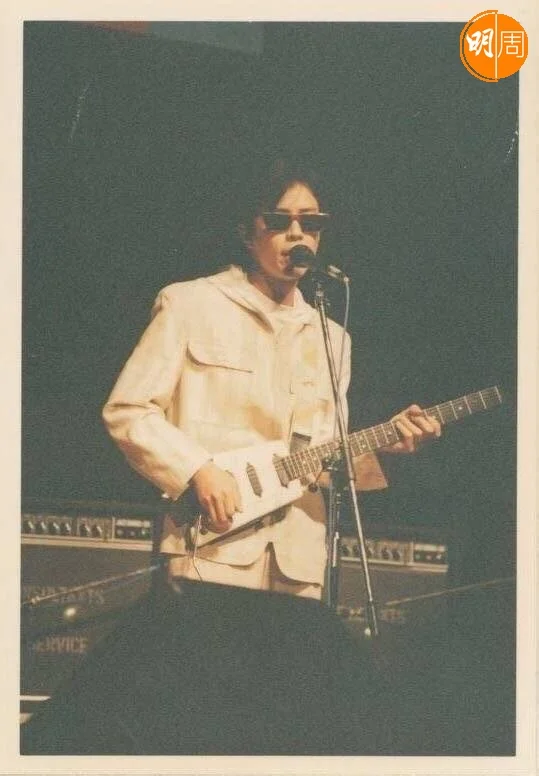
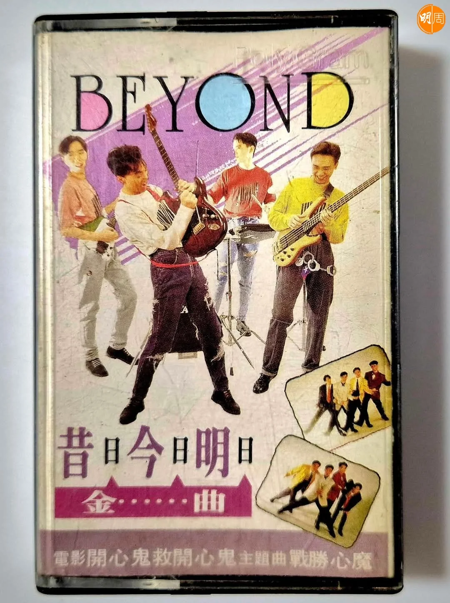
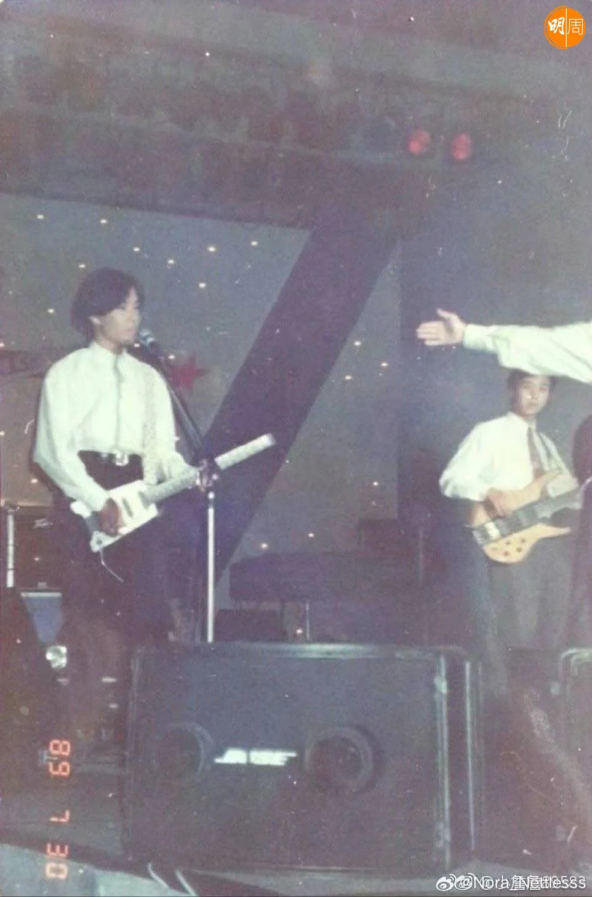
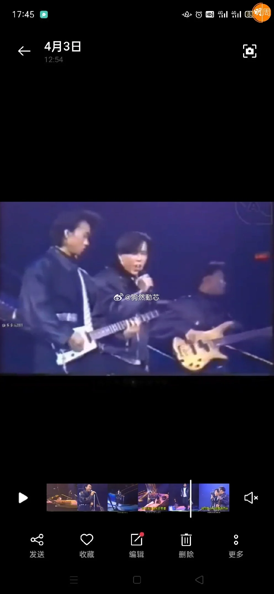

import YouTube from '@/components/patterns/YouTube.astro';

*黃貫中承諾從今以後再不會離開她！*

*黃貫中30年舊結他失而復得 網民搜舊照感慨：那年家駒還在｜鄧兆尊登台曾遇瘋狂女粉 激動曬「大光燈」嚇到O嘴（22/04/2025）*

<YouTube id="J9mZspuDHQY" />

黃貫中（Paul）近日失而復得一把失蹤了30多年的白色Steinberger結他，他在社交網曬照並留言：「這把結他和我分開了30幾年的時間，自從當年妳和我的朋友一起失蹤之後一直音訊全無，感謝Ken把妳從地獄帶回人間，找到妳的時候妳是支離破碎，體無完膚，他用了一年多的時間，從世界各地搜羅你身上失去的部分，把妳重身（新）組裝，很有心的他今日把妳送回我的身邊。（感謝Mike）

「分開當日我們還是青蔥歲月，今日再見我們都老去了，很想問妳去了哪裏？夜店？娛樂場所？他們對妳做過了什麼？換過了什麼主人？定抑或沒有主人？不知從何問起。妳的聲音依然是全世界最甜美的，我的聲音已變沙啞了，突然我感覺我是全世界最幸福的人。」

最後Paul承諾：「從今以後我再不會要妳離開我的身邊，讓我們一起終老吧！他的名字叫小白，又名『飯盒』，全世界只她一把」！

Paul早在2011年回答網民，提起1988年他們在勁歌憑《大地》得獎時彈的白色電結他時，他當時已心痛回覆：「在一個舊Beyond隊員鄧偉謙William手裏，可以還給我嗎？強烈要求！我很懷念她！你要好好對她…淚！」、「她不是普通的琴！（不是因為值六位數字的天價，是因為她在早期的歌如《大地》、《喜歡你》、《衝開一切》等等有出色的表現）白色的存世沒幾把，一把在DAVID GILMOUR（PINK FLOYD）手中。我感覺她正在人海某一角落在呼喚我！不管她在那，讓我看看妳平安好嗎？跪地而求！」

網民均戥Paul高興小白琴終於回來，並紛紛搜出當年他拿着小白表演的舊照片，當中黃家駒也很愛小白，也有拿着她彈奏，網民不無感慨說：「那一年家駒還在，飯盒還新，Beyond徹底紅了」！

有網民則指：「除了小白之外，黃貫中還有兩支美國製造的Steinberber Guitar，一支是紅色GM4t，另外一支黑色Double neck。」
