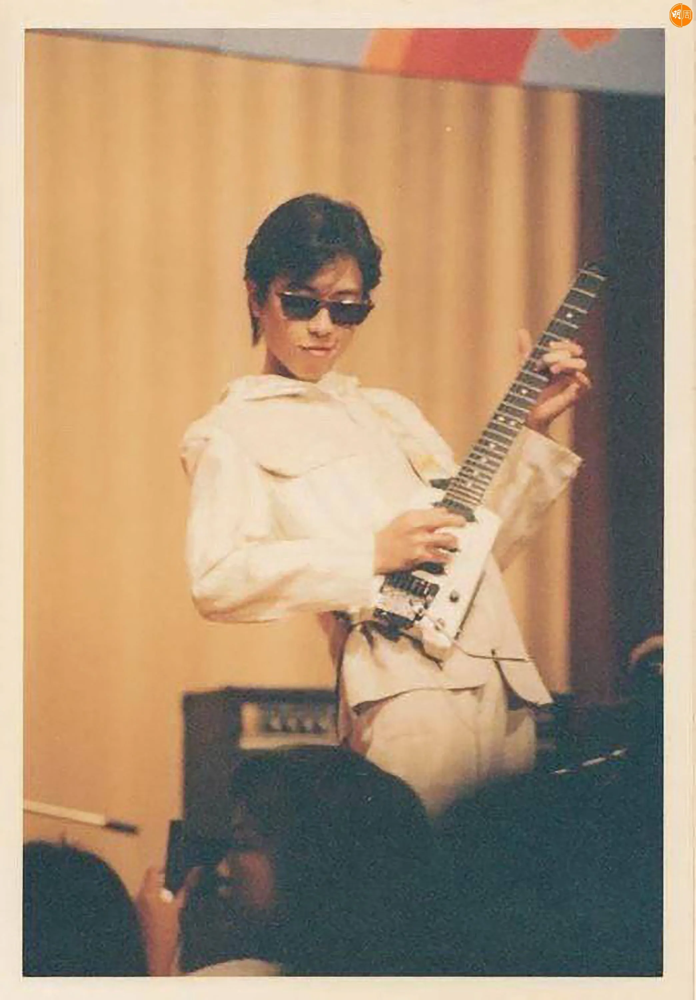
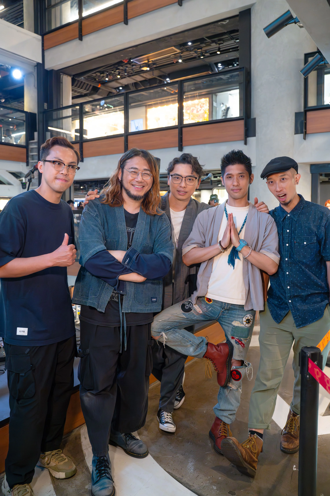
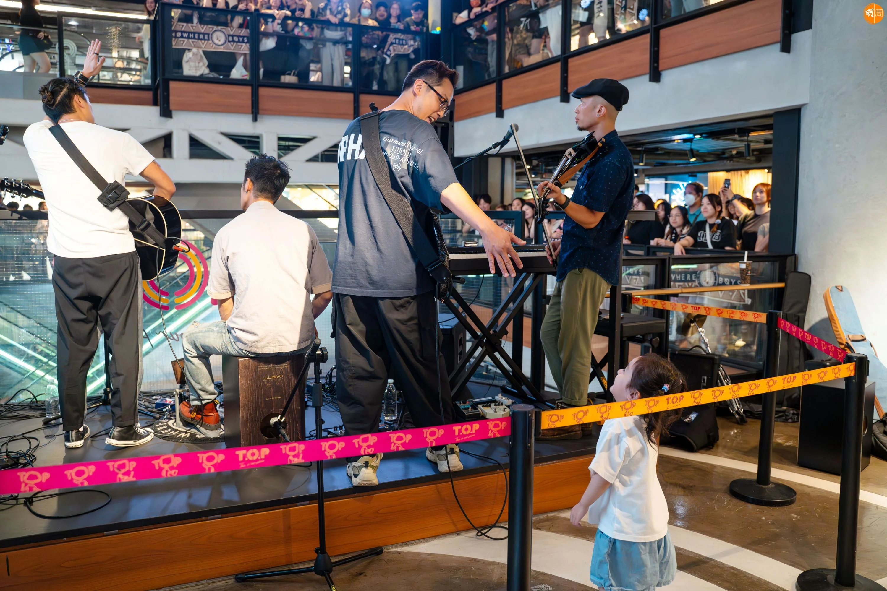

*Nowhere Boys為新歌《給失敗者的一封信》到旺角宣傳。*

樂隊Nowhere Boys於復活節假期最後一日（21日），為新歌《給失敗者的一封信》到旺角舉行Mini Live，合共準備了9首歌與在場樂迷分享，場內氣氛高漲。

提到近日Beyond成員黃貫中在社交網站發文，感謝Nowhere Boys結他手阿Ken，幫他尋回並維修已失去超過30年的結他，阿Ken解釋在他發現、維修、物歸原主這個長達一年半的過程，彷彿一切都是冥冥之中。

「支結他係我一個同我夾開band嘅村民俾我，但送到我手嘅時候已經好多零件壞晒，連螺絲都甩埋，即使我學過整結他，但呢支估計喺1987年出產嘅Steinberger結他，裏面嘅零件我當年冇學過，最後好好彩搵到間廠肯同我重新生產，但啲零件寄到嚟，我都唔識整，要再花好長時間上網搵呢支結他嘅設計圖，再搵師傅整咗4個月。」

雖然重新更換了零件，但結他的音色還未達標，阿Ken坦言心裏很著急，他希望Nowhere Boys可以與Paul的結他做一個紀錄，即使音色未盡完美，阿Ken最後還是將這支結他，帶到五子去年10月在西九舉行《US》演唱會的尾場，阿Ken攞起Paul的結他上台彈奏《推石頭的人》以及《逃出阿卡拉》，身為Beyond歌迷的他，更唱出Beyond作品《海闊天空》。

「我當日學結他都因為Beyond，好清楚一支結他對結他手有幾咁重要，所以我花咗好長時間再幫支結他調音，希望可以喺Paul 3月31日生日之前，將支結他交番俾佢，因為好多Beyond嘅經典作品，都係用呢支結他彈出嚟，所以能夠完成呢件事，我覺得好感動。」阿Ken說。

