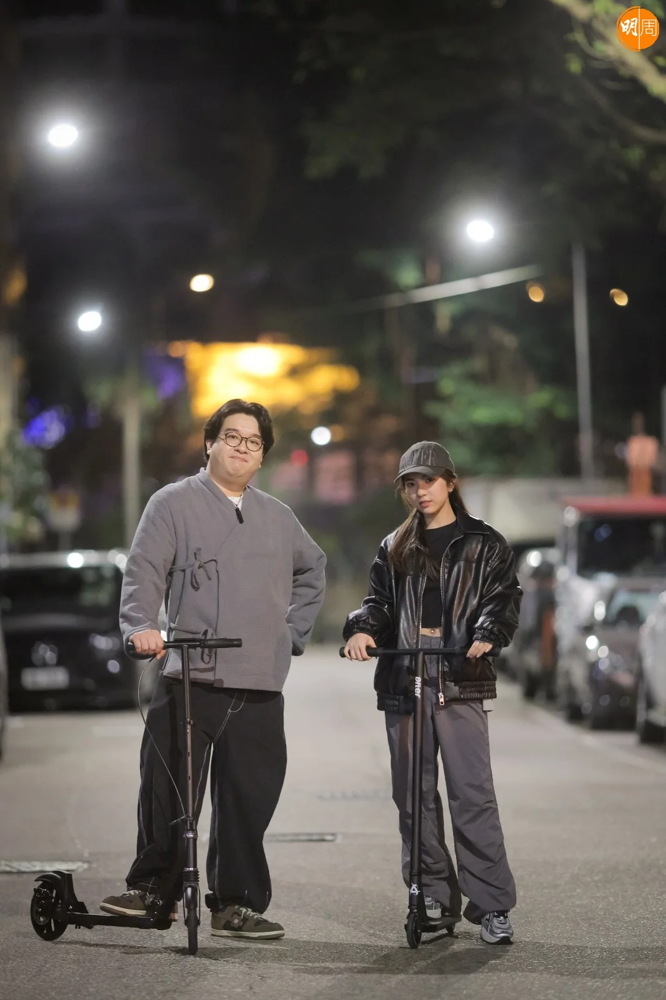
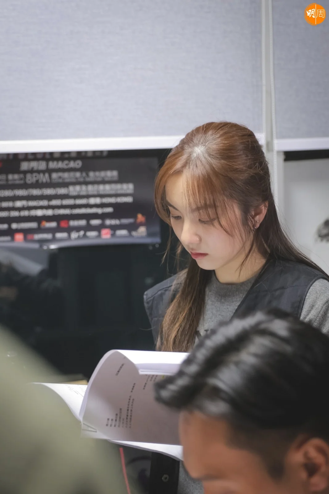

新進歌手榛綦（Natalie）本年繼推出《第一萬零一次重遇》後，最近又有新搞作，就是翻唱偶像黃貫中經典歌《年少無知》，為配合歌曲宣傳，榛綦搞搞新意思，推出一連6集的小劇場，並以「社畜」作主題，宣揚重拾自我，而劇集除了由徐浩昌（肥腸）編劇外，肥腸與榛綦及演員張毓軒亦一同演出。

榛綦透露今次的《年少無知》屬較柔弱的remix版本，「好多人認知由Paul前輩唱嘅《年少無知》，都係一首比較男子氣概嘅歌，但今次我呢個版本比較柔弱。」榛綦指歌曲灌錄後，公司同事已迅速送給原唱人黃貫中所聽，榛綦興奮地說：「Paul前輩個feed back都好似幾良好，好感恩！如果有機會，我好想同Paul前輩合作jam歌。」

為宣傳新版《年少無知》，榛綦一反傳統MV，特別推出小劇場，而故事主題圍繞「社畜」，講述榛綦飾演一名超聽話的員工，永遠聽從上司指令、無條件OT，之後遇到一件事而覺悟，重拾自我。

對於今次角色挑戰？榛綦表示過往曾拍攝微電影，反而今次最大困難是拍攝場地有限，而唱歌跟演戲，榛綦覺得邊方面較難？她認為：「唱歌冇take two，但演戲可以NG，所以唱歌難啲！其實我細個夢想做演員，因為做演藝可以嘗試唔同職業，經過上次拍微電影後，發現對演戲都有興趣，但要先訓練演技。」

提到「社畜」，榛綦笑言自認鍾情「社畜」生活，她喜愛朝九晚五的工作，深感具有做社畜的潛力，「我會係好聽指令，可能我由細到大都喺咁嘅環境成長，屋企人培養我學好多嘢，成日好早起身返學，之後又上好多興趣班，所以成為習慣！」

此外，作為微電影編劇的肥腸，首次與榛綦合作，起初曾一度擔心對方難勝任角色，他說：「喺IG睇對方啲相，覺得呢個女仔好cool，初時擔心佢唔符合角色性格，但嚟到拍攝現場認識之後，發現佢原來幾cute、幾有正能量，所以一開機已放下擔心。」

當中一場戲講肥腸跑步追着正踩滑板車的榛綦與張毓軒，肥腸坦言不感吃力，全因近年狂操fit自己：「我fit咗好多！因為早年身體響警號，肥到成日瞓極唔夠，依家愛上做運動、打拳、打籃球同做gym，做好多運動個人都精神咗，我依家想練啲肌肉，因為身邊好多男神，好似Jeffrey、Ian嗰啲，佢哋個個手臂好堅，我都唔可以失禮。」
