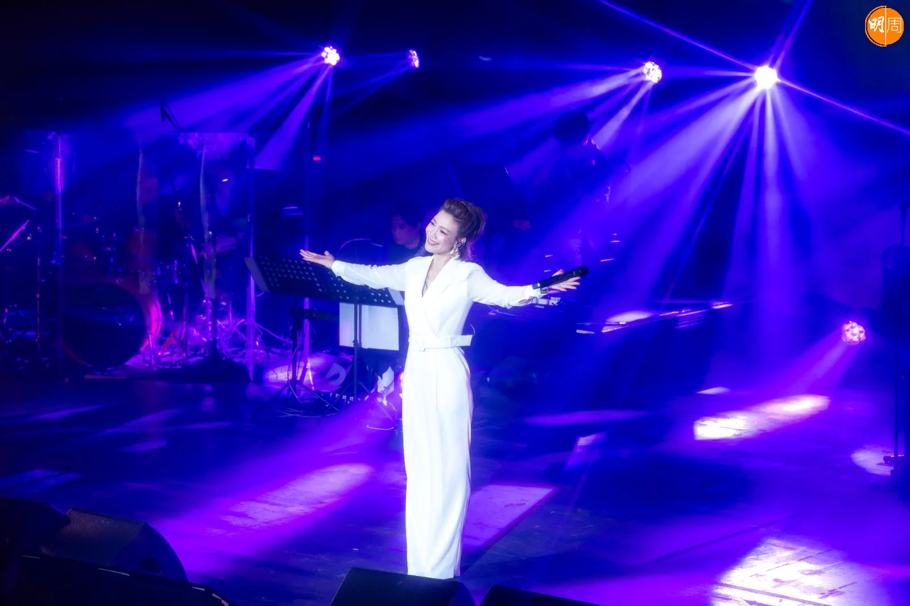
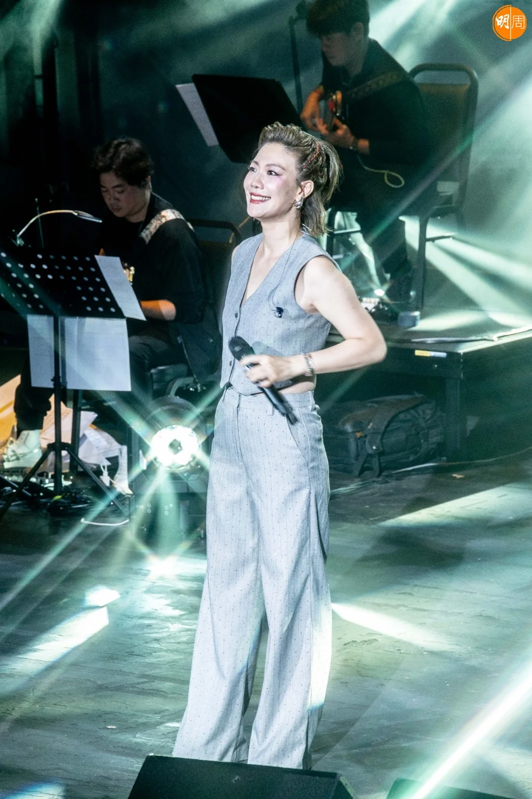
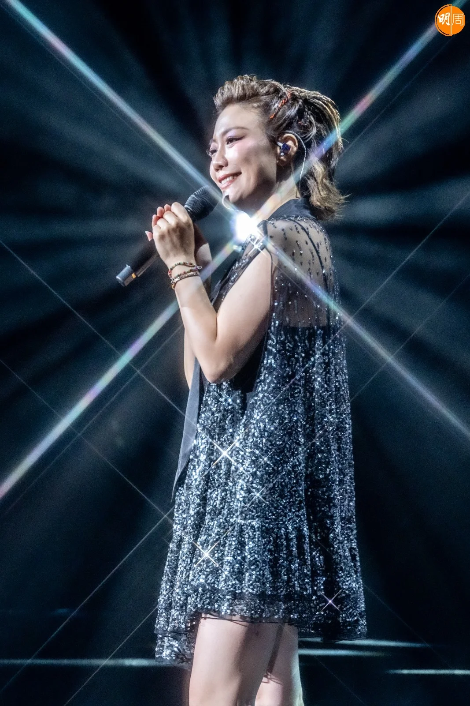
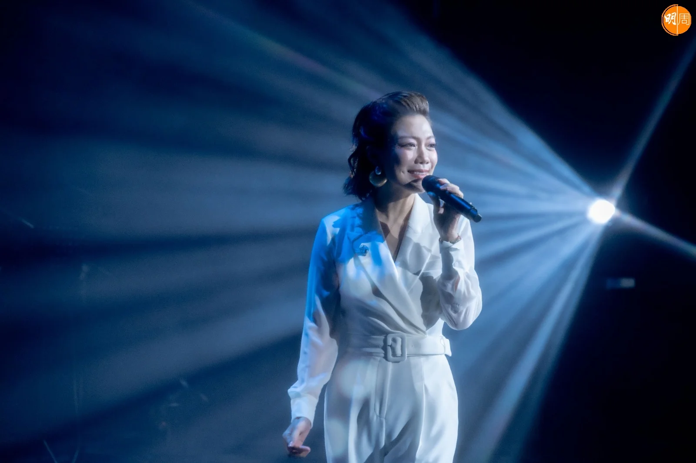
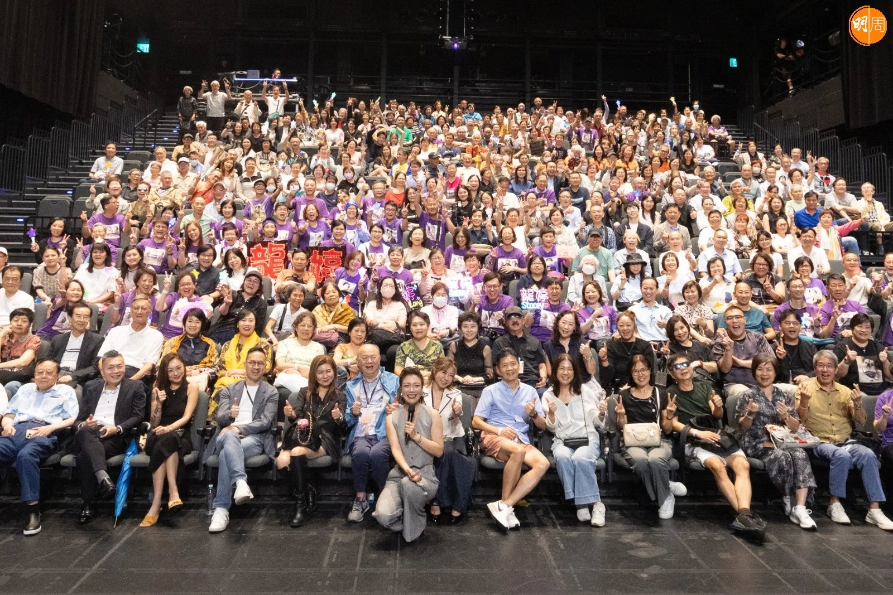

龍婷在西九文化區自由空間大盒舉行三場「旅程 Story 演唱會」，昨晚（18日）首場演出，龍婷以一曲《不了情》揭開序幕，然後演繹了《明日天涯》、《讓一切隨風》及《夢中人》等經典。龍婷說：「今晚這麼大雨，可以來的朋友都是懷着真感情，多謝大家今晚來到西九大盒，今次這個演唱會分為過去、現在和將來三部分，剛才我問音樂總監梁榮志為何揀選了開首那四首歌曲，他解釋因為《不了情》是60年代歌、《明日天涯》是70年代、《讓一切隨風》是80年代，而《夢中人》則是90年代，希望大家喜歡。接着我會唱我喜歡的鄧麗君小姐的Medley，我會邊唱邊到觀眾席和大家握手。」在《甜蜜蜜》、《我要對你說》、《月亮代表我的心》、《在水一方》、《原鄉情濃》及《原鄉人》的歌聲下，龍婷與觀眾一一握手，握完手後，龍婷感性表示場館空調很凍，但大家的手給了她好多溫暖，所以她會唱很多好歌給大家聽。

除了鄧麗君的歌，龍婷亦唱盡許多天王巨星的經典，包括張學友的《李香蘭》、梅艷芳的《蔓珠莎華》、周杰倫的《龍捲風》、Beyond的《海闊天空》和甄妮的《海上花》等等。龍婷感謝公司在事業路上對她的支持，最後以一曲《好歌獻給你》為首晚演出畫上句號。

更多圖輯：

