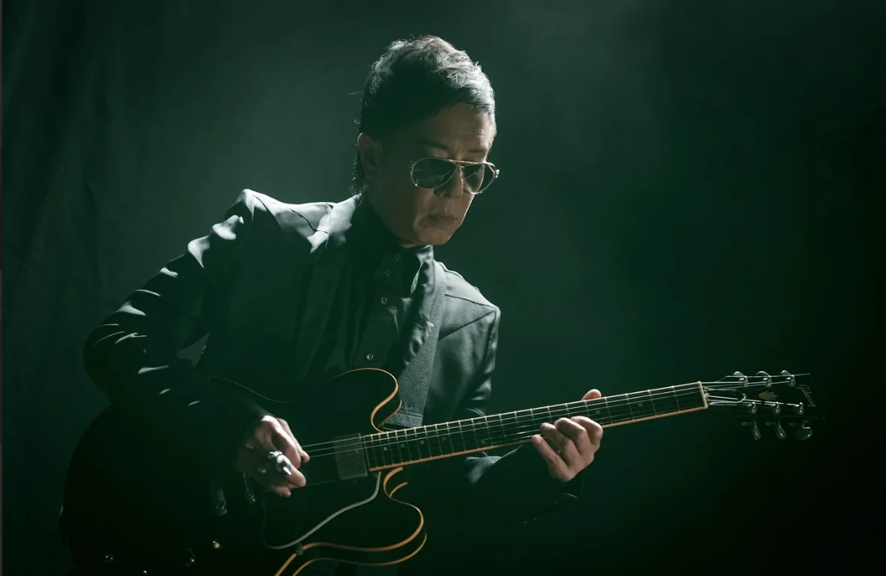
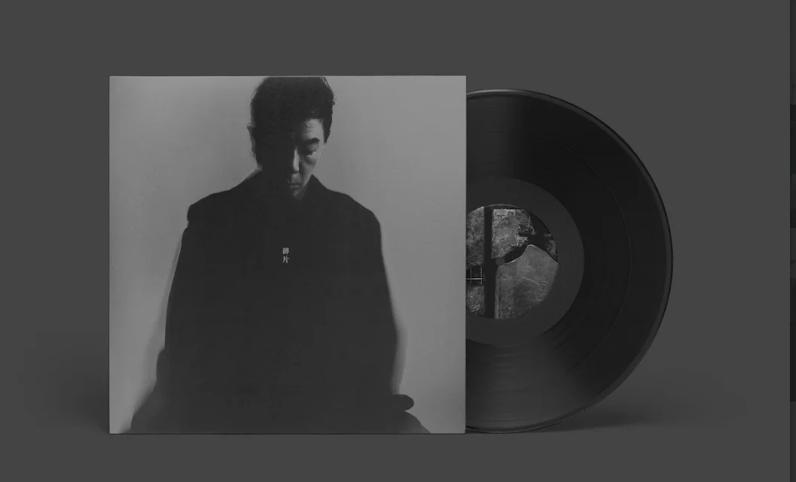
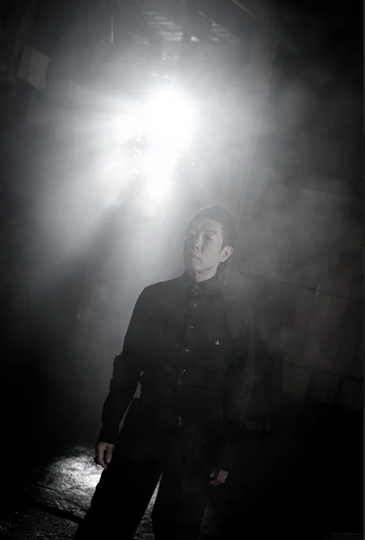
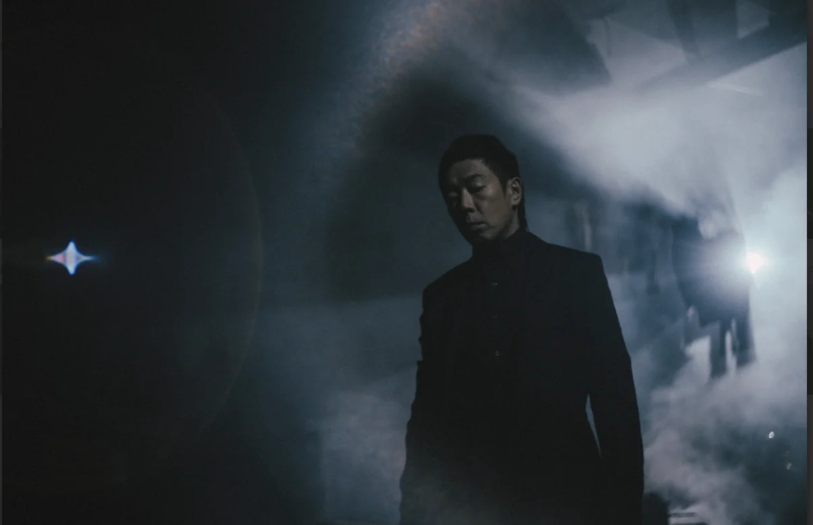
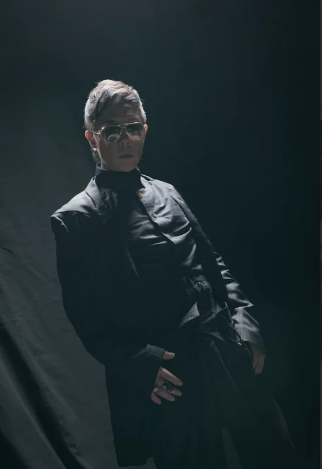
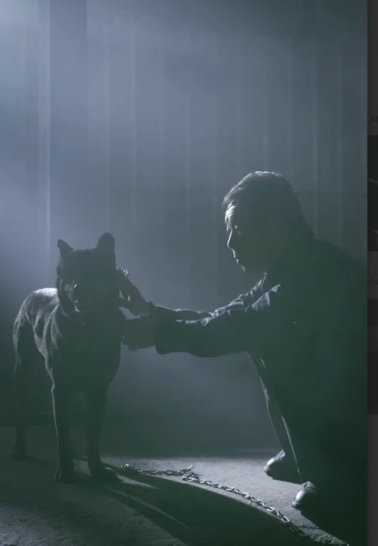

黃貫中（Paul）花了12年心血打造的大碟《碎片》，收錄了8首歌，包括：《彗星》、《廣東道》、《碎片》等，今次Paul更會推出黑膠唱片，Paul表示：「呢個可以話係我對音樂一個承諾，因為初入行出唱片時係推出黑膠碟，而家我出黑膠碟，係反映我嘅初心。」

他說今次大碟嘅歌，全部都是自己最鍾意，「原本預先做咗四、五十首歌，一有少少我唔鍾意，我就唔要，慢慢揀吓揀淨呢幾首，一個過程嚟，呢個過程12年。」Paul又坦言相隔多年再次出碟並不緊張：「平常心，其實今次係對自己一個交代，容許我自私啲，冇乜特別期望，只係為音樂而做，自己入行40年，唔知自己幾時再有能力做出一隻碟，可能呢一隻就係最後一隻，好難講，畢竟我都61歲。」

對於每一首歌Paul都一絲不苟，早前為大碟歌曲《彗星》拍攝MV，Paul於酷熱天氣下到戶外車房拍攝，一身黑色西裝的除了要彈結他，還要跟狗狗互動，拍攝過程十分順利，他指：「對上一次拍MV都唔記得幾時，起碼係10年前；今次拍攝過程係熱啲，但出嚟效果好好。（點解唔出動私伙狗？）唔可以，驚佢太過跟住我，同MV劇情唔啱。好彩養開狗，我同動物溝通好好，好少會溝通唔到。」

提到太太朱茵與囡囡黃鶯可有聽過他即將面世的新碟？Paul笑言：「佢哋唔覺意會聽到，好少喺屋企播自己啲歌，有時我喺屋企check吓歌詞、check吓編曲，佢哋間中聽到。囡囡實話爸爸嘅嘢係好聽，都唔知真定假，所以唔問佢意見。」至於囡囡可有遺傳Paul的音樂天分？Paul謂：「而家Feel到佢鍾意，佢想學，我隨時教，佢本身有學鋼琴、小提琴，我睇佢團火幾時著，始終屋企有好多樂器，佢容易接觸到，由細到大都對住結他，但佢好少問，最近開始問我邊支打邊支，開始好奇。」

