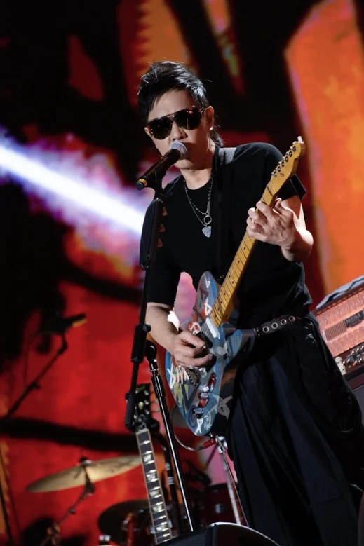
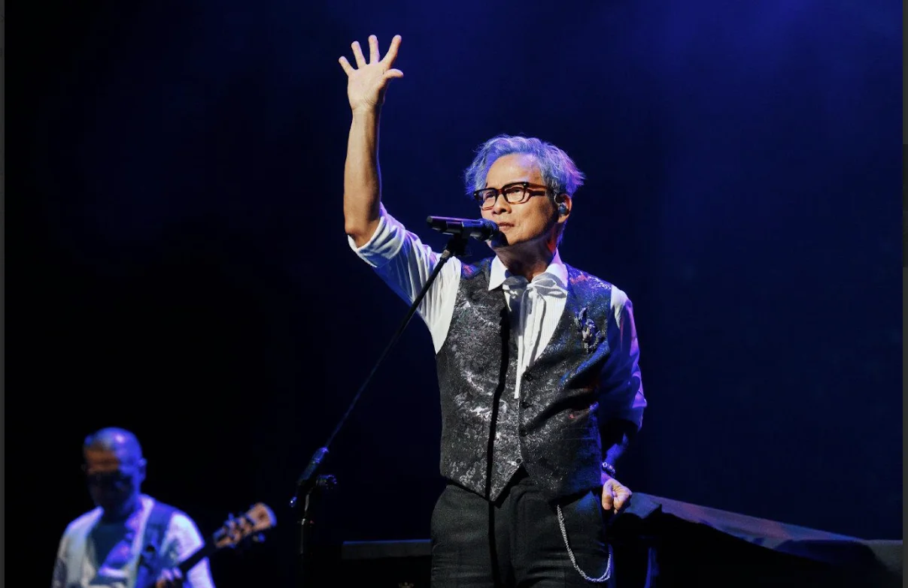

香港的黃貫中（Paul）、台灣的羅大佑，以及中國搖滾先驅崔健，宣布攜手於10月11日在杭州奧體中心體育場（大蓮花）舉行「時光Classic演唱會·三響杭州站」。

今次三人首度世紀同台，被譽為華語音樂史上罕見時刻！三位主角亦已積極備戰，Paul 表示：「知道今次杭州大蓮花場館可以容納超過46000人，好期待大家一齊大合唱嘅震撼畫面。」他們同時預告將會獻不少金曲，誓必勾起不少樂迷的回憶殺。

演唱會消息傳出後，即時在樂迷圈引發轟動，許多香港歌迷直呼：「呢個組合真係有今生冇來世！」、「三位教父同台，簡直係終極夢想！」

