import YouTube from '@/components/patterns/YouTube.astro';

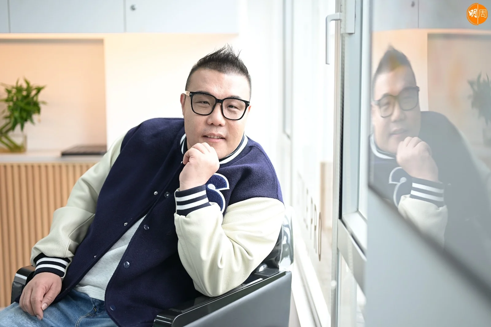

*劉洋*

很多人喜歡劉洋，喜歡他渾厚低迴的嗓音，喜歡他寬宏不爭的量度，也喜歡他敦實穩重的身形。

四十三歲的劉洋，參加《中年好聲音3》奪得季軍，以前是遼寧省游泳運動員，從小在爭分奪秒中長大，在與時間競賽的激烈環境中成長。

*從游泳運動員到唱歌之路 劉洋最愛《古惑仔》港片回憶殺｜劉洋專訪*

<YouTube id="T3GYXwwYuLQ" />

青少年時期的經歷，令他更清楚人生早有安排，有些事想爭也爭不到，他說：「我相信緣份，從東北到昆明再到香港，現在的人生像踏上夢幻旅程，遠遠超出我的想像，這是爭也爭不到的奇異經歷。」

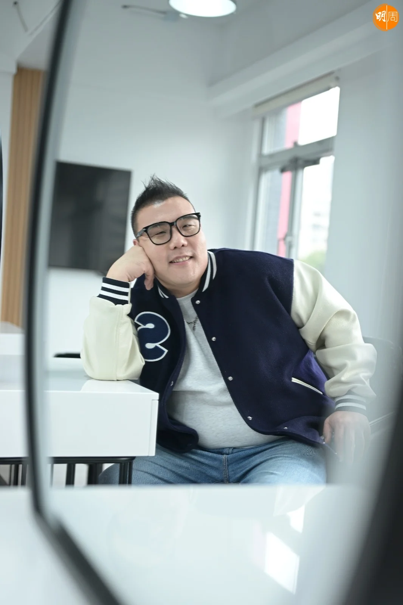

*劉洋遠道從昆明到香港，他形容是奇異之旅。*

*劉洋是東北人在遼寧出生*

*劉洋的父母已經退休，習慣了遼寧的生活，沒有想過到昆明或香港定居。*

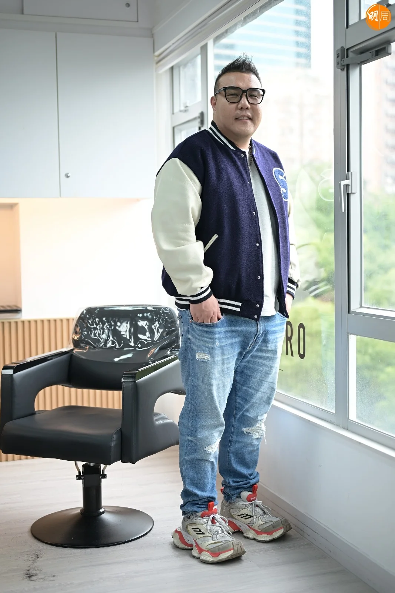

*劉洋的身形做運動員並不奇怪*

*劉洋從游泳隊退役後開始發胖*

劉洋在《中年好聲音3》獲獎後，參加處境劇《愛·回家之開心速遞》演細曹總，以演藝圈新人在台慶頒獎禮獲「最佳男新人」獎，有粉絲留言指「TVB之前欠你的冠軍現在補償了」，他回覆說：「TVB從不欠我冠軍，我知道我的不足和差距，相信有一天，我能成為更好的自己。」劉洋的人生從來不缺競爭和比賽，他在遼寧省鞍山市出生，這個被譽為「奧運冠軍之城」，以盛產奧運金牌選手聞名，是一個充滿濃厚運動氣氛的城市。

## 成功減了一百一十磅

因為游泳成績出色，劉洋從小被栽培向金牌進發，通過層層比賽和選拔，加入省代表隊做專業運動員，他說：「我真的很喜歡游泳，曾經希望在運動員方面發展，不過在開始發育後的階段，教練認為我『水性』不好，腿部的阻力太大，不適合做專業運動員，簡單說就是天生『硬件不足』，就算如何努力，也難以有更好的發展。你看我現在這麼胖，也是因為很多運動員，在停止高強度訓練後，身形都會出現反彈，開始發胖後很難瘦下來。」

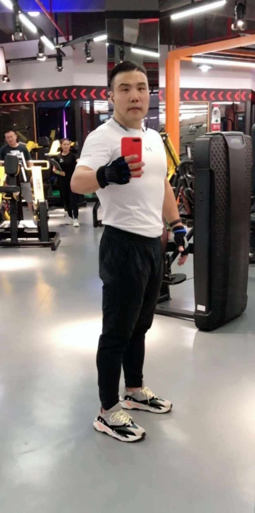

*劉洋參加《中年好聲音》前減肥成功*

*劉洋找專業教練指導操肌*

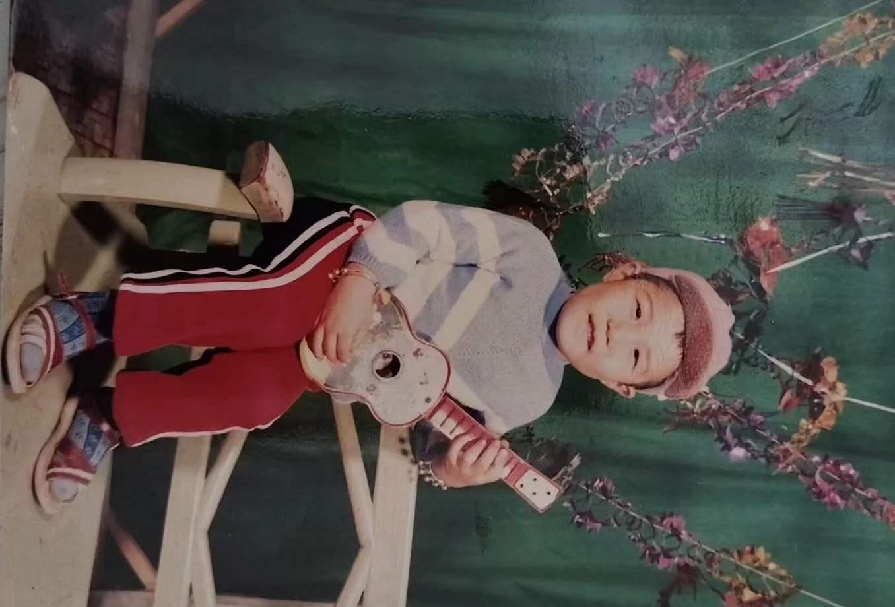

*小時候的劉洋樣子與現在沒有分別*

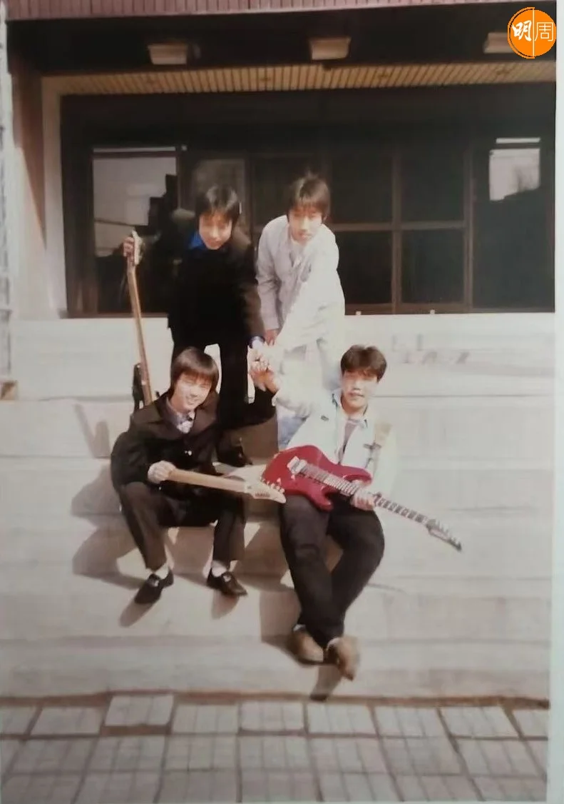

*劉洋與小伴伴們組樂隊*

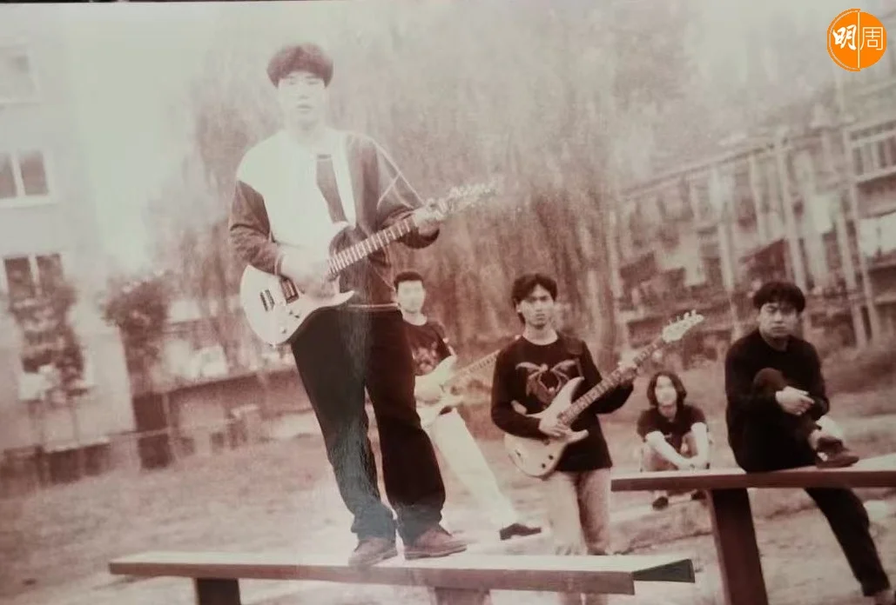

*劉洋對搖滾音樂的興趣始於少年時*

來香港參加比賽前，他的體重高達280斤（約三O八磅），曾經找專業教練操練，成功減了一百一十磅，《中3》初期大家看到他的時候，已經是減肥成功後二百磅的樣子，「那時候我很瘦，天天上健身房做運動，到香港後有太多好吃的東西，又沒有教練捉我去健身房，體重上升已經失守了！現在應該是二百五十磅，我發現踢波都跑不動，沒有之前那麼輕盈，雖然說肥人有肥福，但我要控制體重，不想打回『圓形』。」

大家知道他來自昆明，在當地經營火鍋店，他在脫離運動員生涯後，因為喜歡音樂，一度向樂壇發展，十八、九歲時與朋友組樂隊，擔任主音和結他手，他說對音樂的興趣比游泳更早，小時候沒有太多娛樂活動，受父母影響喜歡聽收音機，培養了對音樂的興趣。他形容組樂隊的歲月像走火入魔，「我們唱自己創作的歌，可能與年齡有關，當時對搖滾樂非常沉迷，明知道不受大眾歡迎，也義無反顧地堅持，幾年後發現此路不通，開始走回正軌喜歡流行音樂，不過大家應該發現，比賽時我唱流行曲，總會忍不住加一些搖滾樂情緒，我覺得能令歌曲更有穿透力，更直接一些。」

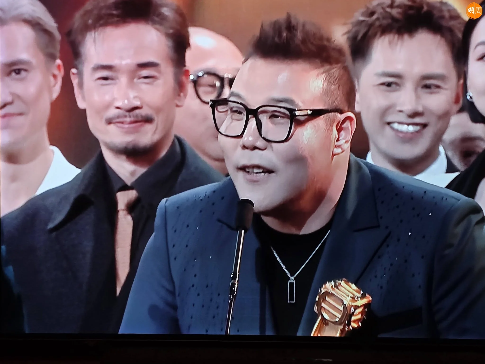

*劉洋拍處境劇《愛·回家之開心速遞》，演細曹總在台慶頒獎禮獲「最佳男新人」獎。*

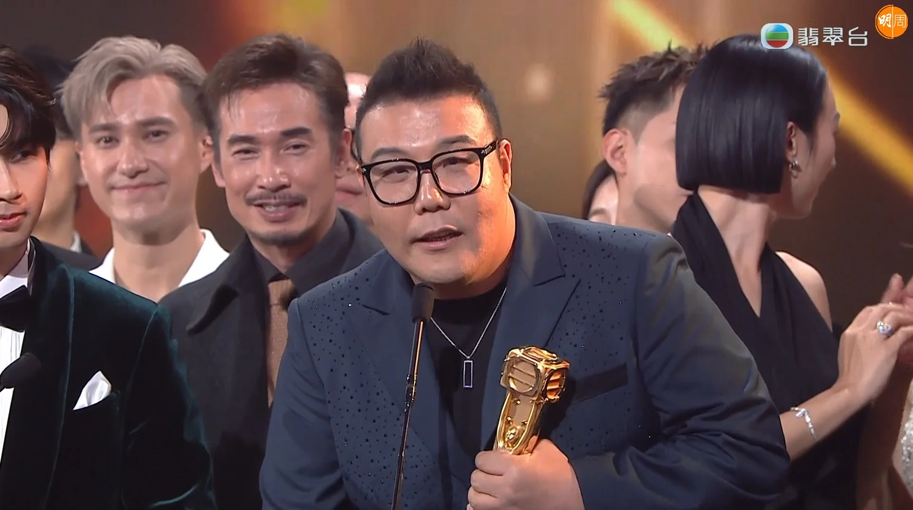

*劉洋的細曹總很有喜劇感*

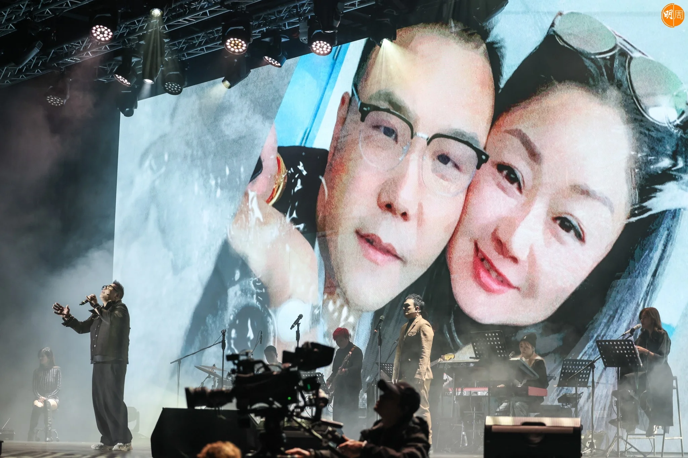

*劉洋太太支持丈夫追音樂夢*

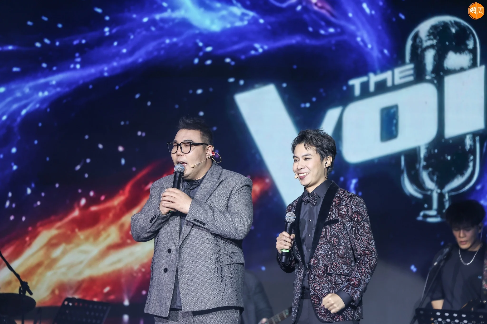

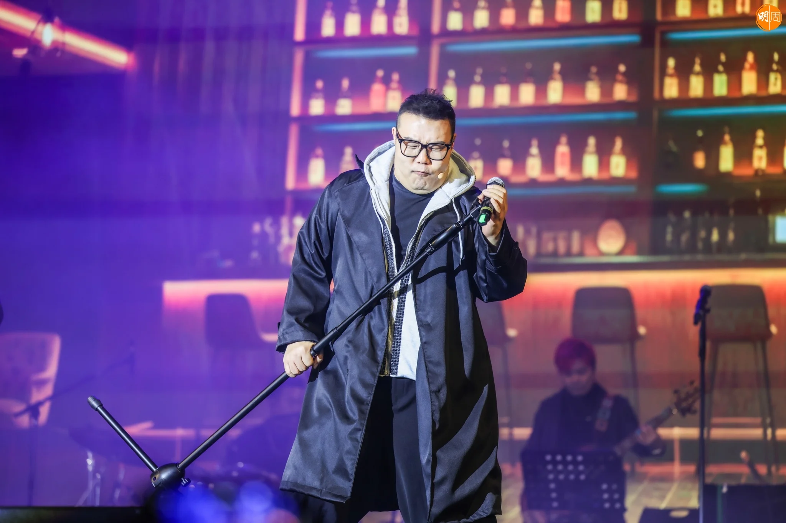

*劉洋的性格得到粉絲支持*

年輕時的劉洋曾經拚命努力，希望成功開創音樂路，當時在酒吧駐唱滿足了表演慾，可是卻沒有名成利就，他在追尋夢想的路上認識了太太，因為太太是昆明人，令他愛上四季如春的昆明，兩人在當地成家立業，音樂夢成為日常生活中的興趣，「放下歌手夢後，我對音樂的興趣，是每次聽到一首好歌，就會不斷研究歌手如何唱，再嘗試用自己的方式演繹，生活中有音樂點綴，延續了我對音樂的堅持。」平時他喜歡唱歌，太太將他唱的歌錄下來循環聽，太太的朋友聽到後就問，唱得這麼好為甚麼不參加比賽？這個提議改變了他的人生，「我相信緣份，從東北到昆明再到香港，我人生像踏上夢幻旅程，遠遠超出我的想像，這是爭也爭不到的奇異經歷。」

當初太太幫他報名參賽，一個連粵語也不會講的人，根本不相信有機會入圍，結果卻收到入圍通知，「朋友覺得我好像不太重視比賽，沒有表現出很強的爭鬥心，我覺得比賽就是做好準備，決賽前把自己的歌練好，剩下的能夠得到甚麼名次，這些是由評審去考慮，參賽者根本想不到也想不了！其實我們這班同學都唱得很好，只不過到現場的時候，每個人的心態都不同，可能我比較放鬆，沒有甚麼包袱和心理壓力，所以把握了發揮的機會。」

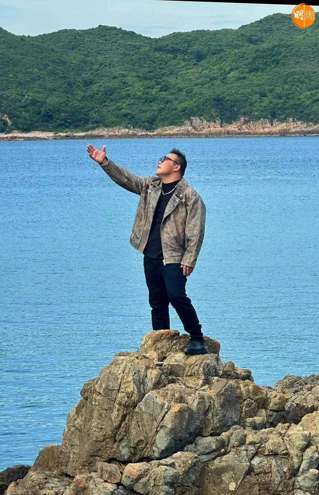

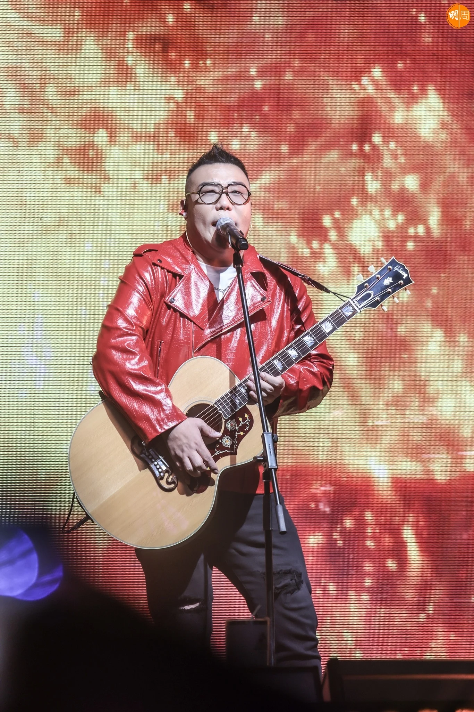

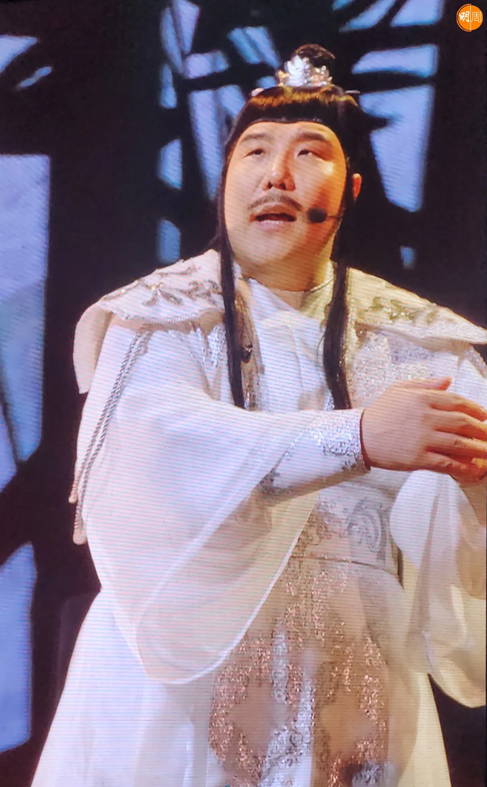

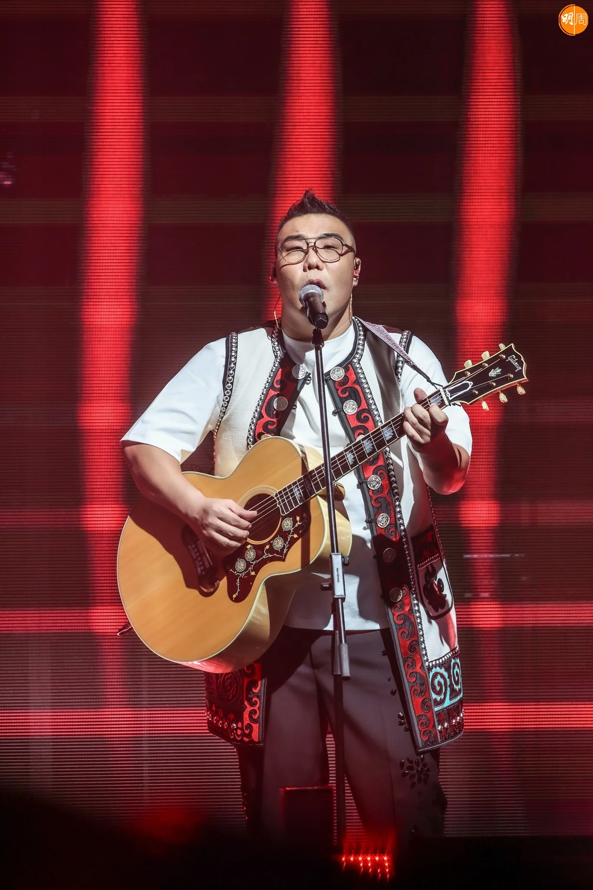

## 到家駒墓前拜祭致敬

他沒有想過自己的歌唱人生，會從陌生又熟悉的香港開始，陌生是從來沒有來過香港，完全聽不懂廣東話；熟悉是從小受香港影視影響，最愛聽Beyond的歌，來到香港後曾到黃家駒墓前拜祭致敬，「你知不知道，我第一天到香港，興奮到晚上失眠睡不着，不是不想睡，是因為滿腦子都想着這個地方，以前看過的電視劇和電影，全部浮現在腦海，我想親身看一看真實的香港，和印象中的香港有沒有不同，我像是來這裏尋找回憶，尋找自己童年和少年時的回憶。」

結果他找到了很多「回憶」，在油麻地警署找到《陀槍師姐》的回憶，在銅鑼灣街頭找到《古惑仔》的回憶，還有尖沙咀、中環與天星小輪等，最驚喜是盂蘭節，朋友帶他到戲棚看大戲，他拍了很多照片分享給同學和朋友們，「大家看到都和我一樣興奮，我們以為只是戲裏面的情節，想不到現實生活中，仍然保留了這些傳統，真的太令人驚喜了，這是香港的一種文化，帶給我們特別深刻的印象。」他說當年看的第一套港劇，是一九八二年版《天龍八部》，在昆明開的火鍋店，裝潢也是八十年代懷舊風格，貼了黃日華演的虛竹劇照，還有《射鵰英雄傳》海報，更有校長譚詠麟的卡式帶。

他在香港認識了很多兒時的明星偶像，還結識了很多志同道合的朋友，最有趣是學會了香港俚語「冚唪唥」，「起初聽人說『冚唪唥』，覺得這個發音很奇怪，不明白是說甚麼，後來才知道是『全部』的意思，真的非常有趣，很拗口不容易學，不過學會後很好用，這是我說得最標準的廣東話。」

-   髮型、化妝：CarrieCammy@Style Pro Salon
-   場地： Style Pro Salon
