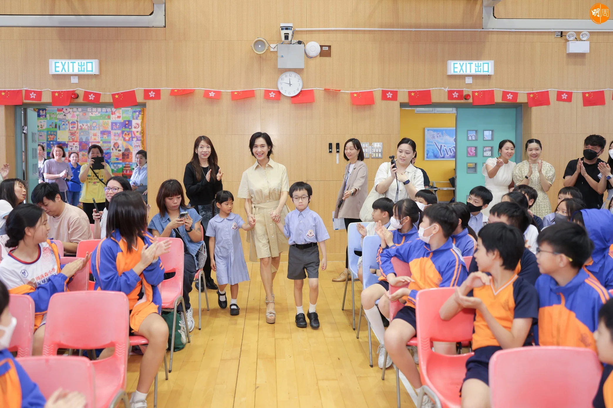
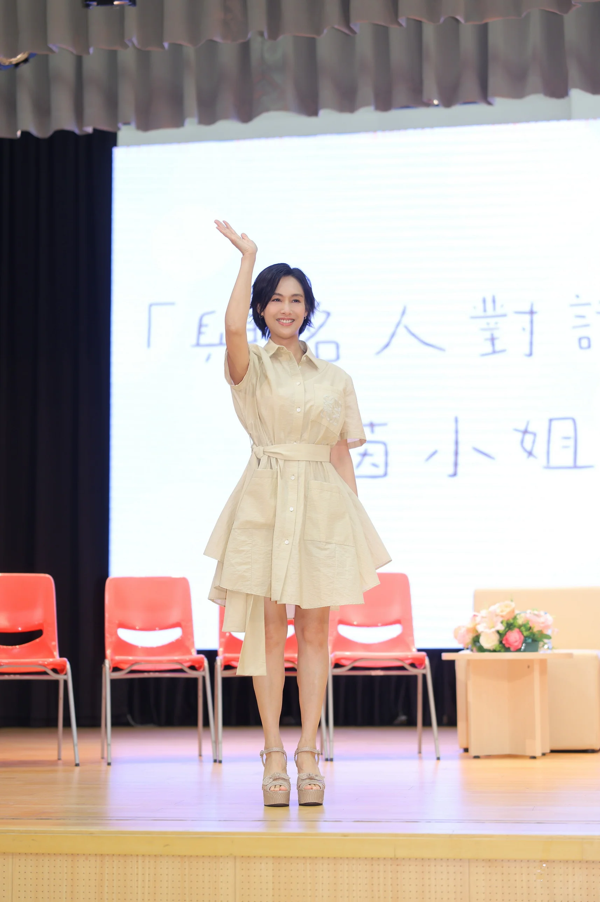
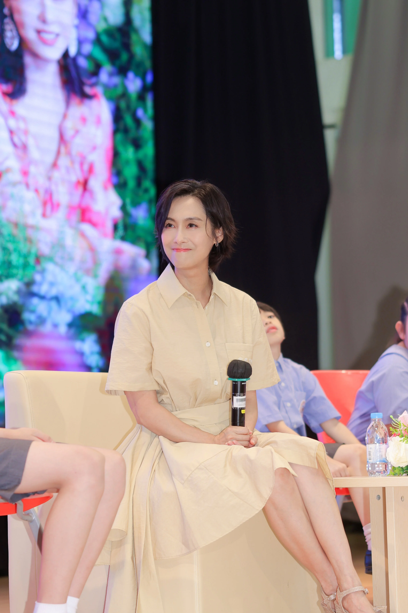
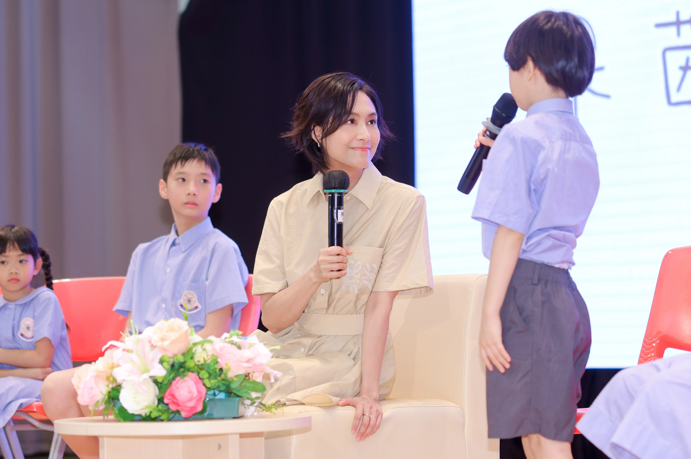
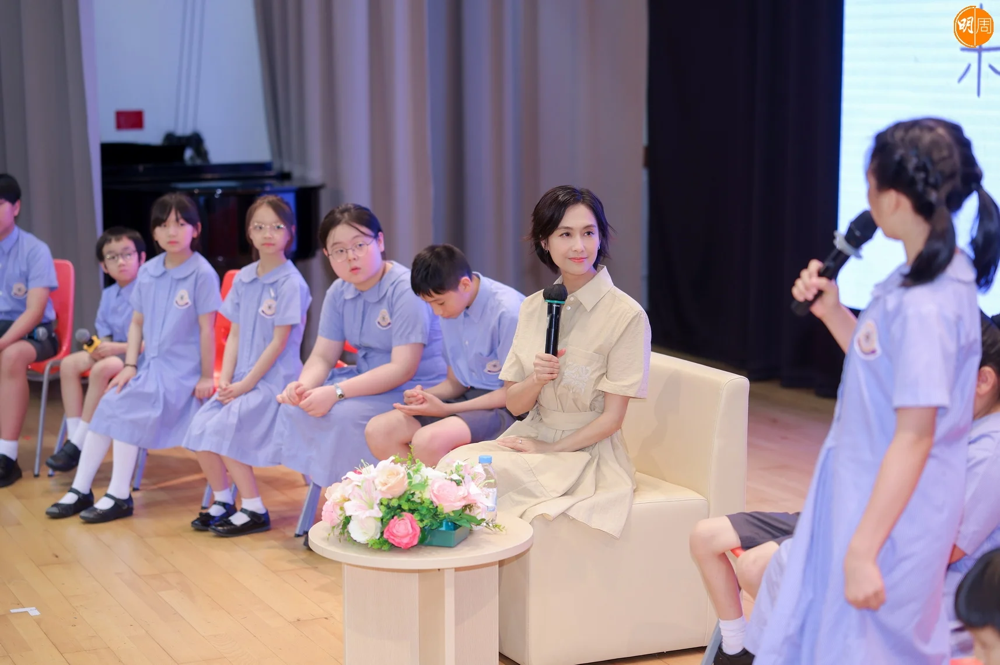
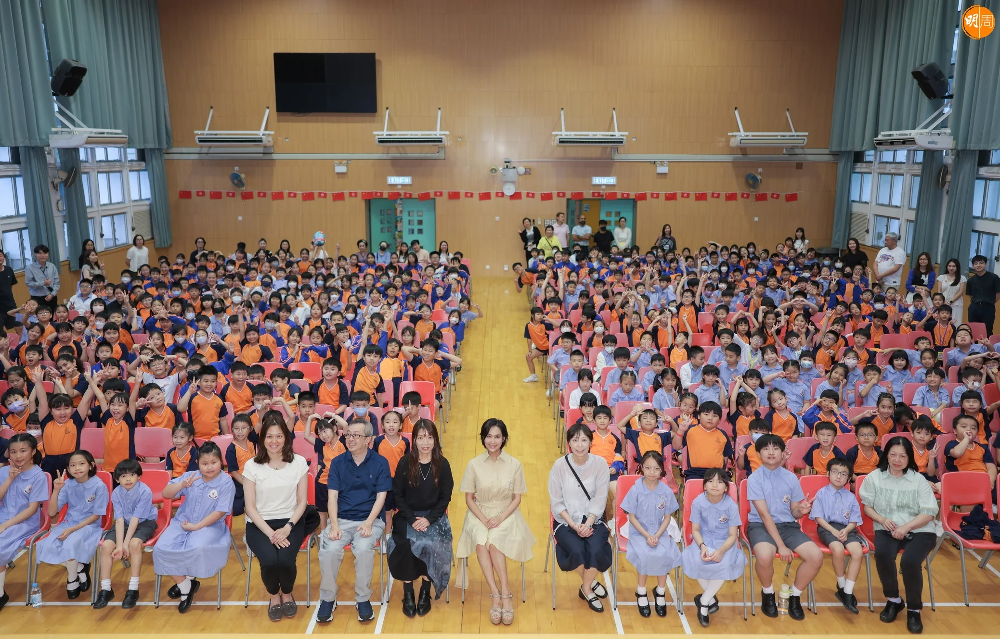
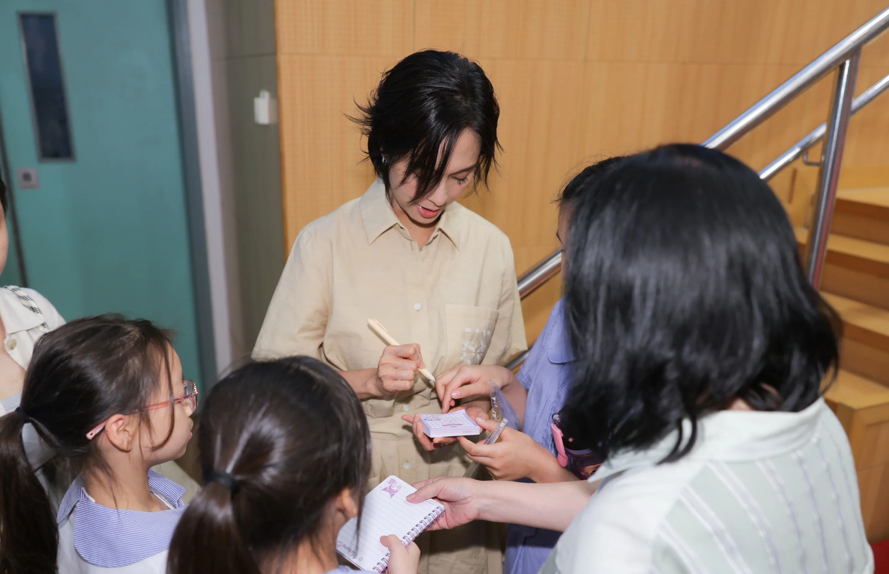

朱茵受邀出席校園活動，接受一班由學生化身的「小記者」訪問，分享演藝心得、經歷及與家人的相處關係，朱茵大讚多位「小記者」表現精靈、思路清晰。她坦言此行勾起女兒的小學生活點滴，「重返小學校園，勾起嘅最大回憶係以前去學校睇阿女表演，當小學家長好幸福，可以參與到阿女校園生活，中學就已經冇咁多機會進入校園了，所以每當有機會踏進小學，內心充滿溫馨同開心嘅感覺。」

朱茵透露女兒黃鶯已進入反叛青春期，跟女兒的相處方式亦要改變，「依家要做佢嘅朋友，聆聽佢嘅內心世界，信任她，提自己唔好擺媽媽款，希望用啲溫和方式令佢容易接受，慢慢成長。」朱茵與黃貫中都不是怪獸家長，偶然會有不同想法，但都是基於為女兒好，朱茵說：「有啲嘢唔使咁硬嘅，邊個鬧完（個女）另一個就做和事佬，我哋盡可能俾空間同自由度個女決定，引導她選擇正確道路，教佢辨別是非，當佢明白之後，自己去改變，咁先可以令家庭和諧。」

更多圖輯：

