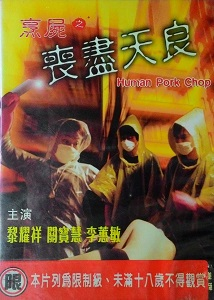

| 烹屍之喪盡天良   *Human Pork Chop* | 烹屍之喪盡天良   *Human Pork Chop* |
| --- | --- |
| 電影《烹屍之喪盡天良》影碟封面 | |
| 基本資料 | 基本資料 |
| 導演 | 陳志舜 |
| 監製 | 陳志舜 |
| 製片 | 陳志賢 Chris Chan |
| 編劇 | 梁寶安 |
| 原著 | Hello Kitty藏屍案 |
| 主演 | 黎耀祥 關寶慧 李蕙敏 羅蘭 <ContentLink uid="wiki/葉世榮">葉世榮</ContentLink> |
| 配樂 | 楊奇昌 |
| 攝影 | 姜國民 |
| 剪接 | 吳宏雄 |
| 製片商 | 利星娛樂有限公司 潤程娛樂有限公司 |
| 片長 | 87分鐘 |
| 產地 | 香港 |
| 語言 | 粵語 |
| 上映及發行 | 上映及發行 |
| 上映日期 | - 2001年1月5日（香港） |
| 票房 | HK $504,090.00 |

《**烹屍之喪盡天良**》（英語：*Human Pork Chop*）2001年上映的香港三級片，本片由Hello Kitty藏屍案中改篇，導演及監製為陳志舜，主演黎耀祥、關寶慧、李蕙敏、羅蘭、<ContentLink uid="wiki/葉世榮">葉世榮</ContentLink>。

## 背景及製作

本片和人頭豆腐湯同一時侯上映，兩片也為競爭對手[^1]。本片籌備到拍攝到後期製作是經過不足一個月，本片因有粗俗語言、色情及血腥片段，本片上映時被列為第III級，只准18歲或以上人士觀看。

## 故事簡介

此電影和人頭豆腐湯一樣，也是以倒敘方式呈現，威sir（莫家堯飾）率領警員到案發現場調查，故事講述任職舞女的李樂思（關寶慧飾）賣淫維生，並有一名男友（黃志宏飾），有一天，李思因每次接客也失敗，根本沒辦法給陳宏學（黎耀祥飾）房租，她急需用錢，並偷偷的取去陳宏學的存款，陳宏學知悉後十分憤怒，帶着楊祖輝（葉世榮飾）和張偉基（梁焯滿飾演）一起追殺李樂思，幾人見追殺也沒用，幾人決定綁架並禁錮李思，李思被他們施虐至重傷。一次，李樂思不知道陳宏學的白粉混了樟腦丸，吃了下去，然後並慢慢死亡。幾人聚集在一起，互相推社責任，陳宏學提議將Grace的遺體肢解及棄置，幾人喪盡天良的把頭顱放進鍋子裏煮成人頭豆腐湯，並叫上楊祖輝及張偉基喝掉它，將頭顱藏在吉蒂貓洋娃娃內，這時，有份聚集的Gigi（陳秀如飾），因感到悔疚和恐懼，她決定到警署自首，並把所有東西都跟警方說了，最後陳宏學、楊祖輝及張偉基被判終身監禁，Gigi因自首，並因她的指証有功而被法院特赦。

## 演員

| 角色 | 演員 | 粵語配音 | 備註 |
| --- | --- | --- | --- |
| 陳宏學 | 黎耀祥 | 黎耀祥 | 黑幫老大，該案第一被告 |
| 李樂思 | 關寶慧 | 關寶慧 | 該案死者 |
| 燕姐 | 李蕙敏 | 陸惠玲 | 陳宏學之妻，李樂思之好友 |
| | 羅蘭 | 羅蘭 | 李樂思外婆 |
| 楊祖輝 | <ContentLink uid="wiki/葉世榮">葉世榮</ContentLink> | 陳欣 | 陳宏學好友，該案第三被告 |
| 張偉基 | 梁焯滿 | 黃志成 | 陳宏學好友，該案第四被告 |
| Gigi | 陳秀如 | | 張偉基的女友，該案第二被告，但因自首，並因她的指証有功而被法院特效 |
| 威sir | 莫家堯 | 陳欣 | 該案警員 |
| | 呂珊 | 黃鳳英 | 威sir下屬 |

參考資料

[^1]: [《人頭豆腐湯》海報 過度血腥](http://newsbot.lib.cuhk.edu.hk/news/apple/20001224/C11-04.html). 蘋果日報. 2000-12-24 [2020-11-04]. （原始內容[存檔](https://web.archive.org/web/20201104075924/http://newsbot.lib.cuhk.edu.hk/news/apple/20001224/C11-04.html)於2020-11-04） （中文）.
