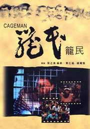

| 籠民   *Cageman* | 籠民   *Cageman* |
| --- | --- |
|  | |
| 基本資料 | 基本資料 |
| 導演 | 張之亮 |
| 監製 | 張之亮 |
| 製片 | 林安莉、陳希文 |
| 編劇 | 張之亮 吳滄洲 黃仁逵 |
| 主演 | <ContentLink uid="wiki/黃家駒">黃家駒</ContentLink> 喬宏 廖啟智 |
| 配樂 | 包以正、李志毅 |
| 攝影 | 林國華 周紀常 |
| 剪接 | 張兆熙 |
| 製片商 | 影幻製作有限公司 |
| 片長 | 144 分鐘 |
| 產地 | 英屬香港 |
| 語言 | 粵語 |
| 上映及發行 | 上映及發行 |
| 上映日期 | 英屬香港：- 1992年11月19日[^1] |
| 發行商 | 銀都機構有限公司 |
| 票房 | HK$ 1,767,657.00[^2] |

**《籠民》**（英語：*Cageman*）是一部於1992年上映的香港社會寫實電影，由張之亮執導，喬宏、<ContentLink uid="wiki/黃家駒">黃家駒</ContentLink>和廖啟智主演。劇情以香港特有的舊式男子公寓籠屋住客為題材，講述繁華國際大都市中被社會遺忘的老弱低下層人士生活。由於劇本涉及大量髒話及不雅對白，加上現場收音使演員間的對白，甚至即興說出的髒話也被一字不漏地收錄，在電影分級制度下為香港三級片。

本片是香港殿堂級搖滾樂隊<ContentLink uid="wiki/beyond">Beyond</ContentLink>主音<ContentLink uid="wiki/黃家駒">黃家駒</ContentLink>過世前參與的最後一部電影；片中住戶於中秋節聚會合唱之歌曲為甄妮主唱、於1989年推出的單曲〈紅唇綠酒〉，原曲為1950年由法國意大利裔作曲家Louiguy（英語：Louiguy）作曲的法語歌曲〈Cerisier rose et pommier blanc（英語：Cherry Pink (and Apple Blossom White)）〉；粵語版本則由林振強填詞，鮑比達編曲。電影獲得第12屆香港電影金像獎最佳電影、最佳導演、最佳編劇、最佳男配角（廖啟智）[^3]，以及第38屆亞太影展最佳影片和最佳攝影[^4]。

## 劇情

刻畫了租住在男子公寓裏的一眾中老年男性住戶的生活狀況，以及他們面對拆遷問題所表現出的各種態度。

## 演員表

-   <ContentLink uid="wiki/黃家駒">黃家駒</ContentLink> 飾 毛仔
-   李名煬 飾 七十一
-   喬 宏 飾 肥姑（男子公寓業主代理人）
-   谷 峰 飾 陸同
-   廖啟智 飾 太子森
-   胡 楓 飾 林Sir（幫辦）
-   泰迪羅賓 飾 唐三
-   黃自強 飾 妹頭
-   劉 洵 飾 道長
-   劉以達 飾 生哥
-   陳國新 飾 徐議員
-   祖尊尼亞 飾 查理
-   周 驄 飾 周議員
-   陳德森 飾 收樓代表
-   施介強（粵語：施介強） 飾 電視主持
-   鄧 祥 飾 大粒廛
-   黃老邪 飾 道友甲
-   左 西 飾 床後老伯
-   邱禮濤 飾 電視編導
-   金揚樺 飾 消防隊長
-   文 仔 飾 郵差
-   胡天恩 飾 的士司機
-   西瓜刨 飾 老伯甲
-   張志成 飾 電視記者 A
-   劉艷娥 飾 電視記者 B
-   霍達華 飾 電視記者 C
-   張旭燊 飾 警員
-   林國華 飾 警官
-   張之亮 飾 沙展
-   楊青萍 飾 孖T A
-   王永珠 飾 孖T B
-   區兆熙 飾 徐助手
-   黃世傑 飾 周助手
-   劉 準 飾 色士風手[^5]

## 其他資料

-   票房：HKD $1,767,657
-   級別: III（香港），粗口太多

## 獎項

| 年份 | 頒獎典禮 | 獎項 | 名字 | 結果 |
| --- | --- | --- | --- | --- |
| 1993 | 第12屆香港電影金像獎 | 最佳電影 | | 獲獎 |
| 1993 | 第12屆香港電影金像獎 | 最佳導演 | 張之亮 | 獲獎 |
| 1993 | 第12屆香港電影金像獎 | 最佳編劇 | 黃仁逵、吳滄洲、張之亮 | 獲獎 |
| 1993 | 第12屆香港電影金像獎 | 最佳男配角 | 廖啟智 | 獲獎 |
| 1993 | 第12屆香港電影金像獎 | 最佳美術指導 | 黃仁逵、錢耀恆 | 提名 |
| 1993 | 第38屆亞太影展 | 最佳影片 | | 獲獎 |
| 1993 | 第38屆亞太影展 | 最佳攝影 | 林國華 | 獲獎 |
| 1993 | 第1屆上海國際電影節 | 「金爵獎」最佳影片 | | 提名 |
| 1993 | 第1屆上海國際電影節 | 評委會特別獎 | | 獲獎 |
| 1993 | 第30屆金馬獎 | 最佳劇情片 | | 提名 |
| 1993 | 第30屆金馬獎 | 最佳導演 | 張之亮 | 提名 |

## 外部連結

-   香港影庫上《[籠民](https://hkmdb.com/db/movies/view.mhtml?id=7618&display_set=big5)》的資料（繁體中文）
-   開眼電影網上《[籠民](http://app2.atmovies.com.tw/film/flhk80096505)》的資料（繁體中文）
-   豆瓣電影上《[籠民](https://movie.douban.com/subject/1306326/)》的資料 （簡體中文）
-   時光網上《[籠民](http://movie.mtime.com/29925/)》的資料（簡體中文）
-   AllMovie上《[籠民](https://www.allmovie.com/movie/v28118)》的資料（英文）
-   爛番茄上《[籠民](https://www.rottentomatoes.com/m/cageman)》的資料（英文）
-   互聯網電影數據庫（IMDb）上《[籠民](https://www.imdb.com/title/tt0107461/)》的資料（英文）

參考資料

[^1]: [Cageman (1992) Release Info](https://www.imdb.com/title/tt0107461/releaseinfo?ref_=tt_dt_rdat). IMDb. [2021-06-23] （英語）.

[^2]: [1992 香港票房](https://web.archive.org/web/20210227120218/http://www.boxofficecn.com/hkboxoffice1992). 中國電影票房榜. [2021-06-23]. （[原始內容](http://www.boxofficecn.com/hkboxoffice1992)存檔於2021-02-27）.

[^3]: [第12屆香港電影金像獎提名及得獎名單](http://www.hkfaa.com/winnerlist12.html). 香港電影金像獎. [2021-06-25]. （原始內容[存檔](https://web.archive.org/web/20200126162507/http://www.hkfaa.com/winnerlist12.html)於2020-01-26）.

[^4]: [AWARDS & FESTIVALS - CAGEMAN](https://mubi.com/films/cageman/awards). Mubi. [2021-07-02]. （原始內容[存檔](https://web.archive.org/web/20210702080014/https://mubi.com/films/cageman/awards)於2021-07-02）.

[^5]: [香港影库资料](http://hkmdb.com/db/movies/view.mhtml?id=7618&display_set=big5). [2010-12-09]. （原始內容[存檔](https://web.archive.org/web/20210309054652/http://hkmdb.com/db/movies/view.mhtml?id=7618&display_set=big5)於2021-03-09）.
