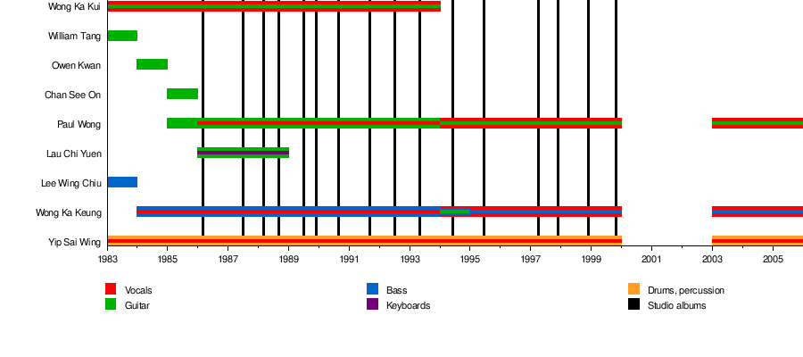

Hong Kong rock band

Not to be confused with The Beyond (band).

| Beyond | Beyond |
| --- | --- |
| _in_1993.jpg)Beyond in Japan, 1993. - From left to right, from top to bottom: <ContentLink uid="wiki/paul-wong-musician">Paul Wong</ContentLink>, <ContentLink uid="wiki/yip-sai-wing">Yip Sai Wing</ContentLink>, <ContentLink uid="wiki/wong-ka-kui">Wong Ka Kui</ContentLink>, and Steve Wong. | |
| Background information | Background information |
| Origin | Hong Kong |
| Genres | - Rock - pop |
| Years active | 1983–1999, 2003–2005 |
| Labels | - Cinepoly (1987–1992) - Warner Music Group (1992–1993) - Rock Records (1994–1999) |
| Past members | - <ContentLink uid="wiki/wong-ka-kui">Wong Ka Kui</ContentLink> - <ContentLink uid="wiki/wong-ka-keung">Wong Ka Keung, Steve</ContentLink> - <ContentLink uid="wiki/yip-sai-wing">Yip Sai Wing</ContentLink> - <ContentLink uid="wiki/paul-wong-musician">Wong Koon Chung, Paul</ContentLink> - Lau Chi Yuen - Tang Wai-Hin, William - Lee Wing Chiu - Kwan Po Shun, Owen - Chan Shi On, David |

**Beyond** was a Hong Kong rock band formed in 1983. The band became prominent in Hong Kong, Taiwan, Japan, Singapore, Malaysia, mainland China, and Overseas Chinese communities.[^1] The band is widely considered as the most successful and influential Cantopop band from Hong Kong.[^1] In 1993, band frontman and major composer <ContentLink uid="wiki/wong-ka-kui">Wong Ka Kui</ContentLink> died at the age of 31, after an accident during the filming of a gameshow at Fuji Television in Tokyo. Beyond continued to perform, record, and release music after Wong Ka Kui's death. In 2005, the remaining members <ContentLink uid="wiki/paul-wong-musician">Paul Wong</ContentLink>, <ContentLink uid="wiki/wong-ka-keung">Wong Ka Keung</ContentLink> and <ContentLink uid="wiki/yip-sai-wing">Yip Sai Wing</ContentLink> decided to pursue their own solo careers, and Beyond officially disbanded. They are one of the most-streamed Chinese groups on YouTube.

## History

### Formation and early years (1983–1986)

In the early 1980s, lead vocalist <ContentLink uid="wiki/wong-ka-kui">Wong Ka Kui</ContentLink> and drummer <ContentLink uid="wiki/yip-sai-wing">Yip Sai Wing</ContentLink> started out as young musicians who were both interested in Pink Floyd's progressive rock.[^2] <ContentLink uid="wiki/wong-ka-kui">Wong Ka Kui</ContentLink> was notably influenced by western styles of rock, and the likes of David Bowie and King Crimson. In 1983, they decided to join a local music contest for "Guitar Magazine" and they decided to form a band with lead guitarist William Tang (鄧煒謙) and bassist Lee Wing Chiu (李榮潮). Tang wished the band's name to convey a feeling of surpassing or going beyond themselves, so the name "Beyond" was chosen.[^1][^2] However, the band name was not definite at the time.[^2] The band's musical style was still experimental. At this time, Wong Ka Kui and Tai Chi lead guitarist Joey Tang formed a temporary band called NASA band that did an art rock style of music with English pop.[^2]

In 1984, Wong's younger brother <ContentLink uid="wiki/wong-ka-keung">Wong Ka Keung</ContentLink> joined the band as a bassist.[^2] At the time, the band consisted of Wong Ka Kui, Yip Sai Wing, Wong Ka Keung and new lead guitarist Chan Shi On (陳時安).[^2] Chan soon had to leave for a foreign country, leaving the band without a lead guitarist. In 1985 <ContentLink uid="wiki/paul-wong-musician">Paul Wong</ContentLink>, the band's designer, joined the band to in his stead.[^2]

In the early years, time was difficult for the band. They had to do everything themselves, including organizing finance, selling tickets, and performing and buying their own equipment. The band's first self-financed concert occurred in 1985 at Caritas Centre in Hong Kong. The show was unsuccessful but caught the attention of their first manager.[^3] He would help them raise HK$16,000, but the band was soon left with only HK$1000.[^2]

In 1986, the band rented a studio to record the album *Goodbye My Dreams* (再見理想).[^2] Lau Chi Yuen (劉志遠) then joined Beyond as lead guitarist and keyboardist. At the time Small Island, Tat Ming Pair and Beyond made a recording together. Small Island was scheduled to attend a July 1986 Pan-Asian Music Festival in Taipei, and Beyond was added to the schedule.[^2] Beyond was well-liked and they joined another festival that same year.[^2] They would sign with Kinn's Music record company.[^2]

### Commercial success

#### 1987–1991

In 1987, Beyond produced the second album. The album *Arabian Dancing Girls* (亞拉伯跳舞女郎) was one of the band's first commercial hits.[^2] They soon were in a new music underground trend along with a select group of other bands, such as Tai Chi, Cocos and Raidas.[^2] Lau Chi Yuen left the band in 1988, leaving the band with four members only.[^2]

In 1989, Beyond became the first Hong Kong band to perform in Beijing at the Capital Indoor Stadium. As Beyond's songs were in Cantonese (instead of Mandarin), the performance was not well received by the audience.[^2] The stadium had been full at the start of the concert, but only half had remained after the concert had ended.[^2] However, they still considered the concert a success.[^2] After a couple of flops, Beyond started to gain popularity following the release of the hit song "Great Land" (大地).[^2] They would soon win their first musical awards, the 1988 Jade Solid Gold Best Ten Music Awards Presentation and 1989 RTHK Top 10 Gold Songs Awards.

In 1990, they released one of their signature songs, "Glorious Years" (光輝歲月), a song about racism and the struggle of Nelson Mandela in South Africa.[^2][^4] The song was a huge hit in Hong Kong. The song was from the band's album *Party of Fate* (命運派對), which achieved triple platinum.[^2] According to a later interview with Wong Ka-Keung, Mandela was "deeply moved" when he heard about the song during his final days in the hospital.[^5]

In 1991, Beyond released another critically acclaimed song "Amani" from the album *Deliberate* (猶豫). The song was written during Beyond's trip to Tanzania.[^6] The song's title means "peace" in Swahili and the song was written about the plight of war-ravaged Africa and the yearning for world peace. Part of the song's lyrics were written in Swahili. The song is still often used by Hong Kong's human rights bands to spread the message of peace.[^6]

#### *Continue the Revolution*

Beyond made their first appearance on Japan's NHK station and immediately signed with record company Amuse and Fun House record label.[^2] After their departure from Cinepoly Records to sign with Warner Music, Beyond started to become a more international band, and began to focus more time in Japan and Taiwan.[^2] The band would release their eighth studio album, *Continue the Revolution* (繼續革命) on 10 July 1992, achieving commercial and critical success with hit lead rock singles "The Wall" (長城), "Insufferably Arrogant" (不可一世) and the reggae single "Continue to indulge" (繼續沉醉). The band member's life in Japan felt lonely and isolated from their loved ones as it is their first time being away from them for a long period. Their songs during this time also emphasized on homesickness, isolation and emotional struggle. Tracks like "Looking into Distance" (遙望), "Be Tired of Loneliness" (厭倦寂寞), and "Home Sick Song" (溫暖的家鄉) vividly portray their experience of living and working abroad in Japan.

Beyond officially entered the Japanese market on 25 July by releasing their first Japanese-Cantonese bilingual single, "The Wall c/w Only Heaven Knows", following "リゾ・ラバ ～International～ c/w The Morning Train". 2 months after the release of both singles, the band released their first Japanese studio album under their band name. This album is considered to be a multilingual album as it still contains 3 Cantonese tracks *("The Morning Train", "Farmer", "Only The Heaven Knows")* and 1 Mandarin track *("Guilty of Love")*.

At the time, Amuse and Fun House had more control over the band compared to Warner Music, handling the production and release of the album. Music videos, packaging and recording of the album took place in Japan. Both Amuse and Fun House aimed to mirror the success of the Cantonese release with a one-to-one strategy, notable example being the Japanese album "Beyond" corresponded to its Cantonese counterpart, "Continue the Revolution" as a pair. "Beyond" would be a flop due to the language barrier and lack of promotion for it. This made Beyond to focus heavily in Japan, joining variety shows to establish their presence in the market.

Beyond would also start producing their first and only EP under Warner Studio around early November 1992 titled "Endless Emptiness". The band would release a promotional single, "What & Why" to help promote the EP.

By the end of the year, the band would signed with Rock Records to release the Mandarin version of "Continue the Revolution", "Belief". It will be the last full Mandarin album that Ka Kui participated as vocalist before his untimely death. The album would struggle commercially in Taiwan at the time despite the critical praises it has received over the years.

Beyond would appeared as guest performers on the TVB's variety show "Summer Vacation Fun to the Max" (暑假玩到盡). On 11 July, they held the "Salem Rocking Night" concert at the Ocean Park parking lot in Hong Kong and on 11 August, they performed their "Continue the Revolution" concert at the Tsuen Wan Town Hall in Hong Kong.

#### *Endless Emptiness* and *Rock N Roll*

In 1993, after a brief stint in Taiwan promoting their third Mandarin album, ‘’Belief’’, Beyond released their fourth EP after 2 years and a half， "Endless Emptiness". This EP would include 3 tracks, "Endless Emptiness" (無盡空虚), "What & Why" (點解‧點解) and the Japanese track "The Wall". The lead single under the same title name used to be a demo by Ka Kui under the name "Don't Break My Heart" and was intended to be released as one of the tracks in "Continue the Revolution". The track vividly reflects on the emotional struggles of urban life. Endless Emptiness would become one of Beyond's classic tracks during their four-member era and tenure in Japan. The track would later be recorded in Japanese by Ka Kui, featured in the 1995 Japanese compilation album "Far Away 92–95" titled under the demo name.

Following the release of "Endless Emptiness", the band began working on their ninth studio album, ‘’Rock N Roll’’（樂與怒）. The album emphasizes on the spirit of rock and roll, as well as the strength of music. Amuse gave the band a larger budget and creative freedom on the album. The band even shifted from a small cabin near Mount Fuji to a studio in downtown Tokyo for the album recordings. Most of the lyrics and compositions were done by Wong Ka Kui, and arranged by the band and with the help of Kunihiko Ryo. Beyond was satisfied with the album and enjoyed the creative freedom from Amuse throughout the arrangement and recording sessions.

On May 1993, Beyond released their ninth studio album, *Rock and Roll*. Lead singles of the album included "Pop And Mom" (爸爸媽媽)，"Lover" (情人) and their signature song "<ContentLink uid="wiki/boundless-oceans-vast-skies">Boundless Oceans, Vast Skies</ContentLink>" (海闊天空).[^7][^2] This album would become Wong Ka Kui's last tenure with the band.[^2]

##### Death of Wong Ka Kui

Further information: Wong Ka Kui § Death

On 24 June 1993, the band appeared at a Tokyo Fuji Television game show *If Uchannan-chan is Going to Do It, We Have to Do It!* (ウッチャンナンチャンのやるならやらねば!).[^8] The stage platform was 2.7 to 3m high.[^9][^10] Actor Teruyoshi Uchimura and Wong Ka Kui both fell off a broken stage and sustained massive head injuries.[^9][^11] Wong was sent to the Tokyo Women's Medical University hospital.[^11] He fell into a coma and died 6 days later at age 31.[^9][^10]

The death occurred at the prime of the band's career, with the tremendously successful song "<ContentLink uid="wiki/boundless-oceans-vast-skies">Boundless Oceans, Vast Skies</ContentLink>" released around the time.[^2] His funeral procession caused traffic in various major streets in Hong Kong to come to a standstill, and many top Hong Kong Cantopop singers of the time attended and paid tribute at the funeral. Criticisms followed that the Japanese were having too many late night shows of this type, and the TV station crews were overworked.[^10]

During this period, both the Mandarin and Japanese versions of the album were on halt. The Japanese version, "This is Love 1" was released on 25 July 1993 and was intended to be a double album. However, this plan was changed due to Ka Kui's death before finishing it. A day after Ka Kui was admitted to the hospital, Fun House released the band's third double A-side Japanese single, featuring two lead tracks "くちびるを奪いたい", the Japanese version of "Love Completely"（完全地愛吧） sung by Ka Kui andKa Kui's younger brother Steve（Wong Ka Keung）, while "遥かなる夢に～Far away～" is the Japanese version of "Boundless Oceans, Vast Skies"（海闊天空） to celebrate the band's tenth anniversary.

The Mandarin version, "Boundless Oceans, Vast Skies", same name as the lead single, was released on 9 September 1993. The album was recorded by the remaining members of the band to fulfil Ka Kui's wish of finishing it. Steve and Paul recorded their respective vocals for "It’s Hard to Express Love"（愛不容易說） and "Cannot Help"（身不由己）, Mandarin versions of "Love Completely"（完全地愛吧） and "Daydream"（妄想）. Songs that included Ka Kui's vocals were untouched out of respect for him. Singles from the Cantonese and Japanese version of the album were also added into it.

### Post Ka Kui era (1994–1999)

#### *Second Floor Back Suite*

After the death of Wong, there was debate as to whether the remaining trio should continue to record and perform as Beyond. Eventually, they reappeared on 30 November 1993 in Hong Kong at the Composer's Tribute Night concert.[^12]

Throughout Beyond's trio era, their sound shifted from progressive rock to alternative rock.

Beyond's first album as a trio in that era was *2nd Floor Back Suite* (二樓後座), was released on 4 June 1994.[^2] This album pays tribute towards the deceased Ka Kui with "Paradise" by Paul, the instrumental "We Don't Wanna Make It Without You" composed by the band, "Scar" and "Wishing You Happiness" by Ka Keung. Ka Keung sang "Wake Up", composed by the trio as well to express how Hong Kong fans are blindly supporting singers during their era which stirred up controversy. They have also written the sweet melody song "There Is Always Love" to their fans as a gift of appreciation for supporting them throughout the years.

A month later after *2nd Floor Back Suite* was released, the Mandarin version of the album was released titled *Paradise*. They have also released their third Japanese album under the title *Second Floor*, however rest of the track are the same as the Cantonese album with the exception being "Paradise" have been rewritten into Japanese. Beyond would quit the Japanese market after deciding to sign with Rock Records over Amuse. The band also established the Beyond Publishing Co. Ltd to manage their own song copyrights, while their record label is only responsible for their distribution

#### *Please Let Go of Your Hands* and *Surprise*

On 8 April 1997, Beyond's thirteenth studio album *Please Let Go of Your Hands* was released, a reference to Hong Kong's cultural changes after the handover of Hong Kong to China.[^2][^13]

8 months later, the band's fourteenth studio album *Surprise* was released

#### *Good Time*

In November 1999, Beyond released their fifteenth and final studio album, "Good Time". The album have exceeded in the traditional hard rock arrangement, using more harmonic and rhythmic patterns for it. They have released the lead single under the same name to promote it. Beyond performed the "GOOD TIME" concert at the Hong Kong Convention and Exhibition Centre at Wan Chai throughout 24 December till 26 December 1999, announcing that they would pursue their own solo career after the concert.[^1]

### First Disbandment

At this time, Paul Wong and Steve began to clash in many aspects of music production. Both musicians fought over the band's future and artistic style whilst slowly drifting apart. This came to a head after Paul claimed that his pay should be higher than that of Yip Sai Wing, as he believed that he had contributed much more to the band's composing and producing. The band had been splitting earnings equally since Wong Ka Kui had formed the band in 1983, and Steve believed that Paul's claims to money were in direct violation of the band's sense of equality which had made them so powerful to begin with.

### Reformation

#### *Together*

In 2003 for the band's 20th anniversary, they came out to embark on a world tour. The tour included stops in Toronto Canada, and various cities in mainland China. They have also released an EP, titled *Together*, featuring remixes of old their old works, including a new track, "Twenty Wars at War".

In 2005, they played their last tour (The Story Live 2005) under the name Beyond and announced their disbandment at their last stop in Singapore.[^2]

For the first time in three years, the three remaining members of Beyond reunited to play "<ContentLink uid="wiki/boundless-oceans-vast-skies">Boundless Oceans, Vast Skies</ContentLink>" for the Wong Ka Kui Memorial Concert. The concert was organised by Wong Ka Keung as a birthday tribute to his brother 15 years after his death which featured covers of Ka Kui's songs by bands and artists such as Kolor, Tai Chi, Soler and at17.[^14]

Yip Sai Wing and Paul Wong held a concert called "Beyond Next Stage Live 2008" on 11 Oct 2008 in Genting Highlands, Malaysia and later on 8 November 2008 at the Singapore Indoor Stadium.

In 2009, Wong Ka Keung and Paul Wong held a series of concerts called "This is Rock & Roll" between 24 July and the 26th in Hong Kong.[^15]

## Legacy

The song "<ContentLink uid="wiki/boundless-oceans-vast-skies">Boundless Oceans, Vast Skies</ContentLink>" has been used in many charity events. For example, the song's lyrics was modified and used for the massive Artistes 512 Fund Raising Campaign after the 2008 Sichuan earthquake.[^16] In 2022, it became the first Cantonese song to record over 100 million views on YouTube.[^17]

The original lyrics of the song "Boundless Oceans, Vast Skies" epitomizes the untamed pursuit of ideals and freedom despite obstacles.[*citation needed*] The song was widely sung by the protesters during the 2014 Hong Kong protests, which aimed to fight for the implementation of universal suffrage in accordance with the Hong Kong Basic Law and Sino-British Joint Declaration.[^18]

The song "Glorious Years" (光輝歲月) is also used as the theme song for Hong Kong's political activities. For example, the song was used for Hong Kong's Five Constituencies Referendum where the pan-democrats tried to push for a by-election.[^19]

## Members

### Principal members

-   <ContentLink uid="wiki/wong-ka-kui">Wong Ka Kui</ContentLink> – vocals, guitars (1983–1993; his death)
-   <ContentLink uid="wiki/yip-sai-wing">Yip Sai Wing</ContentLink> – drums, vocals, percussion (1983–1999, 2003–2005)
-   <ContentLink uid="wiki/wong-ka-keung">Wong Ka Keung</ContentLink> – vocals, bass guitar (1984–1999, 2003–2005)
-   <ContentLink uid="wiki/paul-wong-musician">Paul Wong</ContentLink> – vocals, guitars (1985–1999, 2003–2005)

### Former members

-   Lau Chi Yuen (劉志遠) – guitars, keyboards, backing vocals (1986–1988)
-   William Tang (鄧煒謙) – guitars (1983)
-   Lee Wing Chiu (李榮潮) – bass guitar (1983)
-   Owen Kwan (關寶璇) – guitars (1983–1984)
-   David Chan (陳時安) – guitars (1984–1985; died 2022)

#### Roadie

-   Wong Chung Yin (黃仲賢) – guitars (2003, 2005) as a touring musician

### Timeline

## Discography

### Studio albums

#### Cantonese

| Title | Release date / year | Notes |
| --- | --- | --- |
| *Goodbye Ideals* (再見理想) | 1986 | Independent debut cassette release. |
| *Arabian Dancing Girl* (亞拉伯跳舞女郎) | 1987 | First major-label studio album. |
| *Modern Stage* (現代舞台) | 1987 | |
| *Secret Police* (秘密警察) | 1988 | Includes "Great Earth" (大地) and "Likes You" (喜歡妳). |
| *Beyond IV* | 1989 | Features the hit "Really Love You" (真的愛妳). |
| *True Testament* (真的見證) | 1989 | Self-cover album featuring tracks composed for other artists. |
| *Party of Fate* (命運派對) | 1990 | Features "Glorious Years" (光輝歲月). |
| *Deliberate* (猶豫) | 1991 | |
| *Continue the Revolution* (繼續革命) | 1992 | First album recorded under Warner Music and Amuse in Japan. |
| *Rock and Roll* (樂與怒) | 1993 | Final album featuring lead vocalist Wong Ka Kui. |
| *2nd Floor Back Suite* (二樓後座) | 1994 | First album released as a trio following Ka Kui's passing. |
| *Sound* | 1995 | |
| *Please Let Go of Your Hands* (請將手放開) | 1997 | |
| *Surprise* (驚喜) | 1997 | |
| *Until You Arrive* (不見不散) | 1998 | |
| *Good Time* | 1999 | Final studio album before their temporary disbandment. |

#### Mandarin

| Title | Release year | Notes |
| --- | --- | --- |
| *Great Earth* (大地) | 1990 | First Mandarin market album. |
| *Glorious Years* (光輝歲月) | 1991 | |
| *Beyond Belief* (信念) | 1992 | Released under Rock Records. |
| *Hold On To My Dream* (海闊天空) | 1993 | Posthumous release features Mandarin adaptations of *Rock and Roll* tracks. |
| *Paradise* | 1994 | Concurrent Mandarin version of *2nd Floor Back Suite*. |
| *Love & Life* (愛與生活) | 1995 | |
| *Here & There* (這裏那裏) | 1998 | |

#### Japanese

| Title | Release year | Notes |
| --- | --- | --- |
| *Beyond* (超越) | 1992 | Debut studio album for the Japanese market. |
| *This Is Love 1* | 1993 | Completed posthumously following Wong Ka Kui's accident. |
| *Second Floor* | 1994 | Japanese version of *2nd Floor Back Suite*. |

### Extended plays & singles

| Title | Format | Release year |
| --- | --- | --- |
| *Waiting Forever* (永遠等待) | EP | 1987 |
| *New World* (新天地) | EP | 1987 |
| *A Lonely Kiss* (孤單一吻) | Single | 1987 |
| *Beyond Four Beats Four* (四拍四) | EP | 1989 |
| *If Heaven Have Feelings* (天若有情) | EP | 1990 |
| *Victorious Against Personal Demons* (戰勝心魔) | EP | 1990 |
| *Endless Emptiness* (無盡空虛) | EP | 1992 |
| *Beyond Splendid* (Beyond得精彩) | EP | 1996 |
| *Action EP* | EP | 1998 |
| *Together* | EP | 2003 |

### Live & compilation albums

| Title | Type | Release year |
| --- | --- | --- |
| *Yesterday's Footprints* (舊日的足跡) | Compilation | 1988 |
| *Beyond 20th Anniversary 2003 Live* | Live album | 2003 |
| *Beyond: The Ultimate Story* | Compilation | 2004 |
| *Beyond The Story Live 2005* | Live album | 2005 |
| *Beyond No. 1 Compilation* | Compilation | 2006 |
| *Beyond 25th Anniversary* | Compilation | 2008 |

### Filmography

-   *<ContentLink uid="wiki/sworn-brothers">Sworn Brothers</ContentLink>* (1987) (cameo)
-   *No Regret* (靚妹正傳) (1987) (cameo)
-   *The Black Wall* (黑色迷牆) (1989) (cameo)
-   *The Fun, the Luck & the Tycoon* (1990) (actors)
-   *<ContentLink uid="wiki/happy-ghost-iv">Happy Ghost IV</ContentLink>* (1990) (actors)
-   *<ContentLink uid="wiki/teenage-mutant-ninja-turtles-1990-film">Teenage Mutant Ninja Turtles</ContentLink>* (1990) (Cantonese voice dub)[^5]
-   *Beyond's Diary* (Beyond日記之莫欺少年窮) (1991) (actors)
-   *<ContentLink uid="wiki/the-banquet-1991-film">The Banquet</ContentLink>* (1991) (cameo)
-   *<ContentLink uid="wiki/teenage-mutant-ninja-turtles-ii-the-secret-of-the-ooze">Teenage Mutant Ninja Turtles 2</ContentLink>* (1991) (Cantonese voice dub)

## See also

-   C-Rock/Sino-Rock

## External links

-   [BEYOND MUSIC](https://web.archive.org/web/20180227093230/http://www.beyondmusic.net/)
-   [Beyond](https://www.facebook.com/beyondmusicnet) on Facebook
-   [Beyond](https://www.instagram.com/beyondmusichk/) on Instagram
-   [Video](https://www.youtube.com/watch?v=beyondmusic) on YouTube
-   [*Beyond's Diary*](https://www.imdb.com/title/tt0101439/) at IMDb
-   [Beyond](https://web.archive.org/web/20080418113743/http://www.hkvpradio.com/artists/beyond/), hkvpradio
-   [Beyond Official Community beyond.com.hk](https://www.beyond.com.hk/)
-   [Beyond](https://www.imdb.com/name/nm13875301/) at IMDb

References

[^1]: HKheadline.com. "[HKheadline.com](http://news.hkheadline.com/figure/index.asp?id=128)." *Beyond 一代搖滾班霸.* Retrieved on 27 December 2010. (in Chinese)

[^2]: Big5.china.com.cn. "[Big5.china.com.cn](http://big5.china.com.cn/gate/big5/tongcheng.china.com.cn/ticket/star-1040.html) [Archived](https://web.archive.org/web/20120327153303/http://big5.china.com.cn/gate/big5/tongcheng.china.com.cn/ticket/star-1040.html) 27 March 2012 at the Wayback Machine." *Beyond.* Retrieved on 27 December 2010. (in Chinese)

[^3]: Chow, Vivienne (24 June 2018). ["Beyond: 25 years after the death of Hong Kong rock giants' frontman"](https://www.scmp.com/culture/music/article/2151986/story-beyond-25-years-hong-kongs-biggest-rock-band-lost-its-frontman). *South China Morning Post*. [Archived](https://web.archive.org/web/20180624143555/http://www.scmp.com/culture/music/article/2151986/story-beyond-25-years-hong-kongs-biggest-rock-band-lost-its-frontman) from the original on 24 June 2018. Retrieved 5 June 2021.

[^4]: Arts.cultural-china.com. "[Arts.cultural-china.com](http://arts.cultural-china.com/en/97A3179A9206.html) [Archived](https://web.archive.org/web/20111006175013/http://arts.cultural-china.com/en/97A3179A9206.html) 6 October 2011 at the Wayback Machine." *Arts.* Retrieved on 22 December 2010.

[^5]: ["Beyond's Wong Ka-kui: 5 things you didn't know about the Hong Kong singer"](https://www.scmp.com/magazines/style/people-events/article/2152373/beyond-singer-wong-ka-kiu-5-things-you-didnt-know). *South China Morning Post*. 29 June 2018. Retrieved 5 June 2021.

[^6]: [http://www.greenpeace.org](http://www.greenpeace.org). "[www.greenpeace.org](http://www.greenpeace.org/china/zh/about/staff/yongrong) [Archived](https://web.archive.org/web/20101206142351/http://www.greenpeace.org/china/zh/about/staff/yongrong) 6 December 2010 at the Wayback Machine." *雍容 政府與公共事務主任.* Retrieved on 27 December 2010.

[^7]: 雷旋 (30 June 2018). ["《海闊天空》25年：超越時代的黃家駒絶唱"](https://www.bbc.com/zhongwen/trad/chinese-news-44654158) (in Traditional Chinese). BBC. [Archived](https://web.archive.org/web/20180702055835/https://www.bbc.com/zhongwen/trad/chinese-news-44654158) from the original on 2 July 2018.

[^8]: McClure, Steve (10 July 1993). ["Hong Kong Rocker Dies After TV Mishap"](https://books.google.com/books?id=CxAEAAAAMBAJ&pg=PA34). *Billboard*. p. 32. Retrieved 5 June 2021 – via Google Books.

[^9]: Arts.cultural-china.com. "[Arts.cultural-china.com](http://arts.cultural-china.com/en/97Arts3179.html) [Archived](https://web.archive.org/web/20110309170705/http://arts.cultural-china.com/en/97Arts3179.html) 9 March 2011 at the Wayback Machine." *Wong Ka Kui.* Retrieved on 27 December 2010.

[^10]: Bagua.ifensi.com. "[Bagua.ifensi.com](http://bagua.ifensi.com/article-168306.html) [Archived](https://web.archive.org/web/20110713003446/http://bagua.ifensi.com/article-168306.html) 13 July 2011 at the Wayback Machine." *黃家駒從2.7米高台上墜下 遺憾告別人世.* Retrieved on 27 December 2010.

[^11]: Tsurumitakanori.com. "[Tsurumitakanori.com](http://www.tsurumitakanori.com/beyond/accident_e.html) [Archived](https://web.archive.org/web/20080321050125/http://www.tsurumitakanori.com/beyond/accident_e.html) 21 March 2008 at the Wayback Machine." *Ka Kui's accident.* Retrieved on 27 December 2010.

[^12]: Beyondmusic.net. "[Beyondmusic.net](http://www.beyondmusic.net/history.html) [Archived](https://web.archive.org/web/20110721132052/http://www.beyondmusic.net/history.html) 21 July 2011 at the Wayback Machine." *Beyond.* Retrieved on 27 December 2010.

[^13]: Music.douban.com. "[Music.douban.com](http://music.douban.com/review/1338894/)." *album review.* Retrieved on 27 December 2010.

[^14]: ["YESASIA: Wong Kar Kui Memorial Concert Karaoke (2DVD) DVD - Beyond, Wong Ka Kui, Go East (HK) - Cantonese Concerts & Music Videos - Free Shipping"](https://www.yesasia.com/global/wong-kar-kui-memorial-concert-karaoke-2dvd/1011813741-0-0-0-en/info.html). *www.yesasia.com*. Retrieved 12 June 2019.

[^15]: ["Beyond "THIS IS ROCK n ROLL" special concert merchandise with Red Monkey Company"](https://web.archive.org/web/20131004213856/http://kix-files.com/2009/07/beyond-this-is-rocknroll-rmc/). Archived from [the original](http://kix-files.com/2009/07/beyond-this-is-rocknroll-rmc/) on 4 October 2013. Retrieved 2013-07-04.

[^16]: Sina.com. "[Sina.com](http://news.sina.com/oth/chinanews/201-104-103-107/2008-05-16/00182902815.html)." *兩岸三地演藝界齊動員 獻唱《承諾》祝福災區.* Retrieved on 27 December 2010.

[^17]: ["HK rock band Beyond's classic 'Hai Kuo Tian Kong' viewed 100 million times on YouTube, first Cantonese song to reach milestone (VIDEO)"](https://malaysia.news.yahoo.com/hk-rock-band-beyond-classic-042016166.html). *Yahoo News*. 15 April 2022. Retrieved 13 April 2025.

[^18]: ["The soundtrack of this year's Hong Kong protests marks a somber turn from the Umbrella Movement "](https://qz.com/1713693/hong-kong-2014-and-2019-two-protest-movements-two-soundtracks). *Quartz*. 26 September 2019. Retrieved 13 April 2025.

[^19]: ["晚會繼續高呼「起義」"](http://www.hkdailynews.com.hk/news.php?id=83721#) [Archived](https://web.archive.org/web/20110721085352/http://www.hkdailynews.com.hk/news.php?id=83721) 21 July 2011 at the Wayback Machine, Hkdailynews.com. Retrieved on 24 January 2010.
