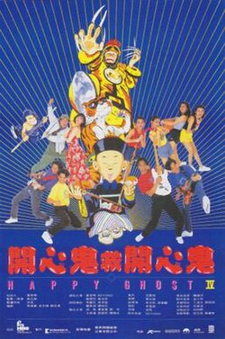

1990 Hong Kong film by Clifton Ko

| Happy Ghost IV | Happy Ghost IV |
| --- | --- |
| Original Hong Kong poster. | |
| Traditional Chinese | 開心鬼救開心鬼 |
| Simplified Chinese | 开心鬼救开心鬼 |
| Hanyu Pinyin | Kai xin gui jiu kai xin gui |
| Directed by | Clifton Ko |
| Written by | Raymond Wong[^1] |
| Produced by | Raymond Wong[^1] |
| Starring | - Raymond Wong - May Lo - Fennie Yuen - Charine Chan |
| Cinematography | Sander Lee[^1] |
| Edited by | Kam Ma[^1] |
| Production companies | Pak Ming Films Ltd.  Ko Chi Sum Films Co. Ltd. |
| Distributed by | Newport Entertainment Co. Ltd. |
| Release date | - 30 June 1990 (1990-06-30) |
| Running time | 84 minutes |
| Country | Hong Kong |
| Language | Cantonese |
| Box office | HK$ 11,780,725 |

***Happy Ghost IV*** (released in the Philippines as ***Magic to Win 4***) (Chinese: 開心鬼救開心鬼) is a 1990 Hong Kong comedy film directed by Clifton Ko. The film stars Raymond Wong and Pauline Yeung.

## Cast

-   Raymond Wong as Hong Sum-kwai
-   Pauline Yeung as Annie
-   <ContentLink uid="wiki/beyond">Beyond</ContentLink> as Man, Mo, Ying, and Kit
-   Woo Fung as Annie's father
-   Charlie Cho as Chiu
-   Tommy Wong as Crazy Bill
-   Lau Shun as Crazy Kwan Yeung
-   James Wong as judge
-   Clifton Ko as man in washroom

## Release

### Box office

*Happy Ghost IV* grossed a total of HK$11,780,725. The film ran in Hong Kong theatres from 30 June 1990 to 2 August 1990.[^2]

## Reception

In his book *Horror and Science Fiction Film IV*, Donald C Willis described *Happy Ghost IV* as an "occasionally funny low comedy" with "some okay "invisible ghost" effects".[^3]

## See also

-   Clifton Ko filmography
-   List of Hong Kong films of 1990

## Notes

### References

-   Willis, Donald C. (1997). *Horror and Science Fiction Films IV*. Scarecrow Press. ISBN 0-8108-3055-8.

## External links

-   [*Happy Ghost IV*](https://www.imdb.com/title/tt0097638/) at IMDb

| | This article related to a Hong Kong film of the 1990s is a stub. You can help Wikipedia by [adding missing information](https://en.wikipedia.org/w/index.php?title=Happy_Ghost_IV&action=edit). |
| --- | --- |

[^1]: ["Happy ghost IV"](http://ipac.hkfa.lcsd.gov.hk/ipac20/ipac.jsp?session=1E738FX784061.1525&profile=hkfa&uri=full=3100024@!30721@!0&ri=7&aspect=basic_search&menu=search&source=192.168.110.61@!horizon&ipp=20&staffonly=&term=Happy+ghost+IV&index=FILMBRP&uindex=&aspect=basic_search&menu=search&ri=7). *Hong Kong Film Archive*. Hong Kong. Retrieved 15 July 2013. [*dead link*]

[^2]: ["Box Office Hong Kong 1990 [Chinese Movies]"](https://web.archive.org/web/20041205050620/http://www.movieworld.com.hk/zine/Office/hkyear/hk1990c-en.shtml). movieworld.com. Archived from [the original](http://www.movieworld.com.hk/zine/Office/hkyear/hk1990c-en.shtml) on 5 December 2004. Retrieved 15 July 2013.

[^3]: [Willis 1997](#CITEREFWillis1997), p. 221.
