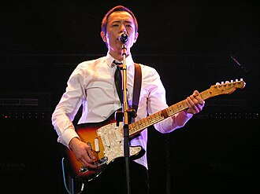

Hong Kong musical artist (born 1964)

In this Chinese name, the family name is  *Wong*.

| Paul Wong | Paul Wong |
| --- | --- |
| 黃貫中 | 黃貫中 |
| Wong performing in 2006 | |
| Born | Wong Koon-chung[^1] 31 March 1964 (age 62) British Hong Kong |
| Other names | - Godfather of bands - Godfather of rock |
| Education | Higher Diploma in Design, Hong Kong Polytechnic College |
| Occupations | - Musician - singer - songwriter - record producer - designer |
| Years active | 1985–present |
| Spouse | Athena Chu ​( 2012)​ |
| Children | 1 |
| Chinese name | Chinese name |
| Traditional Chinese | 黃貫中 |
| Simplified Chinese | 黄贯中 |
| **Musical career** | **Musical career** |
| Genres | - Rock - Cantopop - Mandopop |
| Instruments | - Vocals - guitar |
| Labels | - Universal Records - Pathe Records - Warner Records - WOW Records |
| Formerly of | <ContentLink uid="wiki/beyond">Beyond</ContentLink> |
| Musical artist | Musical artist |

| Transcriptions | Transcriptions |
| --- | --- |
| Standard Mandarin | Standard Mandarin |
| Hanyu Pinyin | Huáng Guànzhōng |
| Yue: Cantonese | Yue: Cantonese |
| Jyutping | Wong4 Gun3zung1 |

**Paul Wong Koon-chung** (born 黃貫中; 31 March 1964), known professionally as **Paul Wong**, is a Hong Kong musician, singer, songwriter and record producer. He achieved fame in Asia as the lead guitarist of the rock band <ContentLink uid="wiki/beyond">Beyond</ContentLink> until the band disbanded in 2005. After lead vocalist <ContentLink uid="wiki/wong-ka-kui">Wong Ka Kui</ContentLink>'s death, Wong became the lead vocalist and main songwriter for Beyond. He also earned the award "The Best Rock Singer" of the Hit Awards in 2012.

## Biography

### 1964–2005: Early life and Beyond

Paul Wong was born on 31 March 1964, growing up with father, mother and two younger brothers in Kowloon City. Still, his mother later lived separately from her husband and children as his parents divorced.

As a juvenile, he was the champion at a couple of art contests. Until he majored in design at Hong Kong Polytechnic College, he was invited by drummer <ContentLink uid="wiki/yip-sai-wing">Yip Sai Wing</ContentLink> to handle a design project for <ContentLink uid="wiki/beyond">Beyond</ContentLink>'s first concert. Later he became friends with them as well as a member replacing the former lead guitarist Chan Sze On. While he worked as a designer at an advertising company, he was meantime in progress of several pieces of design work, such as the envelope design of the cassette *Goodbye Ideals* (1986) and the clothing design for *Contact of Life Concert* (1991).

Regarding his vocal contribution to Beyond, he started off as the lead vocalist singing the lead on "Midnight Stray" (1988). In the same year, he later provided lead vocals on "The Ground", one of the band's big hits. Besides, he began to play roles in different television series, including *Two of a Kind* featuring Hacken Lee and Wong in the leading roles.

On 30 June 1993, the mainstay of Beyond Wong Ka Kui was deceased. Thereafter the remaining three members switched to Rock Records making the band's next album *The 2nd Floor Flat* (1994). After Wong Ka Kui's death, Paul Wong and <ContentLink uid="wiki/wong-ka-keung">Wong Ka Keung</ContentLink> became the band's primary songwriters. In circa 1999, the media told that Paul Wong and Wong Ka Keung had discorded due to the difference between their musical ideas. Beyond in 2003 resumed conducting the concerts *Beyond Beyond Beyond Live*. Still, they held the band's final and break-up concert *Beyond The Story Live* in 2005.

### 1999–present: Solo career

In late 1999, Wong launched his work as a solo singer while Beyond was taking a break. He formed the band Hann consisting of Jun Kung, Mak Man Wai (member of LMF) and Dino Acconci from the band Soler. Later on Wong established his own studio Polar Bear Studio. Afterward he signed a contract with Universal Records and then released *Yellow Paul Wong* (2001) and *Black White* (2001) in order. By these two albums, he won "The Gold Award as a Singer-songwriter" in Ultimate Song Chart Awards Presentation (2001 & 2002).

Wong showed his interest in musicals. In 2000 he played the protagonist Tony in the musical *The Dream Broken in Victoria Harbour* by troupe Theatre Space.[^2] The story was adapted from a broadway musical *West Side Story*, which was localised and whose background was moved to Hong Kong. At the performances, local conductor Henry Shek took the lead and played with Hong Kong New Philharmonic Symphonic Orchestra as all performers at the seashore of Hong Kong Cultural Centre.

In November 2002 Wong held his debut concert *Play It Loud* in Hong Kong Coliseum. After the contract with Universal had ended, he issued an album *Existence* (2004), where he invested in by himself.

In 2005 by the dissolution of Beyond, they ran eight sessions of *Beyond The Story Live 2005* at Hong Kong Coliseum, which is the band's last world tour. Consequently, he worked as the musical supervisor for the musical *Akapi Shooting Incident* by Commercial Radio Hong Kong, in which Sammy Leung and Kitty Yuen engaged and Wong also wrote a few soundtracks.

In April 2006, Wong signed a contract with Chinese Warner Records to explore the market of the Mainland China. In October he conducted solo concerts at Hong Kong Coliseum, namely *Paul Wong Hong Kong Concert 2006: The Music of Madman's Study*.

## Discography

### Solo albums and EPs

| Release date | Title | Language | Label |
| --- | --- | --- | --- |
| January 2001 | *Yellow Paul Wong* | Cantonese | Universal |
| December 2001 | *Black White* (黑白) | Cantonese | Universal |
| April 2002 | *Identical Root* (同根) | Cantonese | Universal |
| November 2002 | *Play It Loud* | Cantonese | Universal |
| July 2004 | *I Now Exists* (我在存在) | Cantonese | Pathe Records |
| July 2007 | *I Now Exists* | Mandarin | WOW Music |
| October 2011 | *Concerto in A minor* (A小調協奏曲) | Cantonese / Mandarin | WOW Music |
| January 2013 | *Paul Wong Collection* | Mandarin | WOW Music |
| September 2025 | *Fragments* (碎片) | Cantonese | |

### Songs for artists

| Year | Single | Artist | Role |
| --- | --- | --- | --- |
| 1997 | "Distressed By Myself" (自尋煩惱) | Andy Hui | - Songwriter - Lyricist - Arranger - Producer |
| 1998 | "Just Say Gooy-Bye" | Karen Mok | Songwriter |
| 1999 | "Nuts" (神經病) | Jordan Chan | Songwriter |
| 1999 | "Don't Let Me Drink Too Much" (別讓我喝太多) | Andy Hui | Songwriter |
| 1999 | "I Can't" | Andy Hui | Songwriter |
| 1999 | "On My God" (我的天) | Karen Mok | - Songwriter - Arranger - Producer |
| 1999 | "Awesome" (了不起) | Lawrence Chou | Songwriter, Lyricist |
| 2000 | "A Black Tie" (黑色領帶) | Daniel Chan | Songwriter, Arranger |
| 2000 | "Drive" | Kang Jingchun (康淨淳) | Songwriter |
| 2000 | "Everyone Is Mad" (所有人是傻) | Nicholas Tse | - Songwriter - Arranger - Producer |
| 2001 | "Good Dog" (好狗) | Jan Lamb | - Songwriter - Arranger - Producer |
| 2002 | "Elegance Wins the Heaven" (美麗勝天國) | Wong He | Songwriter |
| 2002 | "Rainy Days" | Athena Chu | Songwriter, Producer |
| 2002 | "Jump Up" (跳起來) | Athena Chu | - Songwriter - Arranger - Producer |
| 2002 | "New Colourful World" (彩色新天地) | Johnny Tseng (曾國銘) | Songwriter |
| 2002 | "We Can Change" | Wong Ka Ming (王嘉明) | Songwriter, Arranger |
| 2003 | "Overnight Feud" (隔夜仇) | Hacken Lee | Songwriter, Producer |
| 2003 | "Understand, okay" (明白了吧) | Hacken Lee | Songwriter, Producer |
| 2004 | "How Much Can You Love" (可以幾愛) | Ella Koon | Songwriter, Producer |
| 2004 | "Awesome (了不起)" | Andy Hui | Songwriter |
| 2004 | "Marlon Brando" (馬龍白蘭度) | Andy Lau | - Songwriter - Arranger - Producer |
| 2004 | "Your Majesty" (萬歲) | Jordan Chan | Songwriter |
| 2004 | "Saturday Night" | Andy Hui | Songwriter, Producer |
| 2004 | "Don't Provoke Me" (不要惹我) | Athena Chu | Songwriter, Producer |
| 2004 | "Ah-oh" | Athena Chu | Songwriter, Producer |
| 2004 | "Spell" (法術) | Athena Chu | Songwriter, Producer |
| 2004 | "I Win" (我贏了) | Athena Chu | Songwriter, Producer |
| 2004 | "A Queen in Trouble" (落難皇后) | Gigi Leung | - Songwriter - Arranger - Producer |
| 2005 | "Where Are You" (你在哪裡) | Fiona Sit | Producer |
| 2006 | "Good Brothers" (好兄弟) | Softhard | - Songwriter - Arranger - Producer |
| 2008 | "A Representative Wife" (標準太太) | Josie Ho | - Songwriter - Arranger - Producer |
| 2008 | "A Poisoned Scorpion" (中毒蠍子) | Josie Ho | Songwriter, Arranger |
| 2008 | "Not a Doll" (不是娃娃) | Elanne Kwong | Songwriter, Producer |
| 2008 | "Starting Off" (出發) | Liu Xuan | - Songwriter - Lyricist - Arranger - Producer |
| 2008 | "An Inflatable Doll" (充氣娃娃) | Shino Lin | Songwriter |
| 2008 | "Go Go Dragon" (GO GO 飛龍) | Jan Lamb | Songwriter, Producer |
| 2009 | "Authentic" (不加塑) | Keeva Mak (麥家瑜) | Songwriter, Arranger |
| 2009 | "Hong Kong Hong Kong" (香港香港) | Alan Tam | - Songwriter - Arranger - Producer |
| 2009 | "Last Time the Last Time" (上次無下次) | Alan Tam | - Songwriter - Arranger - Producer |
| 2009 | "Poors" (窮鬼) | Jan Lamb | - Songwriter - Arranger - Producer |
| 2009 | "Never Said Goodbye" | Juno Mak | Arranger, guitar |
| 2011 | "Ignorant During Youthhood" (年少無知) | Bowie Lam, Moses Chan, Kenny Wong (黃德斌) | Songwriter, Producer |
| 2015 | "A Virtuous Robber" (盜亦有道) | Alex Chia (謝中傑) | - Songwriter - Arranger - Producer |

## Filmography

| Film | Year | Role |
| --- | --- | --- |
| *<ContentLink uid="wiki/sworn-brothers">Sworn Brothers</ContentLink>* | 1987 | |
| *No Regret* | 1987 | |
| *The Black Wall* | 1989 | |
| *The Fun, the Luck & the Tycoon* | 1989 | |
| *<ContentLink uid="wiki/happy-ghost-iv">Happy Ghost IV</ContentLink>* | 1990 | |
| *Beyond's Diary* | 1991 | |
| *Daddy, Father and Papa* | 1991 | |
| *Love and Let Love!* | 1998 | |
| *The Boss Up There* | 1999 | |
| *Sleeping with the Dead* | 2002 | |
| *Escape from Hong Kong Island* | 2004 | |
| *The Heavenly Kings* | 2006 | |
| *Wonderful Times* | 2006 | |
| *Rebellion* | 2009 | |
| *Young and Dangerous: Reloaded* | 2013 | |
| *The Way We Dance* | 2013 | |
| *Doomsday Party* | 2013 | |

## External links

-   [Beyond Music](https://web.archive.org/web/20180227093230/http://www.beyondmusic.net/)
-   [Hong Kong Vintage Pop Radio – Beyond](http://www.hkvpradio.com/artists/beyond/)
-   [Ovation](http://www.ovationguitars.com/?fa=artists&startz=61)

References

[^1]: ["Madman's Work by Paul Wong Koon-chung"](https://www.scmp.com/article/574357/madmans-work-paul-wong-koon-chung). *Madman's Work by Paul Wong Koon-chung*. South China Morning Post. 6 December 2006. Retrieved 26 October 2021.

[^2]: ["West Side Story"](http://www.theatrespace.org/portfolio-items/west-side-story/?lang=en). *Theatre Space*. 2014. Retrieved 1 November 2021.
