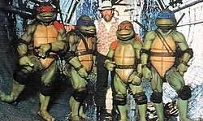

Film by Steve Barron

This article is about the 1990 film. For other entries in the franchise, see Teenage Mutant Ninja Turtles (disambiguation).

| Teenage Mutant Ninja Turtles | Teenage Mutant Ninja Turtles |
| --- | --- |
| _poster.jpg)Theatrical release poster | |
| Directed by | Steve Barron |
| Screenplay by | - Todd W. Langen - Bobby Herbeck |
| Story by | Bobby Herbeck |
| Based on | Characters created by - Kevin Eastman - Peter Laird |
| Produced by | - Kim Dawson - Simon Fields - David Chan |
| Starring | - Judith Hoag - Elias Koteas |
| Cinematography | John Fenner |
| Edited by | - William D. Gordean - Sally Menke - James R. Symons |
| Music by | John Du Prez |
| Production companies | - Golden Harvest Entertainment Company[^1] - Limelight Productions[^1] - 888 Productions[^1] |
| Distributed by | New Line Cinema[^1] |
| Release date | - March 30, 1990 (1990-03-30) (United States) |
| Running time | 92 minutes[^2] |
| Country | United States[^1][^3] |
| Language | English |
| Budget | $13.5 million[^1][^4] |
| Box office | $202 million[^4][^5] |

***Teenage Mutant Ninja Turtles*** is a 1990 American superhero comedy film based on the comic book characters created by Kevin Eastman and Peter Laird. It is the first installment in the *Teenage Mutant Ninja Turtles* film series. Directed by Steve Barron and written by Todd W. Langen and Bobby Herbeck, the film follows the Turtles on a quest to save their master, Splinter, with their new allies, April O'Neil (Judith Hoag) and Casey Jones (Elias Koteas), from the Shredder and his Foot Clan.

The film adapts the early *Teenage Mutant Ninja Turtles* comics, with several elements taken from the animated series airing at the time. Filming took place in 1989 in North Carolina and New York City. Many major studios turned down distribution for the film, worrying that it could be a box office disappointment. New Line Cinema, at that time a small independent production company, acquired the rights halfway through production. The turtle costumes were developed by Jim Henson's Creature Shop, one of Jim Henson's last projects before his death shortly after the premiere.

*Teenage Mutant Ninja Turtles* was released in the United States on March 30, 1990, by New Line Cinema, and received mixed reviews from critics. It grossed $202 million on a budget of $14 million, and was the highest-grossing independent film up to that time[^6] and the ninth-highest-grossing film of 1990. It was followed by *<ContentLink uid="wiki/teenage-mutant-ninja-turtles-ii-the-secret-of-the-ooze">Teenage Mutant Ninja Turtles II: The Secret of the Ooze</ContentLink>* (1991) and *Teenage Mutant Ninja Turtles III* (1993).

## Plot

April O'Neil, a television reporter investigating a crime wave terrorizing New York City, is attacked by thieves, but is saved by an unseen group of vigilantes, the Teenage Mutant Ninja Turtles — Leonardo, Donatello, Michelangelo, and Raphael. However, Raph loses a sai in the fight, which April recovers. The turtles return to their hidden lair in the sewer, where their adoptive father, a rat named Splinter, advises them to continue practicing the art of ninjutsu. Visiting the surface, Raph watches *Critters*, only to run into fellow vigilante Casey Jones, and is counseled by Splinter.

Charles Pennington, April's supervisor at Channel 3 News, struggles to control his delinquent son Danny, who has been recruited with other troubled teenagers to help the mysterious ninja Foot Clan in their wave of thefts. April suspects that the Foot are responsible, raising the ire of Police Chief Sterns, while Shredder, the leader of the Foot, sends his soldiers after April. Raph defeats them and brings the unconscious April to the turtles' lair, unknowingly followed by a Foot soldier. Splinter explains to April that he and the turtles were mutated into intelligent, anthropomorphic creatures by a mysterious chemical. After escorting April home and bonding over their love of pizza, the turtles return to find their lair ransacked and Splinter kidnapped, and return to April's apartment.

Danny is arrested, which Sterns uses to pressure Charles, who urges April to drop her investigation. Glimpsing the turtles hiding at April's apartment, Danny informs Shredder at the Foot's hideout, where Splinter is being held prisoner. Back at April's place, Raph argues with Leo over his leadership, and is ambushed on the rooftops by the Foot and beaten unconscious. Casey witnesses this and aids the turtles in fighting off the Foot and escape the burning building with April, who is fired by Charles in a phone message. Danny seeks counsel from the captive Splinter, and flees the Foot Clan. The turtles retreat to April's rundown family farm upstate, where she bonds with Casey as Raph recovers. Leo receives a vision of Splinter and assembles the other turtles to contact him through astral projection. Splinter delivers his final lesson, inspiring the turtles to return to the city.

The turtles find Danny hiding in their lair, and Casey follows him to the Foot's hideout. Splinter tells Danny that as an ordinary pet in Japan, he learned ninjutsu from watching his master, the ninja Hamato Yoshi. To escape conflict with his rival, Oroku Saki, over the love of a woman, Tang Shen, Yoshi fled with Shen to New York, where they were killed by a vengeful Saki. Splinter suggests Saki is linked to the Foot, while Shredder finds Danny and realizes that the turtles have returned, ordering Splinter to be killed. Casey and Danny free Splinter and defeat Shredder's lieutenant Tatsu, before convincing the remaining Foot members that they have been manipulated by Shredder.

The turtles repel the Foot from their lair and onto the streets, before confronting the spear-wielding Shredder on a rooftop. After a fierce battle, Shredder claims that Splinter is dead, overpowering an infuriated Leo and disarming the turtles. Before Shredder can kill Leo, Splinter appears and identifies him as Oroku Saki, who in turn recognizes Splinter as Yoshi's pet rat. Shredder charges Splinter, who snares his spear with Mikey's nunchaku, leaving Shredder dangling over the roof's edge. Shredder makes a final attempt to kill Splinter with a thrown tantō, but Splinter drops him into a garbage truck below. Casey then deliberately activates the truck's compactor, crushing Shredder.

The police arrive to arrest the Foot soldiers, and recover the stolen goods from their hideout. The Channel 3 news crew arrives as well to cover the story, and Danny is reunited with Charles, who gives April her job back with major benefits. April and Casey share a kiss, while the turtles celebrate their victory with Splinter.

## Cast

Judith Hoag in 2005 (left) and Elias Koteas in 2011.

-   Judith Hoag as April O'Neil: A young reporter for Channel 3 News.
-   Elias Koteas as Casey Jones: A streetwise vigilante and former ice hockey player.
-   Raymond Serra as Chief Sterns: The chief of the New York City Police Department.
-   Michael Turney as Danny Pennington: A delinquent youth and prospect for the Foot Clan.
-   James Saito / David McCharen (voice) as The Shredder: The leader of the Foot Clan, a network of runaways-turned-thieves.
-   Jay Patterson as Charles Pennington: April's supervisor at Channel 3 News and Danny's father.
-   Toshishiro Obata / Michael McConnohie (voice) as Tatsu: Shredder's second-in-command.
-   Josh Pais (in-suit performer/voice) as Raphael: The strong and angry member of the Turtles.[^6]
    -   David Greenaway performs the remote facial puppetry for Raphael.
-   Michelan Sisti (in-suit performer) and Robbie Rist (voice) as Michelangelo: The least-mature and fun-loving partier of the Turtles.[^6]
    -   Mak Wilson performs the remote facial puppetry for Michelangelo.
-   Leif Tilden (in-suit performer) and Corey Feldman (voice) as Donatello: The smart one of the Turtles.
    -   David Rudman performs the remote facial puppetry for Donatello.
-   David Forman (in-suit performer) and Brian Tochi (voice) as Leonardo: The leader and most mature of the Turtles and the closest to Splinter.
    -   Martin P. Robinson performs the remote facial puppetry for Leonardo.

Kevin Clash performs and voices Splinter, a rat and the Turtles' mentor. Other members of the Foot Clan include Sam Rockwell as the head thug, Leif Tilden as a messenger, and David Forman as the gang member who encounters Casey Jones at a warehouse. Michelan Sisti also appears as a Domino's Pizza delivery man and Josh Pais as a cab passenger who briefly encounters the masked Raphael. *TMNT* co-creator Kevin Eastman has a small cameo as a garbage man. According to him, he was supposed to have an extended spot, but it ended up being a background cameo instead.[^7]

## Production

### Pre-production

In the mid-1980s, creators Kevin Eastman and Peter Laird were pitched a concept of a live-action film adaptation by Roger Corman for his studio New World Pictures. The film was to have starred comedians Sam Kinison, Gallagher, Bobcat Goldthwait and Billy Crystal in makeup as the turtles.[^8][^9]

The script is based mainly on the early *Teenage Mutant Ninja Turtles* comics, including the stories of the turtles' origins, rooftop battle, sojourn to the farmhouse, and battle with Shredder. Elements were taken from the 1980s animated series, such as the Turtles' colored bandanas and love of pizza, elements of Michelangelo's character, and April O'Neil as a television reporter instead of a lab assistant.[^10]

### Filming and post-production

The film's budget was $13.5 million.[^1][^4] Much of the production took place in North Carolina, with a couple of location shoots in New York City during the summer of 1989 to capture famous landmark areas, such as the World Trade Center, Times Square, the Empire State Building, and the Hudson River.[^6] Filming in North Carolina took place at the North Carolina Film Studios, where New York rooftop sets were created. Production designer Roy Forge Smith and his art director, Gary Wissner, went to New York City four months prior to filming and took still photographs of rooftops and other various locations. While in NYC, Smith and Wissner were allowed to explore an abandoned Brooklyn subway line, as they could not gain access to a city sewer, but the structure of the subway had the same principle as a sewer. They also went to a water tunnel which had large pipes running through it.[^11]

Many major studios, such as Walt Disney Pictures, Columbia Pictures, Universal Pictures, MGM/UA, Orion Pictures, 20th Century Fox (who later would distribute the sequels internationally), Paramount Pictures (whose parent company Viacom would acquire the *TMNT* property in 2009), and Warner Bros. Pictures turned down the film for distribution; they were worried that despite the popularity of the cartoon and the toy line, the film could potentially be a box office disappointment, like *Masters of the Universe* was just a couple years prior.[^6] The film found distribution roughly halfway through the initial production, via the then small and independent production company New Line Cinema, which had been known for distributing low-budget B movies and arthouse fare.[^6] According to Brian Henson, the film was finished in post-production largely without Barron. Editor Sally Menke, who later edited many films by Quentin Tarantino, was removed as production company Golden Harvest did not like her work.[^12]

### Costume design

*Jim Henson on set with the suit actors. The film was released less than two months before Henson's death.*

The turtle costumes were created by Jim Henson's Creature Shop in London.[^6] Jim Henson said that the creatures were the most advanced that he had ever worked with. The creatures were first made out of fiberglass, and then remolded out of clay.[^13] They were produced as molds to cast the whole body in foam rubber latex. The work at the Creature Shop was completed within 18 weeks.[^11]

The costumes used state-of-the-art animatronics to make the face masks expressive. The masks included a set of internal animatronic mouths, eyes and eyebrows which were managed by a technician with the help of a computer. The computer could codify a set of expressions, such as anger or awe, which were later programmed into the keys of a joystick handed by the technician. Capture of movement was also used for the lips. The technician could wear a special helmet with cameras recording the lips when pronouncing a phrase, and transferring to the mechanical lips embedded in the masks.[^14]

## Music

Main article: *Teenage Mutant Ninja Turtles: The Original Motion Picture Soundtrack*

## Release

### Marketing

Live Entertainment Inc. announced that the film would go to VHS via its Family Home Entertainment label on October 4, 1990. The suggested price was $24.99 per cassette. Pizza Hut engaged in a $20 million marketing campaign tied into the film (despite the fact that Domino's Pizza was used as product placement in the film itself). Items included advertising in print, radio and television, and several rebate coupons.[^15]

### Alternate versions

The UK version removed Eastern fighting weapons like the nunchaku, using alternate shots of Michaelangelo in order to conceal his nunchaku weapon, or omitting the show-off duel between Michaelangelo and a member of the Foot clan. Also, the scene of Shredder in the garbage shred was heavily edited and the Turtle Power song was edited to change the word 'ninja' to 'hero' as per the UK television series. The unedited version was released on DVD in 2004 in the UK.[^16]

### Home media

On October 4, 1990, the film was released on VHS[^17] and reached No. 4 in the home video market.[^18]

On August 11, 2009, the film was included in a special 25th anniversary box set (commemorating the original comic book), released to both DVD and Blu-ray formats. It also contained *<ContentLink uid="wiki/teenage-mutant-ninja-turtles-ii-the-secret-of-the-ooze">Teenage Mutant Ninja Turtles II: The Secret of the Ooze</ContentLink>*, *Teenage Mutant Ninja Turtles III*, and the animated release, *TMNT* (2007). No additional features, other than theatrical trailers, were included. In Germany, a "Special Edition" was released on March 12, 2010, with additional features, including an audio commentary by director Steve Barron, an alternate ending, and alternate takes from the original German release, where Michelangelo's nunchaku had been edited out.[^19] Warner Home Video released the film along with *Secret of the Ooze* and *Teenage Mutant Ninja Turtles III* as part of a "Triple Feature" on Blu-ray in June 2012, minus the fourth film *TMNT*. Warner Home Video released the film separately on Blu-ray on December 18. In the UK, Medium Rare released the film along with its sequels in a 3 DVD set on 28 October 2013.[^20]

In December 2025, Arrow Video released the film on both 4K Ultra HD Blu-ray and Blu-ray formats, along with *Secret of the Ooze* and *Teenage Mutant Ninja Turtles III*, in the UK, the US and Canada.[^21]

## Reception

### Box office

The film opened in the United States on March 30, 1990, and was number one at the box office over the weekend, grossing more than $25 million, the biggest opening weekend an independent film had ever had up to that time.[^22][^23] It went on to gross $32 million in its opening week, making it the second biggest US opening ever up until then (after 1989's *Batman*).[^24]

The film turned out to be a huge success at the box office, eventually making over $135 million in North America, and over $66 million outside North America, for a worldwide total of over $200 million, making it the ninth highest-grossing film of 1990 worldwide.[^4] The film was also nominated for awards by The Academy of Science Fiction, Fantasy and Horror Films.[^25]

During its 2025 theatrical re-release, the film made $3.3 million during its first week. Its success led to Fathom Events extending the re-release for an additional week and a re-release for the sequel *<ContentLink uid="wiki/teenage-mutant-ninja-turtles-ii-the-secret-of-the-ooze">Teenage Mutant Ninja Turtles II: The Secret of the Ooze</ContentLink>* which released in March 2026.[^26]

### Critical response

On the film's initial release, Roger Ebert gave 2.5 out of 4 stars and concluded it to be "nowhere near as bad as it might have been, and probably is the best possible Teenage Mutant Ninja Turtle movie. It supplies, in other words, more or less what Turtle fans will expect". Ebert singled out the production design, which he described as a "low-rent version of *Batman* or *Metropolis*."[^27] *Variety* praised the film's tongue-in-cheek humor and "amusingly outlandish" martial arts sequences, but thought it was "visually rough around the edges" and "sometimes sluggish in its plotting".[^28] Janet Maslin of *The New York Times* criticized the cinematography, stating that it was so "poorly photographed that the red-masked turtle looks almost exactly like the orange-masked one".[^29] Kim Newman wrote in the *Monthly Film Bulletin* that he found the characters reminiscent of the early 1970s Godzilla film series, describing the turtles as "loveable monsters in baggy foam rubber suits" who "befriended lost children and smashed things up in orgies of destruction that somehow never hurt anyone" and "drop the occasional teenage buzzword but are never remotely convincing as teenagers, mutants, ninjas or turtles".[^30]

*Variety*, the *New York Times*, and the *Monthly Film Bulletin* all noted the Asian villains of the film; *Variety* described "overtones of racism in its use of Oriental villains", while Maslin stated "the story's villainous types are Asian, and the film plays the yellow-peril aspects of this to the hilt".[^30][^29][^28] Newman noted a racist joke in April O'Neil's response to the Foot Clan, "What's the matter, did I fall behind on my Sony payments?", finding that the film expressed a "resentment of Japan's economic strength even while the film is plundering Japan's popular culture".[^30] Ebert felt there was "no racism" in the film.[^27]

Lloyd Bradley of *Empire* gave the film four out of five stars, stating: "A well-rounded, unpretentious, very funny, knockabout adventure – subtly blended so that it's fun for all the family".[^31] Owen Gleiberman, writing for *Entertainment Weekly*, gave an F rating, finding that none of the four turtles or Splinter had any personality, but felt that a young audience might enjoy the film, noting he might have "gone for it too had I been raised on Nintendo games and the robotic animation that passes for entertainment on today's Saturday-morning TV".[^32]

*Entertainment Weekly* and *The New York Times* praised the work of Jim Henson's Creature Shop, with Maslin stating "without which there would have been no film at all".[^32][^29]

As of 2025, the film has an approval rating of 46% on Rotten Tomatoes based on reviews from 57 critics and an average rating of 5.10/10. The website's consensus states, "*Teenage Mutant Ninja Turtles* is exactly as advertised: one-liners, brawls, and general silliness. Good for the young at heart, irritating for everyone else".[^33] On Metacritic, it has a score of 51 based on reviews from 21 critics, indicating "mixed or average reviews".[^34]

*Turtles* co-creator Peter Laird praised the film in the 2014 documentary *Turtle Power: The Definitive History of the Teenage Mutant Ninja Turtles* saying, "I cannot sit here and honestly say there is anything I would change about [the movie] to make them better." Kevin Eastman went on to say in 2022 that this film will always be the best *Turtles* film adaptation.[^35]

## Sequels

Main articles: <ContentLink uid="wiki/teenage-mutant-ninja-turtles-ii-the-secret-of-the-ooze"><i>Teenage Mutant Ninja Turtles II: The Secret of the Ooze</i></ContentLink> and *Teenage Mutant Ninja Turtles III*

A second film, *<ContentLink uid="wiki/teenage-mutant-ninja-turtles-ii-the-secret-of-the-ooze">Teenage Mutant Ninja Turtles II: The Secret of the Ooze</ContentLink>*, was released in 1991. With a rushed production and a lighter tone, it received weaker reviews and was less successful at the box office.[^36] *Teenage Mutant Ninja Turtles III* (1993) was aimed at the Japanese market, the largest foreign market for US films at the time, but failed to see release there and had weaker reviews and sales.[^37][^36]

## Further reading

-   Siegel, Alan (March 31, 2020). ["Green Screen: The Oral History of 'Teenage Mutant Ninja Turtles'"](https://www.theringer.com/movies/2020/3/31/21196871/teenage-mutant-ninja-turtles-1990-movie-oral-history). *The Ringer*. Retrieved October 4, 2023.

## External links

Wikiquote has quotations related to ***Teenage Mutant Ninja Turtles***.

Wikimedia Commons has media related to Teenage Mutant Ninja Turtles (1990 film).

-   [Official Warner Bros. Site](https://www.warnerbros.com/movies/teenage-mutant-ninja-turtles)
-   [*Teenage Mutant Ninja Turtles*](https://www.imdb.com/title/tt0100758/) at IMDb

Portals:

-   Film
-   United States
-   1990s
-   Speculative fiction
-   Hong Kong
-   Comedy
-   Comics

References

[^1]: ["Teenage Mutant Ninja Turtles (1990)"](https://catalog.afi.com/Film/58704-TEENAGE-MUTANTNINJATURTLES). *AFI Catalog of Feature Films*. [Archived](https://web.archive.org/web/20190902130350/https://catalog.afi.com/Film/58704-TEENAGE-MUTANTNINJATURTLES) from the original on September 2, 2019. Retrieved March 21, 2020.

[^2]: ["*Teenage Mutant Ninja Turtles* (PG)"](https://www.bbfc.co.uk/release/teenage-mutant-ninja-turtles-q29sbgvjdglvbjpwwc0yotizmtg). *British Board of Film Classification*. [Archived](https://web.archive.org/web/20260111012414/https://www.bbfc.co.uk/release/teenage-mutant-ninja-turtles-q29sbgvjdglvbjpwwc0yotizmtg) from the original on January 11, 2026. Retrieved December 4, 2025.

[^3]: ["Teenage Mutant Ninja Turtles (1990)"](https://web.archive.org/web/20210515023434/https://www2.bfi.org.uk/films-tv-people/4ce2b7a443991). Archived from [the original](https://www2.bfi.org.uk/films-tv-people/4ce2b7a443991) on May 15, 2021. Retrieved May 15, 2021.

[^4]: ["Teenage Mutant Ninja Turtles"](https://boxofficemojo.com/movies/?id=teenagemutantninjaturtles.htm). *Box Office Mojo*. [Archived](https://web.archive.org/web/20061006032941/http://boxofficemojo.com/movies/?id=teenagemutantninjaturtles.htm) from the original on October 6, 2006. Retrieved September 24, 2006.

[^5]: ["Teenage Mutant Ninja Turtles (1990)"](https://www.the-numbers.com/movie/Teenage-Mutant-Ninja-Turtles-(1990)#tab=summary). *The Numbers*. [Archived](https://web.archive.org/web/20200623221416/https://www.the-numbers.com/movie/Teenage-Mutant-Ninja-Turtles-(1990)#tab=summary) from the original on June 23, 2020. Retrieved April 22, 2020.

[^6]: Aaron Couch (April 2, 2015). ["'Teenage Mutant Ninja Turtles': Untold Story of the Movie "Every Studio in Hollywood" Rejected"](https://www.hollywoodreporter.com/features/teenage-mutant-ninja-turtles-untold-785653). *The Hollywood Reporter*. [Archived](https://web.archive.org/web/20200621102039/https://www.hollywoodreporter.com/features/teenage-mutant-ninja-turtles-untold-785653) from the original on June 21, 2020. Retrieved April 1, 2021.

[^7]: Wong, Kevin. ["Teenage Mutant Ninja Turtles Movie (1990): 42 Easter Eggs & References From The First Film"](https://www.gamespot.com/gallery/teenage-mutant-ninja-turtles-movie-1990-42-easter-/2900-3435/). *GameSpot*. [Archived](https://web.archive.org/web/20220605082604/https://www.gamespot.com/gallery/teenage-mutant-ninja-turtles-movie-1990-42-easter-/2900-3435/) from the original on June 5, 2022. Retrieved June 6, 2023.

[^8]: Scott, Ryan (September 7, 2023). ["B-Movie Legend Roger Corman Could've Made A TMNT Film – With The Wildest Cast Imaginable"](https://www.slashfilm.com/1388021/roger-corman-tmnt-film-with-wildest-cast-imaginable/). *SlashFilm*. Static Media. Retrieved July 12, 2025.

[^9]: ["Green Screen: The Oral History of 'Teenage Mutant Ninja Turtles'"](https://www.theringer.com/movies/2020/3/31/21196871/teenage-mutant-ninja-turtles-1990-movie-oral-history). *www.theringer.com*. March 31, 2020. Retrieved July 12, 2025.

[^10]: Mike Cecchini (August 11, 2014). ["Teenage Mutant Ninja Turtles: The Comic Book Roots of the First TMNT Movie"](https://www.denofgeek.com/movies/teenage-mutant-ninja-turtles-the-comic-book-roots-of-the-first-tmnt-movie/). *Den of Geek*. [Archived](https://web.archive.org/web/20180727162525/http://www.denofgeek.com/us/books-comics/teenage-mutant-ninja-turtles/238162/teenage-mutant-ninja-turtles-the-comic-book-roots-of-the-first-tmnt-movie) from the original on July 27, 2018. Retrieved March 26, 2018.

[^11]: ["TMNT I"](https://web.archive.org/web/20060425163912/http://www.ninjaturtles.com/movies/movie1.htm). *ninjaturtles.com*. Archived from [the original](http://www.ninjaturtles.com/movies/movie1.htm) on April 25, 2006. Retrieved September 24, 2006.

[^12]: ["The Original Teenage Mutant Ninja Turtles Movie Is Still Amazing"](https://www.denofgeek.com/movies/the-original-teenage-mutant-ninja-turtles-movie-is-still-amazing/). *Den of Geek*. [Archived](https://web.archive.org/web/20191112165500/https://www.denofgeek.com/us/movies/teenage-mutant-ninja-turtles/238339/the-original-teenage-mutant-ninja-turtles-movie-is-still-amazing) from the original on November 12, 2019. Retrieved March 26, 2018.

[^13]: ["Mock Turtle Suits"](https://ew.com/article/1990/03/30/mock-turtle-suits/). Entertainment Weekly. March 30, 1990. [Archived](https://web.archive.org/web/20121020093917/https://www.ew.com/ew/article/0,,317054,00.html) from the original on October 20, 2012. Retrieved December 7, 2010.

[^14]: ["Youtube. Film 90's report on the animatronics by Jim Henson's Creature Shop for the 1990 movie Teenage Mutant Ninja Turtles"](https://www.youtube.com/watch?v=JzzieEpUffw). *YouTube*. December 30, 2016. [Archived](https://web.archive.org/web/20230328152047/https://www.youtube.com/watch?v=JzzieEpUffw) from the original on March 28, 2023. Retrieved March 28, 2023.

[^15]: Pendleton, Jennifer. "[RELEASE OF `NINJA TURTLES' WILL FUEL BUSY VIDEO-BUYING SEASON THIS FALL](http://nl.newsbank.com/nl-search/we/Archives?p_product=NewsLibrary&p_multi=DSNB&d_place=DSNB&p_theme=newslibrary2&p_action=search&p_maxdocs=200&p_topdoc=1&p_text_direct-0=0F35FDC0189F21A1&p_field_direct-0=document_id&p_perpage=10&p_sort=YMD_date:D&s_trackval=GooglePM) [Archived](https://web.archive.org/web/20120111103026/http://nl.newsbank.com/nl-search/we/Archives?p_product=NewsLibrary&p_multi=DSNB&d_place=DSNB&p_theme=newslibrary2&p_action=search&p_maxdocs=200&p_topdoc=1&p_text_direct-0=0F35FDC0189F21A1&p_field_direct-0=document_id&p_perpage=10&p_sort=YMD_date:D&s_trackval=GooglePM) January 11, 2012, at the Wayback Machine." *Los Angeles Daily News* at *The Deseret News*. July 22, 1990. Retrieved on September 6, 2011.

[^16]: Gerald Wurm. ["Teenage Mutant Ninja Turtles - The Movie (Comparison: BBFC PG VHS - BBFC PG DVD) - Movie-Censorship.com"](http://www.movie-censorship.com/report.php?ID=3927). *movie-censorship.com*. [Archived](https://web.archive.org/web/20120511164226/http://www.movie-censorship.com/report.php?ID=3927) from the original on May 11, 2012. Retrieved October 19, 2011.

[^17]: *Teenage Mutant Ninja Turtles*. Worldcat. 1990. OCLC [607485386](https://search.worldcat.org/oclc/607485386).

[^18]: Hunt, Dennis (October 18, 1990). ["Ninja Turtles Barrels Up Rental Chart"](https://www.latimes.com/archives/la-xpm-1990-10-18-ca-3609-story.html). *Los Angeles Times*. [Archived](https://web.archive.org/web/20160306152248/https://articles.latimes.com/1990-10-18/entertainment/ca-3609_1_rental-market) from the original on March 6, 2016. Retrieved November 9, 2010.

[^19]: ["'Teenage Mutant Ninja Turtles' Alternative Extended Ending"](https://www.slashfilm.com/2010/08/10/teenage-mutant-ninja-turtles-alternative-extended-ending/). */Film*. [Archived](https://web.archive.org/web/20101025172020/http://www.slashfilm.com/2010/08/10/teenage-mutant-ninja-turtles-alternative-extended-ending/) from the original on October 25, 2010. Retrieved November 9, 2010.

[^20]: ["Teenage Mutant Ninja Turtles - The Movie Collection: 3DVD Set"](https://www.amazon.co.uk/Teenage-Mutant-Ninja-Turtles-Collection/dp/B00DVNXW9O). October 28, 2013. [Archived](https://web.archive.org/web/20230306234030/https://www.amazon.co.uk/Teenage-Mutant-Ninja-Turtles-Collection/dp/B00DVNXW9O) from the original on March 6, 2023. Retrieved April 5, 2020 – via Amazon.

[^21]: Fallon, Sean (August 14, 2025). ["The Teenage Mutant Ninja Turtles Trilogy Arrives On 4K Blu-ray For The First Time"](https://comicbook.com/movies/news/the-teenage-mutant-ninja-turtles-trilogy-arrives-in-4k-blu-ray-for-the-first-time/). *ComicBook.com*. Retrieved August 14, 2025.

[^22]: Broeske, Pat H. (April 3, 1990). ["Turtles Wax the Opposition at Box Office : Film: Moviegoers spent more than $25 million on the opening weekend of the New Line Cinema movie"](https://www.latimes.com/archives/la-xpm-1990-04-03-ca-826-story.html?_amp=true). *Los Angeles Times*. [Archived](https://web.archive.org/web/20160804124917/https://articles.latimes.com/1990-04-03/entertainment/ca-826_1_weekend-box) from the original on August 4, 2016. Retrieved November 9, 2010.

[^23]: McBride, Joseph (September 17, 1991). "Top 10 Gets Rise Out Of Freddy". *Daily Variety*. p. 1.

[^24]: Smith, Wes (May 7, 1990). ["Turtle mania: Everything you need to know about America's Ninja heroes in a half shell"](https://www.newspapers.com/image/811085186/). *Anderson Independent-Mail*. p. 6A. [Archived](https://web.archive.org/web/20220603084634/https://www.newspapers.com/image/811085186/) from the original on June 3, 2022. Retrieved April 21, 2022 – via Newspapers.com.

[^25]: ["Ninja Turtle Movie Honored by Sci-Fi Academy"](https://www.latimes.com/archives/la-xpm-1990-03-08-ca-3120-story.html?_amp=true). *Los Angeles Times*. Associated Press. March 8, 1990. [Archived](https://web.archive.org/web/20160804131118/https://articles.latimes.com/1990-03-08/entertainment/ca-3120_1_turtle-movie-ninja) from the original on August 4, 2016. Retrieved November 9, 2010.

[^26]: D'Alessandro, Anthony (August 22, 2025). ["'Teenage Mutant Ninja Turtles': Fathom's 35th Anniversary Re-Release Extends Run; Sets Date For 'Secret Of The Ooze'"](https://www.yahoo.com/entertainment/met-gala-reportedly-makes-decision-234208275.html). *Deadline Hollywood*. [Archived](https://web.archive.org/web/20250413110227/https://www.yahoo.com/entertainment/met-gala-reportedly-makes-decision-234208275.html) from the original on April 13, 2025. Retrieved August 22, 2025.

[^27]: Ebert, Roger (March 30, 1990). ["Teenage Mutant Ninja Turtles"](https://www.rogerebert.com/reviews/teenage-mutant-ninja-turtles-1990). rogerebert.com. [Archived](https://web.archive.org/web/20150905072459/http://www.rogerebert.com/reviews/teenage-mutant-ninja-turtles-1990) from the original on September 5, 2015. Retrieved August 17, 2015.

[^28]: ["Teenage Mutant Ninja Turtles"](https://variety.com/1989/film/reviews/teenage-mutant-ninja-turtles-2-1200428241/). *Variety*. December 31, 1989. [Archived](https://web.archive.org/web/20160305055839/http://variety.com/1989/film/reviews/teenage-mutant-ninja-turtles-2-1200428241/) from the original on March 5, 2016. Retrieved August 17, 2015.

[^29]: Maslin, Janet (March 30, 1990). ["Review/Film; Nonstop Action in 'Mutant Ninja Turtles'"](https://www.nytimes.com/1990/03/30/movies/review-film-nonstop-action-in-mutant-ninja-turtles.html). *The New York Times*. [Archived](https://web.archive.org/web/20150627121136/http://www.nytimes.com/1990/03/30/movies/review-film-nonstop-action-in-mutant-ninja-turtles.html) from the original on June 27, 2015. Retrieved August 17, 2015.

[^30]: Newman, Kim (December 1990). "Teenage Mutant Ninja Turtles". *Monthly Film Bulletin*. **LVII** (683). London: 344–345.

[^31]: Lloyd Bradley (1990). ["Teenage Mutant Ninja Turtles"](https://www.empireonline.com/movies/reviews/teenage-mutant-ninja-turtles-review/). *Empire*. [Archived](https://web.archive.org/web/20210310090333/https://www.empireonline.com/movies/reviews/teenage-mutant-ninja-turtles-review/) from the original on March 10, 2021. Retrieved January 1, 2021.

[^32]: Gleiberman, Owen (March 30, 1990). ["Teenage Mutant Ninja Turtles"](https://www.ew.com/article/1990/03/30/teenage-mutant-ninja-turtles). *Entertainment Weekly*. [Archived](https://web.archive.org/web/20150924004716/http://www.ew.com/article/1990/03/30/teenage-mutant-ninja-turtles) from the original on September 24, 2015. Retrieved August 17, 2015.

[^33]: ["Teenage Mutant Ninja Turtles: The Movie"](https://www.rottentomatoes.com/m/teenage_mutant_ninja_turtles_the_movie). *Rotten Tomatoes*. [Archived](https://web.archive.org/web/20210415031012/https://www.rottentomatoes.com/m/teenage_mutant_ninja_turtles_the_movie) from the original on April 15, 2021. Retrieved May 16, 2021.

[^34]: ["Teenage Mutant Ninja Turtles"](https://www.metacritic.com/movie/teenage-mutant-ninja-turtles-1990). *Metacritic*. [Archived](https://web.archive.org/web/20190722103423/https://www.metacritic.com/movie/teenage-mutant-ninja-turtles-1990) from the original on July 22, 2019. Retrieved November 13, 2018.

[^35]: Freitag, Lee (August 19, 2022). ["TMNT Co-Creator Kevin Eastman Explains Why the First Film Will Always Be the Best"](https://www.cbr.com/tmnt-kevin-eastman-explains-first-film-best/). *Comic Book Resources*. [Archived](https://web.archive.org/web/20230807092346/https://www.cbr.com/tmnt-kevin-eastman-explains-first-film-best/) from the original on August 7, 2023. Retrieved September 29, 2023.

[^36]: ["What went wrong with *Teenage Mutant Ninja Turtles II: The Secret of the Ooze*?"](https://www.denofgeek.com/movies/what-went-wrong-with-teenage-mutant-ninja-turtles-2-secret-of-the-ooze/). *Den of Geek*. March 22, 2021. [Archived](https://web.archive.org/web/20220603124342/https://www.denofgeek.com/movies/what-went-wrong-with-teenage-mutant-ninja-turtles-2-secret-of-the-ooze/) from the original on June 3, 2022. Retrieved October 14, 2021.

[^37]: Collins, Sean T. (August 14, 2014). ["Cowabunga: how *TMNT* went from joke to blockbuster"](https://www.rollingstone.com/movies/movie-news/how-teenage-mutant-ninja-turtles-went-from-in-joke-to-blockbuster-230484/). *Rolling Stone*. [Archived](https://web.archive.org/web/20220603073105/https://www.rollingstone.com/movies/movie-news/how-teenage-mutant-ninja-turtles-went-from-in-joke-to-blockbuster-230484/) from the original on June 3, 2022. Retrieved October 9, 2021.
