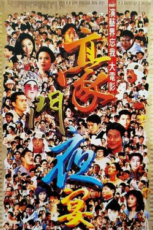

1991 Hong Kong film

| The Banquet | The Banquet |
| --- | --- |
| Theatrical poster | |
| Chinese name | Chinese name |
| Traditional Chinese | 豪門夜宴 |
| Simplified Chinese | 豪门夜宴 |
| Directed by | Alfred Cheung Joe Cheung Clifton Ko Tsui Hark |
| Starring | Eric Tsang Richard Ng Carol Cheng Sammo Hung John Shum Andy Lau Leslie Cheung Tony Leung Chiu-Wai Tony Leung Ka-Fai Jacky Cheung Aaron Kwok Leon Lai Rosamund Kwan Maggie Cheung Anita Mui Michelle Reis  Carina Lau Gong Li Joey Wong George Lam Alan Tam Stephen Chow Michael Hui |
| Cinematography | Andy Lam Kin-Keung Lee Tak-Wai Lee Chi-Wai Tan Wing-Hang Wong Andrew Lau David Chung Peter Pau |
| Edited by | Shao Feng Jin Ma David Wu Marco Mak |
| Music by | Lowell Lo |
| Distributed by | Distribution Workshop (BVI) Ltd. |
| Release date | - 30 November 1991 (1991-11-30) |
| Country | Hong Kong |
| Language | Cantonese |
| Box office | HK$21.92 million |

| Transcriptions | Transcriptions |
| --- | --- |
| Standard Mandarin | Standard Mandarin |
| Hanyu Pinyin | Háomén yèyàn |
| Yue: Cantonese | Yue: Cantonese |
| Jyutping | Hou4 Mun4 Je6 Jin3 |

***The Banquet*** (in Chinese 豪門夜宴), also known as *Party of a Wealthy Family*, is a 1991 Hong Kong comedy film. A remake of the 1959 Hong Kong film *Feast of a Rich Family*, it was quickly filmed for a Hong Kong flood relief charity, after the Yangtze River flooded in July of that year, killing over 1,700 people and displacing many more in the eastern and southern regions of mainland China.[^1]

A large ensemble of actors and crew (including multiple directors and cinematographers) worked on the film, many in supporting roles and cameos. The principal star is Eric Tsang.

## Plot

Developer Tsang Siu-Chi (Eric Tsang) and his agent (Jacky Cheung) have bought two of a group of four properties. Rival developer, Boss Hung (Sammo Hung) has secured the other two properties. Both aim to buy all four so they can knock them down and build hotels.

The agent learns that billionaire Kuwait Prince Allabarba (George Lam) is due to arrive in Hong Kong and advises Tsang that they could dupe him in order to gain a billion dollar contract. The prince's father has recently died and the prince bitterly regrets that he was not a good son.

The agent tells Tsang that he should make a show of the positive relationship he has with his father, to impress the prince. Unfortunately, Tsang has not seen his father (Richard Ng) for 10 years. Along with his wife (Carol Cheng) and his sycophantic assistant (Tony Leung Chiu Wai), Tsang heads off to bring his father back. When they meet up, Tsang pretends to have cancer to convince his father to come home, along with his sister (Rosamund Kwan) and her husband (Tony Leung Ka Fai).

Tsang throws a banquet to impress the prince, pretending that it is also a birthday party for his father. During the banquet, Tsang's father has a number of staff, including a sword expert, Master Lau / Uncle Nine (Lau Kar-leung), Servant (Kara Hui), two English Teachers (Eric Kot and Jan Lamb), a make-up artist Mak (Karl Maka) and body language expert / gigolo (Simon Yam).

Tsang daydream of the banquet, in which his imagined self looks like Leslie Cheung, with Aaron Kwok as his Brother and George Lam as Prince Allabarba. The dream banquet was attended by famous actresses including Anita Mui, Sally Yeh, Sylvia Chang, Angie Chiu and Gong Li and leading Hong Kong actors including Anthony Chan Yau, Stephen Chow and Michael Hui (accompanied by Maria Cordero).

During the actual banquet, Tsang's staff Include chefs Leon Lai and Ng Man Tat, servants Meg Lam and Wong Wan-Si and waiting staff May Lo, Sandra Ng, Fennie Yuen, Ti Lung and Kenneth Tsang. Actual guests at the banquet include David Chiang, Tony Ching, Ku Feng, Carina Lau, Lee Hoi-sang, Loletta Lee, Waise Lee, Maggie Cheung, Bryan Leung, Mars, Lawrence Ng, Barry Wong, Johnnie To, Melvin Wong, John Woo, Pauline Yeung, Gloria Yip, Chor Yuen, Tai Chi Squadron, Yuen Cheung Yan, Mimi Zhu and the band Grasshopper. <ContentLink uid="wiki/beyond">Beyond</ContentLink> performed at the banquet.

The banquet was presented on TV with TV presenters, Teresa Mo and Andy Lau. A thief crashed the banquet with a pair of police officers chasing after him.

However, the banquet was a ploy by Tsang's agent, who has secretly been working for Boss Hung.

## Cast

Almost 100 well-known Hong Kong actors appeared in the film, many of them in cameo roles.

-   Eric Tsang as Tsang Siu-Chi
-   Sammo Hung as Hung "Boss Hung" Tai-Po
-   Jacky Cheung as Jacky Cheung Ah Hok Yau
-   John Shum as "Curly", Boss Hung's Assistant
-   Tony Leung Chiu-Wai as Wai, Tsang's Assistant
-   Rosamund Kwan as Gigi, Tsang's Sister
-   Tony Leung Ka-Fai as Leung, Gigi's Husband
-   Richard Ng as Father Tsang
-   Carol Cheng (Cheng Yu-Ling, aka Do Do Cheng) as Mimi, Tsang's Wife
-   Joey Wong as Honey, Jacky's Wife
-   George Lam as Prince Alibaba of Kuwait ("Allabarba" in subtitles)
-   Kwan Hoi San as "Uncle Chicken Roll"
-   Lau Siu-Ming as Wong
-   Jamie Luk as Vassal
-   Pau Hon Lam as "Uncle Lotus Seed Bun"
-   Michelle Reis as Kar-Yan Li
-   Lydia Shum as Aunt Bill (credited as Lydia Sham)
-   Bill Tung as Uncle Bill
-   Raymond Wong as "Forty"
-   Gabriel Wong as Vassal
-   Stephen Chow as Himself
-   Andy Lau as Presenter
-   Maggie Cheung as Personal Singing Instructor
-   Chin Kar Lok
-   Leslie Cheung as Himself
-   Anita Mui as Herself
-   Aaron Kwok as Leslie's Younger Brother
-   Anthony Chan
-   Ti Lung as Cook # 2
-   Kara Hui as Household Servant
-   Teresa Mo as Presenter
-   Simon Yam as Wai's Friend, Body Language Instructor & Gigolo
-   David Wu as Jogger
-   John Woo as Guest
-   Mars
-   Sandra Ng as Trolley Waitress
-   Candice Yu
-   Eric Kot as English Instructor
-   Jan Lamb
-   Karl Maka as Wai's Uncle, Make-Up Artist
-   Sally Yeh as Herself
-   Sylvia Chang as Herself
-   Angie Chiu
-   Gong Li as Herself
-   Michael Hui as Himself
-   Leon Lai as Cook Assistant
-   Alan Tam as Ali Baba Dream Version
-   Ng Man Tat as Cook #1
-   Kenneth Tsang as Waiter
-   Teddy Robin as Football Player
-   Alfred Cheung
-   Philip Chan as Police Officer
-   Melvin Wong as Guest
-   Billy Lau
-   Gordon Liu
-   Maria Cordero as Guest
-   Gloria Yip
-   Josephine Koo
-   Hoi Sang Lee
-   Mimi Zhu as Guest
-   Tai Chi Squadron as Music Band
-   Grasshopper
-   Lowell Lo as Taxi Driver
-   Lau Kar Leung as Martial Arts Instructor For Fencing

Teddy Robin Kwan, Wan Chi Keung and Billy Lau as Soccer Players. Philip Chan and Anglie Leung play a pair of Cops, Chasing A Thief played by Tommy Wong. Other cameos include Josephine Koo as Photographer, James Wong as Food Vendor, David Wu as Jogger, Lowell Lo as Cab Driver and Cheung Wing-fat in an unknown role.

## Box office

The film grossed HK $21.92 million in Hong Kong.[^2]

## See also

-   List of Hong Kong films

## External links

-   [*The Banquet*](https://www.imdb.com/title/tt0101999/) at IMDb
-   [The Banquet](http://www.hkmdb.com/db/movies/images.mhtml?id=7453&display_set=eng) at the [Hong Kong Movie DataBase](http://www.hkmdb.com)

References

[^1]: ["The Banquet"](https://web.archive.org/web/20060716131237/http://www.hkcuk.co.uk/reviews/banquet.htm). *Review*. www.HKCuk.co.uk. Archived from the original on 16 July 2006. Retrieved 11 September 2007.

[^2]: ["The Banquet"](https://web.archive.org/web/20200904044251/http://www.hkcinemagic.com/en/movie.asp?id=17). *Database entry*. Hong Kong Cinemagic. Archived from [the original](http://www.hkcinemagic.com/en/movie.asp?id=17) on 4 September 2020. Retrieved 11 September 2007.
