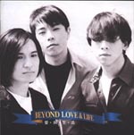

| 爱与生活 | 爱与生活 |
| --- | --- |
|  | |
| <ContentLink uid="wiki/beyond">Beyond</ContentLink>的录音室专辑 | <ContentLink uid="wiki/beyond">Beyond</ContentLink>的录音室专辑 |
| 发行日期 | 1995年10月27日，​30年前 |
| 类型 | 摇滚、华语流行音乐 |
| 唱片公司 | 滚石唱片 |
| <ContentLink uid="wiki/beyond">Beyond</ContentLink>专辑年表 | <ContentLink uid="wiki/beyond">Beyond</ContentLink>专辑年表 |

| Paradise （1994年） | **爱与生活** （1995年） | <ContentLink uid="wiki/這裡那裡">这里那里</ContentLink> （1998年） |
| --- | --- | --- |

《**爱与生活**》是香港摇滚乐队<ContentLink uid="wiki/beyond">Beyond</ContentLink>发行的第六张国语专辑，《爱与生活》Beyond第一次与黄舒骏合作的唱片。

除了收录6首来自粤语大碟《Sound》的国语版，独占收录了4首全新的国语创作歌曲，是Beyond第一次先有国语的歌曲；后来仅仅只有《活得精彩》这一首有录制成粤语版本，并收录在1996年的《Beyond得精彩》EP里。
《活着便精采》是Beyond首次先有国语，再有粤语的一首歌曲。其余三首《Love》 , 《唯一》, 《梦》，到Beyond解散后，都没有出现过其他语言版本。

Beyond先前不擅长填写国语歌词，这张专辑里Beyond填写国语歌词占了70%。

Beyond来台湾与陈昇领军的新宝岛康乐队一同参加《土洋大战北、中、南巡回演唱会》。

## 曲目[^1]

1.  一厢情愿
1.  糊涂的人
1.  唯一
1.  声音
1.  Love
1.  最后的答案
1.  活得精彩
1.  Cryin'
1.  梦
1.  荒谬世界

1.  [BEYOND / 愛與生活](https://shop.rockmall.com.tw/product_view.php?id=52515). ROCKMALL 滚石购物网. [2025-11-25].

[^1]: [BEYOND / 愛與生活](https://shop.rockmall.com.tw/product_view.php?id=52515). ROCKMALL 滚石购物网. [2025-11-25].
