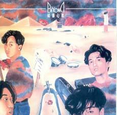

| 战胜心魔 | 战胜心魔 |
| --- | --- |
|  | |
| <ContentLink uid="wiki/beyond">Beyond</ContentLink>的EP | <ContentLink uid="wiki/beyond">Beyond</ContentLink>的EP |
| 发行日期 | 1990年7月 |
| 录制时间 | 1990年 |
| 类型 | 摇滚、粤语流行音乐 |
| 唱片公司 | 新艺宝唱片 |
| <ContentLink uid="wiki/beyond">Beyond</ContentLink>专辑年表 | <ContentLink uid="wiki/beyond">Beyond</ContentLink>专辑年表 |

| <ContentLink uid="wiki/天若有情-beyond-ep">天若有情</ContentLink> （1990年） | **战胜心魔** （1990年） | <ContentLink uid="wiki/無盡空虛">无尽空虚</ContentLink> （1993年） |
| --- | --- | --- |

《**战胜心魔**》是香港摇滚乐队<ContentLink uid="wiki/beyond">Beyond</ContentLink>发行第四张EP，收录乐队主演电影《<ContentLink uid="wiki/開心鬼救開心鬼">开心鬼救开心鬼</ContentLink>》的主题曲《战胜心魔》及插曲《文武英杰宣言》。

《文武英杰宣言》节奏轻快、活泼、年轻，之后被重新编曲，演变成《农民》一曲，并收录于1992年专辑《<ContentLink uid="wiki/繼續革命">继续革命</ContentLink>》内。

## 曲目

1.  战胜心魔
1.  战胜心魔（Karaoke）
1.  文武英杰宣言
1.  文武英杰宣言（Karaoke）
