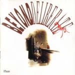

| 犹豫 | 犹豫 |
| --- | --- |
|  | |
| <ContentLink uid="wiki/beyond">Beyond</ContentLink>的录音室专辑 | <ContentLink uid="wiki/beyond">Beyond</ContentLink>的录音室专辑 |
| 发行日期 | 1991年9月6日，​34年前 |
| 录制时间 | 1990年－1991年 |
| 类型 | 摇滚、粤语流行音乐 |
| 唱片公司 | 新艺宝唱片 |
| <ContentLink uid="wiki/beyond">Beyond</ContentLink>专辑年表 | <ContentLink uid="wiki/beyond">Beyond</ContentLink>专辑年表 |

| <ContentLink uid="wiki/命運派對">命运派对</ContentLink> （1990年） | **犹豫** （1991年） | <ContentLink uid="wiki/繼續革命">继续革命</ContentLink> （1992年） |
| --- | --- | --- |

《**犹豫**》是英属香港摇滚乐队<ContentLink uid="wiki/beyond">Beyond</ContentLink>发行第七张粤语专辑，《犹豫》虽然风格不一，但仍有一些经典之作。

## 简介

主打歌是内容涉及战争与和平，及关注非洲儿童情怀的《<ContentLink uid="wiki/amani">Amani</ContentLink>》获得1991年度十大中文金曲的“十大中文金曲”，是<ContentLink uid="wiki/黃家駒">黄家驹</ContentLink>在非洲之旅后填写的，其中歌词中的“Amani Nakupenda Nakupenda We We”是解作“我们需要和平与爱”，表达非洲之行后的感想，更流露出他对和平的憧憬及反战的想法（对和平与爱的追求）。

这张专辑发行前，黄家驹曾向唱片公司计划出一张主题为非洲音乐的专辑，但被唱片公司否决了。因此，此唱片的出版，对Beyond日后前往日本发展的决定埋下伏笔。

## 曲目

| 次序 | 歌名 | 填词 | 作曲 | 备注 |
| --- | --- | --- | --- | --- |
| 1. | <ContentLink uid="wiki/amani">Amani</ContentLink> | <ContentLink uid="wiki/黃家駒">黄家驹</ContentLink> | 黄家驹 | |
| 2. | 坚持信念 | 黄家驹 | 黄家驹 | |
| 3. | 不再犹豫 | <ContentLink uid="wiki/小美-香港">小美</ContentLink> | 黄家驹 | 乐队主演电影《<ContentLink uid="wiki/beyond日記之莫欺少年窮">Beyond日记之莫欺少年穷</ContentLink>》主题曲 |
| 4. | 系要听ROCK N' ROLL | <ContentLink uid="wiki/黃貫中">黄贯中</ContentLink> | 黄贯中 | |
| 5. | 我早应该习惯 | 黄贯中 | 黄贯中 | 无线电视剧《横财3000万》主题曲 |
| 6. | 谁伴我闯荡 | 刘卓辉 | 黄家驹 | 乐队主演电影《Beyond日记之莫欺少年穷》插曲 |
| 7. | 高温派对 | 陈敏生 | 黄家驹 | 无线电视综合节目《Beyond放暑假》主题曲 |
| 8. | 谁来主宰 | <ContentLink uid="wiki/黃家強">黄家强</ContentLink>/黄贯中 | 黄家驹 | 无线电视剧《笑傲在明天》主题曲 |
| 9. | 爱你一切 | 黄家强 | 黄家强 | |
| 10. | 完全的拥有 | 叶世荣 | 黄家驹 | 这是叶世荣在Beyond乐队第一次做主唱，也是在黄家驹（1993逝世）生前唯一的一次 |

## 奖项

-   1991年度十大中文金曲颁奖典礼

-   “十大中文金曲”：《Amani》

## 音乐录影带

| 歌名 | 演唱 | 首播日期 | 首播频道 | 导演 |
| --- | --- | --- | --- | --- |
| [Amani](https://www.youtube.com/watch?v=T_j4ED_u4Uk) （[页面存档备份](//web.archive.org/web/20200420043034/http://www.youtube.com/watch?v=T_j4ED_u4Uk)，存于互联网档案馆） | 黄家驹 | 1991年 | 无线电视 | 杨伟业 |
| [不再犹豫](https://www.youtube.com/watch?v=cz681Zr6SWk) （[页面存档备份](//web.archive.org/web/20200420043057/https://www.youtube.com/watch?v=cz681Zr6SWk)，存于互联网档案馆） | Beyond | 1991年 | 无线电视 | 小美 |
| [谁伴我闯荡](https://www.youtube.com/watch?v=bMnkjFEMLOo) （[页面存档备份](//web.archive.org/web/20200420043044/http://www.youtube.com/watch?v=bMnkjFEMLOo)，存于互联网档案馆） | 黄家驹 | 1991年 | 无线电视 | 曾宪宗 |

## 外部链接
