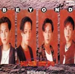

此條目的主題是<ContentLink uid="wiki/beyond">Beyond</ContentLink>的國語唱片專輯。關於其他同名作品，請見「**光輝歲月**」。

| 光輝歲月 | 光輝歲月 |
| --- | --- |
|  | |
| <ContentLink uid="wiki/beyond">Beyond</ContentLink>的錄音室專輯 | <ContentLink uid="wiki/beyond">Beyond</ContentLink>的錄音室專輯 |
| 發行日期 | 1991年4月，​35年前 |
| 類型 | 華語流行音樂 |
| 唱片公司 | 新藝寶唱片 |
| <ContentLink uid="wiki/beyond">Beyond</ContentLink>專輯年表 | <ContentLink uid="wiki/beyond">Beyond</ContentLink>專輯年表 |

| <ContentLink uid="wiki/大地-beyond专辑">大地</ContentLink> （1990年） | **光輝歲月** （1991年） | 信念 （1992年） |
| --- | --- | --- |

| 外部影片連結 |
| --- |
| [光輝歲月 1991年演唱會 黃家駒](https://www.youtube.com/watch?v=ITwsumNdSjk) |

《**光輝歲月**》是香港搖滾樂隊<ContentLink uid="wiki/beyond">Beyond</ContentLink>在台灣於1991年4月寶麗金唱片發行第二張國語專輯。主打歌為與專輯同名的《光輝歲月》。

同年5月11日在台灣 SoGo 百貨文化會館舉辦《光輝歲月演唱會》。

主打歌《光輝歲月》的粵語版是一首讚美南非的非洲人國民大會主席納爾遜·曼德拉的歌曲，以歌頌他在南非種族隔離時期為黑人所付出的努力，當時曼德拉在監禁28年後剛被釋放，光輝歲月表達他的一生。在國語版裏面，這首《光輝歲月》是為激勵年輕人努力拼搏而作，[^1][^2]而當中的種族議題被淡化。[^3]

## 曲目

全碟編曲：Beyond 全碟製作人：Beyond/薛忠銘　

| 曲序 | 曲目 | 填詞 | 作曲 | 備註 |
| --- | --- | --- | --- | --- |
| 1. | 光輝歲月 | 周治平/何啟弘 | <ContentLink uid="wiki/黃家駒">黃家駒</ContentLink> | 粵語版為《光輝歲月》 |
| 2. | 午夜怨曲 | <ContentLink uid="wiki/劉卓輝">劉卓輝</ContentLink> | 黃家駒 | 粵語版為《午夜怨曲》 |
| 3. | 撒旦的咀咒 | 何惠晶 | <ContentLink uid="wiki/黃貫中">黃貫中</ContentLink> | 粵語版為《撒旦的詛咒》 |
| 4. | 請你讓我來決定我的路 | 小美 | 黃家駒 | 粵語版為《逝去日子》 |
| 5. | 射手座咒語 | 鄭淑妃 | 黃家駒 | 粵語版為《亞拉伯跳舞女郎》 |
| 6. | 歲月無聲 | 劉卓輝 | 黃家駒 | 粵語版為《歲月無聲》 |
| 7. | 曾經擁有 | 林楚麒 | 黃家駒 | 粵語版為《曾是擁有》 |
| 8. | 懷念你，忘記你 | 黃貫中 | 黃貫中 | 粵語版為《懷念你》 |
| 9. | 心中的太陽 | <ContentLink uid="wiki/黃家強">黃家強</ContentLink> | 黃家駒 | 粵語版為《又是黃昏》 |
| 10. | 兩顆心 | 何惠晶 | 黃家強 | 粵語版為《兩顆心》 |

## 參考文獻

## 參見

-   納爾遜·曼德拉

[^1]: [十年生死兩茫茫 光輝歲月不曾忘 黃家駒定格](https://web.archive.org/web/20120420214751/http://news.xinhuanet.com/audio/2003-06/30/content_944722.htm). 北京娛樂信報. 2003-06-30 [2011-12-02]. （[原始內容](http://news.xinhuanet.com/audio/2003-06/30/content_944722.htm)存檔於2012-04-20）.

[^2]: 陳志芬. [專訪黃家強：Beyond《光輝歲月》獻曼德拉](https://www.bbc.com/zhongwen/trad/china/2013/12/131206_mandela_pop-song_beyond). BBC中文網. 2013-12-06 [2013-12-06]. （原始內容[存檔](https://web.archive.org/web/20220918180411/https://www.bbc.com/zhongwen/trad/china/2013/12/131206_mandela_pop-song_beyond)於2022-09-18）.

[^3]: 關栩溢. 《光輝歲月 》. 踏着Beyond的軌跡 II - 專輯篇. 香港: 非凡出版. 2023: 180. ISBN 9789888860869
