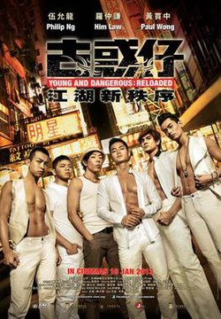

| 古惑仔：江湖新秩序   *Young and Dangerous：Reloaded* | 古惑仔：江湖新秩序   *Young and Dangerous：Reloaded* |
| --- | --- |
| 香港版《古惑仔：江湖新秩序》電影海報 | |
| 基本資料 | 基本資料 |
| 導演 | 陳翊恆 |
| 監製 | 文雋 王晶 |
| 製片 | 黎家豪 |
| 編劇 | 文雋 |
| 原著 | 古惑仔 牛佬作品 |
| 主演 | 羅仲謙 伍允龍 梁烈唯 沈震軒 <ContentLink uid="wiki/黃貫中">黃貫中</ContentLink> |
| 配樂 | 新秩序 （ <ContentLink uid="wiki/黃貫中">黃貫中</ContentLink> 作曲編曲監製） |
| 攝影 | 韋德·穆勒 (Wade Muller) |
| 剪接 | 許偉傑 |
| 製片商 | 香港影王朝有限公司  晶藝電影事業有限公司  太陽娛樂文化有限公司 |
| 片長 | 110分鐘 |
| 產地 | 香港 |
| 語言 | 粵語 |
| 上映及發行 | 上映及發行 |
| 上映日期 | - 2013年1月10日（香港、馬來西亞、新加坡） - 2013年1月18日（澳門） - 2013年2月1日（台灣） |
| 發行商 | 嘉樂影片發行有限公司 |
| 預算 | 200萬港幣 |
| 票房 | 423萬港幣（香港） 80萬令吉（馬來西亞） 90萬新台幣（台灣） 22萬新幣（新加坡） |

**《古惑仔：江湖新秩序》**（英語：**Young and Dangerous: Reloaded**）是自漫畫《古惑仔》改編的作品；也是新一系列的古惑仔電影，陳翊恆執導。於2013年1月10日香港上映。是1996年系列首部曲《古惑仔之人在江湖》的重啟。

## 故事大綱

**大天二**表妹被「藥王」看上，迫服毒品後被輪姦至死，大天二與其社團大佬**陳浩南**、同門兄弟**山雞**及**包皮**展開復仇，在街上圍斬「藥王」至死。 但由於「藥王」剛剛改拜「洪興社」近年灸手可熱的「靚坤」為新大佬，「靚坤」為了面子，誓要把陳浩南煎皮拆骨以泄心頭之恨。 浩南等人紛紛遇襲，其前任大佬老叔父 「棠叔」提議他們去找「靚坤」的死對頭**大佬B**。浩南與大佬B手下**大頭仔**連番激戰過後，終能拜見大佬B。大佬B 要他們在三天之內收一百個手下才願意保護他們。
在過程中，山雞到教會請求牧師協助，因而和**淑芬**重遇。另一方面，浩南制止大天二和包皮去中學強行拉人入會，這一切被大佬B 看在眼裏反覺浩南甚有正氣，答應收納旗下。

洪興龍頭**蔣天生**擺生日宴，由其女人Anna主持，宴席間「靚坤」發難為難浩南，蔣天生出面擺平，使「靚坤」奸計無法得逞，但「靚坤」心火未平。與此同時，Anna其實與「靚坤」相好多時，偷情之後雙雙密謀除去蔣天生。大佬B 指派四人去蘭桂坊夜店負責保安。 浩南被派去城中富豪─Gordon的千金超婷做貼身保鏢，浩南超婷互相留有好印象，超婷讓浩南陪她去高級派對，超婷的前男友出現於派對中，力數超婷的不是，浩南出面解決困局，之後兩人成為情侶。

淑芬與山雞一夜情後懷疑自己懷孕，叫山雞陪同去墮胎，結果原來是淑芬自己弄錯，二人漸生情愫。Anna致電大佬B赴蔣天生的約，沒想到到達時蔣天生已倒臥在地上，其時其他堂主到達現場，Anna 力指大佬B為殺人兇手，「靚坤」此時出現，表示要禁錮大佬B，之後買通大佬B手下，手下在密室放走大佬B，同時並告訴大佬B逃到碼頭有船接應，大佬B去到碼頭發覺中計，被「靚坤」斬死，「靚坤」更將其全家活埋。

另一方面， Gordon 知道女兒與浩南熱戀，同時亦查清浩南的底細，Gordon叫浩南脫離洪興，跟隨Gordon學做生意。但浩南因為收到大佬B 的死訊而拒絕。 「靚坤」因為Anna 的幫助及堂主的支持下，成功成為「洪興社」龍頭， 在「靚坤」的登基慶功宴上, 浩南等人趕至，「𡃁坤」殺人罪證被揭發，此時警方及**蔣天養**突然在宴會中出現，幾經追逐，「靚坤」最後被陳浩南殺死，浩南逃去台灣避難時，在船上遇上了一名患有口吃的女子，名叫**蘇阿細**。

## 演員

### 洪興社

| **演員** | **角色** | **暱稱／關係** |
| --- | --- | --- |
| 單立文 | 蔣天生 | 洪興社龍頭 蔣天養之弟 Anna姐之男友 被靚坤殺害 |
| 林盛斌 | 肥佬黎(黎胖子) | 洪興社北角堂主 |
| 何韻詩 | 十三妹 | 洪興社砵蘭街堂主 |
| 洪天明 | 甘子泰 | **太子** 洪興社尖沙咀堂主 |
| 潘源良 | 陳耀 | 洪興社西環堂主 蔣天生副手 |
| 雷宇揚 | 鬼王 | 洪興社頭目 |
| 譚炳文 | 炳叔 | 洪興社堂主 |
| 丁羽 | 吉叔 | 洪興社堂主 |
| 牛佬 | 牛佬 | 洪興社堂主 |
| 倫裕國 | 亞國 | 洪興社堂主 |
| 詹瑞文 | 口水詹 | 洪興社堂主 |
| **羅仲謙** | **陳浩南** | 洪興社小頭目 大老B頭馬 林超婷男友，後分手 趙山河、梁二、包達二、楊添之兄弟 大佬B之手下 靚坤之天敵 |
| **伍允龍** | **楊 添** | **大頭仔** 洪興社金牌打仔 大老B頭馬 陳浩南、包達二、趙山河、梁二之兄弟 大佬B手下 金牌拳王 |
| **梁烈唯** | **趙山河** | **山雞** 洪興社小頭目 大老B頭馬 陳浩南、梁二、包達二、楊添之兄弟 在旺角收購二手手提電話為生 林淑芬男友 靚坤之天敵 |
| **沈震軒** | **譚 坤** | **靚坤** 洪興社旺角堂主 與Anna鬼混 殺害蔣天生、鄧智勇之兇手 故事後期被陳浩南燒死 |
| **<ContentLink uid="wiki/黃貫中">黃貫中</ContentLink>** | **鄧智勇** | **大佬B**  洪興社銅鑼灣堂主 喜愛搖滾樂 搏擊冠軍 與靚坤勢成水火 被靚坤殺死 |
| 何浩文 | 梁 二 | **大天二** 洪興社成員 大老B頭馬 陳浩南、趙山河、包達二、楊添之兄弟 靚坤之天敵 |
| 林子善 | 包達二 | **包皮** 洪興社成員 大佬B頭馬 陳浩南、趙山河、梁二、楊添之兄弟 靚坤之天敵 |
| 蔣祖曼 | Man姐 | 洪興社旺角砵蘭街代理堂主 十三妹之心腹 |
| 王朗然 | Tiger | 李乾坤頭馬 |
| 香振強 | Panda | 李乾坤頭馬 |
| 羅天池 | 阿寶 | 洪興社成員 大佬B手下，後被李乾坤用一百萬收賣而出賣大B |
| 關浩揚 | 細龜 | |

### 其他演員

| **演員** | **角色** | **暱稱／關係** |
| --- | --- | --- |
| 胡 然 （配音：林芷筠） | 林超婷 | **Lorraine** 陳浩南女友，後分手 |
| 張大偉 | Thomas | Lorraine前男友 |
| 王思敏 | Jasmine | Thomas女友 |
| 梁敏儀 | Anna姐 | 蔣天生女友 靚坤情婦 |
| 莊思敏 | 林淑芬 | 林牧師之女 趙山河女友 |
| 萬梓良 | 蔣天養 | 蔣天生之兄 泰國華僑 |
| 駱應鈞 | Gordon Lam | 林超婷之父，賞識陳浩南 |
| 黃興桂 | 林牧師 | 林淑芬之父 |
| 黃樹棠 | 棠叔 | 陳浩南前大佬 |
| 童 菲 | 蘇阿細 | **細細粒**（小結巴）（小不點） 火拼後並未死亡，以細細粒的身分回來保護因放火燒死靚坤而準備跑路的陳浩南，在戲末疑似有喜歡上陳浩南的跡象 |
| 唐紫睿 | 十三妹女伴 | |
| 柯嘉琪（粵語：柯嘉琪） | 靚坤女伴 | |
| 王宏志 | 藥王 | |
| 李珈葆 | 賣手機女 | |
| 楊狄珊 | 賣手機女 | |
| 吳保錡 | 泊車仔 | |
| 李健宏 | 鼓手 | |
| 梁健恆 | 電結他手 | |
| 麥文威 | 低音電結他手 | |
| Bitto | 南亞裔人士 | 大佬B朋友 |

## 與系列一《古惑仔之人在江湖》（1996年版）的不同

-   本片開頭同樣都是由陳浩南等人殺死靚坤的人，不同的是：
    -   系列一：靚坤與陳浩南等人故事開始已經是宿敵
    -   本片：靚坤與陳浩南等人故事開始素未謀面，而且靚坤完全不知陳浩南是誰
-   系列一開始陳浩南等人在球場偶上大佬B後跟隨，本片到故事中起陳浩南等人才正式跟隨大佬B
    -   系列一：大頭仔(楊添)在第五集才正式登場
    -   本片：大頭仔(楊添)在開幕時即登場
-   系列一裏面，陳浩南等人是出身自藍田邨，本片陳浩南等人是出身自秀茂坪邨
-   本片牧師與系列一的牧師飾演的演員現實中同樣都曾經擔當足球員和足球評述員（林尚義和黃興桂飾）
-   靚坤原名不同（系列一為李乾坤，本片為譚坤）
-   靚坤的死法也與之前不同：
    -   系列一：靚坤因反抗而被戴着眼鏡（俗稱：四眼仔）的警察開槍射殺。
    -   本片：靚坤被陳浩南放火燒死。
-   女主角登場的時間:
    -   系列一：陳浩南和小結巴是在劇情中段結識。
    -   本片：陳浩南和小結巴是在劇情尾段結識。
-   蔣天生和蔣天養與系列一同樣都是兄弟關係，而且蔣天養一角仍然是泰國華僑，仍然由萬梓良飾演，但本片是蔣天養為兄，蔣天生為弟（系列一調轉）
-   系列三中蔣天生是被東星的笑面虎（吳志雄飾演）槍殺，而本片蔣天生是被靚坤殺害
-   本片並沒有「巢皮」（包達明）此角色

## 分級

| 國家/地區 | 分級 |
| --- | --- |
| 香港 | III級 |
| 馬來西亞 | 18 |
| 台灣 | 限制級 |
| 新加坡 | M18 |

## 相關條目

-   古惑仔電影系列

## 外部連結

-   豆瓣電影上《[古惑仔：江湖新秩序](https://movie.douban.com/subject/19976063/)》的資料 （簡體中文）
-   時光網上《[古惑仔：江湖新秩序](http://movie.mtime.com/181885/)》的資料（簡體中文）
-   爛番茄上《[古惑仔：江湖新秩序](https://www.rottentomatoes.com/m/young_and_dangerous_reloaded_2013)》的資料（英文）
-   香港影庫上《[古惑仔：江湖新秩序](https://hkmdb.com/db/movies/view.mhtml?id=16009&display_set=big5)》的資料（繁體中文）
-   互聯網電影數據庫（IMDb）上《[古惑仔：江湖新秩序](https://www.imdb.com/title/tt2642064/)》的資料（英文）
-   [古惑仔：江湖新秩序（Young and Dangerous: Reloaded）](http://thehkneo.com/blog/?p=3411) （[頁面存檔備份](//web.archive.org/web/20200621173625/http://thehkneo.com/blog/?p=3411)，存於互聯網檔案館），〈澳大利亞電影評論學會〉

參考資料
