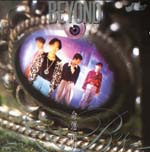

| 命運派對 | 命運派對 |
| --- | --- |
|  | |
| <ContentLink uid="wiki/beyond">Beyond</ContentLink>的錄音室專輯 | <ContentLink uid="wiki/beyond">Beyond</ContentLink>的錄音室專輯 |
| 發行日期 | 1990年9月6日，​35年前 |
| 錄製時間 | 1990年 |
| 類型 | 搖滾、粵語流行音樂 |
| 唱片公司 | 新藝寶唱片 |
| <ContentLink uid="wiki/beyond">Beyond</ContentLink>專輯年表 | <ContentLink uid="wiki/beyond">Beyond</ContentLink>專輯年表 |

| <ContentLink uid="wiki/真的見證">真的見證</ContentLink> （1989年） | **命運派對** （1990年） | <ContentLink uid="wiki/猶豫">猶豫</ContentLink> （1991年） |
| --- | --- | --- |

《**命運派對**》是香港搖滾樂隊<ContentLink uid="wiki/beyond">Beyond</ContentLink>發行的第六張粵語專輯。《命運派對》這張碟具有社會良知，有不少社會題材的歌曲，有別於以情歌作為主題，歌詞內容令人感動，令主流音樂相形見拙。

## 簡介

主打歌《光輝歲月》，歌曲充滿理想和向曼德拉致敬之意，同樣也是黃家駒的華語事業迴響，當時發行的時間，曼德拉在經過28年的牢獄生涯後剛被釋放，作曲和填詞皆由黃家駒包辦，而這首歌寫成時曼德拉仍在南非獄中。[^1][^2]此曲亦與《<ContentLink uid="wiki/海闊天空-beyond歌曲">海闊天空</ContentLink>》、《抗戰二十年》等為被視香港社會運動的歌曲，包括七一大遊行、雨傘運動爭取自由民主的主題歌曲。[^3][^4][^5][^6][^7][^8][^4][^9]

另外專輯中《俾面派對》中的歌詞，批評當時香港樂壇歌手參加無意義的派對，暗指參與TVB「做騷」的歌手因受唱片公司的安排，歌手必需參加一些明知不會拿獎項的節目，而Beyond樂隊成員亦要參與與音樂無關的遊戲節目；《撒旦的詛咒》則十分令人興奮，<ContentLink uid="wiki/黃家強">黃家強</ContentLink>的拍線令歌的節奏部分很吸引。而背後的結他節奏用了Muting之後，和歌本身的節奏與低音結他很合櫬。《戰勝心魔》則相當具搖滾風格。

## 曲目

| 次序 | 歌名 | 填詞 | 作曲 | 主唱 | 備註 |
| --- | --- | --- | --- | --- | --- |
| 1. | 光輝歲月 | <ContentLink uid="wiki/黃家駒">黃家駒</ContentLink> | 黃家駒 | 黃家駒 | 向南非民權領袖曼德拉致敬歌曲 |
| 2. | 兩顆心 | 葉世榮 | 黃家強 | 黃家強 | |
| 3. | 俾面派對 | 黃貫中 | 黃家駒 | 黃家駒 | 1990年6月17日(農曆5月25日)黃貫中出席不相熟的關德興85歲壽宴後情緒宣洩之作 |
| 4. | 無淚的遺憾 | 劉卓輝 | 黃家駒 | 黃家駒 | 無綫電視劇《笑傲在明天》插曲 |
| 5. | 懷念你 | 黃家強 | 黃貫中 | 黃貫中 | |
| 6. | 可知道 | 黃家駒 | 黃家駒 | 黃家駒 | |
| 7. | 相依的心 | 盧國宏 | 黃家駒 | 黃家駒 | 電影《西環的故事》插曲 |
| 8. | 撒旦的詛咒 | 葉世榮 | 黃貫中 | 黃貫中 | |
| 9. | 送給不知怎去保護環境的人 (包括我) | 劉卓輝 | 黃家駒 | Beyond | |
| 10. | 戰勝心魔 | 翁偉微 | 黃家駒 | Beyond | 樂隊主演電影《<ContentLink uid="wiki/開心鬼救開心鬼">開心鬼救開心鬼</ContentLink>》主題曲 同時收錄於《<ContentLink uid="wiki/戰勝心魔">戰勝心魔</ContentLink>》EP |

## 獎項

-   1990年度十大中文金曲頒獎典禮

-   「十大中文金曲」：《俾面派對》

-   1990年度十大勁歌金曲頒獎典禮

-   「十大勁歌金曲」：《光輝歲月》
-   「最佳填詞獎」：黃家駒

1990年度叱咤樂壇流行榜頒獎典禮：

-   叱咤組合銀獎－Beyond

## 音樂錄影帶

| 歌名 | 演唱 | 首播日期 | 首播頻道 | 導演 |
| --- | --- | --- | --- | --- |
| [光輝歲月](https://www.youtube.com/watch?v=X2RRk6OLq8E)（[頁面存檔備份](//web.archive.org/web/20200420043007/http://www.youtube.com/watch?v=X2RRk6OLq8E)，存於互聯網檔案館） | 黃家駒 | 1990年 | 無綫電視 | 曾憲宗 |
| [俾面派對](https://www.youtube.com/watch?v=fKz0Tbn3WEc) （[頁面存檔備份](//web.archive.org/web/20200420043013/http://www.youtube.com/watch?v=fKz0Tbn3WEc)，存於互聯網檔案館） | 黃家駒 | 1990年 | 無綫電視 | 唐婉儀 |
| [懷念您](https://www.youtube.com/watch?v=X6jmdMJ8hSA)（[頁面存檔備份](//web.archive.org/web/20200420043018/http://www.youtube.com/watch?v=X6jmdMJ8hSA)，存於互聯網檔案館） | 黃貫中 | 1990年 | 無綫電視 | 小美 |
| [戰勝心魔](https://www.youtube.com/watch?v=OoPXxAJpKFI)（[頁面存檔備份](//web.archive.org/web/20200420043024/http://www.youtube.com/watch?v=OoPXxAJpKFI)，存於互聯網檔案館） | Beyond | 1990年 | 無綫電視 | 曾憲宗 |

## 參考

[^1]: [新華網：十年生死兩茫茫 光輝歲月不曾忘 黃家駒定格](http://news.xinhuanet.com/audio/2003-06/30/content_944722.htm). [2014-11-01]. （原始內容[存檔](https://web.archive.org/web/20120420214751/http://news.xinhuanet.com/audio/2003-06/30/content_944722.htm)於2012-04-20）.

[^2]: [BBC中文網 專訪黃家強：Beyond《光輝歲月》獻曼德拉](https://www.bbc.co.uk/zhongwen/trad/china/2013/12/131206_mandela_pop-song_beyond.shtml). [2014-11-01]. （原始內容[存檔](https://web.archive.org/web/20131206164742/http://www.bbc.co.uk/zhongwen/trad/china/2013/12/131206_mandela_pop-song_beyond.shtml)於2013-12-06）.

[^3]: [歌詞貼切! Beyond「海闊天空」成佔中曲](http://www.nexttv.com.tw/news/realtime/international/11151047/privacy) （[頁面存檔備份](//web.archive.org/web/20141006070106/http://www.nexttv.com.tw/news/realtime/international/11151047/privacy)，存於互聯網檔案館）, 壹電視, 2014/09/30

[^4]: [BEYOND-海闊天空](http://www.appledaily.com.tw/realtimenews/article/entertainment/20141001/479647/) （[頁面存檔備份](//web.archive.org/web/20141006114419/http://www.appledaily.com.tw/realtimenews/article/entertainment/20141001/479647/)，存於互聯網檔案館）, 蘋果日報 (台灣), 2014年10月1日

[^5]: [因為不羈放縱愛自由 Beyond《海闊天空》成佔中主題曲](http://www.ettoday.net/news/20140930/407523.htm?from=easynews) （[頁面存檔備份](//web.archive.org/web/20141001171237/http://www.ettoday.net/news/20140930/407523.htm?from=easynews)，存於互聯網檔案館）, ETtoday, 2014/09/30

[^6]: [香港佔中／「佔中」打死不退！ 空拍13萬人遍地開花](http://news.tvbs.com.tw/entry/548590) （[頁面存檔備份](//web.archive.org/web/20141006085438/http://news.tvbs.com.tw/entry/548590)，存於互聯網檔案館）, TVBS, 2014/09/30

[^7]: [Beyond挺！ 黃貫中與民眾唱「海闊天空」](http://news.ebc.net.tw/apps/newsList.aspx?id=1412131789) （[頁面存檔備份](//web.archive.org/web/20141006065640/http://news.ebc.net.tw/apps/newsList.aspx?id=1412131789)，存於互聯網檔案館）, 東森新聞, 2014/10/1

[^8]: [「風雨中抱緊自由」 香港佔中大V隱秘發聲](http://m.ntdtv.com/xtr/mb5/2014/10/01/a1142560.html) （[頁面存檔備份](//web.archive.org/web/20141006090315/http://m.ntdtv.com/xtr/mb5/2014/10/01/a1142560.html)，存於互聯網檔案館）, 新唐人, 2014年10月1日

[^9]: [年少無知(佔中版) Occupy Central Movement in Hong Kong (Umbrella Revolution)](https://www.youtube.com/watch?v=vd84DlMq-qA). [2014-11-01]. （原始內容[存檔](https://web.archive.org/web/20200420043003/https://www.youtube.com/watch?v=vd84DlMq-qA)於2020-04-20）.
