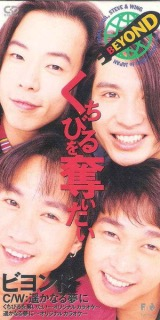

| くちびるを奪いたい | くちびるを奪いたい |
| --- | --- |
|  | |
| <ContentLink uid="wiki/beyond">Beyond</ContentLink>的歌曲 | <ContentLink uid="wiki/beyond">Beyond</ContentLink>的歌曲 |
| 發行日期 | 1993年6月25日 |
| 錄製時間 | 1993年 |
| 類型 | 日本流行音樂 |
| 唱片公司 | Fun House |
| <ContentLink uid="wiki/beyond">Beyond</ContentLink>單曲年表 | <ContentLink uid="wiki/beyond">Beyond</ContentLink>單曲年表 |

| リソ ラバ ～International～ （1992年） | **くちびるを奪いたい**  （1993年） | <ContentLink uid="wiki/paradise-beyond單曲">Paradise</ContentLink> （1994年） |
| --- | --- | --- |

《**くちびるを奪いたい**》（《**我想奪取妳的唇**》）是香港搖滾樂隊<ContentLink uid="wiki/beyond">Beyond</ContentLink>發行第三張日本單曲，是雙主打單曲，收錄兩首歌曲是主打歌曲，《くちびるを奪いたい》是《完全地愛吧》日文版，亦是<ContentLink uid="wiki/黃家駒">黃家駒</ContentLink>和<ContentLink uid="wiki/黃家強">黃家強</ContentLink>最後一次合唱歌曲。《遙かなる夢に～Far away～》是慶祝成軍十週年的歌曲，同時也是《<ContentLink uid="wiki/海闊天空-beyond歌曲">海闊天空</ContentLink>》的日文版。

## 曲目

1.  くちびるを奪いたい

## 音樂

-   [https://www.youtube.com/watch?v=wJRGhyDNs-c](https://www.youtube.com/watch?v=wJRGhyDNs-c) （[頁面存檔備份](//web.archive.org/web/20200420063805/https://www.youtube.com/watch?v=wJRGhyDNs-c)，存於互聯網檔案館）
