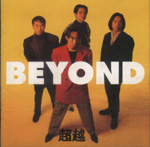

| 超越 | 超越 |
| --- | --- |
|  | |
| <ContentLink uid="wiki/beyond">Beyond</ContentLink>的錄音室專輯 | <ContentLink uid="wiki/beyond">Beyond</ContentLink>的錄音室專輯 |
| 發行日期 | 1992年9月26日，​33年前 |
| 類型 | 日本流行音樂 |
| 語言 | 日語 廣東話 國語 |
| 唱片公司 | Fun House |
| <ContentLink uid="wiki/beyond">Beyond</ContentLink>專輯年表 | <ContentLink uid="wiki/beyond">Beyond</ContentLink>專輯年表 |
| 收錄於《超越》的單曲 | 收錄於《超越》的單曲 |
| - The Wall～長城～ - リゾ・ラバ～international～ | |

| | **超越** （1992年） | <ContentLink uid="wiki/this-is-love-1">This Is Love 1</ContentLink> （1993年） |
| --- | --- | --- |

《**超越**》是香港搖滾樂隊<ContentLink uid="wiki/beyond">Beyond</ContentLink>發行第一張日語專輯，《超越》並不是一張完全日語專輯，收錄了三首粵語歌曲來自專輯《<ContentLink uid="wiki/繼續革命">繼續革命</ContentLink>》和一首國語歌曲來自專輯《<ContentLink uid="wiki/信念-beyond專輯">信念</ContentLink>》，當時在日本推出的專輯和單曲，反應不理想，原因是日語不靈光和宣傳不足，後來暫時放下香港的工作，積極開拓日本市場，長居於日本，在日本的生活感到非常孤獨，歌曲帶一點離鄉別井，孤單寂寞的感覺，其中《手紙》、《風》、《Home Sick Song》是在日本發展的寫照。

## 曲目

| 順序 | 歌名 | 演唱 | 作詞 | 作曲 | 編曲 | 時間 | 語言 | 原曲 |
| --- | --- | --- | --- | --- | --- | --- | --- | --- |
| 01 | The Wall | 黃家駒 | 真名杏樹 | 黃家駒 | Beyond 梁邦彥 | 4:52 | 日語 | 長城 |
| 02 | リゾ・ラバ Riso Lover ～International～ | 黃家駒 | サンプラザ中野くん | 黃家駒 黃家強 黃貫中 | Beyond 梁邦彥 | 4:43 | 日語 | 可否衝破 |
| 03 | 早班火車 The Morning Train | 黃家駒 | 林振強 | 黃家駒 黃家強 黃貫中 | Beyond 梁邦彥 | 5:51 | 粵語 | 早班火車 |
| 04 | Kaze 風 | 黃家強 | 夏野芹子 | 黃家強 | Beyond 梁邦彥 | 4:22 | 日語 | 厭倦寂寞 |
| 05 | 孤獨 Kodoku | 黃家駒 | 夏野芹子 | 黃家駒 | Beyond 梁邦彥 | 4:14 | 日語 | 不可一世 |
| 06 | 愛過的罪 Guilty of Love | 黃家駒 | 陳昇 | 黃貫中 | Beyond 梁邦彥 | 4:48 | 國語 | 繼續沉醉 |
| 07 | 農民 | 黃家駒 | 劉卓輝 | 黃家駒 | Beyond 梁邦彥 | 3:12 | 粵語 | 無 |
| 08 | Home Sick Song | 黃貫中 | 夏野芹子 | 黃貫中 | Beyond 梁邦彥 | 4:38 | 日語 | 溫暖的家鄉 |
| 09 | 無語問蒼天 Only The Heaven Knows | 黃家駒 | 黃家強 | 黃家駒 | Beyond 梁邦彥 | 3:20 | 粵語 | 無 |
| 10 | 剎那的混沌 Instant Crazy | 黃家駒 | 真名杏樹 | 黃家駒 | Beyond 梁邦彥 | 5:21 | 日語 | Bye - Bye |
| 11 | 手紙 Tegami | 黃家駒 | 真名杏樹 | 黃家駒 | Beyond 梁邦彥 | 3:25 | 日語 | 遙望 |

## 音樂錄影帶

| 歌名 | 演唱 | 首播日期 | 首播頻道 | 導演 |
| --- | --- | --- | --- | --- |
| [リゾ・ラバ～International～](https://www.youtube.com/watch?v=AN16MorjAOc) （[頁面存檔備份](//web.archive.org/web/20150703002728/http://www.youtube.com/watch?v=AN16MorjAOc)，存於互聯網檔案館） | 黃家駒 | 1992年 | | |

| <ContentLink uid="wiki/beyond">Beyond</ContentLink> | <ContentLink uid="wiki/beyond">Beyond</ContentLink> |
| --- | --- |
| - <ContentLink uid="wiki/黃家駒">黃家駒</ContentLink>（節奏結他手，主音） - <ContentLink uid="wiki/黃貫中">黃貫中</ContentLink>（主音結他手，和音） - <ContentLink uid="wiki/黃家強">黃家強</ContentLink>（貝斯手，和音） - <ContentLink uid="wiki/葉世榮">葉世榮</ContentLink>（鼓手，和音） | |
| 錄音室專輯 | |
| 迷你專輯 | - <ContentLink uid="wiki/永遠等待">永遠等待</ContentLink>（1987年） - <ContentLink uid="wiki/新天地-ep">新天地</ContentLink>（1987年） - <ContentLink uid="wiki/四拍四">四拍四</ContentLink>（1989年） - <ContentLink uid="wiki/戰勝心魔">戰勝心魔</ContentLink>（1990年） - <ContentLink uid="wiki/天若有情-beyond-ep">天若有情</ContentLink>（1990年） - <ContentLink uid="wiki/無盡空虛">無盡空虛</ContentLink>（1993年） - Beyond得精彩（1996年） - <ContentLink uid="wiki/action">Action</ContentLink>（1998年） - <ContentLink uid="wiki/together-beyond-ep">Together</ContentLink>（2003年） |
| 單曲 | - <ContentLink uid="wiki/孤單一吻">孤單一吻</ContentLink>（1987年） - 舊日的足跡（1988年） - <ContentLink uid="wiki/the-wall-長城">The Wall～長城～</ContentLink>（1992年） - リゾ・ラバ ～International～（1992年） - <ContentLink uid="wiki/我想奪取妳的唇">我想奪取妳的唇</ContentLink>（1993年） - <ContentLink uid="wiki/paradise-beyond單曲">Paradise</ContentLink>（1994年） - <ContentLink uid="wiki/謝謝-beyond單曲">謝謝</ContentLink>（1995年） |
| 精選輯 | - <ContentLink uid="wiki/舊日足跡精選集">舊日足跡精選集</ContentLink>（1988年） - 昔日今日明日金曲（1990年） - Tracking（1991年） - <ContentLink uid="wiki/control-專輯">Control</ContentLink>（1992年） - Recognition（1992年） - 精選輯Encore（1992年） - 遙望黃家駒不死音樂精神 特別紀念集92~93（1993年） - 遙かなる夢 Beyond 1992-1995（1995年） - 各有各精彩 13周年紀念版（1996年） - Play Back 自典 字典（1997年） - <ContentLink uid="wiki/files">Files!</ContentLink>（1998年） - The Best Of Beyond（1999年） - <ContentLink uid="wiki/原來-beyond精選專輯">原來</ContentLink>（1999年） - <ContentLink uid="wiki/全部-beyond精選專輯">全部</ContentLink>（2000年） - <ContentLink uid="wiki/一世">一世</ContentLink>（2000年） - <ContentLink uid="wiki/millennium">Millennium</ContentLink>（2000年） - <ContentLink uid="wiki/beyond精選滾石香港黃金十年">Beyond精選滾石香港黃金十年</ContentLink>（2003年） - Super Love（2003年） - <ContentLink uid="wiki/最動聽的beyond">最動聽的Beyond</ContentLink>（2004年） - The Ultimate Story（2005年） - <ContentLink uid="wiki/beyond-25th-anniversary">25th Anniversary</ContentLink>（2008年） - Rock & Roll Collection（2009年） - 音樂大全101（2011年） - Super Rock（2012年） - Super Sound（2012年） - 30th Anniversary（2013年） - The Legend （2015年） - The Stage（2015年） - MULTIVERSE OF CINEPOLY 40TH ANNIVERSARY - Beyond（2025年） |
| 套裝 | - Super Collection（1999年） - 20th Anniversary Collection（2003年） - 限量珍藏超值8碟套裝（2003年） - 從頭認識 Beyond（2004年） - 永遠等待25週年（2013年） - 30th Anniversary Box Set（2013年） - Beyond Premium（2013年） - Legendary: The History（2015年） - 追憶黃家駒（2015年） - Still Beyond（2017年） |
| 合輯 | - <ContentLink uid="wiki/香港-合輯">香港</ContentLink>（1983年） - 香港電台六十週年紀念（1988年） - 新藝寶五週年（1990年） - 華納群星難忘您許冠傑（1992年） - Love Our Bay（1999年） - 超級Band Band Band（2000年） |
| 現場錄音專輯 | - <ContentLink uid="wiki/beyond生命接觸演唱會">Beyond Live 1991</ContentLink>（1991年） - Words & Music: Final Live with 家駒（1993年） - Live & Basic（1996年） - 真的見證演唱會（1999年） - Good Time Live Concert（2001年） - <ContentLink uid="wiki/beyond超越beyond演唱會">超越Beyond Live 03</ContentLink>（2003年） - 超越亞拉伯演唱會（2003年） - 北京演唱會1988（2003年） - Live 88（2005年） - Super Live（2012年） |
| 演唱會 | - 永遠等待演唱會（1985年） - 超越阿拉伯演唱會（1987年） - 真的見證演唱會（1989年） - <ContentLink uid="wiki/beyond生命接觸演唱會">Beyond生命接觸演唱會</ContentLink>（1991年） - Unplugged Live（1993年） - Beyond的精彩Live&Basic演唱會（1996年） - Good Time演唱會（1999年） - <ContentLink uid="wiki/beyond超越beyond演唱會">Beyond超越Beyond演唱會</ContentLink>（2003年） - <ContentLink uid="wiki/beyond-the-story-live-2005">Beyond The Story Live 2005</ContentLink>（2005年） |
| 電視 | |
| 電影 | - <ContentLink uid="wiki/肝膽相照">肝膽相照</ContentLink>（1987年） - <ContentLink uid="wiki/靚妹正傳">靚妹正傳</ContentLink>（1987年） - 黑色迷牆（1989年） - <ContentLink uid="wiki/吉星拱照">吉星拱照</ContentLink>（1990年） - <ContentLink uid="wiki/開心鬼救開心鬼">開心鬼救開心鬼</ContentLink>（1990年） - <ContentLink uid="wiki/忍者神龟-1990年电影">忍者龜</ContentLink>（1990年） - 忍者龜II（1991年） - <ContentLink uid="wiki/beyond日記之莫欺少年窮">Beyond日記之莫欺少年窮</ContentLink>（1991年） - <ContentLink uid="wiki/豪門夜宴-1991年電影">豪門夜宴</ContentLink>（1991年） - <ContentLink uid="wiki/墨斗先生">墨斗先生</ContentLink>（2004年） |
| 相關條目 | - <ContentLink uid="wiki/beyond歌曲對照表">Beyond歌曲對照表</ContentLink> - <ContentLink uid="wiki/黃家駒音樂作品">黃家駒音樂作品</ContentLink> - NASA - Laser Band - Stone - Unknown - <ContentLink uid="wiki/高速啤機">高速啤機</ContentLink> - 浮世繪 - 汗 - Picasso Horses - 男人幫 - The Postman - 異種樂隊 - <ContentLink uid="wiki/陳健添">陳健添</ContentLink>（經理人） - <ContentLink uid="wiki/潘先儀">潘先儀</ContentLink>（經理人，形象設計） - <ContentLink uid="wiki/劉卓輝">劉卓輝</ContentLink>（填詞） - <ContentLink uid="wiki/黃仲賢">黃仲賢</ContentLink>（演唱會支援結他手） - <ContentLink uid="wiki/刘志远-香港音乐人">劉志遠</ContentLink>（鍵琴手，結他手，和音，編曲) |

| 粵語 | - <ContentLink uid="wiki/再見理想">再見理想</ContentLink>（1986年） - <ContentLink uid="wiki/亞拉伯跳舞女郎">亞拉伯跳舞女郎</ContentLink>（1987年） - <ContentLink uid="wiki/現代舞台">現代舞台</ContentLink>（1988年） - <ContentLink uid="wiki/秘密警察-專輯">秘密警察</ContentLink>（1988年） - <ContentLink uid="wiki/beyond-iv">Beyond IV</ContentLink>（1989年） - <ContentLink uid="wiki/真的見證">真的見證</ContentLink>（1989年） - <ContentLink uid="wiki/命運派對">命運派對</ContentLink>（1990年） - <ContentLink uid="wiki/猶豫">猶豫</ContentLink>（1991年） - <ContentLink uid="wiki/繼續革命">繼續革命</ContentLink>（1992年） - <ContentLink uid="wiki/樂與怒">樂與怒</ContentLink>（1993年） - <ContentLink uid="wiki/二樓後座">二樓後座</ContentLink>（1994年） - <ContentLink uid="wiki/sound-beyond專輯"> Sound</ContentLink>（1995年） - <ContentLink uid="wiki/請將手放開">請將手放開</ContentLink>（1997年） - <ContentLink uid="wiki/驚喜-專輯">驚喜</ContentLink>（1997年） - <ContentLink uid="wiki/不见不散-专辑">不見不散</ContentLink>（1998年） - <ContentLink uid="wiki/good-time-beyond專輯">Good Time</ContentLink>（1999年） |
| --- | --- |
| 國語 | - <ContentLink uid="wiki/大地-beyond专辑">大地</ContentLink>（1990年） - <ContentLink uid="wiki/光輝歲月-專輯">光輝歲月</ContentLink>（1991年） - <ContentLink uid="wiki/信念-beyond專輯">信念</ContentLink>（1992年） - <ContentLink uid="wiki/海闊天空-beyond專輯">海闊天空</ContentLink>（1993年） - <ContentLink uid="wiki/paradise-beyond專輯">Paradise</ContentLink>（1994年） - <ContentLink uid="wiki/愛與生活">愛與生活</ContentLink>（1995年） - <ContentLink uid="wiki/這裡那裡">這裏那裏</ContentLink>（1998年） |
| 日語 | - 超越（1992年） - <ContentLink uid="wiki/this-is-love-1">This Is Love 1</ContentLink>（1993年） - <ContentLink uid="wiki/second-floor">Second Floor</ContentLink>（1994年） |

| 劇集 | - 暴風少年（1987年） - <ContentLink uid="wiki/淘氣雙子星">淘氣雙子星</ContentLink>（1989年） |
| --- | --- |
| 節目 | - 夠Hit鬥玩Beyond加草蜢（1989年） - 勁Band四鬥士（1990年） - Beyond放暑假（1991年） - 暑假玩到盡（1992年） |
